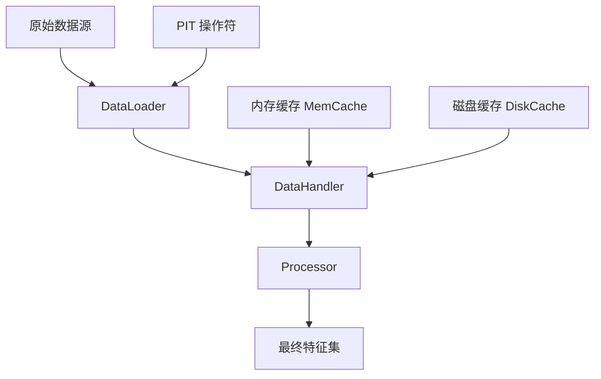
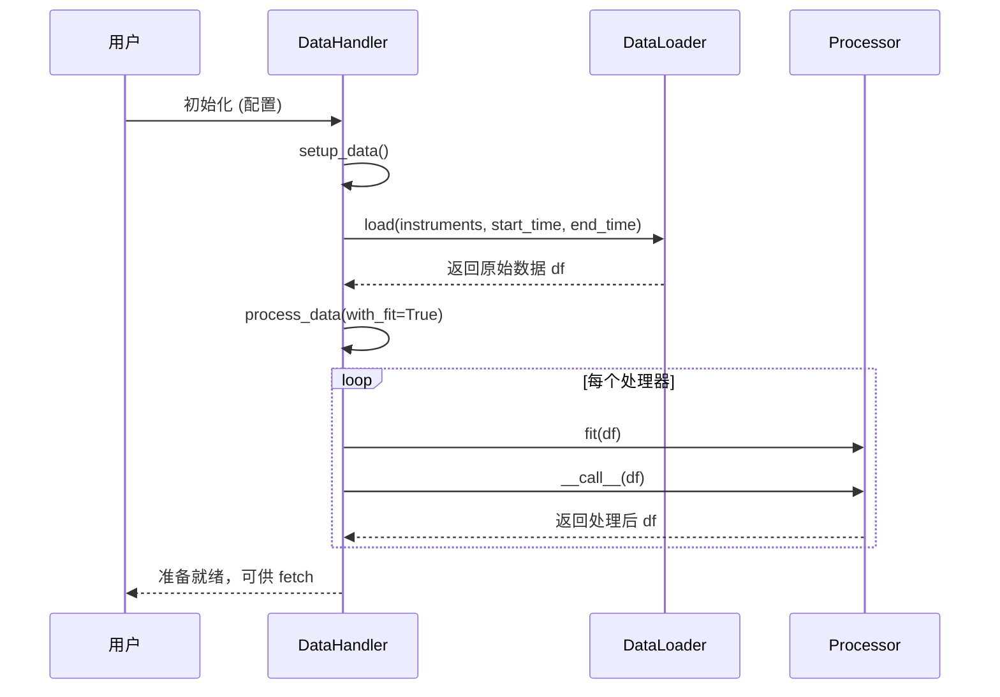
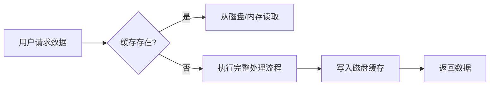

# 数据模块

<cite>
**本文档中引用的文件**   
- [cache.py](file://qlib/data/cache.py)
- [data_cache_demo.py](file://examples/data_demo/data_cache_demo.py)
- [highfreq_handler.py](file://examples/highfreq/highfreq_handler.py)
- [highfreq_handler.py](file://qlib/contrib/data/highfreq_handler.py)
- [handler.py](file://qlib/data/dataset/handler.py)
- [processor.py](file://qlib/data/dataset/processor.py)
- [loader.py](file://qlib/data/dataset/loader.py)
- [pit.py](file://qlib/data/pit.py)
</cite>

## 目录
1. [引言](#引言)
2. [核心组件架构](#核心组件架构)
3. [数据处理流程详解](#数据处理流程详解)
4. [PIT数据模型与防未来信息泄露机制](#pit数据模型与防未来信息泄露机制)
5. [缓存策略与性能优化](#缓存策略与性能优化)
6. [高频数据处理实例](#高频数据处理实例)
7. [配置示例与最佳实践](#配置示例与最佳实践)
8. [结论](#结论)

## 引言

Qlib的数据处理核心模块设计旨在为量化研究提供一个高性能、可扩展且无未来信息泄露风险的数据处理框架。该模块通过精心设计的分层架构，将数据加载、特征工程、数据集构建和缓存管理等关键功能解耦，实现了高效的数据流水线。其核心设计理念是确保在任何时间点（Point-in-Time）进行数据分析时，所使用的数据仅包含截至该时间点为止的历史信息，从而严格保证回测结果的有效性和公平性。本文档将深入剖析这一核心模块的内部工作机制。

**Section sources**
- [handler.py](file://qlib/data/dataset/handler.py#L67-L379)
- [processor.py](file://qlib/data/dataset/processor.py#L0-L419)

## 核心组件架构

Qlib的数据处理流程由四个核心组件协同工作：数据加载器（Loader）、特征处理器（Processor）、数据集处理器（Handler）和缓存系统（Cache）。这些组件共同构成了一个从原始数据到可用特征集的完整转换管道。

**Diagram sources**
- [loader.py](file://qlib/data/dataset/loader.py#L0-L386)
- [handler.py](file://qlib/data/dataset/handler.py#L67-L379)
- [processor.py](file://qlib/data/dataset/processor.py#L0-L419)
- [cache.py](file://qlib/data/cache.py#L0-L1199)
- [pit.py](file://qlib/data/pit.py#L0-L72)

### 数据加载器 (DataLoader)

`DataLoader` 是整个数据流的入口，负责从底层存储（如HDF5、数据库）中按需加载原始数据。`QlibDataLoader` 是其实现之一，它接收一个配置，该配置定义了需要计算的特征表达式（fields）和对应的列名（names）。加载器的核心方法 `load_group_df` 会调用全局数据接口 `D.features()` 来获取指定股票、时间段和频率下的特征数据，并根据配置进行重采样和索引交换。

**Section sources**
- [loader.py](file://qlib/data/dataset/loader.py#L0-L386)

### 特征处理器 (Processor)

`Processor` 组件负责对加载后的数据进行各种变换和清洗操作。每个处理器都是一个可序列化的对象，实现了 `fit` 和 `__call__` 方法。`fit` 方法用于学习数据的统计参数（如均值、标准差），而 `__call__` 方法则应用这些参数进行实际的数据转换。Qlib提供了多种内置处理器，例如：
- `MinMaxNorm`: 最小-最大归一化。
- `ZScoreNorm`: Z-Score标准化。
- `RobustZScoreNorm`: 使用中位数和MAD的鲁棒Z-Score标准化。
- `CSRankNorm`: 截面排名归一化。
- `DropnaLabel`: 删除标签为NaN的样本。

**Section sources**
- [processor.py](file://qlib/data/dataset/processor.py#L0-L419)

### 数据集处理器 (DataHandler)

`DataHandler` 是连接 `DataLoader` 和 `Processor` 的核心枢纽。它首先使用 `DataLoader` 加载原始数据，然后依次应用一系列 `Processor` 进行处理。`DataHandlerLP` 类扩展了此功能，支持为推理（inference）和学习（learning）阶段分别配置不同的处理器流水线，这在某些样本的处理依赖于标签（如涨跌停板处理）时非常有用。

**Section sources**
- [handler.py](file://qlib/data/dataset/handler.py#L67-L379)

## 数据处理流程详解

完整的数据处理流程始于 `DataHandler` 的初始化。用户通过配置指定要使用的 `DataLoader`、起止时间和一系列 `Processor`。

1.  **数据加载**: `DataHandler.setup_data()` 调用 `DataLoader.load()` 方法，从数据源加载指定范围内的原始数据，并将其存储在 `self._data` 中。
2.  **参数拟合**: 在 `process_data(with_fit=True)` 阶段，所有处理器的 `fit` 方法被依次调用，传入当前的 `df`（初始为 `self._data`）。这一步骤学习并记录下必要的转换参数。
3.  **数据处理**: 紧接着，所有处理器的 `__call__` 方法被调用，对数据进行实际的转换。`DataHandlerLP` 允许将处理后的数据分为 `_infer` 和 `_learn` 两个独立的数据集。

**Diagram sources**
- [handler.py](file://qlib/data/dataset/handler.py#L382-L785)
- [processor.py](file://qlib/data/dataset/processor.py#L0-L419)

## PIT数据模型与防未来信息泄露机制

防止未来信息泄露是量化回测的生命线。Qlib通过其独特的“点内时间”（Point-in-Time, PIT）数据模型来解决这一问题。传统的财务数据（如季度财报）具有“周期时间”（period time）属性，即一条数据代表一个过去的时间段（如2023年Q1），但这条数据本身是在未来某个时间点（如2023年4月30日）才发布的。

Qlib引入了 `P` 操作符来桥接“周期时间”和“观察时间”。`P($roewa_q)` 表示将季度ROE数据 `$roewa_q` 按照其发布日期（观察时间）进行对齐。其核心逻辑如下：

1.  对于每一个观察时间点 `t`，确定需要多少历史数据窗口（由 `get_extended_window_size` 决定）。
2.  调用 `_load_feature` 加载该历史窗口内的“周期时间”数据。
3.  将加载到的数据“坍缩”（collapse）为一个单一的值，并作为时间点 `t` 的特征值。

关键在于，`P` 操作符的设计禁止了对未来周期的引用（如 `Ref('$$roewa_q', -1)`），从根本上杜绝了利用未来信息的可能性。

**Section sources**
- [pit.py](file://qlib/data/pit.py#L0-L72)

## 缓存策略与性能优化

为了应对大规模数据集带来的性能瓶颈，Qlib实现了一套多级缓存机制，显著减少了重复的数据加载和处理开销。

### 内存缓存 (MemCache)

`MemCache` 提供了一个基于 `OrderedDict` 的内存缓存单元，支持按长度或对象大小进行限制。它主要缓存三类高频访问的数据：
- 日历 (`c`)
- 股票列表 (`i`)
- 特征表达式结果 (`f`)

### 磁盘缓存 (DiskCache)

`DiskDatasetCache` 和 `DiskExpressionCache` 实现了持久化的磁盘缓存。当用户请求一个特征集时，系统会根据 `instruments`, `fields`, `start_time`, `end_time` 等参数生成一个唯一的哈希值作为缓存文件名。如果缓存存在，则直接读取；否则，执行完整的数据处理流程并将结果写入缓存。

`data_cache_demo.py` 展示了如何通过序列化 `DataHandler` 对象来避免重复的特征计算，这是一种更高级的缓存形式。

**Diagram sources**
- [cache.py](file://qlib/data/cache.py#L0-L1199)
- [data_cache_demo.py](file://examples/data_demo/data_cache_demo.py#L0-L54)

## 高频数据处理实例

`contrib` 模块中的 `highfreq_handler.py` 提供了处理分钟级高频数据的范例。`HighFreqGeneralHandler` 类展示了如何为高频场景定制特征工程。

其核心思想是：
1.  **数据规范化**: 将价格和成交量特征除以昨日收盘价或平均成交量，以消除量纲影响。
2.  **处理停牌**: 使用 `Select(Gt($paused_num, 1.001), {0})` 过滤掉停牌时段的数据。
3.  **填充缺失值**: 使用前向填充 `FFillNan` 处理因交易不活跃导致的空值。

这种模式可以轻松扩展以支持订单簿等更复杂的高频数据。

**Section sources**
- [highfreq_handler.py](file://qlib/contrib/data/highfreq_handler.py#L0-L539)

## 配置示例与最佳实践

### 内存复用技巧

为了减少内存占用，可以在 `DataHandlerLP` 中设置 `drop_raw=True`。这会在完成数据处理后删除原始数据 `self._data`，只保留处理后的 `_infer` 和 `_learn` 数据集。

### 大规模数据集管理

对于超大规模数据集，建议采用以下策略：
1.  **启用磁盘缓存**: 在 `qlib.init()` 时配置 `dataset_cache` 参数。
2.  **分阶段处理**: 先使用 `fit_start_time` 和 `fit_end_time` 在训练集上拟合处理器，再应用于全量数据。
3.  **使用 `StaticDataLoader`**: 对于已经处理好的静态数据集，可以直接使用 `StaticDataLoader` 加载，绕过复杂的特征计算。

## 结论

Qlib的数据处理核心模块通过其清晰的分层架构、严谨的PIT数据模型和高效的多级缓存策略，为构建可靠的量化研究环境奠定了坚实的基础。开发者可以在此框架之上，灵活地定义特征、组合处理器，并利用缓存机制大幅提升研究效率，同时确保回测结果的科学性和有效性。