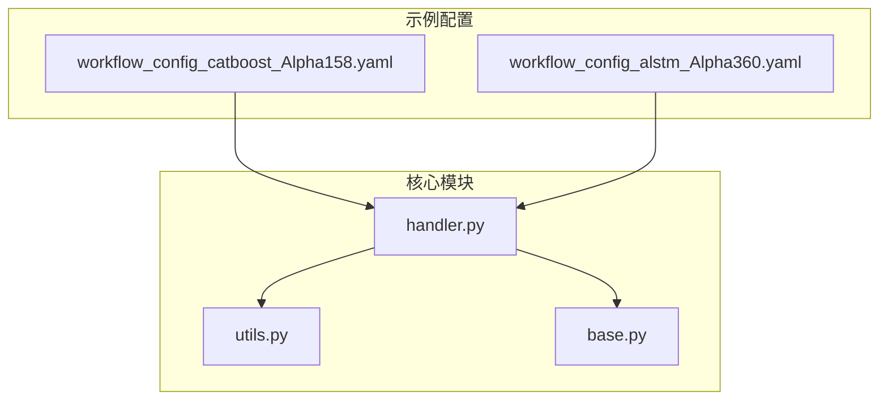
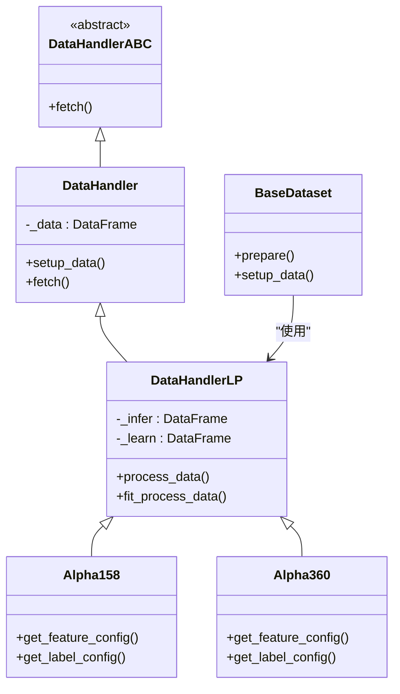
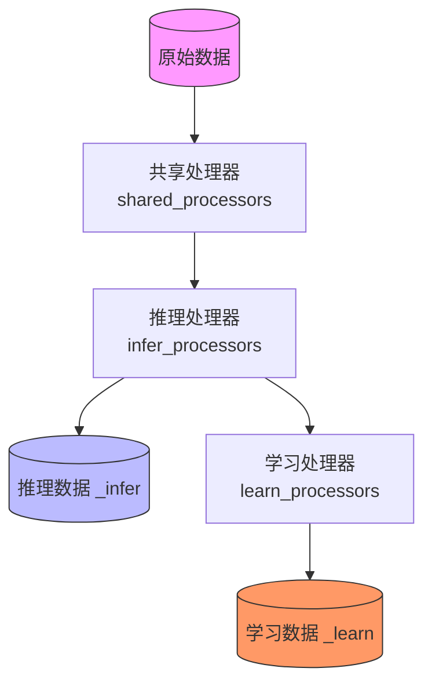
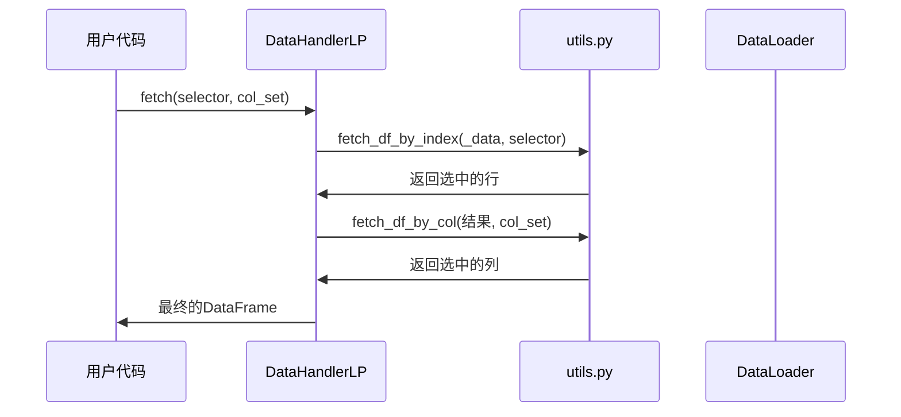
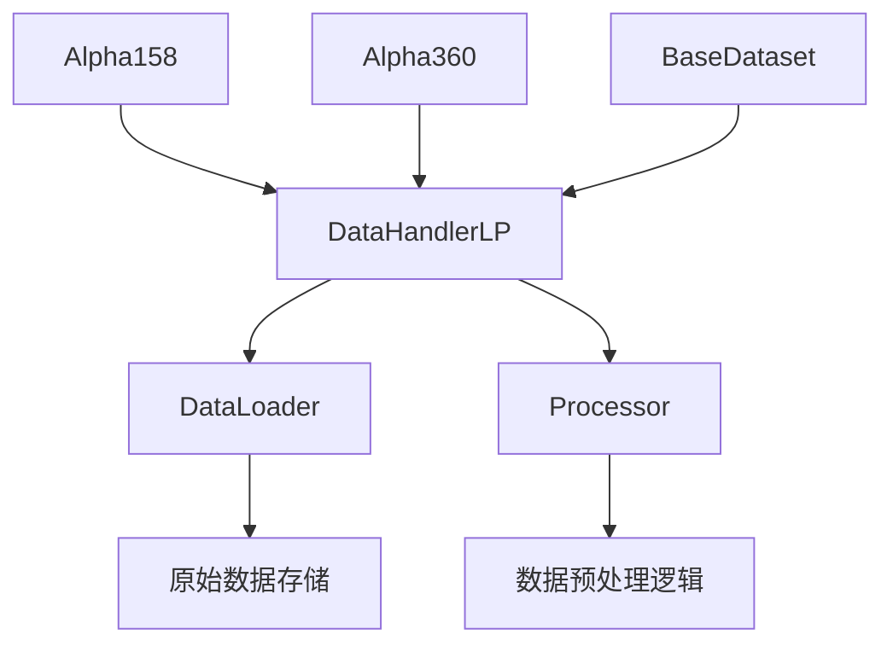

# 数据集构建

<cite>
**本文档中引用的文件**
- [handler.py](file://qlib/data/dataset/handler.py)
- [utils.py](file://qlib/data/dataset/utils.py)
- [base.py](file://qlib/data/base.py)
- [workflow_config_catboost_Alpha158.yaml](file://examples/benchmarks/CatBoost/workflow_config_catboost_Alpha158.yaml)
- [workflow_config_alstm_Alpha360.yaml](file://examples/benchmarks/ALSTM/workflow_config_alstm_Alpha360.yaml)
</cite>

## 目录
1. [引言](#引言)
2. [项目结构](#项目结构)
3. [核心组件](#核心组件)
4. [架构概述](#架构概述)
5. [详细组件分析](#详细组件分析)
6. [依赖分析](#依赖分析)
7. [性能考虑](#性能考虑)
8. [故障排除指南](#故障排除指南)
9. [结论](#结论)

## 引言
本文档全面讲解了Handler机制在数据集构建中的核心作用，解析了Alpha158、Alpha360等经典因子集的定义模式。说明如何通过继承DataHandlerLP实现自定义因子组合，并利用utils.py中的辅助函数进行数据对齐与缺失值处理。阐述BaseDataset和base.py中基础数据结构的设计哲学，包括标签生成（label generation）与样本切片策略。结合examples中的workflow_config文件，演示训练集/验证集划分的时间序列特性保障机制，确保与回测系统的无缝对接。

## 项目结构
Qlib项目的目录结构清晰地展示了其模块化设计。核心数据处理逻辑位于`qlib/data/dataset/`目录下，其中`handler.py`定义了数据处理器的核心接口与实现，`utils.py`提供了数据处理的辅助函数。基础数据表达式类定义在`qlib/data/base.py`中。示例配置文件分布在`examples/benchmarks/`目录下，为不同模型和因子集提供了具体的使用范例。



**图源**
- [handler.py](file://qlib/data/dataset/handler.py#L1-L50)
- [utils.py](file://qlib/data/dataset/utils.py#L1-L20)
- [base.py](file://qlib/data/base.py#L1-L20)

**节源**
- [handler.py](file://qlib/data/dataset/handler.py#L1-L100)
- [project_structure](file://project_structure#L1-L50)

## 核心组件
本节深入分析数据集构建中的核心组件，包括DataHandlerLP、Alpha158、Alpha360以及相关的工具函数。

**节源**
- [handler.py](file://qlib/data/dataset/handler.py#L382-L785)
- [utils.py](file://qlib/data/dataset/utils.py#L1-L143)
- [base.py](file://qlib/data/base.py#L1-L282)

## 架构概述
Qlib的数据集构建架构围绕`DataHandlerLP`类展开，它继承自`DataHandler`并实现了可学习的处理器（Learnable Processor）模式。该架构将原始数据、推理数据和学习数据分离，支持不同的预处理流程。`BaseDataset`作为数据集的基类，负责根据时间片段（segments）从`DataHandler`中准备最终用于模型训练和推理的数据。



**图源**
- [handler.py](file://qlib/data/dataset/handler.py#L382-L785)
- [__init__.py](file://qlib/data/dataset/__init__.py#L40-L96)

## 详细组件分析
### DataHandlerLP 分析
`DataHandlerLP`是构建高级数据处理流水线的基础。它通过三个关键属性管理数据流：`_data`（原始数据）、`_infer`（推理用数据）和`_learn`（学习用数据）。通过`shared_processors`、`infer_processors`和`learn_processors`三组处理器，可以灵活地为不同阶段定制数据预处理逻辑。

#### 处理器工作流


**图源**
- [handler.py](file://qlib/data/dataset/handler.py#L382-L785)

### Alpha158 和 Alpha360 因子集分析
`Alpha158`和`Alpha360`是两个经典的因子集实现，它们都继承自`DataHandlerLP`，并重写了`get_feature_config`和`get_label_config`方法来定义特定的特征和标签。

#### Alpha158 定义模式
```mermaid
classDiagram
class Alpha158 {
+instruments : str
+freq : str
+get_feature_config() FeatureConfig
+get_label_config() LabelConfig
}
note right of Alpha158
特征配置 :
- kbar (K线)
- price (价格)
- rolling (滚动窗口)
标签配置 :
- LABEL0 : Ref($close, -2)/Ref($close, -1) - 1
end note
```

**图源**
- [handler.py](file://qlib/contrib/data/handler.py#L97-L151)

#### Alpha360 定义模式
```mermaid
classDiagram
class Alpha360 {
+instruments : str
+freq : str
+get_feature_config() FeatureConfig
+get_label_config() LabelConfig
}
note right of Alpha360
特征配置 :
- 来自 Alpha360DL 的完整配置
标签配置 :
- LABEL0 : Ref($close, -2)/Ref($close, -1) - 1
end note
```

**图源**
- [handler.py](file://qlib/contrib/data/handler.py#L47-L89)

### 自定义因子组合
用户可以通过继承`DataHandlerLP`来创建自定义的因子组合。这允许完全控制特征工程、数据清洗和标签生成过程。

```python
# 示例代码路径
# file://custom_handler.py
```

**节源**
- [handler.py](file://qlib/data/dataset/handler.py#L382-L785)

### 数据对齐与缺失值处理
`utils.py`文件提供了关键的辅助函数，如`fetch_df_by_index`和`fetch_df_by_col`，用于高效地从多索引DataFrame中提取数据。这些函数是实现数据对齐和处理缺失值的基础。



**图源**
- [utils.py](file://qlib/data/dataset/utils.py#L40-L100)
- [handler.py](file://qlib/data/dataset/handler.py#L200-L300)

## 依赖分析
`DataHandlerLP`及其衍生类构成了一个复杂的依赖网络。`Alpha158`和`Alpha360`依赖于`DataHandlerLP`提供的框架，并通过`QlibDataLoader`加载底层数据。`BaseDataset`则依赖于任何`DataHandler`实例来准备最终的数据集。



**图源**
- [handler.py](file://qlib/data/dataset/handler.py#L382-L785)
- [__init__.py](file://qlib/data/dataset/__init__.py#L40-L96)

## 性能考虑
为了优化性能，`DataHandler`提供了`fetch_orig=True`选项，尽可能避免不必要的数据复制。此外，`drop_raw=True`参数可以在预处理完成后释放原始数据的内存。对于大型数据集，建议使用缓存机制来加速重复的数据加载操作。

## 故障排除指南
常见问题包括处理器配置错误、时间范围不匹配和数据缺失。应检查`workflow_config`文件中的`segments`配置是否与数据可用性一致，并确保所有处理器的参数正确无误。

**节源**
- [handler.py](file://qlib/data/dataset/handler.py#L382-L785)
- [workflow_config_catboost_Alpha158.yaml](file://examples/benchmarks/CatBoost/workflow_config_catboost_Alpha158.yaml#L1-L71)

## 结论
Qlib通过`DataHandlerLP`提供了一个强大而灵活的数据集构建框架。通过对`Alpha158`和`Alpha360`等经典因子集的分析，我们可以看到其清晰的定义模式和可扩展的架构。结合`BaseDataset`的时间序列切片策略和`utils.py`中的高效数据处理函数，开发者能够构建出既符合金融时序特性又易于维护的高质量数据管道，为量化模型的训练和评估奠定坚实基础。