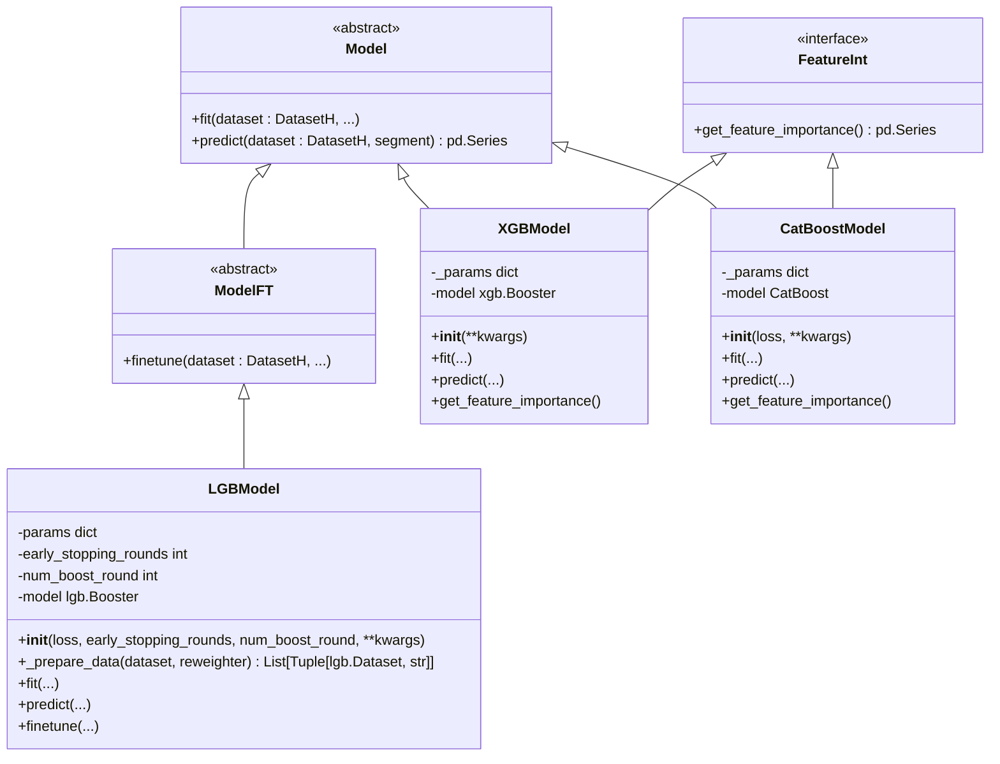
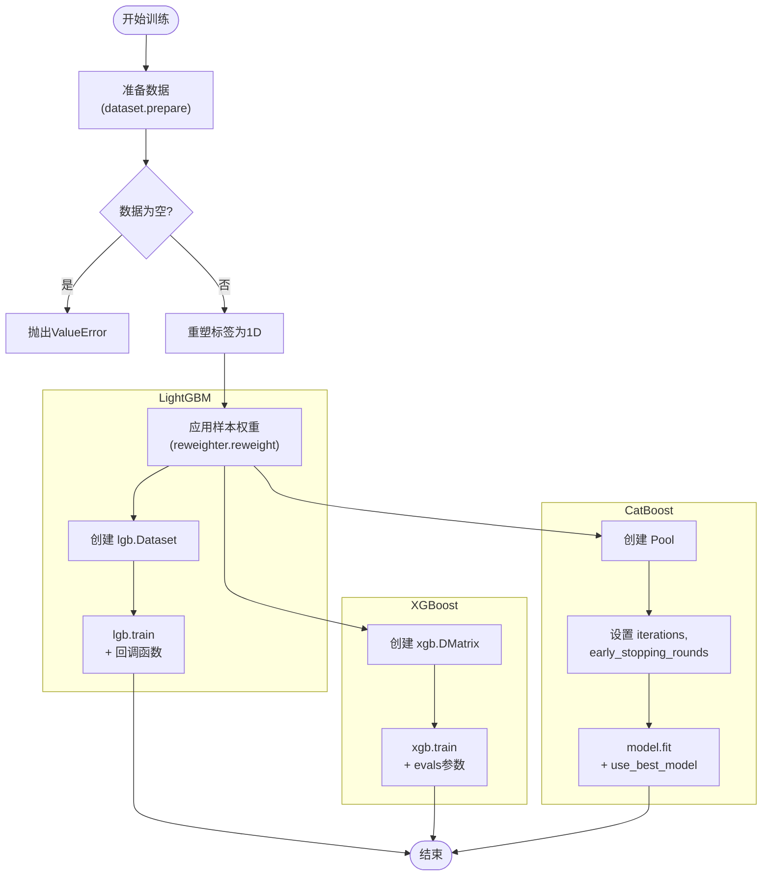

# GBDT系列模型

<cite>
**本文档中引用的文件**
- [gbdt.py](file://qlib/contrib/model/gbdt.py)
- [catboost_model.py](file://qlib/contrib/model/catboost_model.py)
- [xgboost.py](file://qlib/contrib/model/xgboost.py)
- [workflow_config_lightgbm_Alpha158.yaml](file://examples/benchmarks/LightGBM/workflow_config_lightgbm_Alpha158.yaml)
- [workflow_config_xgboost_Alpha158.yaml](file://examples/benchmarks/XGBoost/workflow_config_xgboost_Alpha158.yaml)
- [workflow_config_catboost_Alpha158.yaml](file://examples/benchmarks/CatBoost/workflow_config_catboost_Alpha158.yaml)
</cite>

## 目录
1. [引言](#引言)
2. [基类设计与架构概述](#基类设计与架构概述)
3. [LightGBM模型实现机制](#lightgbm模型实现机制)
4. [XGBoost模型实现机制](#xgboost模型实现机制)
5. [CatBoost模型实现机制](#catboost模型实现机制)
6. [YAML配置文件中超参数分析](#yaml配置文件中超参数分析)
7. [模型训练流程对比](#模型训练流程对比)
8. [预测与特征重要性分析](#预测与特征重要性分析)
9. [Alpha因子构建中的性能比较](#alpha因子构建中的性能比较)
10. [代码示例：模型加载与批量预测](#代码示例模型加载与批量预测)
11. [结论与适用场景建议](#结论与适用场景建议)

## 引言
Qlib是一个面向量化金融研究的机器学习平台，支持多种先进的GBDT（梯度提升决策树）模型，包括LightGBM、XGBoost和CatBoost。这些模型在Alpha因子挖掘中表现出色，因其强大的非线性拟合能力、对高维特征的良好适应性以及高效的训练速度而被广泛采用。本文深入剖析Qlib中这三种GBDT模型的实现机制，重点介绍其基类设计、参数配置策略、训练流程差异及预测优化手段，并结合实际YAML配置文件分析关键超参数设置对因子效果的影响。

## 基类设计与架构概述
Qlib通过统一的接口抽象简化了不同GBDT模型的集成与使用。所有GBDT模型均继承自`Model`或`ModelFT`基类，并实现了`FeatureInt`等可解释性接口，确保API一致性的同时提供灵活扩展能力。

**图示来源**
- [gbdt.py](file://qlib/contrib/model/gbdt.py#L15-L123)
- [xgboost.py](file://qlib/contrib/model/xgboost.py#L14-L84)
- [catboost_model.py](file://qlib/contrib/model/catboost_model.py#L16-L95)

**本节来源**
- [gbdt.py](file://qlib/contrib/model/gbdt.py#L15-L123)
- [xgboost.py](file://qlib/contrib/model/xgboost.py#L14-L84)
- [catboost_model.py](file://qlib/contrib/model/catboost_model.py#L16-L95)

## LightGBM模型实现机制
LightGBM在Qlib中由`LGBModel`类实现，该类继承自`ModelFT`并融合了`LightGBMFInt`以支持特征重要性分析。其核心优势在于基于直方图的快速分裂算法和Leaf-wise生长策略，能够高效处理大规模数据。

### 参数配置
初始化时接受`loss`（目标函数）、`early_stopping_rounds`（早停轮数）、`num_boost_round`（最大迭代次数）等参数，并将其他LightGBM原生参数通过`**kwargs`传递至`self.params`字典。

### 训练流程
`fit`方法首先调用`_prepare_data`准备训练与验证集。此过程会：
- 从`DatasetH`中提取“train”和“valid”段的数据；
- 将二维标签压缩为一维（因LightGBM不支持多标签）；
- 支持样本重加权（reweighting）；
- 构建`lgb.Dataset`对象列表。

随后，利用`lgb.train`进行训练，内置早停、日志输出和评估结果记录回调函数，并通过`R.log_metrics`将每轮指标写入实验管理器。

### 预测优化
`predict`方法直接调用`self.model.predict`，输入经`dataset.prepare`处理后的测试集特征矩阵。

### 微调支持
`finetune`方法允许基于已有模型继续训练少量轮次，适用于增量学习或在线更新场景。

**本节来源**
- [gbdt.py](file://qlib/contrib/model/gbdt.py#L15-L123)

## XGBoost模型实现机制
XGBoost在Qlib中由`XGBModel`类实现，继承自`Model`并实现`FeatureInt`接口。它采用精确贪心算法或近似算法寻找最优分割点，具有较强的理论保障和正则化机制。

### 参数配置
与LightGBM不同，XGBoost模型的所有参数均存储于`self._params`字典中，在`__init__`阶段接收并通过`update`合并外部参数。

### 训练流程
`fit`方法同样准备训练/验证数据，并检查标签维度。关键区别在于数据封装方式：使用`xgb.DMatrix`包装特征和标签，支持样本权重。训练通过`xgb.train`完成，直接指定`evals`参数进行验证集监控，且自动启用早停。

评估结果`evals_result`会被重新组织为与Qlib标准兼容的格式（如`train-rmse`, `valid-rmse`），便于后续分析。

### 特征重要性
`get_feature_importance`方法封装了XGBoost原生的`get_score`接口，返回按重要性排序的Pandas Series，支持多种重要性类型（如weight, gain, cover）。

**本节来源**
- [xgboost.py](file://qlib/contrib/model/xgboost.py#L14-L84)

## CatBoost模型实现机制
CatBoost专长于处理类别型特征，在Qlib中由`CatBoostModel`类实现，同样继承`Model`并实现`FeatureInt`。

### 参数配置
构造函数接受`loss`参数（默认RMSE用于回归任务），其余参数存入`self._params`。特别地，`task_type`会根据GPU设备可用性自动设为"GPU"或"CPU"。

### 训练流程
训练前需将数据封装为`Pool`对象，这是CatBoost特有的数据结构。训练过程调用`self.model.fit`，并设置`use_best_model=True`以启用内置早停逻辑。

值得注意的是，CatBoost内部已集成早停机制，因此无需像LightGBM那样显式传入回调函数。

### 特征重要性
`get_feature_importance`方法调用CatBoost原生API获取重要性得分，并以特征名为索引构建排序后的Series。

**本节来源**
- [catboost_model.py](file://qlib/contrib/model/catboost_model.py#L16-L95)

## YAML配置文件中超参数分析
Qlib通过YAML配置文件定义完整的实验流程，包含模型、数据集和回测策略。以下对比三种模型在Alpha158基准下的典型配置：

| 超参数 | LightGBM | XGBoost | CatBoost |
|--------|----------|---------|----------|
| 学习率 (`learning_rate` / `eta`) | 0.2 | 0.0421 | 0.0421 |
| 树的最大深度 (`max_depth`) | 8 | 8 | 6 |
| 叶子节点数 (`num_leaves`) | 210 | N/A | 100 |
| 迭代次数 (`num_boost_round` / `n_estimators`) | 1000 (默认) | 647 | 1000 (默认) |
| 列采样比例 (`colsample_bytree`) | 0.8879 | 0.8879 | N/A |
| 行采样比例 (`subsample`) | 0.8789 | 0.8789 | 0.8789 |
| 正则化项 (`lambda_l1`, `lambda_l2`) | 205.7, 581.0 | N/A | N/A |
| 生长策略 (`grow_policy`) | Leaf-wise (默认) | Level-wise (默认) | Lossguide |
| 引导方式 (`bootstrap_type`) | Bernoulli (默认) | N/A | Poisson |

### 关键超参数影响分析
- **`num_leaves`**: LightGBM的核心参数，控制模型复杂度。较大值可能过拟合，较小值欠拟合。通常`num_leaves < 2^max_depth`。
- **`learning_rate`**: 所有模型共有的敏感参数。过高导致震荡不收敛，过低收敛慢。常配合`num_boost_round`调整。
- **`max_depth`**: 限制单棵树深度，防止过拟合。CatBoost默认较浅，依赖更多迭代补偿。
- **`subsample` / `colsample_bytree`**: 引入随机性，增强泛化能力，降低方差。
- **正则化参数**: LightGBM明确支持L1/L2正则；XGBoost通过`reg_alpha`/`reg_lambda`实现；CatBoost通过`l2_leaf_reg`控制。

合理设置这些参数能显著提升Alpha因子的稳定性与IC值。

**本节来源**
- [workflow_config_lightgbm_Alpha158.yaml](file://examples/benchmarks/LightGBM/workflow_config_lightgbm_Alpha158.yaml#L1-L72)
- [workflow_config_xgboost_Alpha158.yaml](file://examples/benchmarks/XGBoost/workflow_config_xgboost_Alpha158.yaml#L1-L70)
- [workflow_config_catboost_Alpha158.yaml](file://examples/benchmarks/CatBoost/workflow_config_catboost_Alpha158.yaml#L1-L71)

## 模型训练流程对比
下图展示了三种GBDT模型在Qlib中的训练流程差异：

**图示来源**
- [gbdt.py](file://qlib/contrib/model/gbdt.py#L15-L123)
- [xgboost.py](file://qlib/contrib/model/xgboost.py#L14-L84)
- [catboost_model.py](file://qlib/contrib/model/catboost_model.py#L16-L95)

**本节来源**
- [gb