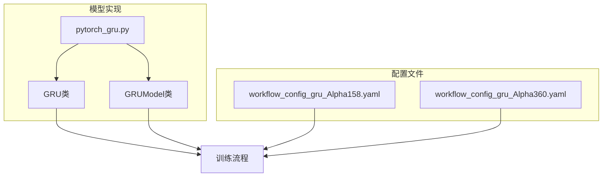
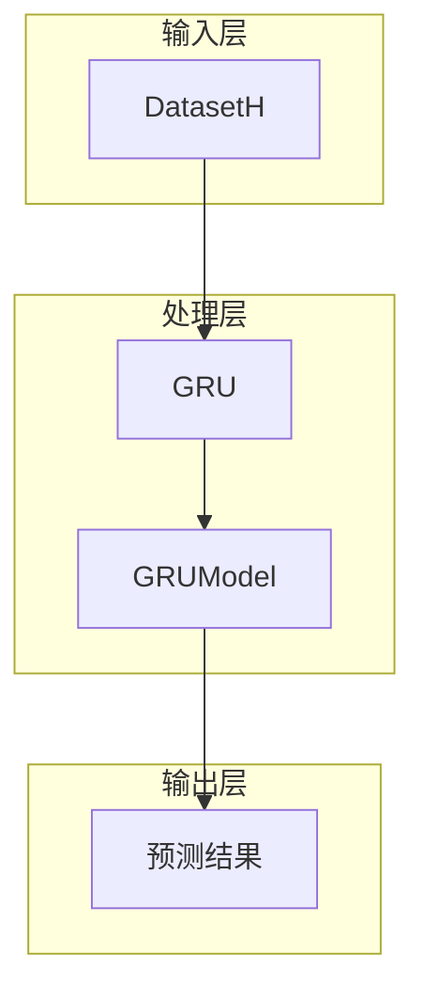
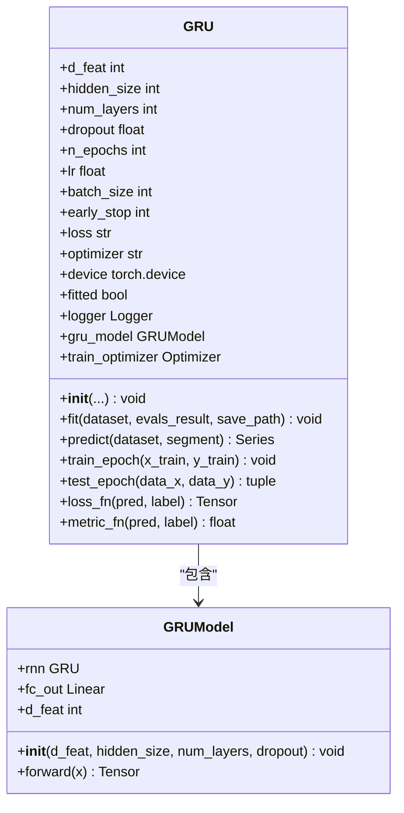
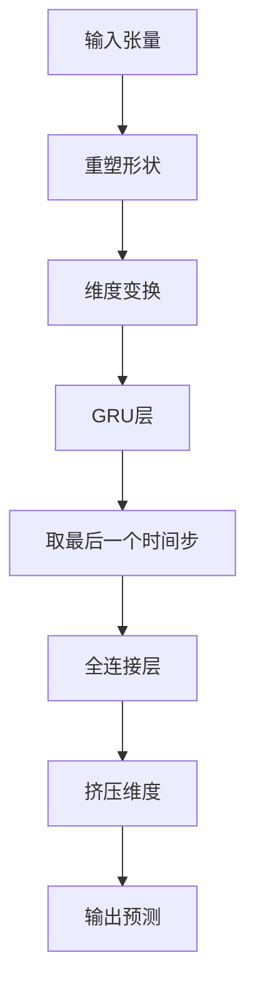
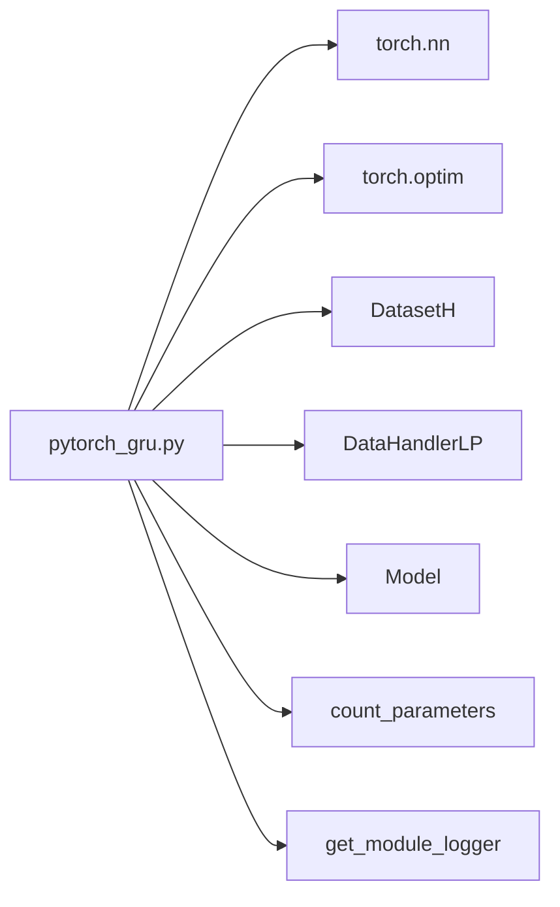

# GRU模型

<cite>
**本文档引用的文件**
- [pytorch_gru.py](file://qlib/contrib/model/pytorch_gru.py)
- [workflow_config_gru_Alpha158.yaml](file://examples/benchmarks/GRU/workflow_config_gru_Alpha158.yaml)
- [workflow_config_gru_Alpha360.yaml](file://examples/benchmarks/GRU/workflow_config_gru_Alpha360.yaml)
</cite>

## 目录
1. [引言](#引言)
2. [项目结构](#项目结构)
3. [核心组件](#核心组件)
4. [架构概述](#架构概述)
5. [详细组件分析](#详细组件分析)
6. [依赖分析](#依赖分析)
7. [性能考量](#性能考量)
8. [故障排除指南](#故障排除指南)
9. [结论](#结论)

## 引言
本文档系统介绍Qlib中GRU模型的实现原理与工程实践。重点分析重置门和更新门的工作机制，对比其与LSTM在参数效率和长程依赖捕捉上的差异。结合pytorch_gru.py源码，解释批量归一化、dropout正则化和序列打包（PackedSequence）等关键技术的应用方式。通过实际YAML配置演示训练流程编排，并给出典型使用场景下的性能调优指南，包括学习率调度、序列截断处理和GPU内存优化策略。

## 项目结构
Qlib框架中的GRU模型实现位于contrib/model目录下，主要由pytorch_gru.py文件构成。该模型作为时间序列预测的重要工具，在examples/benchmarks/GRU目录中提供了针对Alpha158和Alpha360特征集的标准配置文件。整个项目采用模块化设计，将数据处理、模型定义和训练流程分离，便于扩展和维护。



**图示来源**
- [pytorch_gru.py](file://qlib/contrib/model/pytorch_gru.py#L24-L315)
- [workflow_config_gru_Alpha158.yaml](file://examples/benchmarks/GRU/workflow_config_gru_Alpha158.yaml#L1-L98)
- [workflow_config_gru_Alpha360.yaml](file://examples/benchmarks/GRU/workflow_config_gru_Alpha360.yaml#L1-L88)

**本节来源**
- [pytorch_gru.py](file://qlib/contrib/model/pytorch_gru.py)
- [examples/benchmarks/GRU](file://examples/benchmarks/GRU)

## 核心组件
GRU模型的核心组件包括GRU类和GRUModel类。前者负责训练流程控制、数据准备和评估，后者专注于网络结构的定义。模型通过门控机制有效捕捉时间序列中的长期依赖关系，相比LSTM减少了参数数量，提高了计算效率。在初始化过程中，模型支持多种超参数配置，包括隐藏层大小、层数、dropout率等，并可根据需要选择不同的优化器。

**本节来源**
- [pytorch_gru.py](file://qlib/contrib/model/pytorch_gru.py#L24-L315)

## 架构概述
Qlib中的GRU模型采用分层架构设计，上层为训练控制器GRU类，下层为网络结构GRUModel类。这种设计实现了关注点分离，使得模型结构可以独立于训练逻辑进行修改。数据流从DatasetH对象获取特征和标签，经过预处理后输入到GRUModel中进行前向传播，最终输出预测结果。整个过程支持GPU加速，可通过配置灵活调整训练参数。



**图示来源**
- [pytorch_gru.py](file://qlib/contrib/model/pytorch_gru.py#L24-L315)

## 详细组件分析

### GRU类分析
GRU类作为模型的主控制器，实现了完整的训练和预测流程。它继承自Qlib的Model基类，遵循统一的接口规范。类中包含了训练、验证、测试等关键方法，通过fit方法协调整个训练过程，使用predict方法生成预测结果。日志记录功能贯穿始终，便于监控训练状态。

#### 类图


**图示来源**
- [pytorch_gru.py](file://qlib/contrib/model/pytorch_gru.py#L24-L315)

#### 训练流程时序图
```mermaid
sequenceDiagram
participant 用户
participant GRU as GRU类
participant GRUModel as GRUModel类
participant 数据集 as DatasetH
用户->>GRU : 调用fit方法
GRU->>数据集 : 准备训练数据
数据集-->>GRU : 返回训练数据
GRU->>数据集 : 准备验证数据
数据集-->>GRU : 返回验证数据
loop 每个训练周期
GRU->>GRU : 记录日志
GRU->>GRU : 调用train_epoch
GRU->>GRUModel : 前向传播
GRUModel-->>GRU : 返回预测值
GRU->>GRU : 计算损失
GRU->>GRU : 反向传播
GRU->>GRU : 更新参数
GRU->>GRU : 调用test_epoch
GRU->>GRUModel : 验证模式前向传播
GRUModel-->>GRU : 返回验证结果
GRU->>GRU : 记录指标
alt 性能提升
GRU->>GRU : 保存最佳参数
else 未提升且达到早停条件
GRU->>用户 : 提前终止训练
break
end
end
GRU->>GRU : 加载最佳参数
GRU->>GRU : 保存模型
GRU-->>用户 : 训练完成
```

**图示来源**
- [pytorch_gru.py](file://qlib/contrib/model/pytorch_gru.py#L208-L289)

**本节来源**
- [pytorch_gru.py](file://qlib/contrib/model/pytorch_gru.py#L24-L315)

### GRUModel类分析
GRUModel类是实际的神经网络结构，基于PyTorch的nn.Module构建。它封装了GRU层和全连接输出层，通过forward方法定义前向传播逻辑。输入数据首先被重塑为适合RNN处理的形状，然后通过GRU层提取时间序列特征，最后由全连接层生成单值预测结果。该设计充分利用了PyTorch的自动微分机制，简化了梯度计算过程。

#### 网络结构流程图


**图示来源**
- [pytorch_gru.py](file://qlib/contrib/model/pytorch_gru.py#L319-L338)

**本节来源**
- [pytorch_gru.py](file://qlib/contrib/model/pytorch_gru.py#L318-L338)

## 依赖分析
GRU模型的实现依赖于多个Qlib核心模块和PyTorch库。主要依赖关系包括：从qlib.data.dataset导入DatasetH用于数据访问，从qlib.model.base继承Model基类以获得统一接口，使用PyTorch的nn模块构建神经网络结构。这些依赖关系确保了模型能够无缝集成到Qlib的整体工作流中，同时保持良好的可扩展性。



**图示来源**
- [pytorch_gru.py](file://qlib/contrib/model/pytorch_gru.py#L1-L339)

**本节来源**
- [pytorch_gru.py](file://qlib/contrib/model/pytorch_gru.py#L1-L339)

## 性能考量
在实际应用中，GRU模型的性能受多种因素影响。批量大小的选择需要平衡内存占用和梯度估计的稳定性；学习率设置直接影响收敛速度和最终精度；dropout率用于防止过拟合但可能降低模型容量。此外，GPU的使用显著加速训练过程，特别是在处理大规模数据集时。建议根据具体任务特点进行超参数调优，以获得最佳性能表现。

## 故障排除指南
当遇到训练问题时，首先检查数据是否为空或包含过多缺失值，这可能导致训练失败。确认GPU可用性及驱动版本兼容性，避免因硬件问题导致的异常。若出现梯度爆炸现象，可尝试减小学习率或增加梯度裁剪阈值。对于过拟合问题，适当增加dropout率或引入更多正则化手段通常有效。日志信息是诊断问题的关键，应仔细审查每个训练周期的输出，及时发现潜在问题。

**本节来源**
- [pytorch_gru.py](file://qlib/contrib/model/pytorch_gru.py#L155-L206)
- [pytorch_gru.py](file://qlib/contrib/model/pytorch_gru.py#L291-L315)

## 结论
Qlib中的GRU模型实现了一个高效的时间序列预测解决方案，通过简洁而强大的架构设计，平衡了模型复杂度和预测性能。其模块化的代码结构便于理解和扩展，丰富的配置选项支持多样化的应用场景。未来可进一步探索与其他技术（如注意力机制）的结合，以提升模型在复杂市场环境下的适应能力。