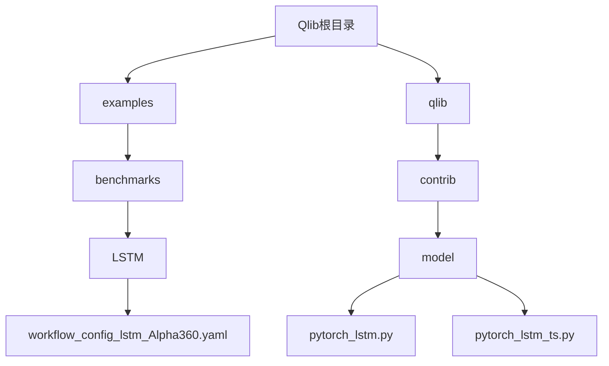
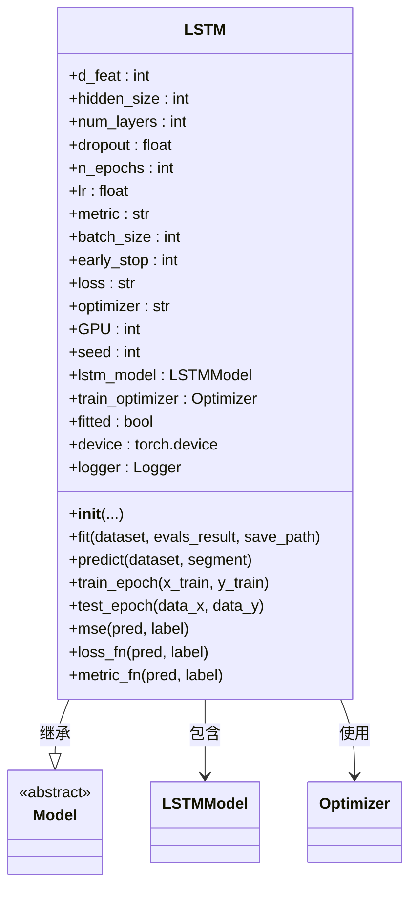
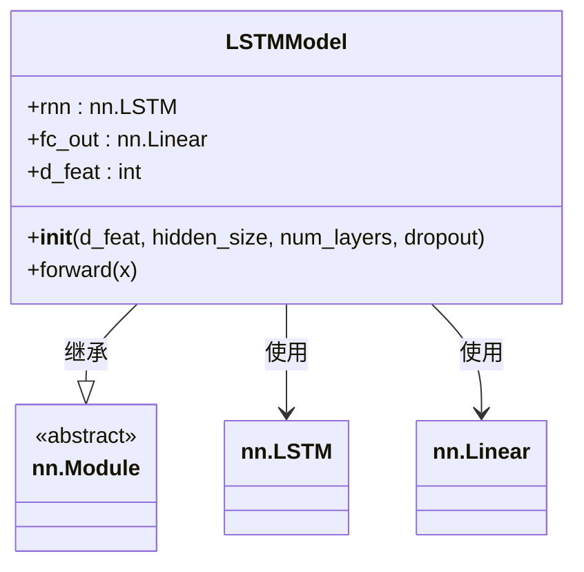
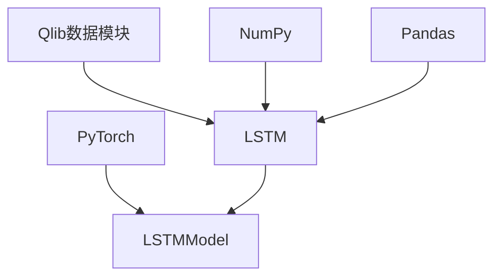

# LSTM模型

<cite>
**本文档中引用的文件**
- [workflow_config_lstm_Alpha360.yaml](file://examples/benchmarks/LSTM/workflow_config_lstm_Alpha360.yaml)
- [pytorch_lstm.py](file://qlib/contrib/model/pytorch_lstm.py)
- [pytorch_lstm_ts.py](file://qlib/contrib/model/pytorch_lstm_ts.py)
</cite>

## 目录
1. [简介](#简介)
2. [项目结构](#项目结构)
3. [核心组件](#核心组件)
4. [架构概述](#架构概述)
5. [详细组件分析](#详细组件分析)
6. [依赖关系分析](#依赖关系分析)
7. [性能考量](#性能考量)
8. [故障排除指南](#故障排除指南)
9. [结论](#结论)

## 简介
本文深入解析Qlib中基于PyTorch实现的LSTM模型架构及其在金融时间序列预测中的应用。重点阐述单层与多层LSTM网络结构设计、隐藏状态初始化策略、门控机制参数配置及梯度裁剪等训练优化技巧。结合workflow_config_lstm_Alpha360.yaml配置文件，说明数据输入格式（如序列长度、特征维度）、输出目标（如未来收益率预测）以及损失函数选择。提供代码级示例展示如何通过继承基类自定义LSTM变体，并讨论其在Alpha因子建模中的表现特性与调参建议。

## 项目结构
Qlib框架下的LSTM模型实现主要分布在`qlib/contrib/model/`目录下，包含两个核心实现文件：`pytorch_lstm.py`和`pytorch_lstm_ts.py`。这两个文件分别对应不同的数据处理方式和训练流程。同时，在`examples/benchmarks/LSTM/`目录下提供了完整的配置文件`workflow_config_lstm_Alpha360.yaml`，用于定义模型训练的具体参数和数据集划分。



**图表来源**
- [workflow_config_lstm_Alpha360.yaml](file://examples/benchmarks/LSTM/workflow_config_lstm_Alpha360.yaml)
- [pytorch_lstm.py](file://qlib/contrib/model/pytorch_lstm.py)
- [pytorch_lstm_ts.py](file://qlib/contrib/model/pytorch_lstm_ts.py)

**章节来源**
- [workflow_config_lstm_Alpha360.yaml](file://examples/benchmarks/LSTM/workflow_config_lstm_Alpha360.yaml)
- [pytorch_lstm.py](file://qlib/contrib/model/pytorch_lstm.py)

## 核心组件
LSTM模型的核心由两个主要类构成：`LSTM`和`LSTMModel`。其中`LSTM`类继承自Qlib的`Model`基类，负责模型的整体生命周期管理，包括训练、验证和预测；而`LSTMModel`则是一个纯粹的PyTorch `nn.Module`子类，专注于LSTM网络的前向传播逻辑。

**章节来源**
- [pytorch_lstm.py](file://qlib/contrib/model/pytorch_lstm.py#L23-L305)
- [pytorch_lstm_ts.py](file://qlib/contrib/model/pytorch_lstm_ts.py#L24-L313)

## 架构概述
LSTM模型采用标准的编码器-解码器架构，其中编码器部分由一个或多个LSTM层组成，解码器部分则是一个简单的全连接层。整个模型的设计旨在捕捉金融时间序列中的长期依赖关系，并据此预测未来的市场走势。

```mermaid
graph LR
Input[输入数据] --> Reshape[重塑为[N, F, T]]
Reshape --> Permute[转置为[N, T, F]]
Permute --> LSTM[LSTM层]
LSTM --> FC[全连接层]
FC --> Output[输出预测]
```

**图表来源**
- [pytorch_lstm.py](file://qlib/contrib/model/pytorch_lstm.py#L285-L305)
- [pytorch_lstm_ts.py](file://qlib/contrib/model/pytorch_lstm_ts.py#L296-L313)

## 详细组件分析

### LSTM类分析
`LSTM`类是模型的主控制器，它封装了所有与训练相关的逻辑，包括超参数设置、优化器选择、损失函数计算以及训练循环。

#### 类图


**图表来源**
- [pytorch_lstm.py](file://qlib/contrib/model/pytorch_lstm.py#L23-L282)
- [pytorch_lstm_ts.py](file://qlib/contrib/model/pytorch_lstm_ts.py#L24-L293)

#### 训练流程序列图
```mermaid
sequenceDiagram
participant User as 用户
participant LSTM as LSTM模型
participant Dataset as 数据集
User->>LSTM : 调用fit方法
LSTM->>Dataset : 准备训练、验证数据
loop 每个训练周期
LSTM->>LSTM : 打印日志
LSTM->>LSTM : train_epoch(x_train, y_train)
LSTM->>LSTM : test_epoch(x_train, y_train)
LSTM->>LSTM : test_epoch(x_valid, y_valid)
LSTM->>LSTM : 记录评估结果
alt 验证分数提高
LSTM->>LSTM : 更新最佳参数
LSTM->>LSTM : 重置早停计数器
else
LSTM->>LSTM : 增加早停计数器
alt 达到早停条件
LSTM->>LSTM : 提前终止训练
break
end
end
end
LSTM->>User : 返回训练完成信号
```

**图表来源**
- [pytorch_lstm.py](file://qlib/contrib/model/pytorch_lstm.py#L23-L282)
- [pytorch_lstm_ts.py](file://qlib/contrib/model/pytorch_lstm_ts.py#L24-L293)

**章节来源**
- [pytorch_lstm.py](file://qlib/contrib/model/pytorch_lstm.py#L23-L282)
- [pytorch_lstm_ts.py](file://qlib/contrib/model/pytorch_lstm_ts.py#L24-L293)

### LSTMModel类分析
`LSTMModel`类是实际执行LSTM计算的核心模块，它利用PyTorch内置的`nn.LSTM`层来构建网络。

#### 类图


**图表来源**
- [pytorch_lstm.py](file://qlib/contrib/model/pytorch_lstm.py#L285-L305)
- [pytorch_lstm_ts.py](file://qlib/contrib/model/pytorch_lstm_ts.py#L296-L313)

#### 前向传播流程图
```mermaid
flowchart TD
Start([输入 x: [N, F*T]]) --> Reshape["重塑 x: [N, F, T]"]
Reshape --> Permute["转置 x: [N, T, F]"]
Permute --> LSTM["LSTM 层处理"]
LSTM --> Select["选择最后一个时间步的输出"]
Select --> FC["全连接层映射到标量"]
FC --> Squeeze["压缩维度"]
Squeeze --> End([输出预测值])
```

**图表来源**
- [pytorch_lstm.py](file://qlib/contrib/model/pytorch_lstm.py#L300-L305)
- [pytorch_lstm_ts.py](file://qlib/contrib/model/pytorch_lstm_ts.py#L311-L313)

**章节来源**
- [pytorch_lstm.py](file://qlib/contrib/model/pytorch_lstm.py#L285-L305)
- [pytorch_lstm_ts.py](file://qlib/contrib/model/pytorch_lstm_ts.py#L296-L313)

## 依赖关系分析
LSTM模型的实现依赖于多个外部库和内部模块。最主要的依赖是PyTorch，用于提供深度学习基础功能。此外，模型还依赖于Qlib自身的数据处理模块，如`DataHandlerLP`和`DatasetH`，以确保能够正确地加载和预处理金融数据。



**图表来源**
- [pytorch_lstm.py](file://qlib/contrib/model/pytorch_lstm.py)
- [pytorch_lstm_ts.py](file://qlib/contrib/model/pytorch_lstm_ts.py)

**章节来源**
- [pytorch_lstm.py](file://qlib/contrib/model/pytorch_lstm.py)
- [pytorch_lstm_ts.py](file://qlib/contrib/model/pytorch_lstm_ts.py)

## 性能考量
在实际应用中，LSTM模型的性能受到多种因素的影响。首先，GPU的使用可以显著加速训练过程。其次，批量大小(batch_size)的选择需要权衡内存消耗和梯度估计的稳定性。最后，梯度裁剪技术被用来防止梯度爆炸问题，这对于保持训练稳定至关重要。

## 故障排除指南
当遇到模型训练不收敛的问题时，应首先检查数据预处理步骤是否正确执行，特别是缺失值填充和标准化操作。其次，确认超参数设置是否合理，例如学习率不宜过高。如果出现CUDA内存不足错误，则应减小批量大小或释放不必要的变量。

**章节来源**
- [pytorch_lstm.py](file://qlib/contrib/model/pytorch_lstm.py#L149-L189)
- [pytorch_lstm_ts.py](file://qlib/contrib/model/pytorch_lstm_ts.py#L155-L197)

## 结论
Qlib中的LSTM模型提供了一个强大且灵活的框架，用于金融时间序列预测。通过对超参数的精细调整和对数据质量的严格把控，该模型能够在复杂的市场环境中提取有价值的信息，为量化投资决策提供支持。