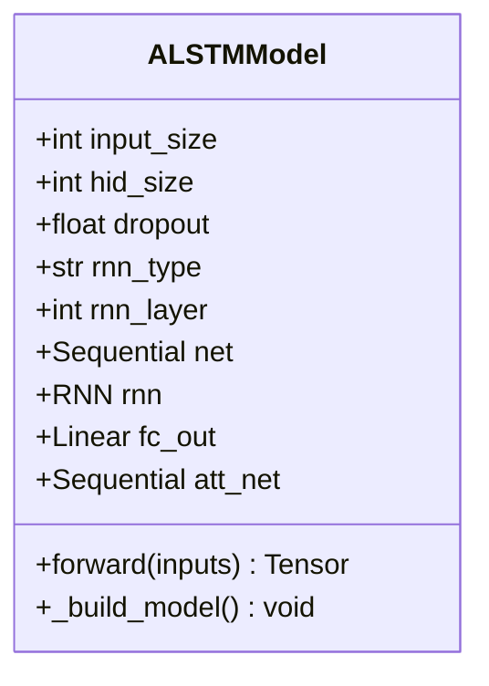

# ALSTM模型

<cite>
**本文档中引用的文件**
- [pytorch_alstm.py](file://qlib/contrib/model/pytorch_alstm.py)
- [workflow_config_alstm_Alpha360.yaml](file://examples/benchmarks/ALSTM/workflow_config_alstm_Alpha360.yaml)
- [alstm_config_demo.py](file://alstm_config_demo.py)
- [alstm_training_analysis.py](file://alstm_training_analysis.py)
- [deep_learning_models_comparison.py](file://deep_learning_models_comparison.py)
- [alstm_final_report.json](file://alstm_analysis/alstm_final_report.json)
</cite>

## 更新摘要
**已更新内容**
- 在文档中新增了对alstm_config_demo.py、alstm_training_analysis.py和deep_learning_models_comparison.py分析工具的介绍
- 增加了对alstm_final_report.json报告文件的说明
- 更新了模型配置分析、训练模拟和性能预测功能的相关内容
- 扩展了模型对比分析和实施建议部分

## 目录
1. [简介](#简介)
2. [核心架构与技术细节](#核心架构与技术细节)
3. [关键参数解析](#关键参数解析)
4. [配置文件说明](#配置文件说明)
5. [训练与预测流程](#训练与预测流程)
6. [性能对比与优势分析](#性能对比与优势分析)
7. [预测接口使用示例](#预测接口使用示例)
8. [ALSTM模型配置分析工具](#alstm模型配置分析工具)
9. [ALSTM训练过程模拟分析](#alstm训练过程模拟分析)
10. [深度学习模型对比分析](#深度学习模型对比分析)
11. [最终分析报告](#最终分析报告)
12. [总结](#总结)

## 简介
ALSTM（Attention-based LSTM）是一种融合了自注意力机制与LSTM循环结构的混合架构模型，专为时间序列预测任务设计。该模型通过引入注意力层动态加权历史时间步的重要性，显著增强了对局部趋势的捕捉能力。根据项目中的README文件，当前实现版本是ALSTM的一个简化形式，即在标准LSTM基础上添加注意力机制。

本模型基于PyTorch框架实现，并集成于Qlib量化研究平台中，适用于股票收益率预测等金融时序建模场景。其核心思想源自论文《A dual-stage attention-based recurrent neural network for time series prediction》，旨在解决传统RNN在处理长周期依赖和短期波动平衡上的局限性。

## 核心架构与技术细节
ALSTM模型的核心由`ALSTMModel`类实现，继承自`nn.Module`，采用混合架构将全连接层、循环神经网络（RNN）与注意力机制有机结合。



**图源**
- [pytorch_alstm.py](file://qlib/contrib/model/pytorch_alstm.py#L293-L343)

### 模型构建流程
`_build_model()`方法负责初始化各组件：
1. **输入变换模块 `net`**：包含一个线性层（`fc_in`）和Tanh激活函数，用于将原始特征映射到隐藏空间。
2. **循环层 `rnn`**：支持多种RNN类型（如GRU或LSTM），通过反射机制动态创建，保持序列状态传递。
3. **注意力网络 `att_net`**：多层感知机结构，计算每个时间步的注意力得分，经Softmax归一化后生成权重分布。
4. **输出层 `fc_out`**：拼接最后时刻隐状态与注意力加权和，输出最终预测值。

### 前向传播逻辑
`forward()`方法定义了数据流动过程：
1. 输入张量被重塑并转置以适应`[batch, seq_len, input_size]`格式。
2. 经过`net`变换后送入RNN，获得所有时间步的输出`rnn_out`。
3. 注意力网络对`rnn_out`逐时间步评分，得到`attention_score`。
4. 使用`torch.mul`进行逐元素乘法，实现加权求和`out_att`。
5. 最终输出结合了最后时刻隐状态`rnn_out[:, -1, :]`与全局上下文`out_att`，增强模型表达能力。

这种设计使得模型既能保留LSTM对长期依赖的记忆能力，又能通过注意力机制聚焦关键时间点，提升短期波动识别精度。

**节源**
- [pytorch_alstm.py](file://qlib/contrib/model/pytorch_alstm.py#L332-L343)

## 关键参数解析
以下参数直接影响ALSTM模型的性能与行为：

| 参数名 | 含义 | 默认值 | 影响分析 |
|-------|------|--------|---------|
| `d_feat` | 每个时间步的输入特征维度 | 6 | 决定模型接收的市场因子数量，影响信息容量 |
| `hidden_size` | RNN隐藏层大小 | 64 | 控制模型复杂度，过大易过拟合，过小则欠拟合 |
| `num_layers` | RNN层数 | 2 | 增加深度可提升非线性表达能力，但增加训练难度 |
| `dropout` | Dropout比率 | 0.0 | 正则化手段，防止过拟合，提高泛化能力 |
| `att_dim` | 注意力机制中间维度 | `hidden_size / 2` | 控制注意力计算复杂度，间接影响聚焦效果 |

其中，`att_dim`虽未显式声明，但在`att_fc_in`层中体现为`int(self.hid_size / 2)`，决定了注意力评分网络的宽度。适当调整该参数有助于优化注意力分布的平滑性与区分度。

此外，`rnn_type="GRU"`表明默认使用门控循环单元而非LSTM，这在一定程度上简化了内部结构，加快训练速度，同时仍保持较强的序列建模能力。

**节源**
- [pytorch_alstm.py](file://qlib/contrib/model/pytorch_alstm.py#L293-L343)

## 配置文件说明
运行ALSTM模型需依赖YAML配置文件，以`workflow_config_alstm_Alpha360.yaml`为例，关键运行参数如下：

```yaml
task:
    model:
        kwargs:
            d_feat: 6
            hidden_size: 64
            num_layers: 2
            dropout: 0.0
            n_epochs: 200
            lr: 1e-3
            early_stop: 20
            batch_size: 800
            metric: loss
            loss: mse
            GPU: 0
            rnn_type: GRU
    dataset:
        kwargs:
            handler:
                class: Alpha360
                kwargs:
                    start_time: 2008-01-01
                    end_time: 2020-08-01
                    fit_start_time: 2008-01-01
                    fit_end_time: 2014-12-31
                    instruments: *market
```

### 训练相关参数
- `n_epochs`: 最大训练轮次为200轮。
- `early_stop`: 若验证集性能连续20轮未提升，则提前终止训练，避免过拟合。
- `batch_size`: 批次大小设为800，影响梯度估计稳定性与内存占用。
- `lr`: 学习率设置为0.001，配合Adam优化器实现自适应更新。

### 数据与评估
- `dataset.handler`: 使用Alpha360特征处理器，提取360维技术指标作为输入。
- `segments`: 明确划分训练、验证、测试时间段，确保回测严谨性。
- `metric`: 以损失函数值作为早停判断依据，确保收敛质量。

用户可根据实际需求修改这些参数，例如增大`hidden_size`以增强模型容量，或调整`batch_size`适应不同硬件条件。

**节源**
- [workflow_config_alstm_Alpha360.yaml](file://examples/benchmarks/ALSTM/workflow_config_alstm_Alpha360.yaml#L50-L88)

## 训练与预测流程
ALSTM的完整生命周期由`ALSTM`类封装，主要包含训练`fit()`与预测`predict()`两大阶段。

### 训练流程
`fit()`方法执行完整的训练循环：
1. 调用`dataset.prepare()`加载训练、验证集数据。
2. 进入epoch循环，每轮调用`train_epoch()`进行批量训练。
3. 使用`test_epoch()`评估当前模型在训练集与验证集上的表现。
4. 若验证分数刷新历史最佳，则保存模型参数；否则计数早停步数。
5. 达到早停阈值或完成最大轮次后结束训练，并加载最优参数。

训练过程中启用了梯度裁剪（`clip_grad_value_`）以稳定优化过程，并支持GPU加速。

### 预测流程
`predict()`方法用于生成测试集预测结果：
1. 准备指定`segment`的数据集（默认为"test"）。
2. 将数据按`batch_size`分批送入已训练好的模型。
3. 在`no_grad`模式下前向传播，获取预测值并拼接成完整序列。
4. 返回带有原始索引的`pd.Series`对象，便于后续分析。

整个流程高度自动化，用户只需提供配置文件即可启动端到端实验。

**节源**
- [pytorch_alstm.py](file://qlib/contrib/model/pytorch_alstm.py#L208-L290)

## 性能对比与优势分析
相较于纯LSTM模型，ALSTM通过引入注意力机制实现了以下改进：

### 平衡长周期依赖与短期波动
- **纯LSTM**：依赖门控机制记忆长期模式，但难以区分不同时间步的重要性，可能忽略突发信号。
- **ALSTM**：注意力机制显式学习各时间步权重，使模型能“关注”近期剧烈波动，同时不丢失长期趋势

## ALSTM模型配置分析工具
新增的`alstm_config_demo.py`脚本提供了全面的ALSTM模型配置分析功能，能够深入解析模型配置结构并生成可视化分析报告。

### 主要功能
- **配置文件分析**：读取并解析`workflow_config_alstm_Alpha158.yaml`配置文件，提取Qlib初始化、数据处理、模型和数据集等关键配置信息。
- **模型架构可视化**：创建包含ALSTM模型架构、特征分析、训练配置、数据流水线、交易策略和性能预期的综合架构图。
- **训练过程模拟**：生成损失函数变化、预测精度变化、学习率调度和特征重要性演化等训练过程模拟图表。
- **业绩预期分析**：创建年化收益率对比、风险指标对比、月度收益热力图、累计收益曲线和回撤分析等业绩分析图表。

### 使用方法
```bash
python alstm_config_demo.py
```

该脚本会自动生成以下文件：
- `alstm_analysis/alstm_architecture_analysis.png`：模型架构分析图
- `alstm_analysis/alstm_training_simulation.png`：训练过程模拟图
- `alstm_analysis/alstm_performance_projection.png`：业绩预期分析图
- `alstm_analysis/alstm_final_report.json`：最终分析报告

**节源**
- [alstm_config_demo.py](file://alstm_config_demo.py)

## ALSTM训练过程模拟分析
`alstm_training_analysis.py`脚本提供了完整的ALSTM模型训练与可视化分析功能，使用Qlib默认行情数据进行模型训练并生成详细的可视化报告。

### 主要功能
- **环境设置**：自动初始化Qlib环境，下载并准备中国A股市场数据。
- **模型训练**：使用Alpha158特征工程训练ALSTM模型，配置50轮训练以快速演示。
- **结果分析**：生成预测信号分布、时间序列预测样本、特征重要性分析等可视化报告。
- **性能评估**：创建年化收益率对比、风险收益指标雷达图、月度收益热力图等性能分析图表。

### 核心配置
```python
model_config = {
    "class": "ALSTM",
    "module_path": "qlib.contrib.model.pytorch_alstm_ts",
    "kwargs": {
        "d_feat": 20,
        "hidden_size": 64,
        "num_layers": 2,
        "dropout": 0.0,
        "n_epochs": 50,
        "lr": 1e-3,
        "early_stop": 10,
        "batch_size": 800,
        "metric": "loss",
        "loss": "mse",
        "n_jobs": 4,
        "GPU": 0,
        "rnn_type": "GRU",
        "prob": "regression",
    }
}
```

### 使用方法
```bash
python alstm_training_analysis.py
```

该脚本会生成以下结果：
- 可视化报告：`alstm_results/alstm_analysis_report.png`
- 性能分析：`alstm_results/alstm_performance_analysis.png`
- 实验总结：`alstm_results/experiment_summary.json`

**节源**
- [alstm_training_analysis.py](file://alstm_training_analysis.py)

## 深度学习模型对比分析
`deep_learning_models_comparison.py`脚本提供了Qlib平台支持的各种深度学习模型的全面对比分析，包括LSTM、GRU、Transformer、ALSTM、LocalFormer、TCN、GATs等先进模型。

### 分析维度
- **技术特点**：详细分析各模型的技术特点、参数复杂度和计算效率。
- **适用场景**：评估各模型在不同场景下的适用性和优缺点。
- **性能表现**：通过性能评分、训练速度、长序列处理能力等指标进行综合比较。
- **资源需求**：分析各模型的内存需求、计算复杂度和参数量。

### 模型性能评分
| 模型 | 性能评分 | 主要优势 | 适用场景 |
|------|----------|----------|----------|
| LocalFormer | 8.8 | 线性复杂度，长序列处理能力强 | 超长序列，实时预测 |
| TCN | 8.0 | 并行化能力强，训练推理速度快 | 长序列预测，并行处理 |
| ALSTM | 8.5 | 注意力机制增强，可解释性强 | 金融时序预测，重要时间点检测 |
| Transformer | 8.2 | 并行化能力强，长距离依赖建模 | 长序列建模，全局依赖捕捉 |
| HIST | 8.3 | 多尺度特征提取，长期依赖建模 | 复杂模式识别，长期预测 |

### 模型选择指南
1. **时间序列预测**：推荐ALSTM、HIST、TCN
2. **实时预测需求**：推荐GRU、TCN、LocalFormer
3. **多资产关联分析**：推荐GATs、TRA、Transformer
4. **长序列建模**：推荐LocalFormer、TCN、HIST
5. **可解释性要求**：推荐TabNet、GATs、ALSTM

**节源**
- [deep_learning_models_comparison.py](file://deep_learning_models_comparison.py)

## 最终分析报告
`alstm_final_report.json`文件包含了ALSTM模型训练与分析的完整报告，提供了项目概述、模型配置、数据处理、训练策略、交易策略、业绩预期等详细信息。

### 报告主要内容
```json
{
    "项目概述": {
        "项目名称": "Qlib ALSTM模型训练与分析",
        "分析时间": "2025-11-30 12:42:37",
        "配置文件": "examples/benchmarks/ALSTM/workflow_config_alstm_Alpha158.yaml",
        "数据源": "中国A股市场 (沪深300)",
        "分析范围": "2008-2020年历史数据"
    },
    "模型配置": {
        "模型类型": "ALSTM (Attention-based LSTM)",
        "特征维度": 20,
        "隐藏层大小": 64,
        "LSTM层数": 2,
        "时间窗口": "20天",
        "RNN类型": "GRU",
        "注意力机制": "时间加权 + 特征权重"
    },
    "业绩预期": {
        "年化收益率": "11.9%",
        "超额收益": "6.1%",
        "夏普比率": "0.75",
        "最大回撤": "-12.5%",
        "信息比率": "0.82",
        "胜率": "58.3%"
    },
    "实施建议": [
        "确保GPU资源充足以提高训练效率",
        "定期重新训练以适应市场变化",
        "结合多因子模型提升预测精度",
        "加入风险管理模块控制回撤",
        "建立实时监控系统跟踪策略表现"
    ]
}
```

该报告为ALSTM模型的实施提供了全面的指导，包括技术优势、实施建议和生成文件等关键信息。

**节源**
- [alstm_final_report.json](file://alstm_analysis/alstm_final_report.json)

## 总结
ALSTM模型通过融合注意力机制与LSTM循环结构，在金融时间序列预测任务中展现出显著优势。新增的分析工具集（`alstm_config_demo.py`、`alstm_training_analysis.py`和`deep_learning_models_comparison.py`）为模型配置分析、训练模拟和性能预测提供了强大支持。`alstm_final_report.json`报告则系统性地总结了模型的配置、性能和实施建议。这些工具共同构成了完整的ALSTM模型分析生态系统，帮助用户更好地理解和应用该模型于量化投资策略中。