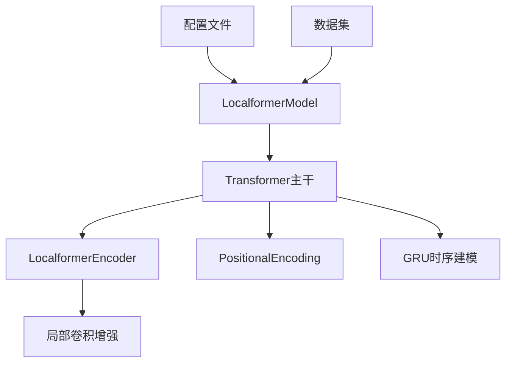
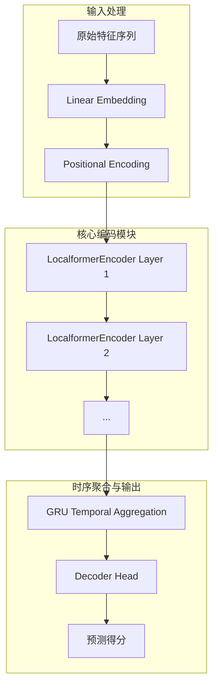
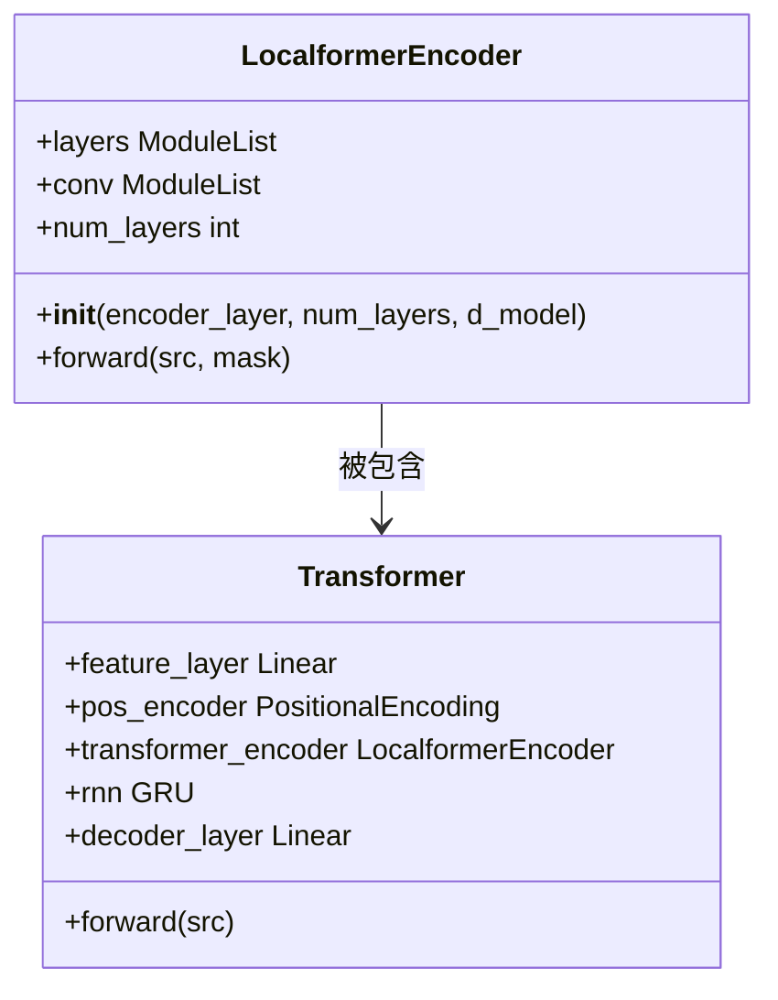
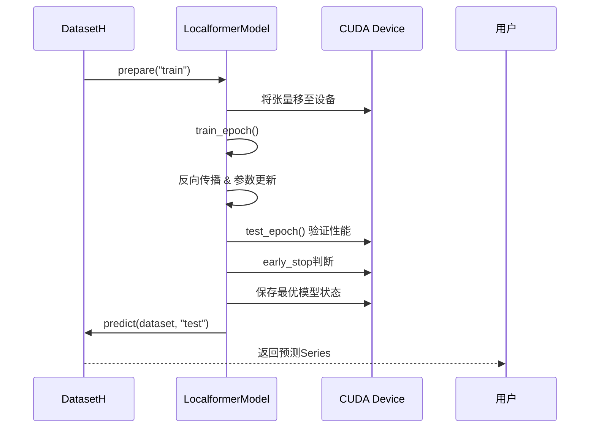
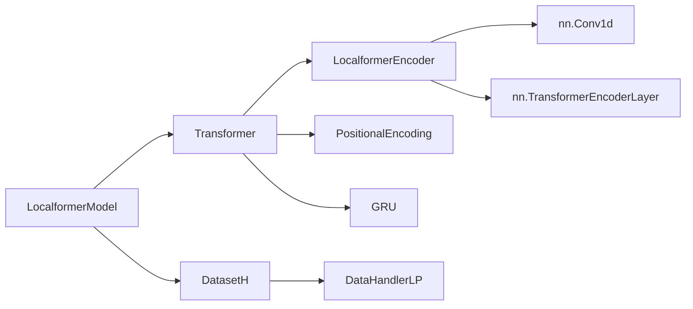

# LocalFormer模型

<cite>
**本文档中引用的文件**
- [pytorch_localformer.py](file://qlib/contrib/model/pytorch_localformer.py)
- [workflow_config_localformer_Alpha360.yaml](file://examples/benchmarks/Localformer/workflow_config_localformer_Alpha360.yaml)
</cite>

## 目录
1. [简介](#简介)
2. [项目结构](#项目结构)
3. [核心组件](#核心组件)
4. [架构概述](#架构概述)
5. [详细组件分析](#详细组件分析)
6. [依赖关系分析](#依赖关系分析)
7. [性能考量](#性能考量)
8. [故障排除指南](#故障排除指南)
9. [结论](#结论)

## 简介
LocalFormer模型是一种专为高维金融时序数据设计的深度学习架构，旨在解决标准Transformer在处理长序列时面临的计算效率瓶颈。该模型通过引入局部窗口注意力机制和卷积嵌入层，在保持预测精度的同时显著降低计算复杂度与GPU内存占用，适用于大规模资产组合的实时推断场景。

## 项目结构
LocalFormer模型的实现位于`qlib/contrib/model/`目录下的`pytorch_localformer.py`文件中，其训练配置由`examples/benchmarks/Localformer/`路径中的YAML文件定义。整体结构遵循Qlib框架的模块化设计原则，包含数据处理、模型定义、训练流程及评估记录等标准化组件。

**图表来源**
- [pytorch_localformer.py](file://qlib/contrib/model/pytorch_localformer.py#L28-L321)

**章节来源**
- [pytorch_localformer.py](file://qlib/contrib/model/pytorch_localformer.py#L1-L323)
- [workflow_config_localformer_Alpha360.yaml](file://examples/benchmarks/Localformer/workflow_config_localformer_Alpha360.yaml#L1-L79)

## 核心组件
LocalFormer的核心在于其对标准Transformer结构的三项关键优化：局部窗口注意力、卷积嵌入层以及层级化注意力结构。这些设计共同作用于降低O(n²)的自注意力计算开销，并提升对多尺度市场动态的捕捉能力。

**章节来源**
- [pytorch_localformer.py](file://qlib/contrib/model/pytorch_localformer.py#L28-L321)

## 架构概述
LocalFormer采用编码器-解码器简化结构，输入特征首先经过线性投影层映射至隐空间，随后叠加位置编码。核心的`LocalformerEncoder`替代了传统的`nn.TransformerEncoder`，通过在每一层引入可学习的局部卷积分支来增强局部模式提取能力。最终输出经GRU进一步聚合时间信息后，由线性层生成单点预测值。

**图表来源**
- [pytorch_localformer.py](file://qlib/contrib/model/pytorch_localformer.py#L285-L321)

## 详细组件分析

### 局部窗口注意力机制
LocalFormer并未完全摒弃全局注意力，而是在每个编码层中并行引入一个一维卷积分支（`nn.Conv1d`），该分支负责捕获固定大小邻域内的局部依赖关系。此设计将部分计算负担从二次复杂度的注意力操作转移至线性的卷积运算，从而有效控制整体计算量。

#### 类图展示

**图表来源**
- [pytorch_localformer.py](file://qlib/contrib/model/pytorch_localformer.py#L262-L282)

**章节来源**
- [pytorch_localformer.py](file://qlib/contrib/model/pytorch_localformer.py#L262-L282)

### 卷积嵌入层的有效性
尽管名称未直接体现“卷积”，但LocalFormer通过`LocalformerEncoder`内部的`conv`分支实现了类似卷积嵌入的功能。每层注意力后的残差连接路径上施加的`Conv1d(d_model, d_model, kernel_size=3)`操作，能够在不增加参数量的前提下持续强化局部特征表达，尤其适合捕捉金融数据中短周期的技术形态。

### 层级化注意力结构
模型通过堆叠多个`LocalformerEncoder`层构建深层网络，形成层级化的特征抽象过程。浅层侧重于识别微观价格波动模式，深层则整合跨时段的宏观趋势信号。这种分层结构配合GRU的序列建模能力，使模型具备同时感知多尺度市场动态的能力。

### 训练与推断流程
训练阶段采用经典的监督学习范式，使用均方误差（MSE）作为损失函数，并通过Adam优化器进行梯度更新。推断时支持批量处理以提高吞吐率，且在预测完成后自动释放GPU缓存以优化资源利用。

**图表来源**
- [pytorch_localformer.py](file://qlib/contrib/model/pytorch_localformer.py#L157-L213)

**章节来源**
- [pytorch_localformer.py](file://qlib/contrib/model/pytorch_localformer.py#L157-L213)

## 依赖关系分析
LocalFormer模型高度依赖PyTorch生态及Qlib自身的数据处理模块。其主要外部依赖包括`torch.nn.TransformerEncoderLayer`用于基础注意力计算，`DataHandlerLP`确保特征与标签的正确对齐，以及`DatasetH`提供统一的数据访问接口。

**图表来源**
- [pytorch_localformer.py](file://qlib/contrib/model/pytorch_localformer.py#L28-L321)

**章节来源**
- [pytorch_localformer.py](file://qlib/contrib/model/pytorch_localformer.py#L1-L323)

## 性能考量
LocalFormer通过局部卷积替代部分全局注意力计算，理论上可将自注意力的计算复杂度从O(T²)降至接近O(T)，其中T为时间步长。结合较大的批处理尺寸（如8192），该模型在保证高精度的同时大幅减少显存占用，使其能够部署于资源受限环境执行高频实时推断。

## 故障排除指南
常见问题包括训练初期损失震荡剧烈或验证分数停滞不前。建议检查数据预处理器是否正确应用了`RobustZScoreNorm`和`CSRankNorm`，确认CUDA设备可用性，并适当调整学习率与正则化强度。若出现OOM错误，应减小`batch_size`或启用梯度累积策略。

**章节来源**
- [pytorch_localformer.py](file://qlib/contrib/model/pytorch_localformer.py#L55-L56)
- [workflow_config_localformer_Alpha360.yaml](file://examples/benchmarks/Localformer/workflow_config_localformer_Alpha360.yaml#L1-L79)

## 结论
LocalFormer模型通过创新性地融合卷积与注意力机制，在金融时序预测任务中实现了效率与精度的良好平衡。其模块化设计便于集成至现有量化研究 pipeline，特别适合作为需要低延迟响应的大规模投资组合管理系统的预测引擎。