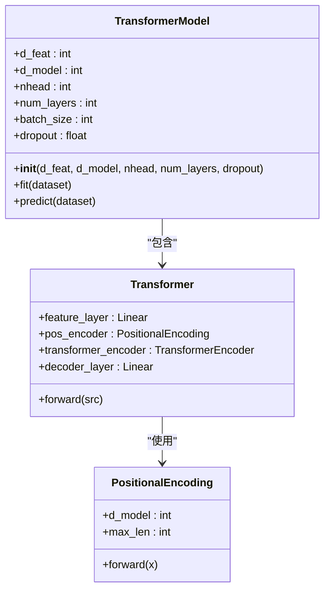
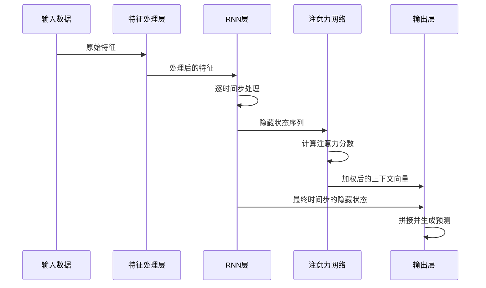
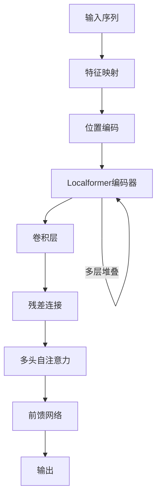

# Transformer系列模型

<cite>
**本文档中引用的文件**
- [pytorch_transformer.py](file://qlib/contrib/model/pytorch_transformer.py)
- [pytorch_alstm.py](file://qlib/contrib/model/pytorch_alstm.py)
- [pytorch_localformer.py](file://qlib/contrib/model/pytorch_localformer.py)
- [workflow_config_transformer_Alpha158.yaml](file://examples/benchmarks/Transformer/workflow_config_transformer_Alpha158.yaml)
- [workflow_config_alstm_Alpha158.yaml](file://examples/benchmarks/ALSTM/workflow_config_alstm_Alpha158.yaml)
- [workflow_config_localformer_Alpha158.yaml](file://examples/benchmarks/Localformer/workflow_config_localformer_Alpha158.yaml)
</cite>

## 目录
1. [简介](#简介)
2. [标准Transformer模型](#标准transformer模型)
3. [ALSTM模型](#alstm模型)
4. [LocalFormer模型](#localformer模型)
5. [配置参数详解](#配置参数详解)

## 简介
Qlib平台提供了多种基于Transformer架构的深度学习模型，用于金融时序数据的预测分析。这些模型包括标准Transformer、ALSTM和LocalFormer，它们在自注意力机制、位置编码和多头注意力模块的设计上各有特点，并针对金融时序数据的特点进行了适应性调整。

## 标准Transformer模型

标准Transformer模型采用经典的编码器-解码器结构，通过自注意力机制捕捉时间序列中的长期依赖关系。该模型首先将输入特征通过线性层映射到指定维度，然后添加位置编码以保留序列顺序信息。编码器由多个Transformer编码层堆叠而成，每个编码层包含多头自注意力机制和前馈神经网络。

**图示来源**
- [pytorch_transformer.py](file://qlib/contrib/model/pytorch_transformer.py#L0-L285)

**本节来源**
- [pytorch_transformer.py](file://qlib/contrib/model/pytorch_transformer.py#L0-L285)

## ALSTM模型

ALSTM模型融合了注意力机制与循环神经网络结构，特别适合捕捉金融时间序列中的局部趋势。该模型首先通过全连接层和激活函数处理输入特征，然后使用GRU或LSTM等循环网络提取时序特征。关键创新在于引入了注意力网络，为不同时间步的隐藏状态分配不同的权重，从而增强模型对重要时间点的关注能力。

**图示来源**
- [pytorch_alstm.py](file://qlib/contrib/model/pytorch_alstm.py#L0-L344)

**本节来源**
- [pytorch_alstm.py](file://qlib/contrib/model/pytorch_alstm.py#L0-L344)

## LocalFormer模型

LocalFormer模型通过引入局部窗口注意力机制，在保持Transformer强大建模能力的同时显著降低了计算复杂度。该模型的核心是LocalformerEncoder，它在标准Transformer编码器的基础上增加了卷积层，实现了局部特征的高效提取。这种设计使得模型既能捕捉局部模式，又能通过多层堆叠获得全局视野。

**图示来源**
- [pytorch_localformer.py](file://qlib/contrib/model/pytorch_localformer.py#L0-L322)

**本节来源**
- [pytorch_localformer.py](file://qlib/contrib/model/pytorch_localformer.py#L0-L322)

## 配置参数详解

### 自注意力机制与位置编码
所有Transformer系列模型都采用了正弦位置编码，通过不同频率的正弦和余弦函数为序列中的每个位置生成唯一的编码向量。这种编码方式能够有效表示相对位置信息，对于金融时间序列分析至关重要。

### 多头注意力模块
多头注意力允许模型在不同子空间中并行学习多种表示模式。通过设置`nhead`参数可以控制注意力头的数量，更多的注意力头通常能捕捉更丰富的特征交互，但也会增加计算负担。

### 关键超参数设置
各模型的YAML配置文件中包含了重要的超参数设置：

**标准Transformer配置要点：**
- `d_feat`: 输入特征维度
- `d_model`: 模型内部表示维度
- `nhead`: 多头注意力头数
- `num_layers`: 编码器层数
- `dropout`: 防止过拟合的丢弃率

**ALSTM配置要点：**
- `hidden_size`: RNN隐藏层大小
- `num_layers`: RNN层数
- `rnn_type`: 可选择GRU或LSTM

**LocalFormer配置要点：**
- 结合了Transformer和卷积的优势
- 通过局部窗口减少计算复杂度
- 适用于长序列处理

**本节来源**
- [workflow_config_transformer_Alpha158.yaml](file://examples/benchmarks/Transformer/workflow_config_transformer_Alpha158.yaml)
- [workflow_config_alstm_Alpha158.yaml](file://examples/benchmarks/ALSTM/workflow_config_alstm_Alpha158.yaml)
- [workflow_config_localformer_Alpha158.yaml](file://examples/benchmarks/Localformer/workflow_config_localformer_Alpha158.yaml)