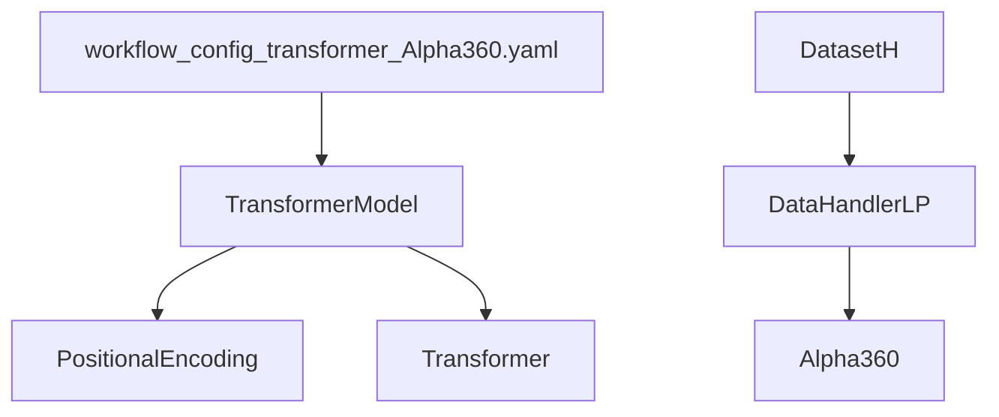
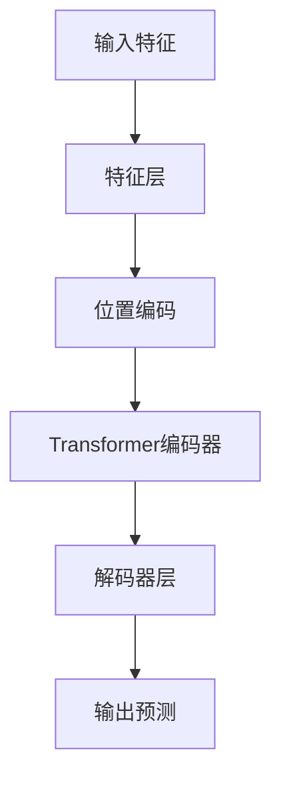
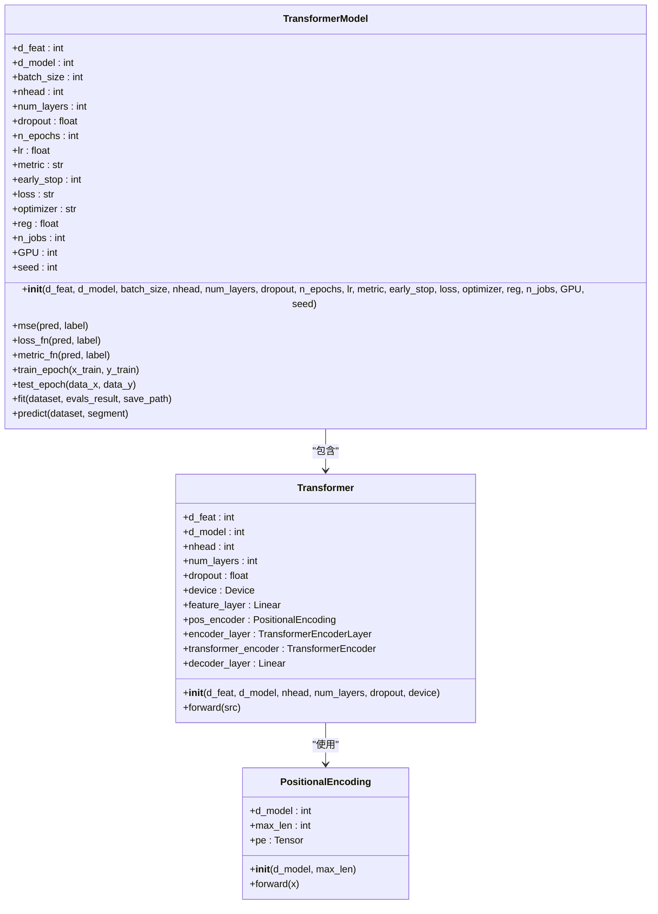
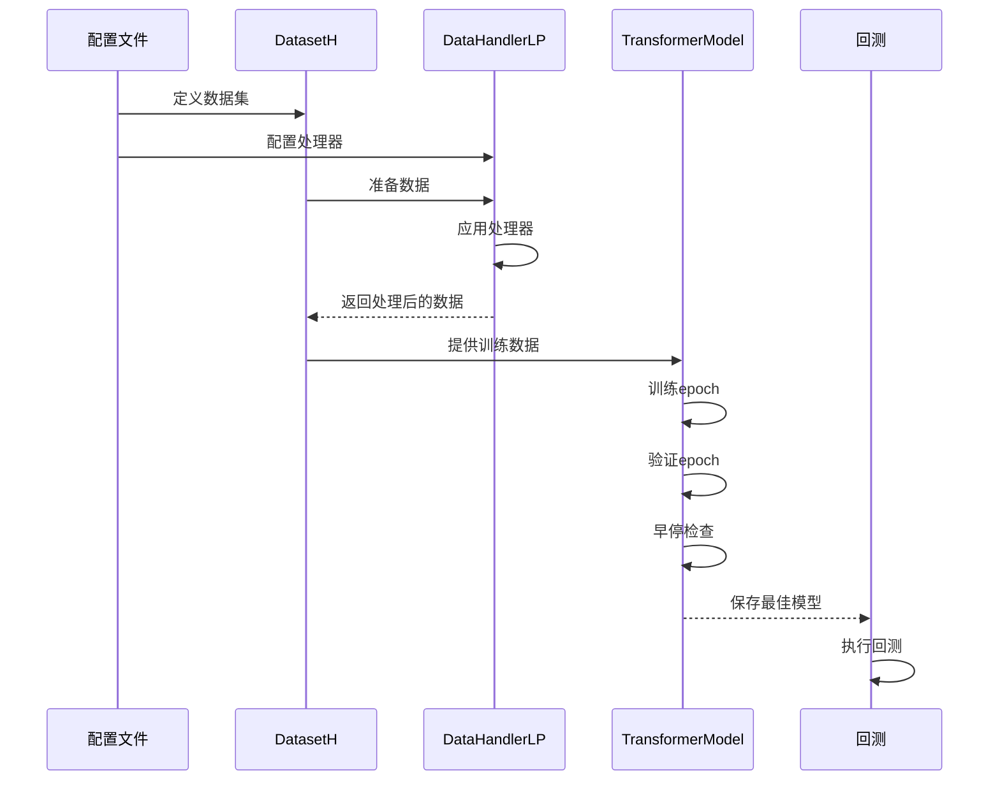
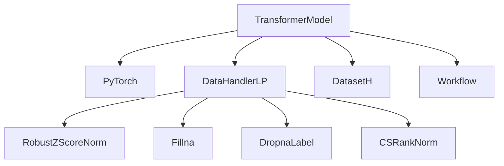

# 标准Transformer模型

<cite>
**本文档中引用的文件**
- [pytorch_transformer.py](file://qlib/contrib/model/pytorch_transformer.py)
- [workflow_config_transformer_Alpha360.yaml](file://examples/benchmarks/Transformer/workflow_config_transformer_Alpha360.yaml)
- [DataHandlerLP.py](file://qlib/data/dataset/handler.py)
- [DatasetH.py](file://qlib/data/dataset/__init__.py)
</cite>

## 目录
1. [项目结构](#项目结构)
2. [核心组件](#核心组件)
3. [架构概述](#架构概述)
4. [详细组件分析](#详细组件分析)
5. [依赖分析](#依赖分析)
6. [性能考虑](#性能考虑)
7. [故障排除指南](#故障排除指南)
8. [结论](#结论)

## 项目结构

Qlib中的标准Transformer模型实现主要位于`qlib/contrib/model/pytorch_transformer.py`文件中，该文件包含了TransformerModel类和相关的辅助类。训练流程的配置通过`examples/benchmarks/Transformer/workflow_config_transformer_Alpha360.yaml`文件定义。数据处理由`qlib/data/dataset/handler.py`中的DataHandlerLP类和`qlib/data/dataset/__init__.py`中的DatasetH类负责。



**图源**
- [pytorch_transformer.py](file://qlib/contrib/model/pytorch_transformer.py)
- [workflow_config_transformer_Alpha360.yaml](file://examples/benchmarks/Transformer/workflow_config_transformer_Alpha360.yaml)
- [handler.py](file://qlib/data/dataset/handler.py)
- [__init__.py](file://qlib/data/dataset/__init__.py)

**节源**
- [pytorch_transformer.py](file://qlib/contrib/model/pytorch_transformer.py)
- [workflow_config_transformer_Alpha360.yaml](file://examples/benchmarks/Transformer/workflow_config_transformer_Alpha360.yaml)

## 核心组件

标准Transformer模型的核心组件包括TransformerModel类、PositionalEncoding类和Transformer类。这些组件共同实现了金融时序预测任务中的Transformer架构。模型通过特征维度d_feat、模型维度d_model、注意力头数nhead及网络层数num_layers等超参数进行配置，并使用MSE作为损失函数，结合梯度裁剪和早停机制进行训练。

**节源**
- [pytorch_transformer.py](file://qlib/contrib/model/pytorch_transformer.py#L26-L284)

## 架构概述

标准Transformer模型的架构基于经典的Transformer编码器结构，针对金融时间序列数据进行了优化。模型接收经过预处理的特征数据，通过线性变换层映射到模型维度，然后添加位置编码以保留时间序列的顺序信息。Transformer编码器堆叠多个编码器层，每个层包含多头自注意力机制和前馈神经网络。最后，通过解码器层将输出映射到单个预测值。



**图源**
- [pytorch_transformer.py](file://qlib/contrib/model/pytorch_transformer.py#L257-L284)

## 详细组件分析

### TransformerModel分析

TransformerModel类是标准Transformer模型的主要封装，负责模型的初始化、训练和预测。该类继承自Qlib的Model基类，实现了fit和predict方法。模型的超参数包括特征维度d_feat、模型维度d_model、批处理大小batch_size、注意力头数nhead、网络层数num_layers、dropout率、训练轮数n_epochs、学习率lr等。

#### 类图


**图源**
- [pytorch_transformer.py](file://qlib/contrib/model/pytorch_transformer.py#L26-L284)

**节源**
- [pytorch_transformer.py](file://qlib/contrib/model/pytorch_transformer.py#L26-L284)

### 位置编码机制

位置编码在Transformer模型中起着至关重要的作用，特别是在处理时间序列数据时。由于Transformer模型本身不具备处理序列顺序的能力，位置编码被用来为输入序列中的每个位置提供一个唯一的标识。在Qlib的实现中，位置编码使用正弦和余弦函数的组合来生成，这使得模型能够学习到相对位置信息。

#### 位置编码公式
```mermaid
flowchart TD
A[位置i] --> B[计算sin(i/10000^(2j/d_model))]
A --> C[计算cos(i/10000^(2j/d_model))]
B --> D[偶数位置]
C --> E[奇数位置]
D --> F[位置编码向量]
E --> F
```

**图源**
- [pytorch_transformer.py](file://qlib/contrib/model/pytorch_transformer.py#L241-L254)

**节源**
- [pytorch_transformer.py](file://qlib/contrib/model/pytorch_transformer.py#L241-L254)

### 训练流程分析

标准Transformer模型的训练流程通过workflow_config_transformer_Alpha360.yaml配置文件定义。该配置文件指定了数据源、处理器、模型参数和回测策略等关键组件。训练过程包括数据准备、模型训练、验证和测试三个阶段。

#### 训练流程序列图


**图源**
- [workflow_config_transformer_Alpha360.yaml](file://examples/benchmarks/Transformer/workflow_config_transformer_Alpha360.yaml)
- [pytorch_transformer.py](file://qlib/contrib/model/pytorch_transformer.py)

**节源**
- [workflow_config_transformer_Alpha360.yaml](file://examples/benchmarks/Transformer/workflow_config_transformer_Alpha360.yaml)
- [pytorch_transformer.py](file://qlib/contrib/model/pytorch_transformer.py)

## 依赖分析

标准Transformer模型的实现依赖于多个Qlib核心组件。主要依赖关系包括：TransformerModel依赖于PyTorch框架进行张量运算和自动微分；数据处理依赖于DataHandlerLP和DatasetH类；训练流程依赖于Qlib的工作流管理系统。此外，模型还依赖于各种处理器如RobustZScoreNorm、Fillna、DropnaLabel和CSRankNorm来预处理金融数据。



**图源**
- [pytorch_transformer.py](file://qlib/contrib/model/pytorch_transformer.py)
- [handler.py](file://qlib/data/dataset/handler.py)
- [__init__.py](file://qlib/data/dataset/__init__.py)

**节源**
- [pytorch_transformer.py](file://qlib/contrib/model/pytorch_transformer.py)
- [handler.py](file://qlib/data/dataset/handler.py)
- [__init__.py](file://qlib/data/dataset/__init__.py)

## 性能考虑

在金融时间序列预测中应用Transformer模型时，需要考虑多个性能因素。首先，模型的计算复杂度与序列长度的平方成正比，这可能限制了其在长序列上的应用。其次，内存消耗也是一个重要考虑因素，特别是在处理大规模股票池时。为了优化性能，可以调整批处理大小、使用混合精度训练或采用模型并行化技术。此外，合理设置早停轮数和学习率衰减策略可以帮助提高训练效率。

## 故障排除指南

在使用标准Transformer模型时可能会遇到一些常见问题。如果模型训练不稳定，可以尝试降低学习率或增加dropout率。如果出现内存不足错误，可以减小批处理大小或使用梯度累积。对于过拟合问题，可以增加正则化强度或添加更多的数据增强技术。在数据预处理方面，确保正确配置处理器的fit_start_time和fit_end_time参数，以避免未来信息泄漏。

**节源**
- [pytorch_transformer.py](file://qlib/contrib/model/pytorch_transformer.py)
- [processor.py](file://qlib/data/dataset/processor.py)

## 结论

Qlib中的标准Transformer模型为金融时间序列预测提供了一个强大而灵活的框架。通过合理的超参数配置和数据预处理，该模型能够有效地捕捉市场动态并生成高质量的预测信号。位置编码机制的成功应用使得模型能够理解时间序列的顺序特性，而Transformer编码器的堆叠结构则允许模型学习复杂的非线性关系。结合Qlib完善的工作流管理系统，用户可以轻松地定义和执行完整的训练-验证-测试流程，从而快速迭代和优化投资策略。