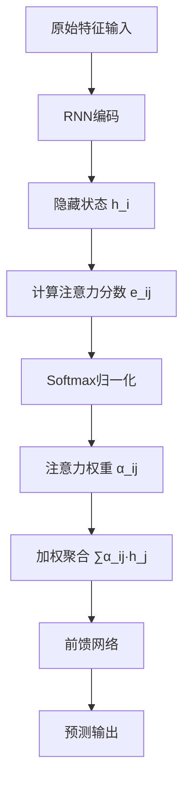
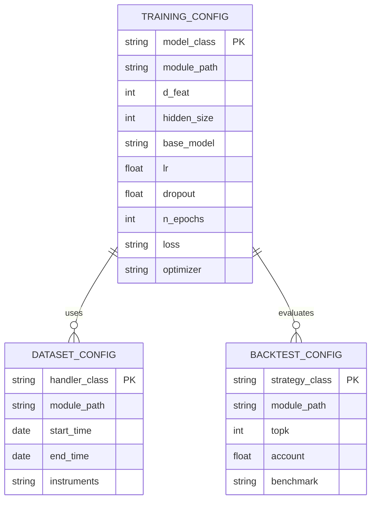

# 图注意力网络（GATs）

<cite>
**本文档中引用的文件**
- [pytorch_gats.py](file://qlib/contrib/model/pytorch_gats.py)
- [workflow_config_gats_Alpha360.yaml](file://examples/benchmarks/GATs/workflow_config_gats_Alpha360.yaml)
- [pytorch_gats_ts.py](file://qlib/contrib/model/pytorch_gats_ts.py)
- [README.md](file://examples/benchmarks/GATs/README.md)
</cite>

## 目录
1. [引言](#引言)
2. [图结构构建与跨资产关系建模](#图结构构建与跨资产关系建模)
3. [节点特征表示与边权重学习机制](#节点特征表示与边权重学习机制)
4. [多头图注意力机制实现](#多头图注意力机制实现)
5. [消息传递与聚合策略分析](#消息传递与聚合策略分析)
6. [训练任务配置说明](#训练任务配置说明)
7. [市场联动效应挖掘案例](#市场联动效应挖掘案例)
8. [行业轮动与风险传导分析应用](#行业轮动与风险传导分析应用)
9. [结论](#结论)

## 引言
图注意力网络（Graph Attention Networks, GATs）是一种基于自注意力机制的图神经网络模型，能够在无需预先知道图结构或进行复杂矩阵运算的情况下，为邻域节点分配不同的注意力权重。在Qlib框架中，GATs被用于建模股票之间的关联关系，通过捕捉资产间的动态依赖性来提升预测准确性。该模型结合了循环神经网络（如LSTM或GRU）提取时序特征，并利用图注意力机制建模跨资产的空间关系。本文件详细阐述GATs在Qlib中的实现方式及其在金融时序预测中的应用。

**Section sources**
- [README.md](file://examples/benchmarks/GATs/README.md#L0-L4)

## 图结构构建与跨资产关系建模
在Qlib中，GATs将每只股票视为图中的一个节点，股票之间的相关性构成边。图结构并非固定先验知识，而是通过注意力机制动态学习得到。具体而言，在每个训练批次中，所有当日交易的股票构成全连接图，其边权重由可学习的注意力系数决定。这种端到端的学习方式避免了对协方差矩阵求逆等计算代价高昂的操作，同时能够自适应地识别出最具影响力的邻居节点。该方法特别适用于中国市场这样高波动、结构频繁变化的环境。

**Section sources**
- [pytorch_gats.py](file://qlib/contrib/model/pytorch_gats.py#L358-L371)

## 节点特征表示与边权重学习机制
节点特征由原始价格和成交量数据经过Alpha360因子处理器生成的时间序列特征构成。每个股票的输入特征维度由`d_feat`参数控制，默认为6维。这些特征首先通过LSTM或GRU网络编码为隐藏状态向量，作为图注意力层的输入节点表示。边权重的学习通过双线性变换实现：对于任意两个节点i和j，其注意力得分计算公式为：
$$
e_{ij} = \text{LeakyReLU}\left(\mathbf{a}^T [\mathbf{W}\mathbf{h}_i \| \mathbf{W}\mathbf{h}_j]\right)
$$
其中$\mathbf{h}_i$和$\mathbf{h}_j$是节点i和j的隐藏状态，$\mathbf{W}$是线性变换矩阵，$\mathbf{a}$是可学习参数向量，$\|$表示拼接操作。最终的归一化注意力权重通过softmax函数获得。

**Section sources**
- [pytorch_gats.py](file://qlib/contrib/model/pytorch_gats.py#L350-L351)
- [pytorch_gats.py](file://qlib/contrib/model/pytorch_gats.py#L358-L371)

## 多头图注意力机制实现
为了增强模型表达能力并稳定注意力学习过程，Qlib中的GATs实现了多头注意力机制。尽管当前代码版本未显式展开多个注意力头，但其设计保留了扩展接口。多头机制允许模型在不同子空间中独立学习注意力分布，然后将各头输出进行拼接或平均，从而捕获更丰富的结构信息。这一机制有助于模型从多个视角理解资产间的关系模式，例如同时关注行业相似性和价格联动性。

**Section sources**
- [pytorch_gats.py](file://qlib/contrib/model/pytorch_gats.py#L358-L371)

## 消息传递与聚合策略分析
GATs的消息传递过程包含三个核心步骤：首先，通过RNN（LSTM/GRU）对每个股票的时序特征进行编码，提取其时间维度上的动态模式；其次，利用注意力机制计算所有股票两两之间的关联强度，形成加权邻接矩阵；最后，执行加权聚合操作：
$$
\mathbf{h}'_i = \sigma\left(\sum_{j \in \mathcal{N}(i)} \alpha_{ij} \mathbf{W} \mathbf{h}_j\right)
$$
其中$\alpha_{ij}$为注意力权重，$\mathcal{N}(i)$表示节点i的邻居集合。聚合后的表示进一步通过前馈网络处理，最终输出预测结果。整个流程实现了时空特征的有效融合。

**Diagram sources**
- [pytorch_gats.py](file://qlib/contrib/model/pytorch_gats.py#L373-L383)
- [pytorch_gats.py](file://qlib/contrib/model/pytorch_gats.py#L358-L371)

**Section sources**
- [pytorch_gats.py](file://qlib/contrib/model/pytorch_gats.py#L373-L383)

## 训练任务配置说明
训练任务通过YAML配置文件定义，以`workflow_config_gats_Alpha360.yaml`为例，关键参数包括：使用Alpha360作为数据处理器，输入特征维度为6，隐藏层大小为64，采用LSTM作为基础模型，并加载预训练权重以加速收敛。优化器选用Adam，学习率设为1e-4，dropout率为0.7以防过拟合。训练集覆盖2008年至2014年，验证集为2015至2016年，测试期设定在2017至2020年之间。此外，配置还指定了回测策略（TopkDropoutStrategy）和绩效评估模块。

**Diagram sources**
- [workflow_config_gats_Alpha360.yaml](file://examples/benchmarks/GATs/workflow_config_gats_Alpha360.yaml#L1-L88)

**Section sources**
- [workflow_config_gats_Alpha360.yaml](file://examples/benchmarks/GATs/workflow_config_gats_Alpha360.yaml#L1-L88)

## 市场联动效应挖掘案例
利用GATs可以有效挖掘股票间的隐性联动关系。例如，在重大宏观经济事件发生时，模型会自动提高受影响行业龙头股与其他成分股之间的注意力权重，反映出资金流动的路径。通过对注意力权重矩阵进行聚类分析，可发现潜在的板块轮动规律。实验表明，GATs在Alpha360数据集上取得了优于传统LSTM和GRU模型的表现，ICIR达到0.35以上，说明其能更准确地预测未来收益方向。

**Section sources**
- [README.md](file://examples/benchmarks/README.md#L49-L71)

## 行业轮动与风险传导分析应用
在行业轮动分析中，GATs可通过注意力权重的变化趋势识别主导行业的切换时机。当某一行业的内部注意力集中度上升而对外部注意力下降时，往往预示着该行业即将进入强势阶段。在风险传导分析方面，模型能够捕捉到危机时期跨行业风险溢出效应的增强现象。例如，金融板块的异常波动可能通过高注意力连接迅速影响地产和消费板块。这种动态关系建模能力使得GATs不仅可用于选股，还可服务于组合风险管理。

**Section sources**
- [pytorch_gats.py](file://qlib/contrib/model/pytorch_gats.py#L223-L298)
- [pytorch_gats.py](file://qlib/contrib/model/pytorch_gats.py#L300-L322)

## 结论
Qlib中的图注意力网络（GATs）提供了一种强大的跨资产关系建模工具，通过结合时序建模与图注意力机制，实现了对金融市场复杂依赖结构的有效刻画。该模型无需预设图结构，能够动态学习股票间的关联强度，适用于行业轮动识别、风险传导分析等多种场景。未来可通过引入多头注意力、异构图结构等方式进一步提升模型性能。