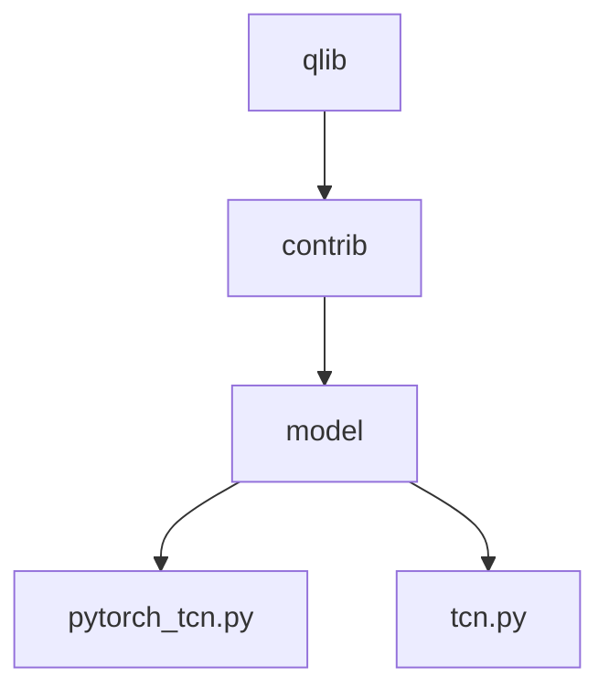
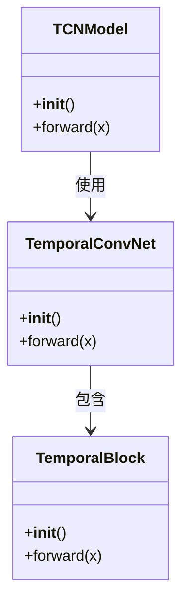
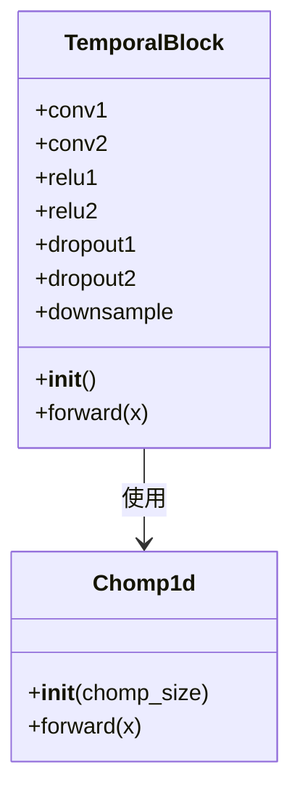
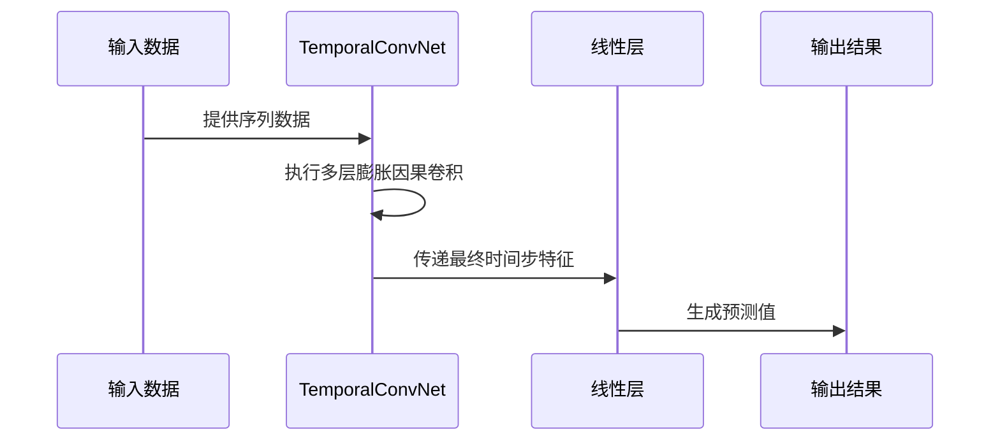
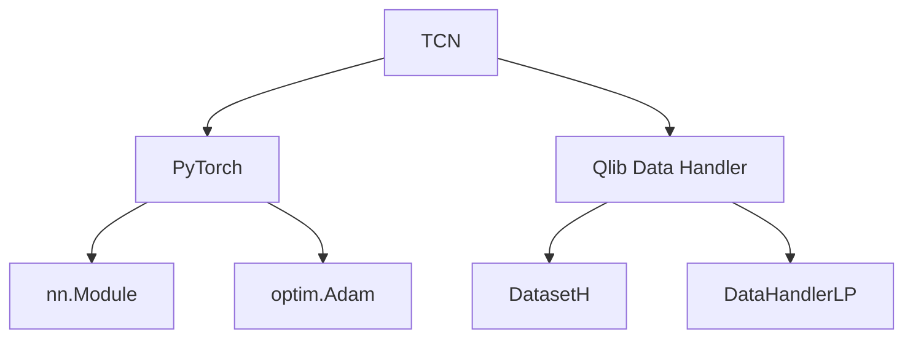

# 时间卷积网络（TCN）

<cite>
**本文档中引用的文件**
- [pytorch_tcn.py](file://qlib/contrib/model/pytorch_tcn.py)
- [tcn.py](file://qlib/contrib/model/tcn.py)
- [workflow_config_tcn_Alpha360.yaml](file://examples/benchmarks/TCN/workflow_config_tcn_Alpha360.yaml)
</cite>

## 目录
1. [简介](#简介)
2. [项目结构](#项目结构)
3. [核心组件](#核心组件)
4. [架构概述](#架构概述)
5. [详细组件分析](#详细组件分析)
6. [依赖关系分析](#依赖关系分析)
7. [性能考量](#性能考量)
8. [故障排除指南](#故障排除指南)
9. [结论](#结论)

## 简介
时间卷积网络（Temporal Convolutional Network, TCN）是一种专为序列建模设计的深度学习架构，它利用膨胀因果卷积来有效捕获长期依赖关系。与传统的循环神经网络（RNN）相比，TCN避免了梯度消失和爆炸的问题，并且能够并行处理输入数据，从而提高了训练效率。在Qlib框架中，TCN被用于金融时间序列预测任务，通过其独特的架构设计实现了对市场动态的精准捕捉。

## 项目结构
Qlib项目的目录结构清晰地组织了各个模块，其中`qlib/contrib/model/`路径下包含了多种机器学习模型的实现，包括TCN相关的源码文件。这些文件共同构成了一个完整的TCN解决方案，从基础的时间卷积层到高级的模型封装都得到了充分的支持。

**图示来源**
- [pytorch_tcn.py](file://qlib/contrib/model/pytorch_tcn.py)
- [tcn.py](file://qlib/contrib/model/tcn.py)

**章节来源**
- [pytorch_tcn.py](file://qlib/contrib/model/pytorch_tcn.py)
- [tcn.py](file://qlib/contrib/model/tcn.py)

## 核心组件
TCN的核心在于其使用的一维膨胀因果卷积层，这种卷积方式允许模型以指数增长的感受野覆盖更长的历史信息，同时保持计算上的高效性。此外，残差连接的应用进一步增强了模型的学习能力，使得深层网络也能稳定训练。

**章节来源**
- [pytorch_tcn.py](file://qlib/contrib/model/pytorch_tcn.py#L25-L295)
- [tcn.py](file://qlib/contrib/model/tcn.py#L15-L75)

## 架构概述
整个TCN架构由多个关键部分组成：首先是`TemporalBlock`，它是构成TCN的基本单元；其次是`TemporalConvNet`，负责堆叠多个`TemporalBlock`形成深层网络；最后是顶层的`TCNModel`类，它将卷积网络与全连接层结合，完成最终的输出映射。

**图示来源**
- [tcn.py](file://qlib/contrib/model/tcn.py#L15-L75)
- [pytorch_tcn.py](file://qlib/contrib/model/pytorch_tcn.py#L298-L309)

## 详细组件分析

### TemporalBlock 分析
`TemporalBlock` 是 TCN 中的基本构建块，每个块包含两个带有权重归一化的因果卷积层、ReLU 激活函数以及 Dropout 层。为了确保没有未来信息泄露，还引入了一个 `Chomp1d` 层来裁剪多余的填充部分。此外，通过添加残差连接，即使在网络非常深的情况下也能够促进梯度流动。

#### 对于对象导向组件：

**图示来源**
- [tcn.py](file://qlib/contrib/model/tcn.py#L15-L48)

**章节来源**
- [tcn.py](file://qlib/contrib/model/tcn.py#L15-L48)

### TCNModel 分析
`TCNModel` 类作为高层接口，整合了底层的 `TemporalConvNet` 和一个线性变换层。该模型接收形状为 (batch_size, num_features, sequence_length) 的输入张量，经过一系列膨胀卷积操作后，仅取最后一个时间步的特征向量送入全连接层进行回归或分类任务。

#### 对于 API/服务组件：

**图示来源**
- [pytorch_tcn.py](file://qlib/contrib/model/pytorch_tcn.py#L298-L309)

**章节来源**
- [pytorch_tcn.py](file://qlib/contrib/model/pytorch_tcn.py#L298-L309)

## 依赖关系分析
通过对代码库的深入分析可以发现，TCN 模型主要依赖于 PyTorch 框架提供的各种神经网络层及优化器。此外，它还利用了 Qlib 自身的数据处理机制（如 `DatasetH` 和 `DataHandlerLP`），确保了从原始市场数据到模型输入之间的无缝衔接。

**图示来源**
- [pytorch_tcn.py](file://qlib/contrib/model/pytorch_tcn.py)
- [tcn.py](file://qlib/contrib/model/tcn.py)

**章节来源**
- [pytorch_tcn.py](file://qlib/contrib/model/pytorch_tcn.py)
- [tcn.py](file://qlib/contrib/model/tcn.py)

## 性能考量
尽管 TCN 在理论上具有优秀的并行化潜力，但在实际应用中仍需注意一些潜在瓶颈。例如，在高频交易场景下，过大的感受野可能导致内存消耗过高。因此，合理设置卷积核大小、膨胀系数和通道数对于平衡模型容量与过拟合风险至关重要。

## 故障排除指南
当遇到训练不稳定或者性能不佳的情况时，建议首先检查以下几点：
- 确认是否正确设置了 `kernel_size` 和 `dilation` 参数。
- 验证是否存在异常值影响了损失函数的表现。
- 调整 `dropout` 值以增强正则化效果。
- 尝试不同的优化算法及其超参数配置。

**章节来源**
- [pytorch_tcn.py](file://qlib/contrib/model/pytorch_tcn.py#L153-L196)

## 结论
综上所述，基于 Qlib 实现的 TCN 模型凭借其强大的长期依赖建模能力和高效的并行计算特性，在金融时间序列分析领域展现出了巨大潜力。通过精心调参和适当的设计选择，用户可以在保证模型泛化能力的同时获得满意的预测精度。