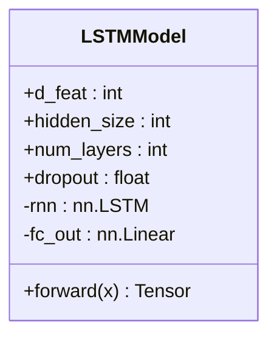
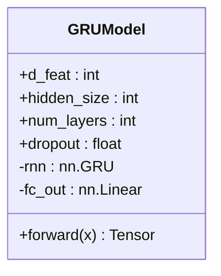
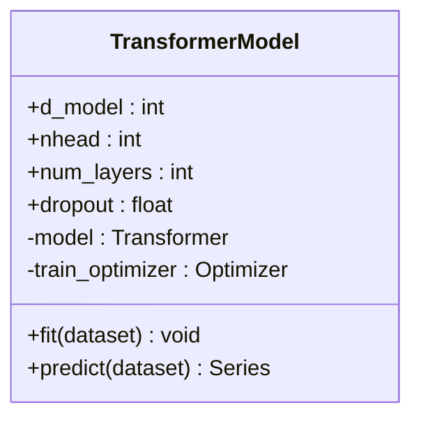
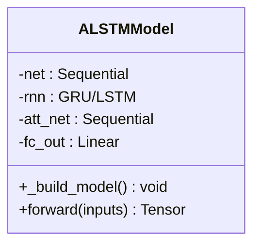
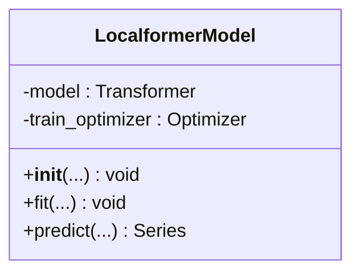
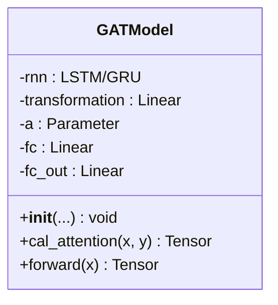
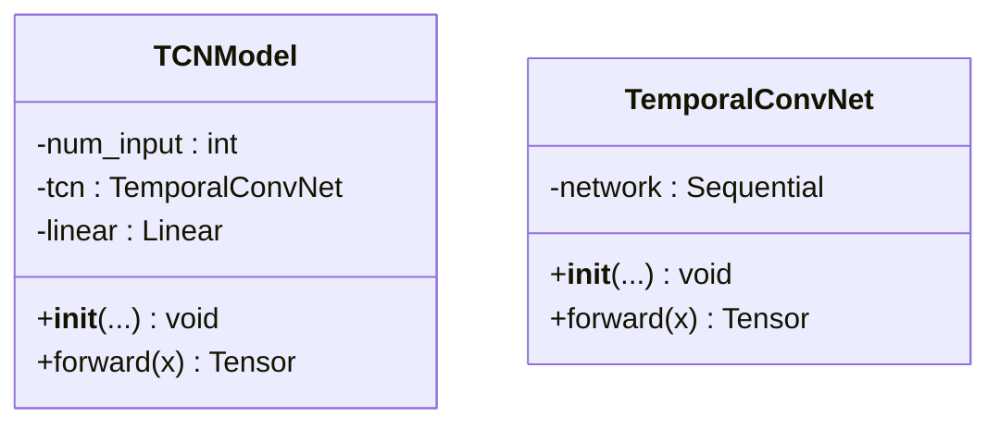

# 深度神经网络模型

<cite>
**本文档中引用的文件**
- [pytorch_lstm.py](file://qlib/contrib/model/pytorch_lstm.py)
- [pytorch_lstm_ts.py](file://qlib/contrib/model/pytorch_lstm_ts.py)
- [pytorch_gru.py](file://qlib/contrib/model/pytorch_gru.py)
- [pytorch_gru_ts.py](file://qlib/contrib/model/pytorch_gru_ts.py)
- [pytorch_transformer.py](file://qlib/contrib/model/pytorch_transformer.py)
- [pytorch_transformer_ts.py](file://qlib/contrib/model/pytorch_transformer_ts.py)
- [pytorch_alstm.py](file://qlib/contrib/model/pytorch_alstm.py)
- [pytorch_alstm_ts.py](file://qlib/contrib/model/pytorch_alstm_ts.py)
- [pytorch_localformer.py](file://qlib/contrib/model/pytorch_localformer.py)
- [pytorch_localformer_ts.py](file://qlib/contrib/model/pytorch_localformer_ts.py)
- [pytorch_gats.py](file://qlib/contrib/model/pytorch_gats.py)
- [pytorch_gats_ts.py](file://qlib/contrib/model/pytorch_gats_ts.py)
- [pytorch_tcn.py](file://qlib/contrib/model/pytorch_tcn.py)
- [pytorch_tcn_ts.py](file://qlib/contrib/model/pytorch_tcn_ts.py)
- [tcn.py](file://qlib/contrib/model/tcn.py)
- [workflow_config_lstm_Alpha158.yaml](file://examples/benchmarks/LSTM/workflow_config_lstm_Alpha158.yaml)
- [workflow_config_gru_Alpha158.yaml](file://examples/benchmarks/GRU/workflow_config_gru_Alpha158.yaml)
- [workflow_config_transformer_Alpha158.yaml](file://examples/benchmarks/Transformer/workflow_config_transformer_Alpha158.yaml)
- [workflow_config_alstm_Alpha158.yaml](file://examples/benchmarks/ALSTM/workflow_config_alstm_Alpha158.yaml)
- [workflow_config_localformer_Alpha158.yaml](file://examples/benchmarks/Localformer/workflow_config_localformer_Alpha158.yaml)
- [workflow_config_gats_Alpha158.yaml](file://examples/benchmarks/GATs/workflow_config_gats_Alpha158.yaml)
- [workflow_config_tcn_Alpha158.yaml](file://examples/benchmarks/TCN/workflow_config_tcn_Alpha158.yaml)
</cite>

## 目录
1. [引言](#引言)
2. [循环神经网络：LSTM与GRU](#循环神经网络lstm与gru)
3. [注意力机制模型：Transformer与变体](#注意力机制模型transformer与变体)
4. [图注意力网络GATs](#图注意力网络gats)
5. [时间卷积网络TCN](#时间卷积网络tcn)
6. [配置与训练实践](#配置与训练实践)
7. [结论](#结论)

## 引言
Qlib平台支持多种先进的深度神经网络模型，专门用于金融时间序列数据的收益率预测任务。这些模型涵盖了从经典循环网络到现代注意力机制和图神经网络的广泛架构。本文档系统阐述了LSTM、GRU、Transformer及其变体（如ALSTM、LocalFormer）、图注意力网络GATs以及时间卷积网络TCN在Qlib中的实现原理、架构设计和应用特性。通过分析PyTorch代码实现和YAML配置文件，详细说明各模型的输入输出结构、隐藏层配置、正则化方法和训练技巧，并为用户定制网络结构、调整超参数提供指导。

## 循环神经网络：LSTM与GRU
长短期记忆网络（LSTM）和门控循环单元（GRU）是处理序列数据的经典RNN变体，在捕捉金融时序数据中的长期依赖关系方面表现出色。

### LSTM模型架构
LSTM模型通过引入细胞状态和三个门控机制（遗忘门、输入门、输出门）来解决传统RNN的梯度消失问题。在Qlib中，`LSTMModel`类封装了这一结构。



**图表来源**
- [pytorch_lstm.py](file://qlib/contrib/model/pytorch_lstm.py#L285-L305)
- [pytorch_lstm_ts.py](file://qlib/contrib/model/pytorch_lstm_ts.py#L296-L313)

**本节来源**
- [pytorch_lstm.py](file://qlib/contrib/model/pytorch_lstm.py#L285-L305)
- [pytorch_lstm_ts.py](file://qlib/contrib/model/pytorch_lstm_ts.py#L296-L313)

### GRU模型架构
GRU是LSTM的简化版本，将遗忘门和输入门合并为更新门，减少了参数数量，计算效率更高。



**图表来源**
- [pytorch_gru.py](file://qlib/contrib/model/pytorch_gru.py#L318-L338)
- [pytorch_gru_ts.py](file://qlib/contrib/model/pytorch_gru_ts.py#L301-L318)

**本节来源**
- [pytorch_gru.py](file://qlib/contrib/model/pytorch_gru.py#L318-L338)
- [pytorch_gru_ts.py](file://qlib/contrib/model/pytorch_gru_ts.py#L301-L318)

### 输入输出与数据流
对于LSTM和GRU模型，输入张量通常被重塑为 `[batch_size, sequence_length, feature_dimension]` 的三维格式。模型首先通过LSTM或GRU层处理整个序列，然后取最后一个时间步的隐藏状态 `out[:, -1, :]` 作为序列的最终表示，并通过一个全连接层 `fc_out` 映射到单个输出值，即收益率预测。

## 注意力机制模型：Transformer与变体
Transformer模型利用自注意力机制，能够并行处理序列并有效捕捉长距离依赖，克服了RNN固有的顺序计算瓶颈。

### Transformer基础架构
Qlib中的`TransformerModel`实现了标准的编码器-解码器结构，但常用于回归任务时仅使用编码器部分。



**图表来源**
- [pytorch_transformer.py](file://qlib/contrib/model/pytorch_transformer.py#L26-L238)
- [pytorch_transformer_ts.py](file://qlib/contrib/model/pytorch_transformer_ts.py#L24-L218)

**本节来源**
- [pytorch_transformer.py](file://qlib/contrib/model/pytorch_transformer.py#L26-L238)
- [pytorch_transformer_ts.py](file://qlib/contrib/model/pytorch_transformer_ts.py#L24-L218)

### ALSTM：带注意力的LSTM
ALSTM（Attention-based LSTM）结合了RNN和注意力机制的优势。它先用LSTM提取序列特征，再通过一个独立的注意力网络计算每个时间步的重要性权重。



**图表来源**
- [pytorch_alstm.py](file://qlib/contrib/model/pytorch_alstm.py#L293-L343)
- [pytorch_alstm_ts.py](file://qlib/contrib/model/pytorch_alstm_ts.py#L307-L354)

**本节来源**
- [pytorch_alstm.py](file://qlib/contrib/model/pytorch_alstm.py#L293-L343)
- [pytorch_alstm_ts.py](file://qlib/contrib/model/pytorch_alstm_ts.py#L307-L354)

### LocalFormer：局部增强的Transformer
LocalFormer是对标准Transformer的改进，旨在更好地适应金融时间序列的局部模式。其核心思想是通过特定的注意力机制设计，增强模型对局部信息的敏感度。



**图表来源**
- [pytorch_localformer.py](file://qlib/contrib/model/pytorch_localformer.py#L27-L239)
- [pytorch_localformer_ts.py](file://qlib/contrib/model/pytorch_localformer_ts.py#L25-L140)

**本节来源**
- [pytorch_localformer.py](file://qlib/contrib/model/pytorch_localformer.py#L27-L239)
- [pytorch_localformer_ts.py](file://qlib/contrib/model/pytorch_localformer_ts.py#L25-L140)

## 图注意力网络GATs
图注意力网络（GATs）用于建模跨资产之间的复杂关系，将股票视为图中的节点，通过学习节点间的注意力权重来聚合邻域信息。

### GATs模型架构
GATs模型首先使用一个基础RNN（如LSTM或GRU）作为编码器，为每只股票生成日级表示。然后，一个图注意力层计算所有股票两两之间的注意力分数，并据此加权聚合信息。



**图表来源**
- [pytorch_gats.py](file://qlib/contrib/model/pytorch_gats.py#L285-L384)
- [pytorch_gats_ts.py](file://qlib/contrib/model/pytorch_gats_ts.py#L285-L393)

**本节来源**
- [pytorch_gats.py](file://qlib/contrib/model/pytorch_gats.py#L285-L384)
- [pytorch_gats_ts.py](file://qlib/contrib/model/pytorch_gats_ts.py#L285-L393)

### 预训练与微调
GATs模型的一个关键特点是支持预训练。用户可以指定一个预训练好的基础模型（如LSTM）的路径，GATs会加载该模型的权重作为初始化，从而加速收敛并提升性能。

## 时间卷积网络TCN
时间卷积网络（TCN）采用扩张因果卷积，能够捕捉非常长的序列依赖，同时保持计算的并行性。

### TCN模型架构
TCN的核心是`TemporalConvNet`，它由多个`TemporalBlock`堆叠而成。每个`TemporalBlock`包含两个扩张卷积层和残差连接。



**图表来源**
- [pytorch_tcn.py](file://qlib/contrib/model/pytorch_tcn.py#L298-L309)
- [pytorch_tcn_ts.py](file://qlib/contrib/model/pytorch_tcn_ts.py#L286-L296)
- [tcn.py](file://qlib/contrib/model/tcn.py#L51-L75)

**本节来源**
- [pytorch_tcn.py](file://qlib/contrib/model/pytorch_tcn.py#L298-L309)
- [pytorch_tcn_ts.py](file://qlib/contrib/model/pytorch_tcn_ts.py#L286-L296)
- [tcn.py](file://qlib/contrib/model/tcn.py#L51-L75)

### 扩张卷积
通过指数级增长的扩张率（dilation rate），TCN的感受野可以随着网络深度呈指数级扩大，使其非常适合处理长序列。

## 配置与训练实践
Qlib通过YAML配置文件定义完整的实验流程，包括数据集、模型和评估记录。

### YAML配置解析
以LSTM模型为例，`workflow_config_lstm_Alpha158.yaml` 文件定义了：
- **模型参数**: `d_feat`, `hidden_size`, `num_layers`, `dropout`, `lr`, `n_epochs` 等。
- **数据集**: 使用 `TSDatasetH` 和 `Alpha158` 处理器，`step_len` 定义了输入序列长度。
- **训练设置**: `batch_size`, `early_stop` 等。

```yaml
task:
    model:
        class: LSTM
        module_path: qlib.contrib.model.pytorch_lstm_ts
        kwargs:
            d_feat: 20
            hidden_size: 64
            num_layers: 2
            dropout: 0.0
            n_epochs: 200
            lr: 1e-3
    dataset:
        class: TSDatasetH
        kwargs:
            handler:
                class: Alpha158
            step_len: 20
```

**本节来源**
- [workflow_config_lstm_Alpha158.yaml](file://examples/benchmarks/LSTM/workflow_config_lstm_Alpha158.yaml#L0-L97)

### 训练技巧
- **优化器**: 常用Adam优化器。
- **损失函数**: 回归任务通常使用均方误差（MSE）。
- **早停 (Early Stop)**: 当验证集性能在连续若干轮（`early_stop`）内不再提升时停止训练，防止过拟合。
- **GPU加速**: 通过设置`GPU`参数启用GPU进行训练。

## 结论
Qlib提供了丰富的深度学习模型库，覆盖了处理金融时间序列的主要技术路线。LSTM和GRU适用于需要显式建模时间动态的场景；Transformer及其变体（ALSTM, LocalFormer）凭借强大的注意力机制，在捕捉全局依赖上表现卓越；GATs通过图结构建模资产间关联，为多资产组合管理提供了新思路；而TCN则以其高效的长序列建模能力成为有力的竞争者。通过灵活的YAML配置和模块化的PyTorch实现，研究人员可以轻松地定制、训练和评估这些模型，推动量化投资研究的发展。