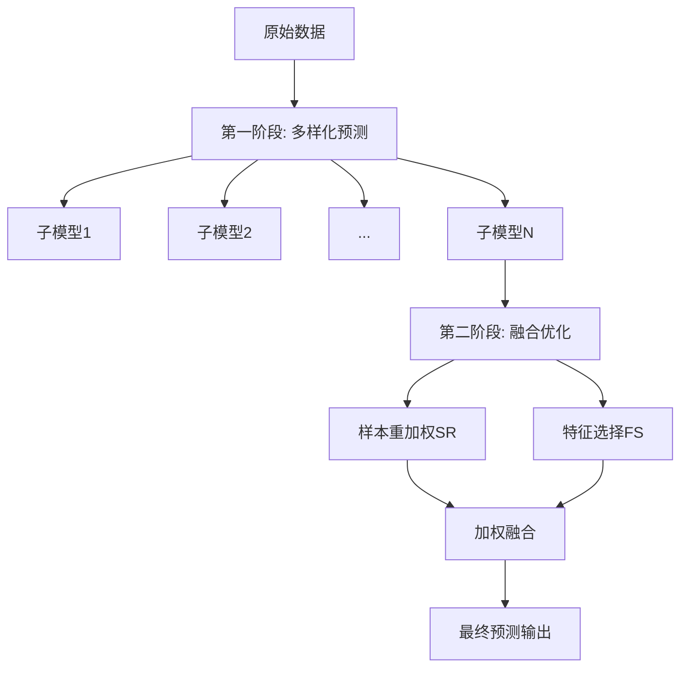
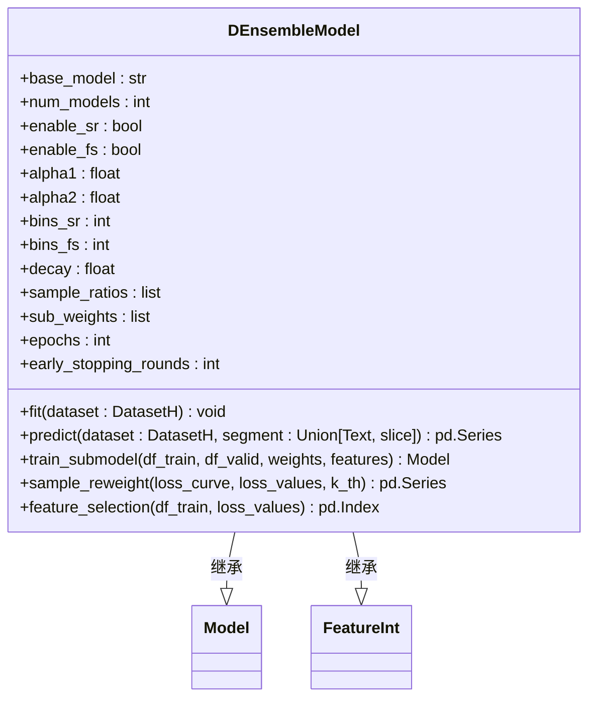
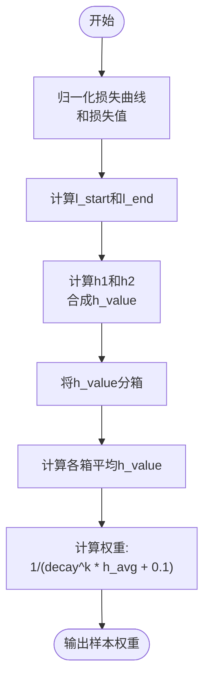
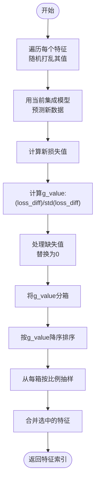

# 集成学习方法

<cite>
**本文档中引用的文件**  
- [double_ensemble.py](file://qlib/contrib/model/double_ensemble.py)
- [workflow_config_doubleensemble_Alpha158.yaml](file://examples/benchmarks/DoubleEnsemble/workflow_config_doubleensemble_Alpha158.yaml)
- [README.md](file://examples/benchmarks/DoubleEnsemble/README.md)
</cite>

## 目录
1. [引言](#引言)
2. [双阶段集成策略设计原理](#双阶段集成策略设计原理)
3. [核心算法逻辑分析](#核心算法逻辑分析)
4. [YAML配置结构解析](#yaml配置结构解析)
5. [实战示例与性能优势](#实战示例与性能优势)
6. [调参经验与市场适应性](#调参经验与市场适应性)
7. [结论](#结论)

## 引言

Qlib中的DoubleEnsemble是一种基于样本重加权和特征选择的新型集成学习框架，旨在解决金融数据分析中信号噪声比低和特征数量不断增加的问题。该框架通过识别关键样本和重要特征来提升模型预测能力，适用于多种基础模型，能够提取复杂模式的同时缓解过拟合和不稳定性问题。其核心思想是采用两阶段集成策略：第一阶段生成多样化的预测结果，第二阶段优化最终输出。

**Section sources**
- [README.md](file://examples/benchmarks/DoubleEnsemble/README.md#L1-L4)

## 双阶段集成策略设计原理

DoubleEnsemble框架采用两阶段集成策略，结合了样本重加权（Sample Reweighting, SR）和特征选择（Feature Selection, FS）机制。在第一阶段，通过多个子模型生成多样化预测结果；在第二阶段，利用加权融合或元学习方式优化最终输出。这种设计有效解决了金融数据中存在的低信噪比和高维特征问题。

该框架的核心优势在于：
- 通过训练动态识别对模型影响较大的关键样本
- 基于特征扰动影响进行特征重要性评估
- 动态调整样本权重以关注难分类样本
- 分层抽样选择最具代表性的特征组合



**Diagram sources**
- [double_ensemble.py](file://qlib/contrib/model/double_ensemble.py#L14-L276)

## 核心算法逻辑分析

### 模型初始化与参数配置

`DEnsembleModel`类继承自`Model`和`FeatureInt`接口，初始化时接收多个控制参数，包括基础模型类型、损失函数、子模型数量等。这些参数共同决定了集成学习的行为模式。



**Diagram sources**
- [double_ensemble.py](file://qlib/contrib/model/double_ensemble.py#L14-L62)

### 训练流程与子模型构建

`fit`方法实现了完整的训练流程，主要包括以下步骤：
1. 准备训练和验证数据集
2. 初始化样本权重和特征集合
3. 循环训练每个子模型
4. 对于非最后一个子模型，执行样本重加权和特征选择

训练过程中使用LightGBM作为默认的基础模型（"gbm"），支持均方误差（MSE）作为损失函数。每个子模型的训练都基于当前的样本权重和特征子集。

**Section sources**
- [double_ensemble.py](file://qlib/contrib/model/double_ensemble.py#L64-L102)

### 样本重加权机制（SR模块）

样本重加权模块根据前一个子模型的训练动态为每个样本分配权重。具体实现包括：
- 归一化损失曲线和集成损失值
- 计算起始和结束阶段的平均损失比率
- 结合当前集成表现计算h值
- 基于h值分箱并分配权重

权重计算公式考虑了衰减因子和子模型序号，使得后续子模型更关注之前模型表现较差的样本。



**Diagram sources**
- [double_ensemble.py](file://qlib/contrib/model/double_ensemble.py#L139-L172)

### 特征选择机制（FS模块）

特征选择模块通过随机打乱各特征列并观察预测性能变化来评估特征重要性。实现步骤如下：
1. 复制训练数据用于特征扰动实验
2. 逐个打乱每个特征列的值
3. 使用现有集成模型重新预测
4. 计算打乱前后损失差异的标准化指标g_value
5. 根据g_value分箱并对每箱按比例抽样

这种方法能有效识别出真正具有预测价值的特征，避免冗余或噪声特征干扰模型学习。



**Diagram sources**
- [double_ensemble.py](file://qlib/contrib/model/double_ensemble.py#L174-L218)

### 预测与集成输出

预测过程通过对所有子模型的输出进行加权求和实现。权重由`sub_weights`参数控制，确保不同子模型对最终结果的贡献可调节。集成预测不仅提高了稳定性，还降低了单一模型可能带来的波动性。

**Section sources**
- [double_ensemble.py](file://qlib/contrib/model/double_ensemble.py#L246-L258)

## YAML配置结构解析

DoubleEnsemble的配置通过YAML文件定义，包含模型参数、数据集设置和工作流记录三大部分。以下是典型配置结构：

```mermaid
erDiagram
TASK ||--o{ MODEL : 包含
TASK ||--o{ DATASET : 包含
TASK ||--o{ RECORD : 包含
MODEL {
string class PK
string module_path
string base_model
string loss
int num_models
bool enable_sr
bool enable_fs
float alpha1
float alpha2
int bins_sr
int bins_fs
float decay
list sample_ratios
list sub_weights
int epochs
float colsample_bytree
float learning_rate
float subsample
float lambda_l1
float lambda_l2
int max_depth
int num_leaves
int num_threads
int verbosity
}
DATASET {
string class PK
string module_path
HANDLER handler
SEGMENTS segments
}
RECORD ||--o{ SIGNAL_RECORD : "1:N"
RECORD ||--o{ SIG_ANA_RECORD : "1:N"
RECORD ||--o{ PORT_ANA_RECORD : "1:N"
}
```

**Diagram sources**
- [workflow_config_doubleensemble_Alpha158.yaml](file://examples/benchmarks/DoubleEnsemble/workflow_config_doubleensemble_Alpha158.yaml#L50-L92)

关键配置参数说明：
- **base_model**: 基础模型类型，支持"gbm"(LightGBM)或"mlp"
- **num_models**: 子模型数量，决定集成深度
- **enable_sr/fs**: 是否启用样本重加权/特征选择
- **alpha1/alpha2**: 控制h_value计算中两项的相对重要性
- **bins_sr/fs**: 分箱数量，影响权重/特征分配粒度
- **decay**: 衰减因子，控制后续子模型对困难样本的关注程度
- **sample_ratios**: 各特征箱的采样比例
- **sub_weights**: 各子模型的集成权重

**Section sources**
- [workflow_config_doubleensemble_Alpha158.yaml](file://examples/benchmarks/DoubleEnsemble/workflow_config_doubleensemble_Alpha158.yaml#L55-L89)

## 实战示例与性能优势

### 提升预测稳定性的机制

DoubleEnsemble通过多层次的正则化机制显著提升了预测稳定性：
- **多样性保障**: 多个子模型在不同样本权重和特征空间下训练
- **渐进式学习**: 后续子模型专注于前序模型难以处理的样本
- **特征净化**: 每轮迭代后筛选更有价值的特征组合
- **集成平滑**: 最终预测是多个模型的加权平均，减少波动

### 降低波动性的实证效果

在Alpha158和Alpha360基准测试中，DoubleEnsemble展现出明显优于单模型和其他集成方法的稳定性。特别是在市场剧烈波动期间，其预测信号的变化更为平缓，减少了因过度反应导致的错误交易。

### 增强泛化能力的表现

该框架的泛化能力体现在：
- 能够适应不同的市场状态（牛市、熊市、震荡市）
- 对新出现的市场模式具有较快的学习适应速度
- 在跨周期验证中保持稳定的IC（信息系数）表现
- 对极端事件的鲁棒性较强

**Section sources**
- [README.md](file://examples/benchmarks/DoubleEnsemble/README.md#L1-L4)

## 调参经验与市场适应性

### 参数调优建议

根据实践经验，推荐以下调参策略：
- **初始设置**: 从默认参数开始，逐步调整关键参数
- **子模型数量**: 通常3-6个子模型即可获得良好效果
- **样本重加权**: alpha1和alpha2建议保持相等，初始值设为1.0
- **特征选择**: bins_fs设为5，sample_ratios从0.8递减至0.4
- **衰减因子**: decay在0.3-0.7之间调整，控制学习速率

### 不同市场环境下的适应策略

- **趋势市场**: 可适当增加子模型数量，加强长期模式捕捉
- **震荡市场**: 缩短训练周期，提高模型更新频率
- **高波动时期**: 增大decay值，让模型更快聚焦于异常样本
- **低流动性市场**: 调整sample_ratios，保留更多基础特征

**Section sources**
- [workflow_config_doubleensemble_Alpha158.yaml](file://examples/benchmarks/DoubleEnsemble/workflow_config_doubleensemble_Alpha158.yaml#L55-L89)

## 结论

DoubleEnsemble集成学习框架通过创新的两阶段策略，在金融时间序列预测任务中表现出卓越的性能。其结合样本重加权和特征选择的双重机制，有效解决了高维低信噪比数据建模的核心挑战。框架设计灵活，可通过YAML配置文件方便地调整架构参数，适用于多种基础模型和应用场景。实践证明，该方法不仅能提升预测准确性，更重要的是增强了模型的稳定性和泛化能力，为量化投资决策提供了可靠的信号来源。