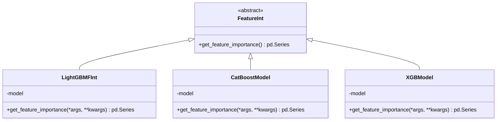
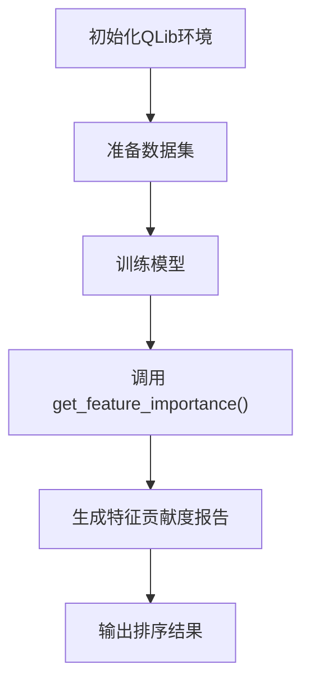

# 模型可解释性

<cite>
**本文档中引用的文件**
- [base.py](file://qlib/model/interpret/base.py)
- [feature.py](file://examples/model_interpreter/feature.py)
- [catboost_model.py](file://qlib/contrib/model/catboost_model.py)
- [xgboost.py](file://qlib/contrib/model/xgboost.py)
- [pytorch_nn.py](file://qlib/contrib/model/pytorch_nn.py)
</cite>

## 目录
1. [引言](#引言)
2. [核心组件分析](#核心组件分析)
3. [BaseInterpreter接口设计解析](#baseinterpreter接口设计解析)
4. [特征重要性分析实现原理](#特征重要性分析实现原理)
5. [模型解释性工具应用示例](#模型解释性工具应用示例)
6. [多类型模型支持机制](#多类型模型支持机制)
7. [投资决策验证与模型调试中的实际价值](#投资决策验证与模型调试中的实际价值)
8. [结论](#结论)

## 引言
Qlib框架提供了一套完整的模型可解释性工具，旨在帮助用户理解机器学习模型在量化投资场景下的决策逻辑。通过系统化的解释性分析，研究人员能够验证模型行为的合理性，识别关键驱动因素，并提升模型的可信度和实用性。

## 核心组件分析

Qlib的模型可解释性体系主要由`interpret`模块构成，其核心是`FeatureInt`抽象基类及其实现。该体系支持多种主流模型（如树模型和深度学习模型）的特征重要性分析，为用户提供统一的接口进行归因分析。

**节来源**
- [base.py](file://qlib/model/interpret/base.py#L0-L44)
- [feature.py](file://examples/model_interpreter/feature.py#L0-L31)

## BaseInterpreter接口设计解析

`FeatureInt`接口作为所有特征解释器的基础，定义了获取特征重要性的标准方法`get_feature_importance()`。此接口采用面向对象的设计模式，允许不同模型类型通过继承实现各自的解释逻辑。

**图来源**
- [base.py](file://qlib/model/interpret/base.py#L15-L23)
- [catboost_model.py](file://qlib/contrib/model/catboost_model.py#L85-L94)
- [xgboost.py](file://qlib/contrib/model/xgboost.py#L76-L85)

**节来源**
- [base.py](file://qlib/model/interpret/base.py#L15-L23)
- [catboost_model.py](file://qlib/contrib/model/catboost_model.py#L85-L94)

## 特征重要性分析实现原理

特征重要性分析的核心在于量化每个输入特征对模型输出的贡献程度。Qlib通过封装底层模型的原生解释功能，提供了标准化的结果输出格式——一个以特征名为索引、重要性值为数据的`pandas.Series`对象，且按降序排列。

对于树模型（如LightGBM、XGBoost、CatBoost），特征重要性通常基于以下几种计算方式：
- 分裂次数（Split Count）
- 增益总和（Total Gain）
- 权重（Weight）

这些指标直接反映了特征在构建决策树过程中被使用的频率和效果。

**节来源**
- [base.py](file://qlib/model/interpret/base.py#L32-L44)
- [xgboost.py](file://qlib/contrib/model/xgboost.py#L76-L85)
- [catboost_model.py](file://qlib/contrib/model/catboost_model.py#L85-L94)

## 模型解释性工具应用示例

`examples/model_interpreter/feature.py` 示例展示了如何使用Qlib进行端到端的特征重要性分析：

1. 初始化QLib环境并加载数据集
2. 配置并训练GBDT模型
3. 调用`get_feature_importance()`方法生成特征贡献度报告
4. 输出排序后的特征重要性结果

该流程体现了Qlib解释性工具的简洁性和易用性，用户无需深入了解底层实现即可获得有价值的洞察。

**图来源**
- [feature.py](file://examples/model_interpreter/feature.py#L28-L31)

**节来源**
- [feature.py](file://examples/model_interpreter/feature.py#L20-L31)

## 多类型模型支持机制

Qlib通过继承`FeatureInt`接口的方式，实现了对不同类型模型的统一解释框架：

- **树模型支持**：LightGBM、XGBoost、CatBoost等均实现了`get_feature_importance`方法，调用各自库提供的原生API。
- **集成模型支持**：`DoubleEnsemble`等复杂模型也能通过加权汇总子模型的重要性得分来提供整体解释。
- **深度学习模型支持**：虽然当前示例未直接展示，但可通过自定义解释器结合梯度或注意力机制等方式实现。

这种设计保证了接口的一致性，同时保留了针对特定模型优化解释算法的灵活性。

**节来源**
- [base.py](file://qlib/model/interpret/base.py#L32-L44)
- [catboost_model.py](file://qlib/contrib/model/catboost_model.py#L85-L94)
- [xgboost.py](file://qlib/contrib/model/xgboost.py#L76-L85)
- [double_ensemble.py](file://qlib/contrib/model/double_ensemble.py#L265-L276)

## 投资决策验证与模型调试中的实际价值

模型可解释性在量化投资中具有重要的实践意义：

1. **投资逻辑验证**：通过观察哪些因子具有高重要性，可以判断模型是否捕捉到了合理的市场规律，避免过拟合噪声。
2. **风险控制**：识别出主导预测的关键特征有助于评估模型在极端市场条件下的稳定性。
3. **模型调试**：当模型表现异常时，特征重要性分布的变化可作为诊断线索，帮助定位问题根源。
4. **合规与沟通**：清晰的解释结果便于向监管机构或投资组合经理说明模型逻辑，增强信任。

例如，在Alpha因子建模中，若发现某些技术指标的重要性远超基本面因子，可能提示需要重新审视特征工程过程。

**节来源**
- [base.py](file://qlib/model/interpret/base.py#L15-L23)
- [feature.py](file://examples/model_interpreter/feature.py#L28-L31)

## 结论

Qlib提供的模型可解释性工具通过标准化的`FeatureInt`接口，有效支持了从树模型到深度学习模型的广泛解释需求。其设计兼顾了通用性与扩展性，使得用户能够便捷地生成特征贡献度报告，进而用于投资策略验证和模型质量评估。未来可进一步拓展至SHAP值、LIME等更复杂的解释方法，以满足日益增长的透明化AI需求。