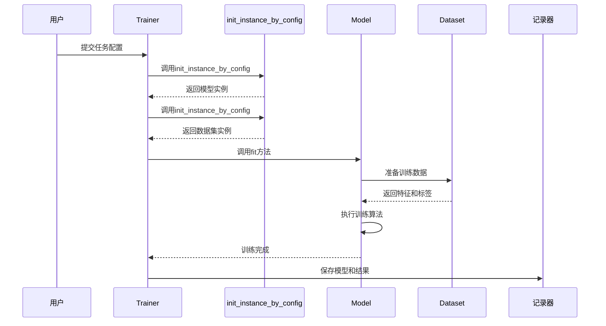
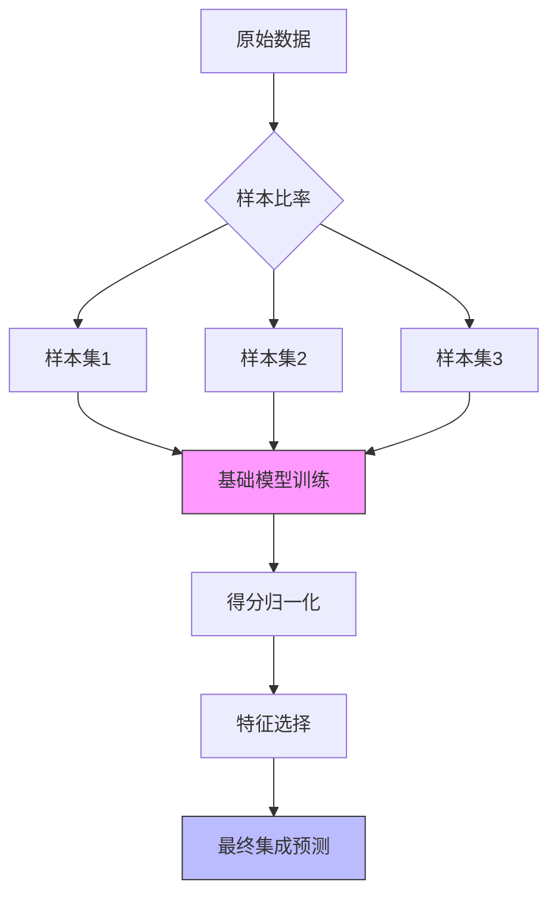
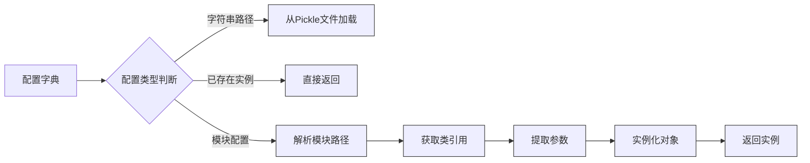

# 模型模块

<cite>
**本文档中引用的文件**
- [base.py](file://qlib/model/base.py)
- [trainer.py](file://qlib/model/trainer.py)
- [init_instance_by_config.py](file://qlib/utils/mod.py)
- [tuner.py](file://qlib/contrib/tuner/tuner.py)
- [interpret/base.py](file://qlib/model/interpret/base.py)
- [double_ensemble.py](file://qlib/contrib/model/double_ensemble.py)
- [workflow_config_catboost_Alpha360.yaml](file://examples/benchmarks/CatBoost/workflow_config_catboost_Alpha360.yaml)
- [workflow_config_lightgbm_Alpha360.yaml](file://examples/benchmarks/LightGBM/workflow_config_lightgbm_Alpha360.yaml)
- [workflow_config_xgboost_Alpha360.yaml](file://examples/benchmarks/XGBoost/workflow_config_xgboost_Alpha360.yaml)
- [workflow_config_lstm_Alpha360.yaml](file://examples/benchmarks/LSTM/workflow_config_lstm_Alpha360.yaml)
- [workflow_config_gru_Alpha360.yaml](file://examples/benchmarks/GRU/workflow_config_gru_Alpha360.yaml)
- [workflow_config_transformer_Alpha360.yaml](file://examples/benchmarks/Transformer/workflow_config_transformer_Alpha360.yaml)
- [workflow_config_gats_Alpha360.yaml](file://examples/benchmarks/GATs/workflow_config_gats_Alpha360.yaml)
- [workflow_config_doubleensemble_Alpha360.yaml](file://examples/benchmarks/DoubleEnsemble/workflow_config_doubleensemble_Alpha360.yaml)
</cite>

## 目录
1. [引言](#引言)
2. [核心架构设计](#核心架构设计)
3. [模型训练管理机制](#模型训练管理机制)
4. [支持的模型类型](#支持的模型类型)
5. [配置驱动的实例化](#配置驱动的实例化)
6. [超参数调优系统](#超参数调优系统)
7. [模型解释性分析](#模型解释性分析)
8. [结论](#结论)

## 引言
本文档深入解析Qlib框架中模型训练与管理系统的架构与实现。重点阐述了统一的模型抽象接口、训练流程协调机制、多种机器学习模型的支持以及配置驱动的实例化模式。通过分析YAML配置文件，展示了不同模型的参数设置与调用方式，并涵盖了超参数调优和模型解释性等高级功能。

## 核心架构设计

### base.Model接口的统一抽象
`base.Model`接口是Qlib中所有可学习模型的基础抽象，定义了模型的核心行为规范。该接口继承自`BaseModel`，后者实现了`Serializable`接口并采用抽象基类（ABC）模式。

```mermaid
classDiagram
class BaseModel {
<<abstract>>
+predict(*args, **kwargs) object
+__call__(*args, **kwargs) object
}
class Model {
<<abstract>>
+fit(dataset : Dataset, reweighter : Reweighter)
}
BaseModel <|-- Model
note right of Model
所有可学习模型必须实现fit方法
用于从数据集中学习模型参数
end note
```

**图示来源**
- [base.py](file://qlib/model/base.py#L0-L42)

**本节来源**
- [base.py](file://qlib/model/base.py#L0-L42)

### 统一的设计原则
`Model`接口的设计遵循以下核心原则：
- **预测一致性**：通过`predict`方法提供统一的预测接口，同时重载`__call__`方法使模型对象可以像函数一样被调用。
- **训练标准化**：`fit`方法接受标准的`Dataset`对象和`Reweighter`重加权器，确保所有模型使用一致的数据输入格式。
- **序列化支持**：继承`Serializable`接口，保证模型可以被正确地保存到磁盘和从磁盘加载。
- **属性命名规范**：要求学习得到的模型属性名不能以'_'开头，以便能够正确地被序列化。

## 模型训练管理机制

### Trainer的协调作用
`Trainer`类负责协调整个模型训练过程，提供了两种主要的训练模式：即时训练和延迟训练。它通过任务配置来驱动模型的创建、训练和结果记录。



**图示来源**
- [trainer.py](file://qlib/model/trainer.py#L0-L619)

**本节来源**
- [trainer.py](file://qlib/model/trainer.py#L0-L619)

### 训练器类型
Qlib提供了多种`Trainer`实现来满足不同的训练需求：

| 训练器类型 | 特点 | 适用场景 |
|-----------|------|---------|
| TrainerR | 基于记录器的线性训练 | 单任务或小批量任务训练 |
| DelayTrainerR | 延迟训练，分离准备和执行阶段 | 在线模拟和并行训练 |
| TrainerRM | 基于任务管理器的多进程训练 | 大规模并行训练 |
| DelayTrainerRM | 延迟的多进程训练 | 分布式环境下的训练 |

## 支持的模型类型

### 传统GBDT模型
Qlib支持三种主流的梯度提升决策树（GBDT）框架：LightGBM、XGBoost和CatBoost。这些模型在`qlib.contrib.model`包中提供了相应的封装。

```mermaid
classDiagram
class LGBModel {
+fit(dataset, reweighter)
+predict(dataset)
}
class XGBModel {
+fit(dataset, reweighter)
+predict(dataset)
}
class CatBoostModel {
+fit(dataset, reweighter)
+predict(dataset)
}
class GBDTModel {
<<abstract>>
+fit(dataset, reweighter)
}
GBDTModel <|-- LGBModel
GBDTModel <|-- XGBModel
CatBoostModel <-- GBDTModel : "类似"
note right of GBDTModel
共享相似的训练接口和参数结构
但针对各自框架进行了优化
end note
```

**图示来源**
- [workflow_config_lightgbm_Alpha360.yaml](file://examples/benchmarks/LightGBM/workflow_config_lightgbm_Alpha360.yaml)
- [workflow_config_xgboost_Alpha360.yaml](file://examples/benchmarks/XGBoost/workflow_config_xgboost_Alpha360.yaml)
- [workflow_config_catboost_Alpha360.yaml](file://examples/benchmarks/CatBoost/workflow_config_catboost_Alpha360.yaml)

**本节来源**
- [workflow_config_lightgbm_Alpha360.yaml](file://examples/benchmarks/LightGBM/workflow_config_lightgbm_Alpha360.yaml)
- [workflow_config_xgboost_Alpha360.yaml](file://examples/benchmarks/XGBoost/workflow_config_xgboost_Alpha360.yaml)
- [workflow_config_catboost_Alpha360.yaml](file://examples/benchmarks/CatBoost/workflow_config_catboost_Alpha360.yaml)

### 深度神经网络模型
对于深度学习模型，Qlib提供了基于PyTorch的多种神经网络实现，包括循环神经网络和注意力机制模型。

#### LSTM/GRU模型
长短期记忆网络（LSTM）和门控循环单元（GRU）是处理时间序列数据的经典RNN变体。

```yaml
model:
    class: LSTM
    module_path: qlib.contrib.model.pytorch_lstm
    kwargs:
        d_feat: 6
        hidden_size: 64
        num_layers: 2
        dropout: 0.0
        n_epochs: 200
        lr: 1e-3
```

#### Transformer/GATs模型
Transformer架构和图注意力网络（GATs）代表了更先进的深度学习方法。

```yaml
model:
    class: TransformerModel
    module_path: qlib.contrib.model.pytorch_transformer
    kwargs:
        d_feat: 6
        seed: 0
```

```yaml
model:
    class: GATs
    module_path: qlib.contrib.model.pytorch_gats
    kwargs:
        d_feat: 6
        hidden_size: 64
        base_model: LSTM
        model_path: "benchmarks/LSTM/model_lstm_csi300.pkl"
```

**本节来源**
- [workflow_config_lstm_Alpha360.yaml](file://examples/benchmarks/LSTM/workflow_config_lstm_Alpha360.yaml)
- [workflow_config_gru_Alpha360.yaml](file://examples/benchmarks/GRU/workflow_config_gru_Alpha360.yaml)
- [workflow_config_transformer_Alpha360.yaml](file://examples/benchmarks/Transformer/workflow_config_transformer_Alpha360.yaml)
- [workflow_config_gats_Alpha360.yaml](file://examples/benchmarks/GATs/workflow_config_gats_Alpha360.yaml)

### 集成方法
Qlib实现了DoubleEnsemble集成方法，通过结合多个基础模型来提高预测性能。



**图示来源**
- [double_ensemble.py](file://qlib/contrib/model/double_ensemble.py#L0-L15)
- [workflow_config_doubleensemble_Alpha360.yaml](file://examples/benchmarks/DoubleEnsemble/workflow_config_doubleensemble_Alpha360.yaml)

**本节来源**
- [double_ensemble.py](file://qlib/contrib/model/double_ensemble.py#L0-L15)
- [workflow_config_doubleensemble_Alpha360.yaml](file://examples/benchmarks/DoubleEnsemble/workflow_config_doubleensemble_Alpha360.yaml)

## 配置驱动的实例化

### 工厂模式实现
`init_instance_by_config`函数实现了配置驱动的工厂模式，可以根据配置字典动态创建相应的实例。



**图示来源**
- [mod.py](file://qlib/utils/mod.py#L121-L183)

**本节来源**
- [mod.py](file://qlib/utils/mod.py#L121-L183)

### 配置解析流程
该工厂模式的执行流程如下：
1. 首先检查配置是否已经是可接受类型的实例，如果是则直接返回
2. 如果配置是文件路径，则从Pickle文件中反序列化对象
3. 解