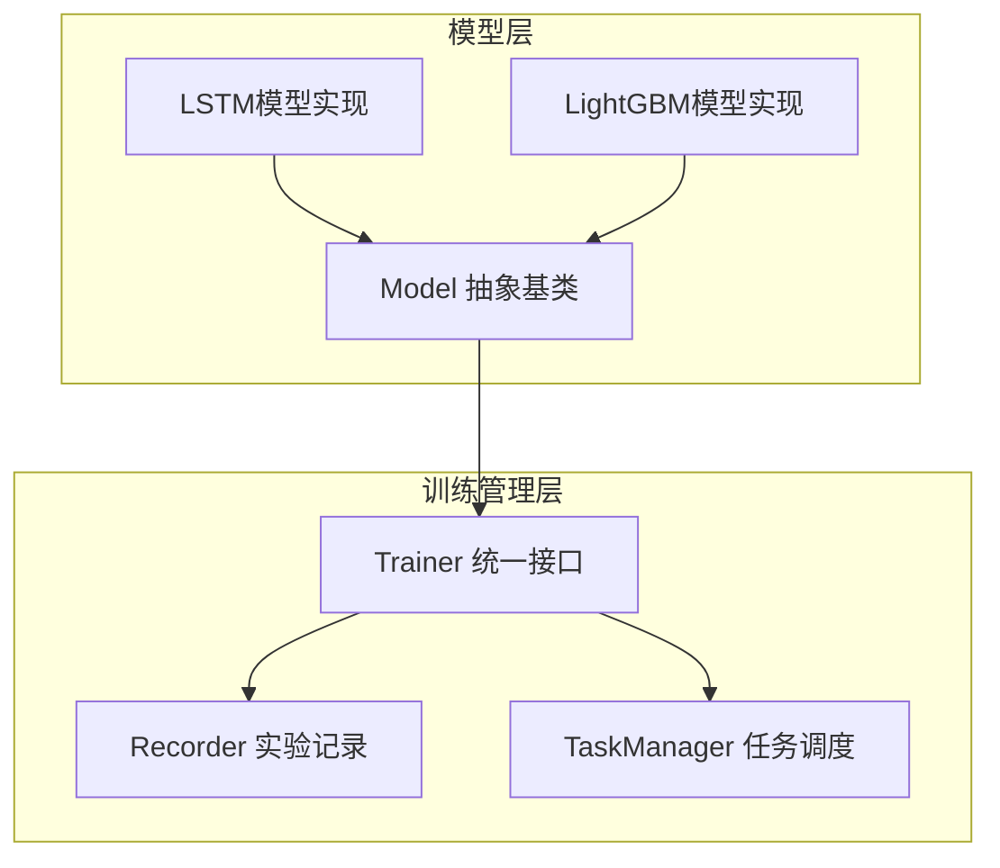
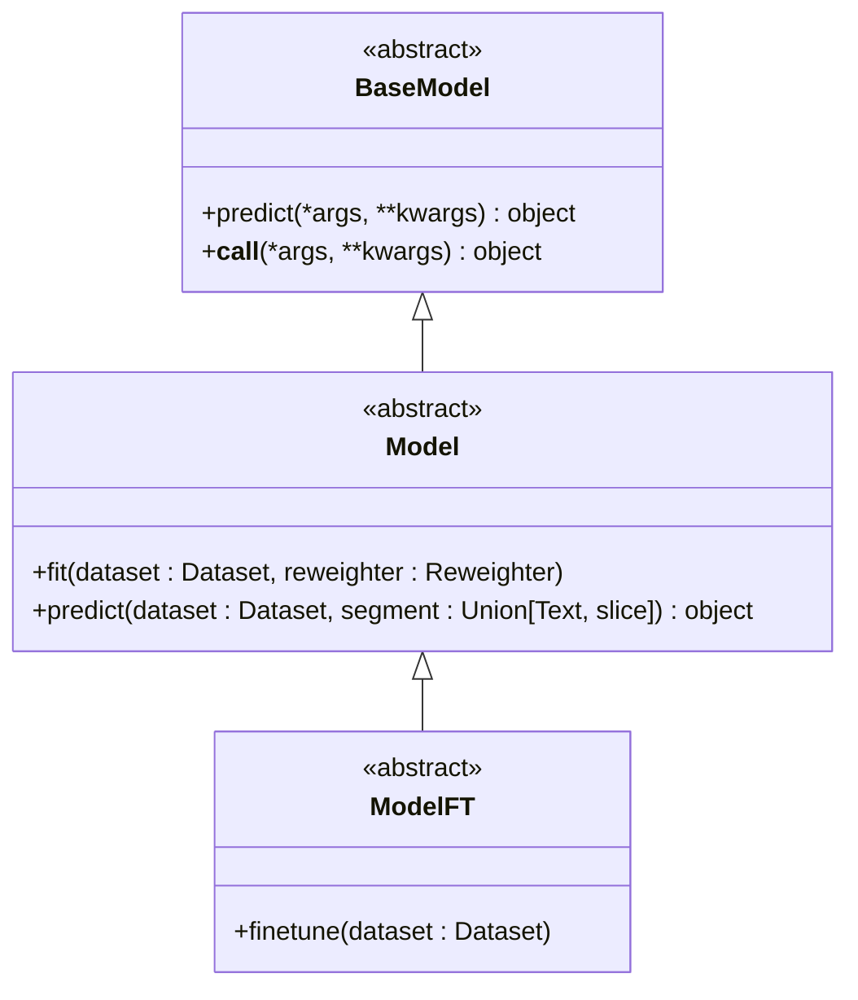
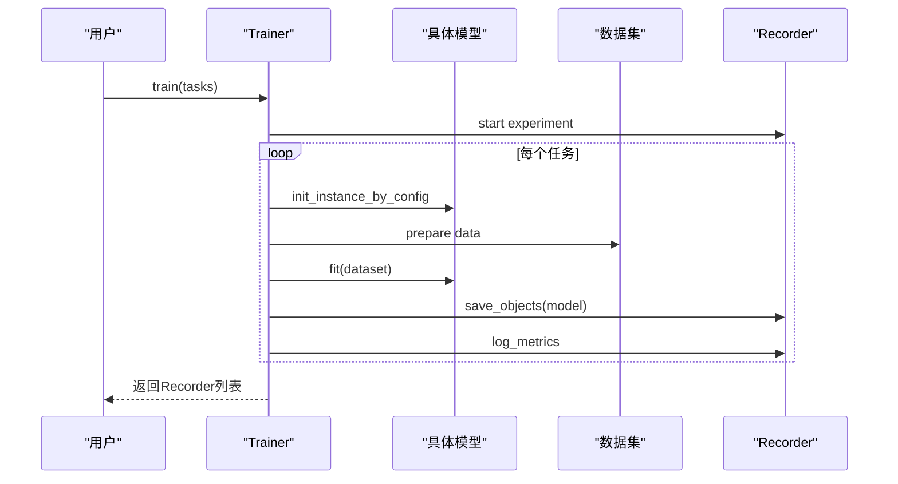
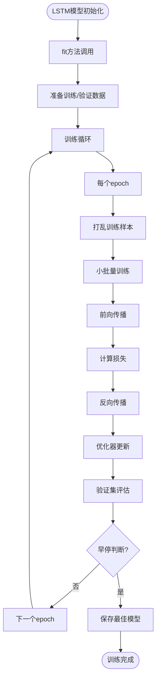
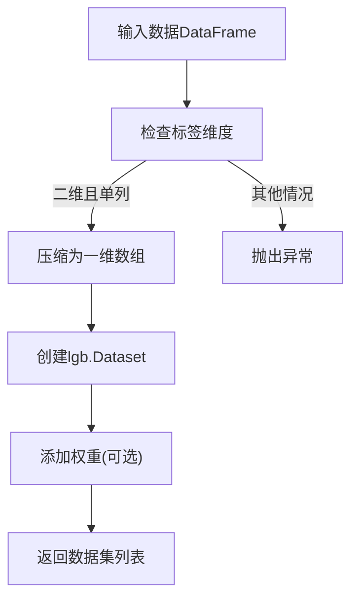
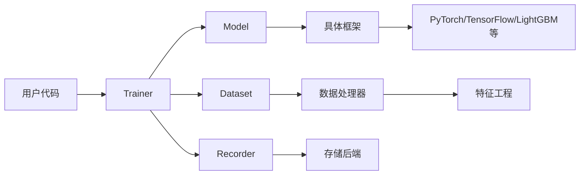

# 模型训练核心接口

<cite>
**本文档中引用的文件**
- [base.py](file://qlib/model/base.py)
- [trainer.py](file://qlib/model/trainer.py)
- [pytorch_lstm.py](file://qlib/contrib/model/pytorch_lstm.py)
- [gbdt.py](file://qlib/contrib/model/gbdt.py)
</cite>

## 目录
1. [引言](#引言)
2. [核心组件分析](#核心组件分析)
3. [架构概述](#架构概述)
4. [详细组件分析](#详细组件分析)
5. [依赖关系分析](#依赖关系分析)
6. [性能考量](#性能考量)
7. [故障排除指南](#故障排除指南)
8. [结论](#结论)

## 引言
Qlib框架通过抽象基类和统一训练器实现了对多种机器学习模型的标准化训练流程。该系统设计支持PyTorch、LightGBM等不同框架的模型，提供了一致的接口规范和分布式训练能力。

## 核心组件分析
本节深入解析Qlib中模型训练的核心接口设计，包括`base.Model`抽象基类的契约规范以及`trainer.Trainer`类如何协调不同机器学习框架的训练流程。

**Section sources**
- [base.py](file://qlib/model/base.py#L0-L110)
- [trainer.py](file://qlib/model/trainer.py#L0-L619)

## 架构概述
Qlib采用分层架构设计，将模型定义与训练流程分离。通过`Model`抽象基类定义统一接口，`Trainer`类负责执行具体的训练任务，并利用Recorder机制进行实验管理。

**Diagram sources**
- [base.py](file://qlib/model/base.py#L0-L110)
- [trainer.py](file://qlib/model/trainer.py#L0-L619)

## 详细组件分析

### BaseModel抽象基类分析
`BaseModel`作为所有可学习模型的基础，定义了预测接口契约，确保所有派生模型都具备一致的行为模式。

#### 类图展示

**Diagram sources**
- [base.py](file://qlib/model/base.py#L0-L110)

### Trainer训练器分析
`Trainer`类提供了统一的模型训练接口，支持同步和异步两种训练模式，能够协调不同机器学习框架的训练流程。

#### 训练流程序列图

**Diagram sources**
- [trainer.py](file://qlib/model/trainer.py#L0-L619)

### PyTorch LSTM模型实现分析
以`pytorch_lstm.py`为例，展示如何继承并扩展基础接口来实现特定的深度学习模型。

#### 实现流程图

**Diagram sources**
- [pytorch_lstm.py](file://qlib/contrib/model/pytorch_lstm.py#L0-L306)

### LightGBM模型实现分析
分析基于GBDT框架的模型如何适配统一接口，特别是处理框架特定需求如一维标签数组的要求。

#### 数据预处理流程

**Diagram sources**
- [gbdt.py](file://qlib/contrib/model/gbdt.py#L0-L124)

## 依赖关系分析
Qlib的模型训练系统具有清晰的模块化结构，各组件之间通过明确定义的接口进行交互。

**Diagram sources**
- [base.py](file://qlib/model/base.py#L0-L110)
- [trainer.py](file://qlib/model/trainer.py#L0-L619)

## 性能考量
在分布式环境下，Qlib通过延迟训练机制和任务队列实现了高效的资源管理策略，支持跨机器的并行训练。

## 故障排除指南
当遇到模型未拟合异常时，请检查是否正确设置了`fitted`标志位；对于内存不足问题，建议启用子进程训练模式以强制释放内存。

**Section sources**
- [pytorch_lstm.py](file://qlib/contrib/model/pytorch_lstm.py#L0-L306)
- [trainer.py](file://qlib/model/trainer.py#L0-L619)

## 结论
Qlib通过精心设计的抽象接口和灵活的训练器架构，成功实现了对多种机器学习框架的统一管理，为量化研究提供了高效、可靠的模型训练基础设施。