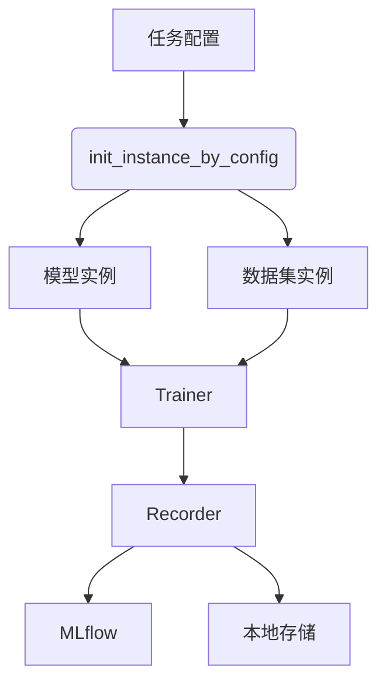
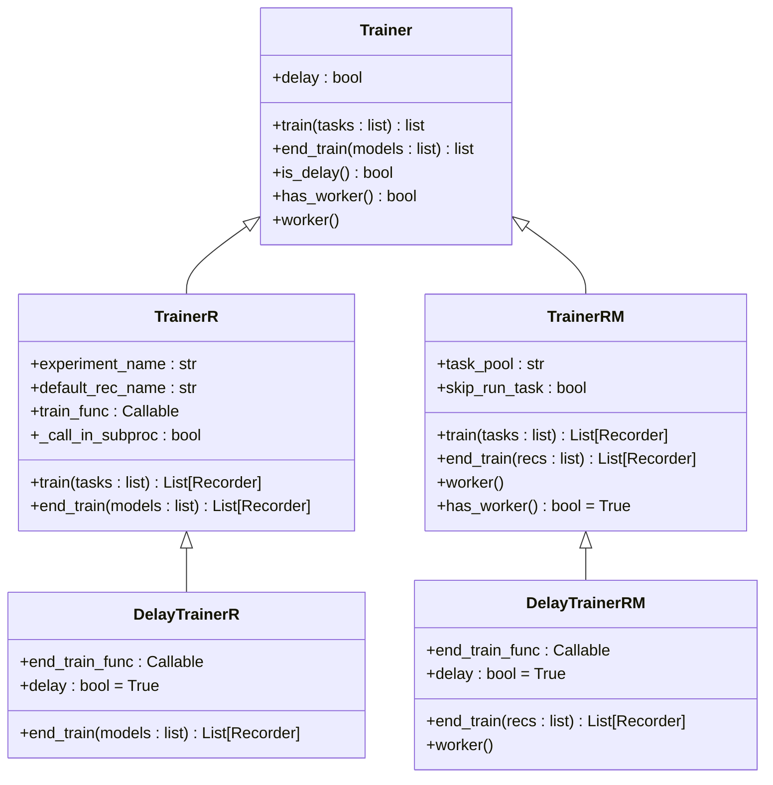
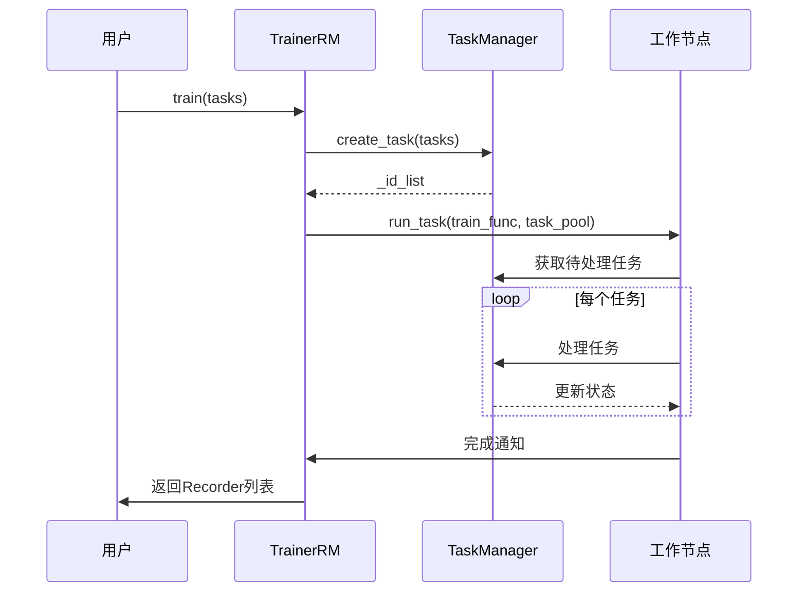

# 模型训练框架

<cite>
**本文档中引用的文件**
- [base.py](file://qlib/model/base.py)
- [trainer.py](file://qlib/model/trainer.py)
- [workflow_by_code.py](file://examples/workflow_by_code.py)
- [mod.py](file://qlib/utils/mod.py)
- [recorder.py](file://qlib/workflow/recorder.py)
- [exp.py](file://qlib/workflow/exp.py)
- [expm.py](file://qlib/workflow/expm.py)
</cite>

## 目录
1. [简介](#简介)
2. [核心架构概览](#核心架构概览)
3. [模型接口设计](#模型接口设计)
4. [训练器协调机制](#训练器协调机制)
5. [配置到执行流程](#配置到执行流程)
6. [工厂模式实现](#工厂模式实现)
7. [关键功能支持](#关键功能支持)
8. [结论](#结论)

## 简介
Qlib提供了一套完整的量化研究工作流框架，支持通过代码或配置文件定义研究流程。该框架的核心是模型训练体系，它基于模块化设计原则，实现了从数据准备、模型训练、预测到回测分析的完整闭环。本文档深入解析其模型训练的核心架构，重点阐述`base.Model`接口的设计原则、`trainer.Trainer`的协调机制以及`init_instance_by_config`工厂模式的作用。

**Section sources**
- [workflow_by_code.py](file://examples/workflow_by_code.py#L1-L85)

## 核心架构概览
Qlib的模型训练框架由多个核心组件构成：`Model`接口定义了模型的行为契约，`Trainer`负责协调训练流程，`Recorder`用于实验管理和结果记录，而`init_instance_by_config`工厂函数则实现了动态实例化。这些组件共同构成了一个灵活且可扩展的训练系统。



**Diagram sources**
- [trainer.py](file://qlib/model/trainer.py#L0-L620)
- [mod.py](file://qlib/utils/mod.py#L121-L183)
- [recorder.py](file://qlib/workflow/recorder.py#L27-L243)

## 模型接口设计
`base.Model`接口继承自`BaseModel`并实现了`Serializable`，定义了机器学习模型的基本行为契约。该接口采用抽象基类（ABC）模式，强制子类实现关键方法。

### 契约规范
`Model`接口主要包含以下方法：

- `fit`: 从数据集中学习模型参数
- `predict`: 基于给定数据集进行预测
- `__call__`: 利用Python语法糖使模型行为类似函数

```python
class Model(BaseModel):
    def fit(self, dataset: Dataset, reweighter: Reweighter):
        raise NotImplementedError()

    @abc.abstractmethod
    def predict(self, dataset: Dataset, segment: Union[Text, slice] = "test") -> object:
        raise NotImplementedError()
```

`ModelFT`接口扩展了微调能力，支持在已有模型基础上进行增量训练。

**Section sources**
- [base.py](file://qlib/model/base.py#L0-L110)

## 训练器协调机制
`trainer.Trainer`通过统一接口协调不同模型的训练流程，并支持实验管理。它提供了两种主要实现：`TrainerR`和`TrainerRM`。

### TrainerR
`TrainerR`基于`Recorder`实现线性训练，适用于单进程场景。它通过`train`方法依次处理任务列表，并使用`task_train`函数执行具体训练逻辑。

### TrainerRM
`TrainerRM`基于`TaskManager`实现多进程训练，支持分布式任务调度。它将任务保存到MongoDB中，允许多个工作节点并行处理。



**Diagram sources**
- [trainer.py](file://qlib/model/trainer.py#L120-L620)

## 配置到执行流程
结合`workflow_by_code.py`中的示例，可以展示从配置定义到模型训练执行的完整过程。

### 初始化阶段
首先初始化Qlib环境并获取数据：
```python
provider_uri = "~/.qlib/qlib_data/cn_data"
GetData().qlib_data(target_dir=provider_uri, region=REG_CN, exists_skip=True)
qlib.init(provider_uri=provider_uri, region=REG_CN)
```

### 实例化阶段
使用`init_instance_by_config`工厂函数动态创建模型和数据集实例：
```python
model = init_instance_by_config(CSI300_GBDT_TASK["model"])
dataset = init_instance_by_config(CSI300_GBDT_TASK["dataset"])
```

### 训练执行阶段
启动实验记录器，执行模型训练并保存结果：
```python
with R.start(experiment_name="workflow"):
    R.log_params(**flatten_dict(CSI300_GBDT_TASK))
    model.fit(dataset)
    R.save_objects(**{"params.pkl": model})
```

**Section sources**
- [workflow_by_code.py](file://examples/workflow_by_code.py#L1-L85)

## 工厂模式实现
`init_instance_by_config`工厂模式在动态实例化模型和训练器中起着关键作用。该函数位于`qlib.utils.mod`模块中，能够根据配置信息创建相应的实例。

### 作用机制
该函数的主要功能包括：

1. 类型检查：如果配置已经是接受类型，则直接返回
2. 路径处理：支持从文件路径加载pickle对象
3. 类查找：根据模块路径和类名获取可调用对象
4. 实例化：使用配置参数创建实例，支持异常回退

```python
def init_instance_by_config(
    config: InstConf,
    default_module=None,
    accept_types: Union[type, Tuple[type]] = (),
    try_kwargs: Dict = {},
    **kwargs,
) -> Any:
    # 类型检查
    if isinstance(config, accept_types):
        return config
    
    # 路径处理
    if isinstance(config, (str, Path)):
        # 处理文件路径
        pass
    
    # 类查找与实例化
    klass, cls_kwargs = get_callable_kwargs(config, default_module=default_module)
    try:
        return klass(**cls_kwargs, **try_kwargs, **kwargs)
    except (TypeError,):
        return klass(**cls_kwargs, **kwargs)
```

**Section sources**
- [mod.py](file://qlib/utils/mod.py#L121-L183)

## 关键功能支持
Qlib的模型训练框架提供了多项关键功能支持，确保训练过程的可靠性和可追溯性。

### 日志记录
通过`Recorder`接口的`log_params`和`log_metrics`方法记录训练参数和指标：
```python
R.log_params(**flatten_dict(task_config))
```

### 检查点保存与恢复
`Recorder`支持保存和加载对象，实现检查点功能：
```python
R.save_objects(**{"params.pkl": model})
model = recorder.load_object("init_model")
```

### 分布式训练支持
`TrainerRM`和`DelayTrainerRM`通过`TaskManager`支持分布式训练，允许多个工作节点共享任务池。

### MLflow集成
通过`MLflowRecorder`和`MLflowExperiment`实现与MLflow的无缝集成，支持实验跟踪和结果可视化。



**Diagram sources**
- [trainer.py](file://qlib/model/trainer.py#L0-L620)
- [recorder.py](file://qlib/workflow/recorder.py#L263-L291)
- [exp.py](file://qlib/workflow/exp.py#L0-L380)
- [expm.py](file://qlib/workflow/expm.py#L0-L435)

## 结论
Qlib的模型训练框架通过精心设计的接口和组件，构建了一个灵活、可扩展且易于使用的量化研究平台。`base.Model`接口定义了清晰的行为契约，`trainer.Trainer`提供了统一的训练协调机制，`init_instance_by_config`工厂模式实现了动态实例化，而完整的实验管理功能则确保了研究过程的可重复性和可追溯性。这一架构不仅支持从简单到复杂的各种训练需求，还为未来的扩展留下了充足的空间。