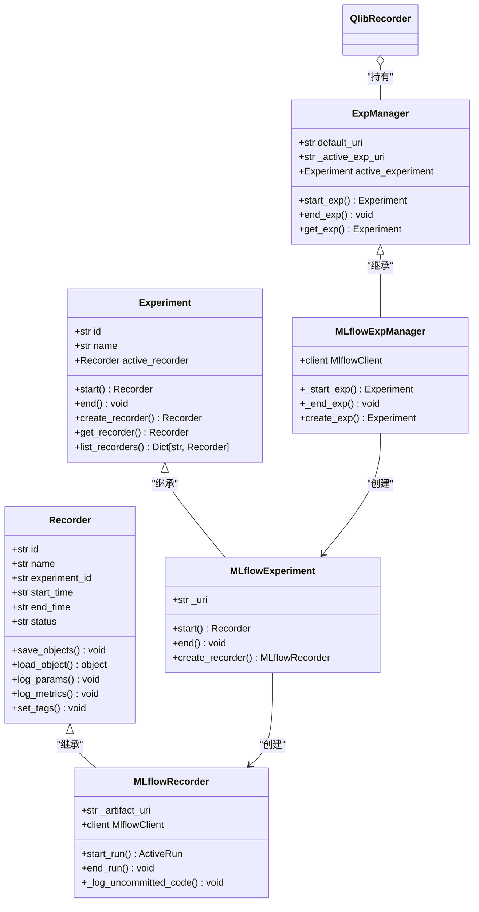
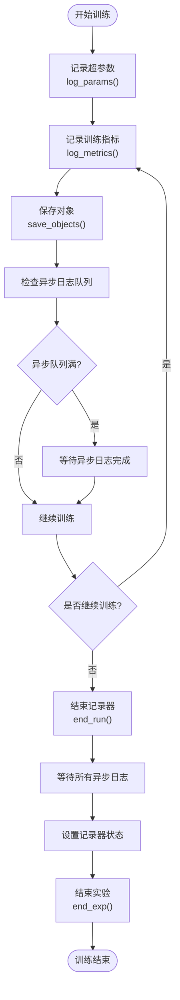
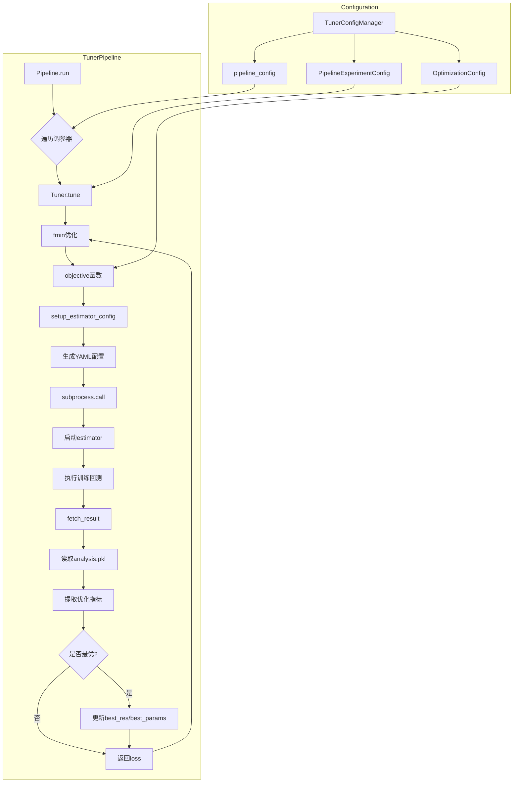

# 训练生命周期管理

<cite>
**本文档中引用的文件**
- [recorder.py](file://qlib/workflow/recorder.py)
- [exp.py](file://qlib/workflow/exp.py)
- [expm.py](file://qlib/workflow/expm.py)
- [__init__.py](file://qlib/workflow/__init__.py)
- [pipeline.py](file://qlib/contrib/tuner/pipeline.py)
- [tuner.py](file://qlib/contrib/tuner/tuner.py)
- [config.py](file://qlib/contrib/tuner/config.py)
</cite>

## 目录
1. [简介](#简介)
2. [实验与记录器系统架构](#实验与记录器系统架构)
3. [实验会话管理机制](#实验会话管理机制)
4. [训练过程中的日志与持久化](#训练过程中的日志与持久化)
5. [自动化调参闭环流程](#自动化调参闭环流程)
6. [训练中断恢复与多阶段编排](#训练中断恢复与多阶段编排)
7. [常见问题与解决方案](#常见问题与解决方案)
8. [结论](#结论)

## 简介
Qlib框架提供了一套完整的模型训练全生命周期管理机制，通过实验（Experiment）与记录器（Recorder）系统实现对机器学习工作流的精细化控制。该系统设计灵感来源于MLflow，但提供了更丰富的功能和更直观的API接口。核心组件包括实验管理器（ExpManager）、实验（Experiment）和记录器（Recorder），它们共同构成了一个层次化的跟踪体系，能够有效管理从模型训练、参数调优到结果分析的全过程。

## 实验与记录器系统架构



**图示来源**
- [expm.py](file://qlib/workflow/expm.py#L34-L100)
- [exp.py](file://qlib/workflow/exp.py#L14-L239)
- [recorder.py](file://qlib/workflow/recorder.py#L27-L243)

**本节来源**
- [expm.py](file://qlib/workflow/expm.py#L34-L100)
- [exp.py](file://qlib/workflow/exp.py#L14-L239)
- [recorder.py](file://qlib/workflow/recorder.py#L27-L243)

## 实验会话管理机制
Qlib通过`workflow.exp.start_exp`启动实验会话，建立了一个层次化的上下文管理体系。实验管理器（ExpManager）作为全局单例，负责管理所有实验实例。当调用`start_exp`时，系统首先检查是否存在活动的实验，若不存在则根据提供的实验ID或名称创建新的实验实例，并将其设置为活动状态。每个实验可以包含多个记录器（Recorder），但在任意时刻只能有一个活动的记录器。

实验的启动过程遵循严格的生命周期：首先初始化实验对象，然后创建并启动记录器实例。记录器的状态机包含SCHEDULED、RUNNING、FINISHED和FAILED四种状态，确保了实验过程的可追踪性。通过`get_exp`方法，用户可以根据实验ID或名称检索特定的实验实例，系统支持自动创建默认实验的便捷模式。

```mermaid
sequenceDiagram
participant User as "用户代码"
participant R as "QlibRecorder(R)"
participant EM as "ExpManager"
participant Exp as "Experiment"
participant Rec as "Recorder"
User->>R : start_exp(experiment_name='test')
R->>EM : start_exp()
EM->>EM : 设置_active_exp_uri
EM->>_start_exp()
EM->>Exp : get_or_create_exp()
alt 实验不存在
Exp->>Exp : create_exp()
Exp->>EM : 返回新实验
else 实验存在
Exp->>EM : 返回现有实验
end
EM->>Exp : 设置为active_experiment
Exp->>Exp : start(recorder_name='mlflow_recorder')
Exp->>Rec : get_or_create_rec()
alt 记录器不存在
Rec->>Rec : create_recorder()
Rec->>Exp : 返回新记录器
else 记录器存在
Rec->>Exp : 返回现有记录器
end
Exp->>Rec : 设置为active_recorder
Rec->>Rec : start_run()
Rec->>mlflow : mlflow.start_run()
Rec->>Rec : 记录开始时间
Rec->>Rec : 异步日志初始化
Rec->>Rec : 记录未提交代码差异
Rec->>Exp : 返回活动记录器
Exp->>EM : 返回活动实验
EM->>R : 返回实验实例
R->>User : 返回实验实例
```

**图示来源**
- [expm.py](file://qlib/workflow/expm.py#L61-L100)
- [exp.py](file://qlib/workflow/exp.py#L14-L239)
- [__init__.py](file://qlib/workflow/__init__.py#L96-L131)

**本节来源**
- [expm.py](file://qlib/workflow/expm.py#L61-L100)
- [exp.py](file://qlib/workflow/exp.py#L14-L239)
- [__init__.py](file://qlib/workflow/__init__.py#L96-L131)

## 训练过程中的日志与持久化
在训练过程中，Qlib的记录器系统提供了全面的日志记录和结果持久化功能。通过`log_params`、`log_metrics`和`set_tags`等方法，用户可以将超参数、训练指标和元数据实时记录到后端存储中。系统采用异步日志机制（AsyncCaller），通过独立的异步调用器处理日志写入操作，避免了I/O阻塞对训练性能的影响。

结果持久化方面，`save_objects`方法支持将模型检查点、预测结果等任意Python对象序列化后保存到工件URI中。系统不仅支持直接保存本地文件或目录，还允许通过关键字参数直接传递对象进行保存。对于MLflow后端，系统会自动记录未提交的代码差异（git diff）、环境变量等关键信息，增强了实验的可复现性。



**图示来源**
- [recorder.py](file://qlib/workflow/recorder.py#L27-L243)
- [__init__.py](file://qlib/workflow/__init__.py#L241-L271)

**本节来源**
- [recorder.py](file://qlib/workflow/recorder.py#L27-L243)
- [__init__.py](file://qlib/workflow/__init__.py#L241-L271)

## 自动化调参闭环流程
Qlib通过`tuner.pipeline.TuningPipeline`实现了自动化调参的训练-验证-选择闭环流程。该流程以`TunerConfigManager`为中心，管理整个调参实验的配置。`Pipeline`类作为主控制器，遍历配置中的每个调参器（tuner_config），初始化相应的调参器实例并执行调优过程。

调参器（Tuner）采用基于Hyperopt的贝叶斯优化框架，通过`fmin`函数在定义的搜索空间内寻找最优参数组合。每次评估都通过子进程启动一个独立的估计器（estimator）实验，确保了环境隔离和资源管理。目标函数`objective`负责组装具体的模型配置，执行训练和回测，并从结果文件中提取优化目标值。



**图示来源**
- [pipeline.py](file://qlib/contrib/tuner/pipeline.py#L1-L85)
- [tuner.py](file://qlib/contrib/tuner/tuner.py#L1-L215)
- [config.py](file://qlib/contrib/tuner/config.py#L1-L90)

**本节来源**
- [pipeline.py](file://qlib/contrib/tuner/pipeline.py#L1-L85)
- [tuner.py](file://qlib/contrib/tuner/tuner.py#L1-L215)
- [config.py](file://qlib/contrib/tuner/config.py#L1-L90)

## 训练中断恢复与多阶段编排
Qlib的实验管理系统支持训练中断后的恢复机制。通过在`start_exp`中设置`resume=True`参数，系统可以重新连接到之前中断的记录器实例，继续后续的训练和日志记录。这一机制依赖于MLflow的运行ID持久化，确保了实验状态的连续性。

对于复杂的多阶段训练流水线，Qlib提供了灵活的编排能力。用户可以通过`with R.start()`上下文管理器精确控制每个阶段的生命周期，确保资源的正确释放。系统支持嵌套的实验结构，允许在一个主实验下管理多个子实验，适用于需要分阶段执行的复杂工作流。

## 常见问题与解决方案
在使用Qlib训练生命周期管理时，可能会遇到一些常见问题。资源泄漏通常源于未正确结束实验会话，解决方案是始终使用`with`语句或确保调用`end_exp`。版本冲突可能发生在共享存储后端时，建议为不同团队或项目配置独立的URI。当出现记录器初始化错误时，应检查是否在已激活的实验中重新初始化Qlib配置。

对于大规模调参任务，建议合理设置`max_evals`参数并监控系统资源使用情况。如果遇到文件锁冲突，可以检查存储路径的并发访问权限。在分布式环境中，推荐使用数据库后端而非文件系统来避免竞争条件。

## 结论
Qlib的训练生命周期管理机制通过实验与记录器系统的协同工作，为量化模型开发提供了完整的追踪和管理解决方案。从实验会话的启动到结果的持久化，再到自动化调参的闭环流程，系统设计充分考虑了实际研究和生产环境的需求。通过合理的最佳实践和问题预防措施，用户可以高效地管理和复现复杂的机器学习工作流。