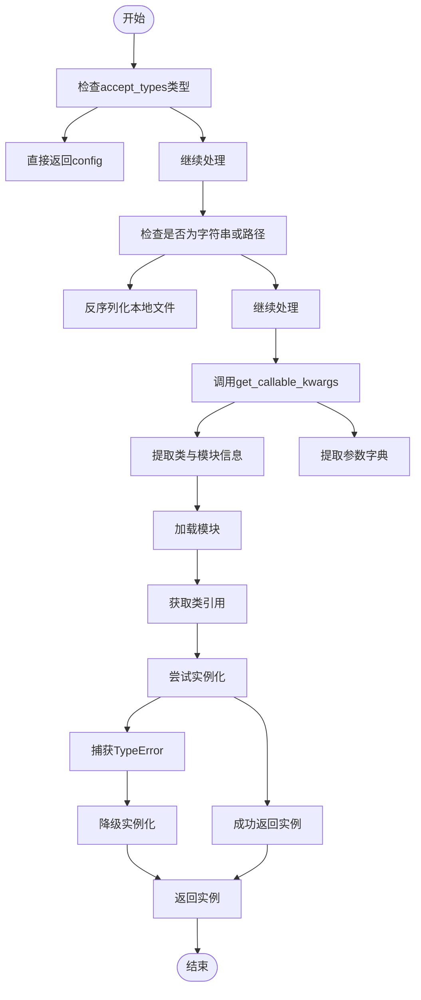
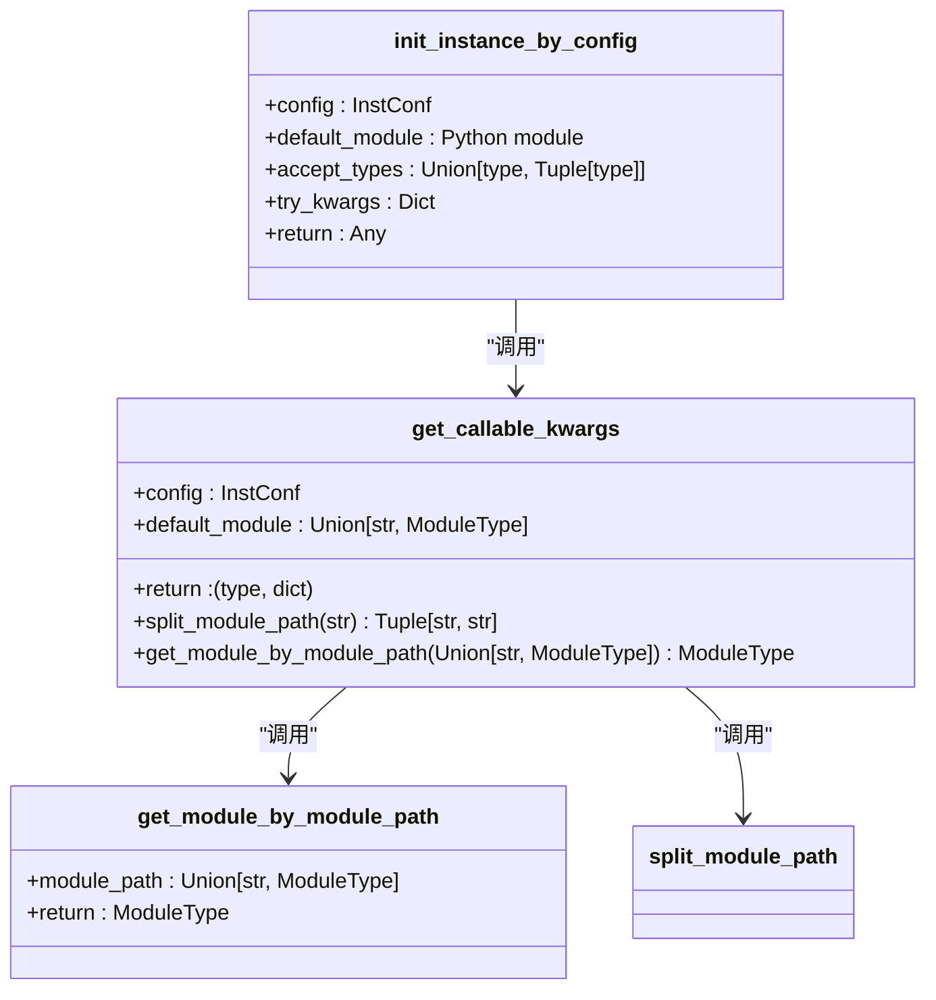
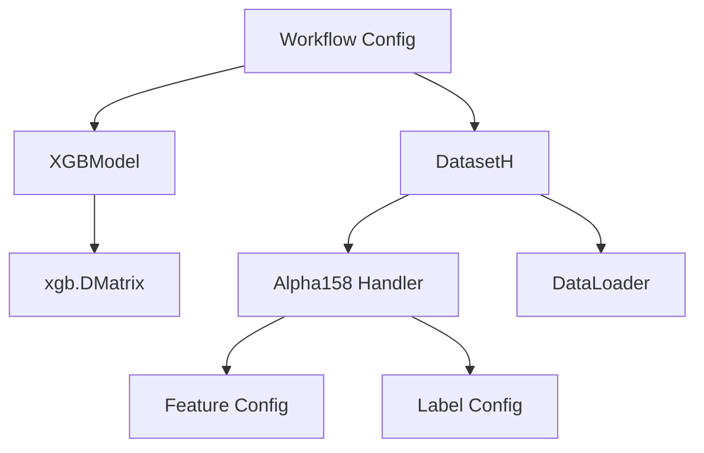

# 配置驱动的实例化机制

<cite>
**本文档引用文件**   
- [mod.py](file://qlib/utils/mod.py#L121-L183)
- [typehint.py](file://qlib/typehint.py#L0-L63)
- [workflow_config_xgboost_Alpha158.yaml](file://examples/benchmarks/XGBoost/workflow_config_xgboost_Alpha158.yaml)
- [xgboost.py](file://qlib/contrib/model/xgboost.py#L14-L84)
- [dataset.py](file://qlib/data/dataset/__init__.py#L71-L268)
- [handler.py](file://qlib/contrib/data/handler.py#L97-L151)
- [signal_strategy.py](file://qlib/contrib/strategy/signal_strategy.py#L74-L294)
- [record_temp.py](file://qlib/workflow/record_temp.py#L161-L209)
- [evaluate.py](file://qlib/contrib/evaluate.py)
</cite>

## 目录
1. [引言](#引言)
2. [核心工厂函数分析](#核心工厂函数分析)
3. [配置解析与类加载流程](#配置解析与类加载流程)
4. [多模式输入支持机制](#多模式输入支持机制)
5. [完整构建链路示例](#完整构建链路示例)
6. [兼容性处理与扩展支持](#兼容性处理与扩展支持)
7. [典型错误场景分析](#典型错误场景分析)
8. [结论](#结论)

## 引言
Qlib框架采用基于YAML配置的动态实例化架构，实现了高度灵活的组件构建能力。该机制通过`init_instance_by_config`工厂函数，将配置字典中的'class'、'module_path'、'kwargs'等字段转化为实际运行时对象，支持模型、数据集、策略等多种金融量化组件的自动化装配。这种设计不仅提升了系统可配置性，也为插件式扩展提供了坚实基础。

## 核心工厂函数分析
`init_instance_by_config`是Qlib中负责动态实例化的核心工厂函数，位于`qlib/utils/mod.py`文件中。该函数接收配置信息并返回初始化后的对象实例。



**图来源**
- [mod.py](file://qlib/utils/mod.py#L121-L183)

**本节来源**
- [mod.py](file://qlib/utils/mod.py#L121-L183)

## 配置解析与类加载流程
配置解析过程由`get_callable_kwargs`函数主导，遵循严格的优先级顺序：首先从配置字典中提取'class'或'func'键值，然后结合'module_path'或默认模块进行类定位。

当配置包含完整模块路径（如"a.b.c.ClassName"）时，系统会自动拆分模块路径和类名；若仅提供类名，则需配合'module_path'字段指定所在模块。此机制确保了跨模块组件的统一访问接口。



**图来源**
- [mod.py](file://qlib/utils/mod.py#L66-L115)
- [mod.py](file://qlib/utils/mod.py#L24-L45)
- [mod.py](file://qlib/utils/mod.py#L48-L63)

**本节来源**
- [mod.py](file://qlib/utils/mod.py#L66-L115)

## 多模式输入支持机制
该架构支持多种输入模式，极大增强了灵活性：

1. **直接对象传递**：若配置本身就是目标类型的实例，则直接返回
2. **文件协议反序列化**：支持`file://`协议读取本地pickle文件
3. **字典配置初始化**：标准的'class'+'module_path'+'kwargs'三元组模式
4. **字符串快捷方式**：支持"module.submodule.ClassName"形式的简写

特别地，对于以`file://`开头的路径，系统能正确解析网络位置标识符（netloc）和路径部分，实现相对路径与绝对路径的兼容处理。

**本节来源**
- [mod.py](file://qlib/utils/mod.py#L121-L183)
- [typehint.py](file://qlib/typehint.py#L0-L63)

## 完整构建链路示例
以`workflow_config_xgboost_Alpha158.yaml`为例，展示从配置到组件的完整构建链路：

```yaml
task:
  model:
    class: XGBModel
    module_path: qlib.contrib.model.xgboost
    kwargs:
      eval_metric: rmse
      colsample_bytree: 0.8879
  dataset:
    class: DatasetH
    module_path: qlib.data.dataset
    kwargs:
      handler:
        class: Alpha158
        module_path: qlib.contrib.data.handler
```

构建过程如下：
1. 解析任务配置 → 2. 实例化XGBModel → 3. 加载Alpha158特征处理器 → 4. 构建DatasetH数据集 → 5. 组装完整工作流

每个组件均通过`init_instance_by_config`递归创建，形成树状依赖结构。



**图来源**
- [workflow_config_xgboost_Alpha158.yaml](file://examples/benchmarks/XGBoost/workflow_config_xgboost_Alpha158.yaml)
- [xgboost.py](file://qlib/contrib/model/xgboost.py#L14-L84)
- [dataset.py](file://qlib/data/dataset/__init__.py#L71-L268)
- [handler.py](file://qlib/contrib/data/handler.py#L97-L151)

**本节来源**
- [workflow_config_xgboost_Alpha158.yaml](file://examples/benchmarks/XGBoost/workflow_config_xgboost_Alpha158.yaml)

## 兼容性处理与扩展支持
系统通过两个关键机制保障兼容性与可扩展性：

### try_kwargs机制
在实例化过程中，`try_kwargs`允许尝试传入额外参数。若引发`TypeError`（如参数冲突或不支持），则自动降级为不含`try_kwargs`的方式重新实例化。这一机制有效解决了版本迭代中的参数变更问题。

### 默认模块注入
`default_module`参数允许预设默认命名空间，当配置未明确指定`module_path`时自动补全。这为第三方插件开发提供了便利，开发者可在自有模块中定义组件而无需修改核心代码。

此外，`accept_types`参数支持白名单机制，允许特定类型对象绕过常规实例化流程，进一步增强了系统的适应能力。

**本节来源**
- [mod.py](file://qlib/utils/mod.py#L121-L183)
- [typehint.py](file://qlib/typehint.py#L0-L63)

## 典型错误场景分析
实例化失败常见于以下情形：

1. **模块导入错误**：`module_path`指向不存在的模块或拼写错误
2. **类名不匹配**：配置中的'class'字段与实际类名不符
3. **参数不匹配**：`kwargs`包含构造函数不接受的参数
4. **循环依赖**：组件间存在相互引用导致初始化阻塞
5. **权限不足**：`file://`协议访问受限文件

调试建议：
- 检查模块路径是否正确注册
- 验证类名大小写一致性
- 使用最小化配置逐步排查
- 启用详细日志输出追踪加载过程

**本节来源**
- [mod.py](file://qlib/utils/mod.py#L121-L183)
- [xgboost.py](file://qlib/contrib/model/xgboost.py#L14-L84)

## 结论
Qlib的配置驱动实例化架构通过`init_instance_by_config`工厂函数实现了强大的动态装配能力。该设计解耦了组件定义与使用，支持多模式输入、兼容性降级和插件式扩展，构成了整个框架灵活性的核心基础。深入理解这一机制有助于高效利用Qlib进行量化研究与策略开发。