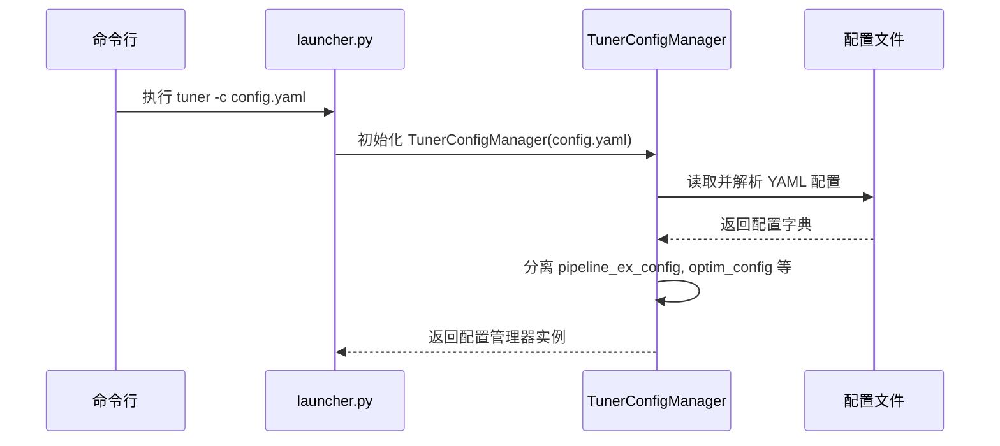
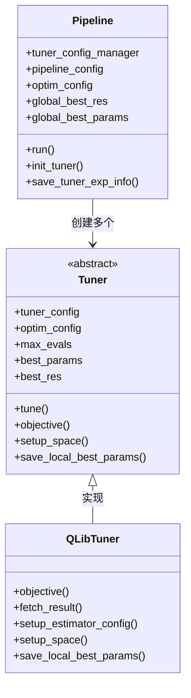
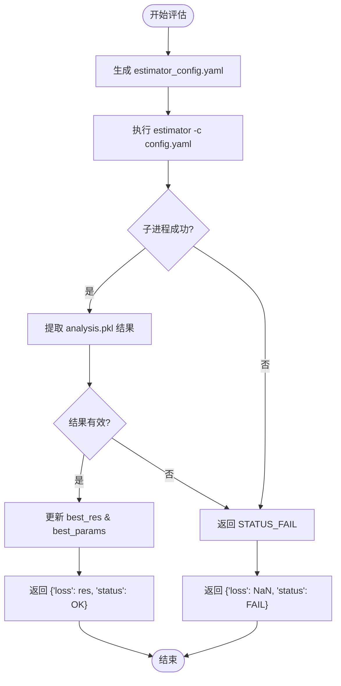

# 调参任务执行流程

<cite>
**本文档中引用的文件**
- [launcher.py](file://qlib/contrib/tuner/launcher.py)
- [pipeline.py](file://qlib/contrib/tuner/pipeline.py)
- [tuner.py](file://qlib/contrib/tuner/tuner.py)
- [config.py](file://qlib/contrib/tuner/config.py)
- [space.py](file://qlib/contrib/tuner/space.py)
- [workflow_config_lightgbm_Alpha158.yaml](file://examples/benchmarks/LightGBM/workflow_config_lightgbm_Alpha158.yaml)
</cite>

## 目录
1. [命令行入口与配置加载](#命令行入口与配置加载)
2. [调优流水线协调机制](#调优流水线协调机制)
3. [分布式执行与资源调度](#分布式执行与资源调度)
4. [端到端运行示例](#端到端运行示例)
5. [日志与结果监控](#日志与结果监控)
6. [并行评估与异常恢复](#并行评估与异常恢复)

## 命令行入口与配置加载

超参数调优任务的启动始于 `launcher.py` 文件中的命令行解析逻辑。该模块通过 `argparse` 解析 `-c` 或 `--config_path` 参数，指定YAML格式的配置文件路径。系统使用 `ruamel.yaml` 安全地加载配置内容，并由 `TunerConfigManager` 类进行统一管理。

配置管理器将原始YAML配置解析为多个结构化子配置，包括实验目录设置、优化目标、时间周期、数据源、回测参数等。其中 `experiment.dir` 指定根输出目录，`optimization_criteria` 定义优化指标（如信息比率、年化收益），而 `tuner_pipeline` 则描述多阶段调优流程的具体配置。



**图示来源**
- [launcher.py](file://qlib/contrib/tuner/launcher.py#L1-L37)
- [config.py](file://qlib/contrib/tuner/config.py#L11-L90)

**本节来源**
- [launcher.py](file://qlib/contrib/tuner/launcher.py#L1-L37)
- [config.py](file://qlib/contrib/tuner/config.py#L11-L90)

## 调优流水线协调机制

`Pipeline` 类是整个调参任务的核心协调者，负责组织多个 `Tuner` 实例按序或并行执行多阶段优化。每个 `Tuner` 对应一个独立的搜索空间和模型策略组合，适用于不同场景下的超参数探索。

在初始化时，`Pipeline` 将全局配置分解为各个 `Tuner` 所需的局部配置，并通过反射机制动态加载指定的调优器类（默认为 `QLibTuner`）。其 `run()` 方法遍历所有配置项，依次创建 `Tuner` 实例并调用 `tune()` 方法执行搜索。

每完成一轮调优，`Pipeline` 会比较当前最优结果与历史最佳，更新全局最优参数记录。最终，所有 `Tuner` 完成后，最佳参数集将被保存至 `global_best_params.json` 文件中，供后续训练使用。



**图示来源**
- [pipeline.py](file://qlib/contrib/tuner/pipeline.py#L1-L85)
- [tuner.py](file://qlib/contrib/tuner/tuner.py#L1-L215)

**本节来源**
- [pipeline.py](file://qlib/contrib/tuner/pipeline.py#L1-L85)
- [tuner.py](file://qlib/contrib/tuner/tuner.py#L1-L215)

## 分布式执行与资源调度

系统通过 `subprocess` 机制实现分布式执行支持，每个 `Tuner` 在 `objective()` 函数中启动独立的 `estimator` 子进程来评估一组超参数性能。这种设计实现了进程级隔离，确保各次评估互不干扰，便于资源分配与故障隔离。

资源调度策略主要体现在以下方面：
- **异步并行控制**：虽然默认为串行执行，但可通过外部脚本或集群工具（如Slurm）并行启动多个 `tuner` 进程。
- **磁盘缓存复用**：基于 Qlib 的数据缓存机制，多次评估共享相同数据视图，减少重复计算开销。
- **目录隔离**：每个 `Tuner` 使用独立实验目录（`estimator_experiment_{id}`），避免文件写入冲突。
- **配置热生成**：每次评估动态生成 `estimator_config.yaml`，按需注入当前参数组合，提升灵活性。

此外，`PipelineExperimentConfig` 自动创建必要的输出目录结构，确保分布式环境下路径一致性。

**本节来源**
- [tuner.py](file://qlib/contrib/tuner/tuner.py#L90-L115)
- [config.py](file://qlib/contrib/tuner/config.py#L30-L50)

## 端到端运行示例

以下是一个完整的调参作业提交命令示例：

```bash
tuner -c examples/benchmarks/LightGBM/workflow_config_lightgbm_Alpha158.yaml
```

对应的YAML配置需扩展以支持调优功能，例如添加 `experiment`, `tuner_pipeline`, 和 `optimization_criteria` 字段：

```yaml
experiment:
  name: lightgbm_tuning
  dir: ./outputs/tuner
  tuner_ex_dir: ./outputs/tuner/lightgbm
  estimator_ex_dir: ./outputs/tuner/lightgbm/estimator_experiment
  tuner_module_path: qlib.contrib.tuner.tuner
  tuner_class: QLibTuner

tuner_pipeline:
  - model:
      class: LGBModel
      module_path: qlib.contrib.model.gbdt
      space: LightGBMSpace
      kwargs:
        learning_rate: null
        num_leaves: null
    strategy:
      class: TopkDropoutStrategy
      module_path: qlib.contrib.strategy
      space: TopkAmountStrategySpace
      kwargs:
        signal: <PRED>
        topk: null
        n_drop: 5
    trainer: {...}
    dataset: {...}

optimization_criteria:
  report_type: pred_long
  report_factor: information_ratio
  optim_type: max
```

此命令将启动调优流程，在指定搜索空间内寻找使“多头预测信息比率”最大化的一组超参数。

**本节来源**
- [workflow_config_lightgbm_Alpha158.yaml](file://examples/benchmarks/LightGBM/workflow_config_lightgbm_Alpha158.yaml)
- [launcher.py](file://qlib/contrib/tuner/launcher.py#L1-L37)

## 日志与结果监控

系统提供多层次的日志输出与中间结果监控机制：
- **日志记录**：使用 `get_module_logger("Tuner")` 输出关键步骤，包括参数搜索值、子进程状态、最优结果更新等。
- **时间追踪**：`TimeInspector` 记录各阶段耗时，便于性能分析。
- **本地结果保存**：每次 `Tuner` 完成后，其最佳参数保存在 `local_best_params.json` 中。
- **全局结果汇总**：最终全局最优参数写入 `global_best_params.json`。
- **Sacred结果集成**：每个 `estimator` 子实验的结果由 Sacred 框架持久化于 `sacred/{id}/analysis.pkl`，供 `fetch_result()` 提取。

用户可通过查看日志判断当前搜索进度，结合分析文件验证优化趋势。

**本节来源**
- [tuner.py](file://qlib/contrib/tuner/tuner.py#L117-L150)
- [pipeline.py](file://qlib/contrib/tuner/pipeline.py#L70-L85)

## 并行评估时的进程隔离与异常恢复机制

系统通过以下机制保障并行评估的稳定性与容错性：
- **进程隔离**：每个参数评估通过 `subprocess.call()` 启动独立Python进程，内存与变量空间完全隔离。
- **异常捕获**：若子进程返回非零退出码，`objective()` 返回 `STATUS_FAIL`，Hyperopt 自动跳过该次评估。
- **NaN处理**：当获取的性能指标为 `NaN` 时，标记为失败状态，防止无效结果污染搜索过程。
- **状态可恢复**：由于每次评估结果独立保存，中断后可从断点继续，无需重跑已完成任务。
- **参数空间健壮性**：搜索空间定义在 `space.py` 中，支持离散选择（`hp.choice`）与连续范围，避免非法参数输入。

这些机制共同确保了大规模调参任务在复杂环境下的鲁棒运行。



**图示来源**
- [tuner.py](file://qlib/contrib/tuner/tuner.py#L90-L115)
- [space.py](file://qlib/contrib/tuner/space.py#L1-L20)

**本节来源**
- [tuner.py](file://qlib/contrib/tuner/tuner.py#L90-L115)
- [space.py](file://qlib/contrib/tuner/space.py#L1-L20)