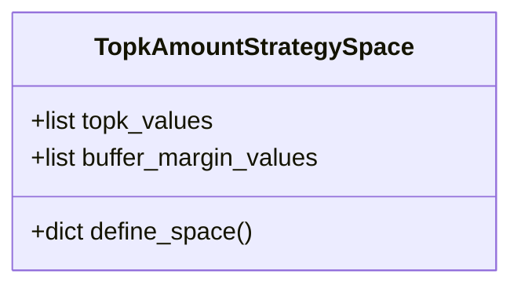
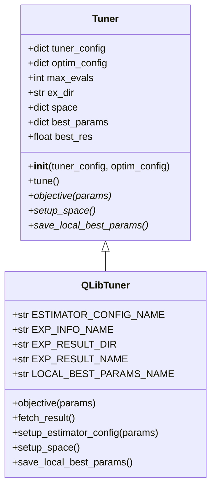
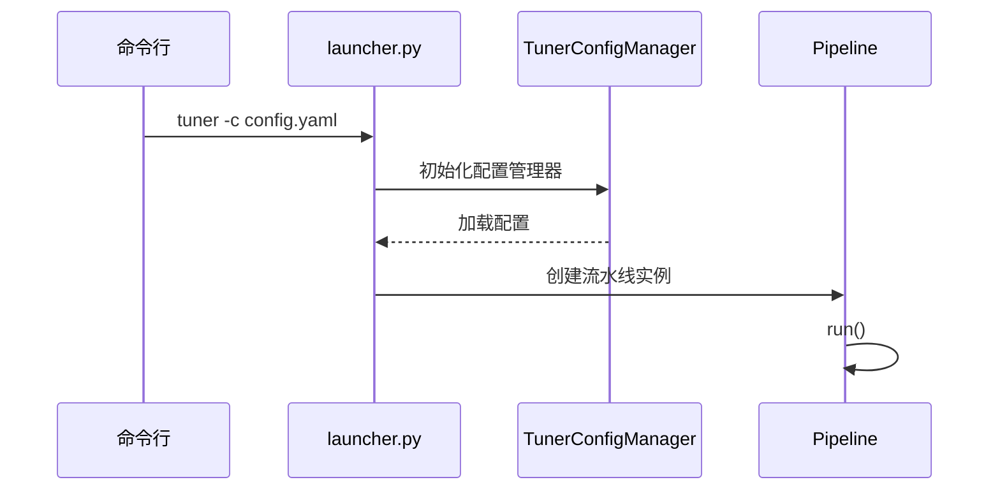

# 超参数优化

<cite>
**本文档中引用的文件**
- [hyperparameter_158.py](file://examples/hyperparameter/LightGBM/hyperparameter_158.py)
- [tuner.py](file://qlib/contrib/tuner/tuner.py)
- [space.py](file://qlib/contrib/tuner/space.py)
- [launcher.py](file://qlib/contrib/tuner/launcher.py)
- [pipeline.py](file://qlib/contrib/tuner/pipeline.py)
- [config.py](file://qlib/contrib/tuner/config.py)
</cite>

## 目录
1. [引言](#引言)
2. [搜索空间定义](#搜索空间定义)
3. [优化算法实现](#优化算法实现)
4. [任务调度机制](#任务调度机制)
5. [端到端调参示例](#端到端调参示例)
6. [结果记录与最佳模型选择](#结果记录与最佳模型选择)
7. [并行计算资源管理](#并行计算资源管理)

## 引言
Qlib提供了一套完整的超参数优化系统，用于自动化机器学习模型的参数调优过程。该系统通过模块化设计实现了搜索空间定义、优化算法执行和任务调度的分离，支持多种优化策略和复杂的实验配置。本文档将深入解析其核心组件的设计原理与使用方法。

## 搜索空间定义
Qlib的超参数搜索空间通过`space.py`模块进行定义，采用Hyperopt库提供的概率分布函数来描述参数的取值范围。系统预定义了多种常见的搜索空间模板，用户也可以根据需要自定义新的搜索空间。

### 策略参数空间
系统提供了TopkAmountStrategySpace作为示例策略参数空间，包含两个关键参数：
- **topk**: 可选值为[30, 35, 40]的离散选择
- **buffer_margin**: 可选值为[200, 250, 300]的离散选择

**图源**
- [space.py](file://qlib/contrib/tuner/space.py#L9-L12)

### 数据标签空间
QLibDataLabelSpace定义了不同的数据标签表达式供选择：
- Ref($vwap, -2)/Ref($vwap, -1) - 1
- Ref($close, -5)/$close - 1

这些预定义的空间可以通过配置文件中的"space"字段引用，实现灵活的参数组合。

**节源**
- [space.py](file://qlib/contrib/tuner/space.py#L14-L19)

## 优化算法实现
Qlib的超参数优化核心由`tuner.py`中的Tuner类及其子类QLibTuner实现，基于Hyperopt库的贝叶斯优化算法（TPE）进行参数搜索。

### 核心架构
Tuner类是一个抽象基类，定义了三个必须实现的抽象方法：
- `setup_space()`: 设置搜索空间
- `objective()`: 定义目标函数
- `save_local_best_params()`: 保存最优参数

**图源**
- [tuner.py](file://qlib/contrib/tuner/tuner.py#L40-L214)

### 目标函数执行流程
QLibTuner的objective方法实现了完整的目标函数评估流程：
1. 根据当前参数生成估算器配置文件
2. 通过子进程调用estimator命令执行模型训练
3. 获取并解析实验结果
4. 更新全局最优参数记录
5. 返回损失值和状态

该流程确保了每次参数评估都是独立且可重复的。

**节源**
- [tuner.py](file://qlib/contrib/tuner/tuner.py#L95-L122)

## 任务调度机制
Qlib的超参数优化任务调度由`launcher.py`和`pipeline.py`协同完成，形成一个完整的自动化调参流水线。

### 启动器设计
launcher.py作为命令行入口，负责：
- 解析配置文件路径参数
- 初始化TunerConfigManager配置管理器
- 启动调参流水线

**图源**
- [launcher.py](file://qlib/contrib/tuner/launcher.py#L0-L36)

### 流水线执行
Pipeline类协调多个调参任务的执行：
- 管理全局实验配置
- 初始化各个Tuner实例
- 执行参数搜索循环
- 记录全局最优结果

每个Tuner实例对应一次独立的参数搜索实验，系统会自动比较所有实验的结果，选择表现最好的参数组合。

**节源**
- [pipeline.py](file://qlib/contrib/tuner/pipeline.py#L0-L84)

## 端到端调参示例
以LightGBM模型为例，结合hyperparameter_158.py中的实际配置，说明如何定义超参数范围、设置目标指标并启动自动化调参流程。

### 配置文件结构
典型的调参配置文件包含以下部分：
- experiment: 实验基本信息
- optimization_criteria: 优化目标设置
- time_period: 时间周期配置
- data: 数据集配置
- backtest: 回测配置
- qlib_client: Qlib客户端配置
- tuner_pipeline: 调参流水线配置

### LightGBM参数空间
在hyperparameter_158.py中，LightGBM模型的超参数空间包括：
- colsample_bytree: [0.5, 1]均匀分布
- learning_rate: [0, 1]均匀分布
- subsample: [0, 1]均匀分布
- lambda_l1: [1e-8, 1e4]对数均匀分布
- lambda_l2: [1e-8, 1e4]对数均匀分布
- num_leaves: [1, 1024]整数均匀分布
- feature_fraction: [0.4, 1.0]均匀分布
- bagging_fraction: [0.4, 1.0]均匀分布
- bagging_freq: [1, 7]整数均匀分布
- min_data_in_leaf: [1, 50]整数均匀分布
- min_child_samples: [5, 100]整数均匀分布

这些参数通过Optuna框架进行优化搜索。

**节源**
- [hyperparameter_158.py](file://examples/hyperparameter/LightGBM/hyperparameter_158.py#L0-L45)

## 结果记录与最佳模型选择
Qlib的超参数优化系统提供了完善的结果记录和最佳模型选择机制。

### 结果获取流程
fetch_result方法从实验输出中提取优化目标值：
1. 读取实验信息文件(exp_info.json)
2. 根据优化类型选择相应指标
3. 处理回测分析结果(analysis.pkl)
4. 返回标准化的损失值

对于最大化目标（如信息比率），系统会将其转换为最小化问题，通过取负值实现。

### 最优参数保存
系统分两级保存最优参数：
- 局部最优：每个Tuner实例保存其搜索过程中的最佳参数
- 全局最优：Pipeline保存所有实验中的最佳参数组合

保存的参数以JSON格式存储，便于后续加载和使用。

**节源**
- [tuner.py](file://qlib/contrib/tuner/tuner.py#L124-L166)

## 并行计算资源管理
Qlib的超参数优化系统通过合理的架构设计支持并行计算，提高调参效率。

### 并行策略
系统支持两种并行模式：
- 参数评估并行：单次参数评估内部可能使用多线程
- 实验级并行：多个独立的调参实验可以并行执行

通过配置n_jobs参数，用户可以控制并行度，充分利用计算资源。

### 性能瓶颈分析
主要性能瓶颈包括：
- 模型训练时间：复杂模型的单次训练耗时较长
- I/O操作：频繁的文件读写影响整体效率
- 内存占用：多个实验同时运行可能导致内存不足

建议根据硬件资源配置合理的并行度，避免资源争用导致的性能下降。

**节源**
- [hyperparameter_158.py](file://examples/hyperparameter/LightGBM/hyperparameter_158.py#L40-L45)