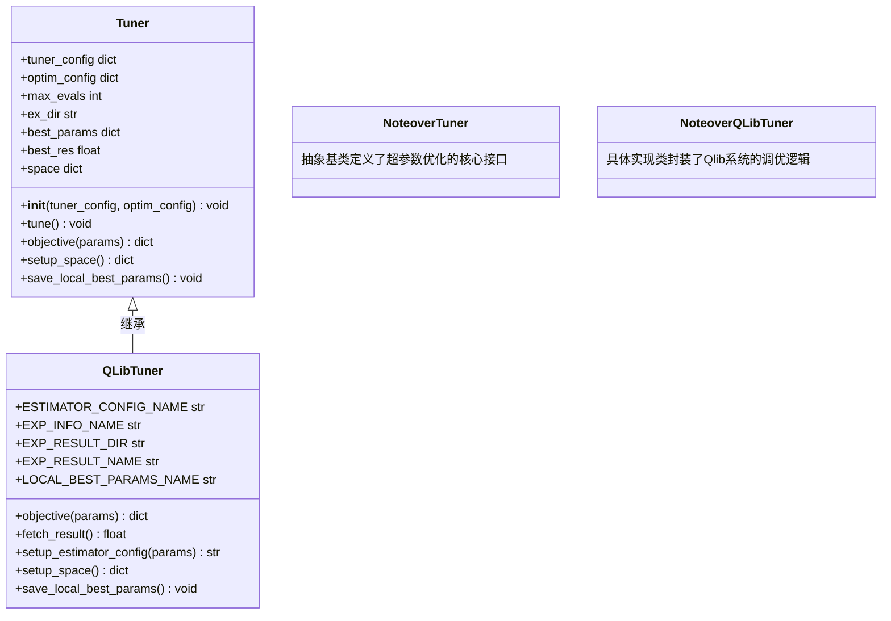
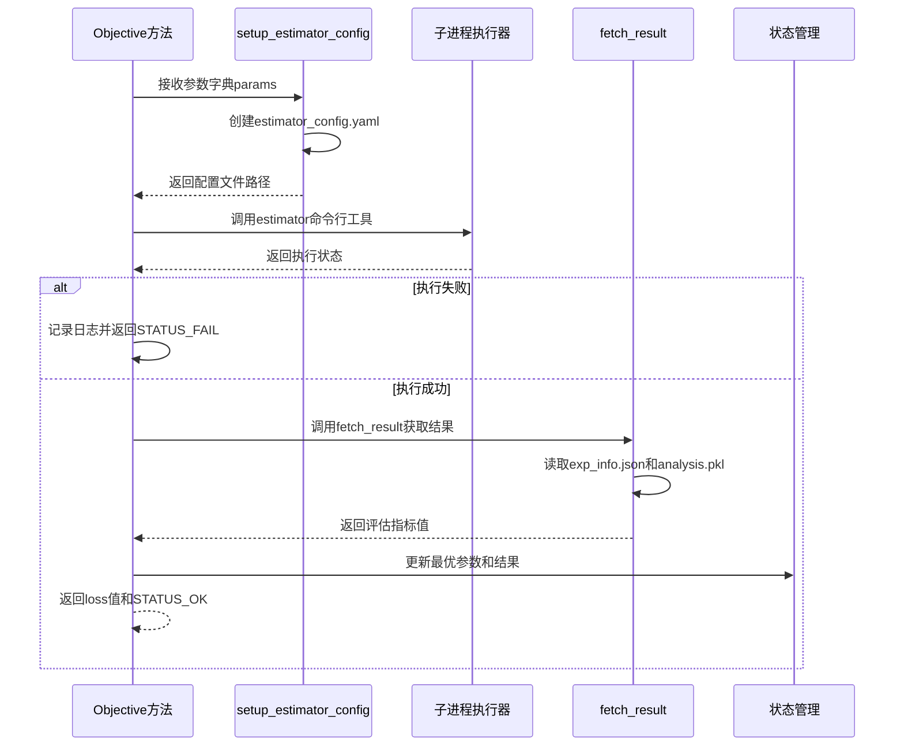
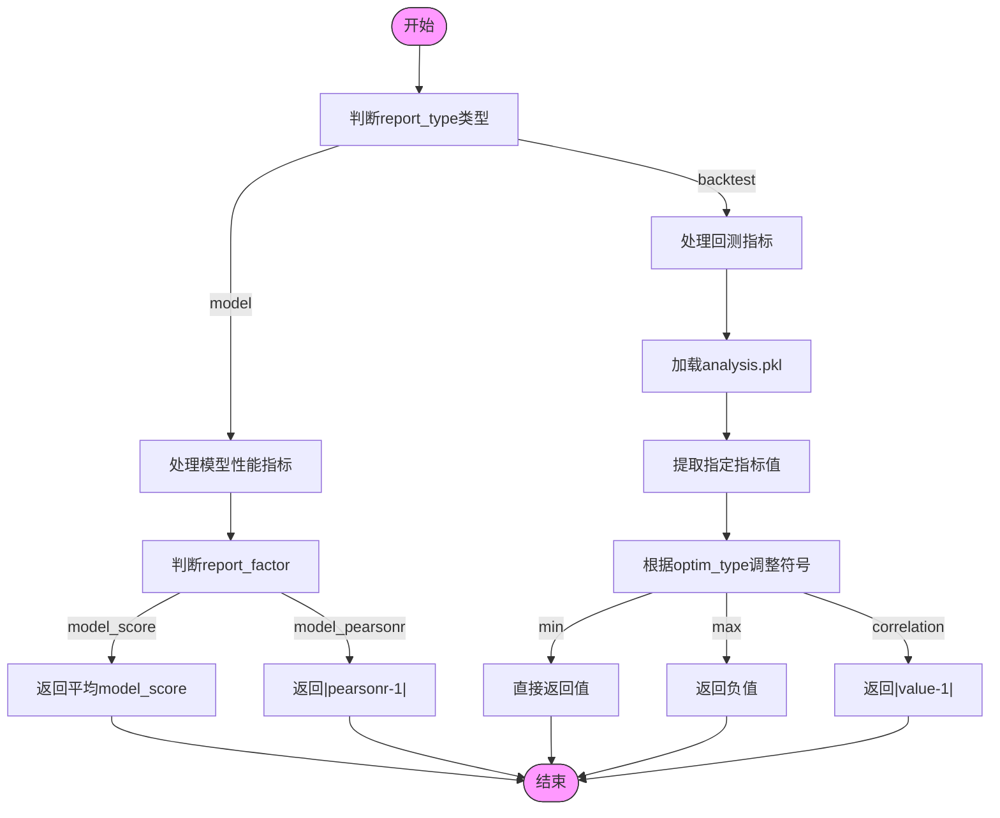
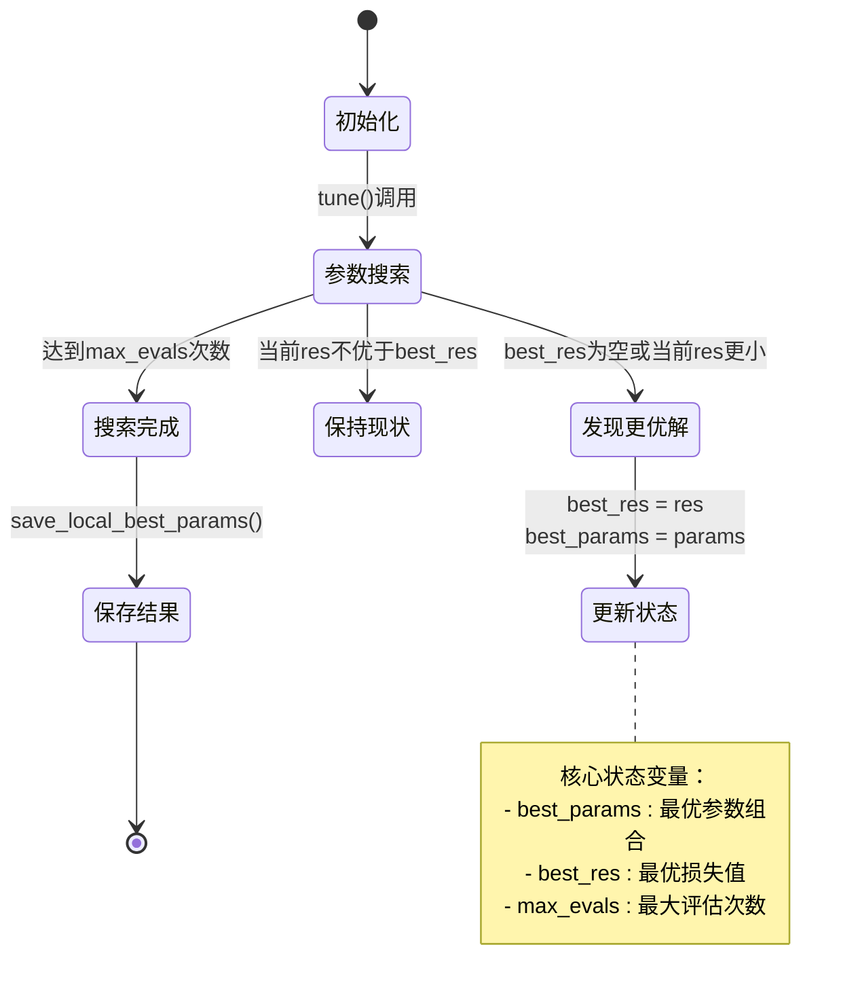
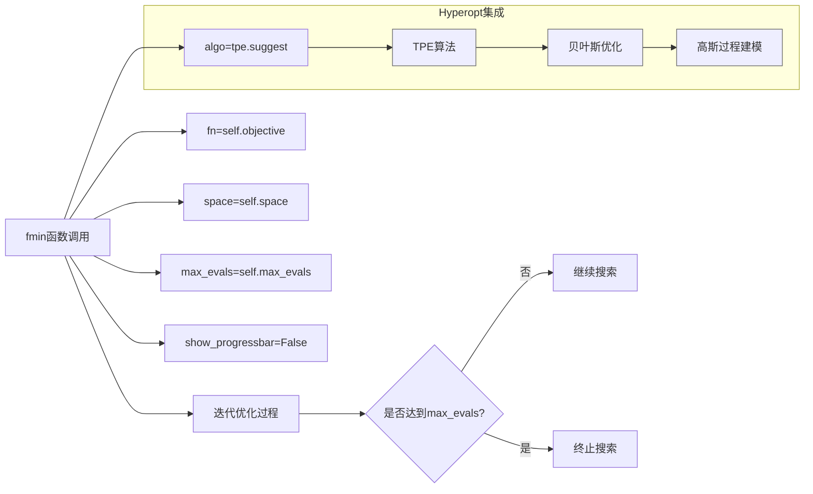
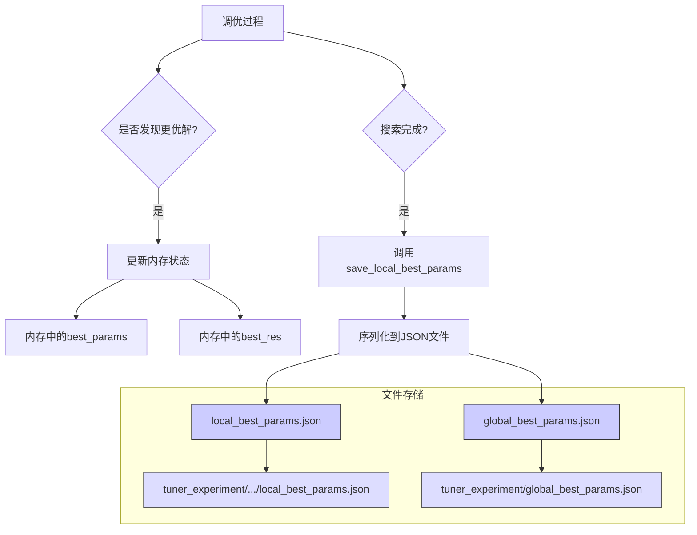

# 超参数优化引擎

<cite>
**本文档中引用的文件**
- [tuner.py](file://qlib/contrib/tuner/tuner.py)
- [config.py](file://qlib/contrib/tuner/config.py)
- [pipeline.py](file://qlib/contrib/tuner/pipeline.py)
- [space.py](file://qlib/contrib/tuner/space.py)
</cite>

## 目录
1. [引言](#引言)
2. [核心组件分析](#核心组件分析)
3. [Tuner抽象基类与继承体系](#tuner抽象基类与继承体系)
4. [Objective函数执行流程](#objective函数执行流程)
5. [评估指标计算逻辑](#评估指标计算逻辑)
6. [状态管理机制](#状态管理机制)
7. [贝叶斯优化算法集成](#贝叶斯优化算法集成)
8. [配置管理与实验目录结构](#配置管理与实验目录结构)
9. [结果持久化策略](#结果持久化策略)

## 引言
Qlib超参数优化引擎提供了一套完整的自动化调参框架，基于Hyperopt库实现贝叶斯优化搜索。该系统通过抽象基类设计支持灵活扩展，并结合配置驱动的方式管理实验流程。本文档深入分析其核心实现机制。

## 核心组件分析

**节来源**
- [tuner.py](file://qlib/contrib/tuner/tuner.py#L24-L80)
- [config.py](file://qlib/contrib/tuner/config.py#L32-L55)
- [pipeline.py](file://qlib/contrib/tuner/pipeline.py#L0-L34)

## Tuner抽象基类与继承体系



**图来源**
- [tuner.py](file://qlib/contrib/tuner/tuner.py#L24-L80)
- [tuner.py](file://qlib/contrib/tuner/tuner.py#L83-L214)

**节来源**
- [tuner.py](file://qlib/contrib/tuner/tuner.py#L24-L80)
- [tuner.py](file://qlib/contrib/tuner/tuner.py#L83-L214)

## Objective函数执行流程



**图来源**
- [tuner.py](file://qlib/contrib/tuner/tuner.py#L90-L115)

**节来源**
- [tuner.py](file://qlib/contrib/tuner/tuner.py#L90-L115)

## 评估指标计算逻辑



**图来源**
- [tuner.py](file://qlib/contrib/tuner/tuner.py#L117-L149)

**节来源**
- [tuner.py](file://qlib/contrib/tuner/tuner.py#L117-L149)
- [config.py](file://qlib/contrib/tuner/config.py#L57-L89)

## 状态管理机制



**图来源**
- [tuner.py](file://qlib/contrib/tuner/tuner.py#L25-L40)
- [tuner.py](file://qlib/contrib/tuner/tuner.py#L207-L214)

**节来源**
- [tuner.py](file://qlib/contrib/tuner/tuner.py#L25-L40)
- [tuner.py](file://qlib/contrib/tuner/tuner.py#L207-L214)

## 贝叶斯优化算法集成



**图来源**
- [tuner.py](file://qlib/contrib/tuner/tuner.py#L42-L56)

**节来源**
- [tuner.py](file://qlib/contrib/tuner/tuner.py#L42-L56)

## 配置管理与实验目录结构

```mermaid
erDiagram
CONFIG||--o{TUNER : "包含"
CONFIG||--o{PIPELINE : "包含"
CONFIG||--o{OPTIMIZATION : "包含"
TUNER }|--|| EXPERIMENT : "关联"
EXPERIMENT ||--o{ DIRECTORY : "组织"
class CONFIG{
dict config
PipelineExperimentConfig pipeline_ex_config
list pipeline_config
OptimizationConfig optim_config
}
class EXPERIMENT{
str name
str global_dir
str tuner_ex_dir
str estimator_ex_dir
}
class DIRECTORY{
str path
bool exists
}
note left of EXPERIMENT
实验目录结构：
- tuner_ex_dir: 调优实验根目录
- estimator_ex_dir: 估计器实验目录
end note
```

**图来源**
- [config.py](file://qlib/contrib/tuner/config.py#L32-L55)

**节来源**
- [config.py](file://qlib/contrib/tuner/config.py#L0-L29)
- [config.py](file://qlib/contrib/tuner/config.py#L32-L55)

## 结果持久化策略



**图来源**
- [tuner.py](file://qlib/contrib/tuner/tuner.py#L207-L214)
- [pipeline.py](file://qlib/contrib/tuner/pipeline.py#L47-L84)

**节来源**
- [tuner.py](file://qlib/contrib/tuner/tuner.py#L207-L214)
- [pipeline.py](file://qlib/contrib/tuner/pipeline.py#L47-L84)