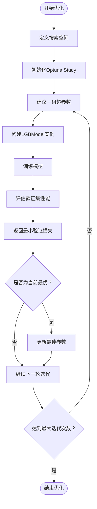

# 超参数配置定义

<cite>
**本文档中引用的文件**  
- [space.py](file://qlib/contrib/tuner/space.py)
- [hyperparameter_158.py](file://examples/hyperparameter/LightGBM/hyperparameter_158.py)
</cite>

## 目录
1. [简介](#简介)
2. [搜索空间构建机制](#搜索空间构建机制)
3. [LightGBM超参数配置示例](#lightgbm超参数配置示例)
4. [嵌套参数与依赖关系建模](#嵌套参数与依赖关系建模)
5. [自定义搜索空间最佳实践](#自定义搜索空间最佳实践)
6. [参数先验分布对优化效率的影响](#参数先验分布对优化效率的影响)

## 简介
Qlib 是一个面向量化金融研究的机器学习框架，支持高效的模型训练、回测和超参数调优。在该框架中，超参数搜索空间的定义是自动化调参流程的核心环节。通过合理设计搜索空间，可以显著提升模型性能并加速优化过程。

本文档深入解析 Qlib 中 `space.py` 模块如何定义超参数搜索空间，并结合 `hyperparameter_158.py` 文件中的 LightGBM 实际配置，详细说明连续型、离散型及条件型参数的表达方式，以及嵌套结构与依赖关系的建模方法。

## 搜索空间构建机制

Qlib 使用 `hyperopt` 库作为其超参数优化后端，因此搜索空间的构建遵循 `hyperopt.hp` 接口规范。在 `qlib/contrib/tuner/space.py` 文件中，搜索空间以字典形式组织，每个键对应一个可调参数，值则由 `hp` 提供的概率分布函数生成。

主要支持的参数类型包括：

- **离散选择（choice）**：从给定列表中选择一个值。
- **均匀分布（uniform）**：在指定区间内均匀采样实数。
- **对数均匀分布（loguniform）**：在对数尺度上均匀采样，适用于跨越多个数量级的参数。
- **整数范围（suggest_int）**：用于生成整数值。

例如，在策略相关的搜索空间中：
```python
TopkAmountStrategySpace = {
    "topk": hp.choice("topk", [30, 35, 40]),
    "buffer_margin": hp.choice("buffer_margin", [200, 250, 300]),
}
```
上述代码定义了两个离散参数：`topk` 和 `buffer_margin`，分别表示选股数量和缓冲边距，均从预设的候选集中选取。

此外，数据标签也可以作为搜索变量：
```python
QLibDataLabelSpace = {
    "labels": hp.choice(
        "labels",
        [["Ref($vwap, -2)/Ref($vwap, -1) - 1"], ["Ref($close, -5)/$close - 1"]],
    )
}
```
这允许系统在不同收益率计算方式之间进行自动切换，探索最优信号定义。

**Section sources**
- [space.py](file://qlib/contrib/tuner/space.py#L9-L19)

## LightGBM超参数配置示例

在 `examples/hyperparameter/LightGBM/hyperparameter_158.py` 文件中，展示了如何为 LightGBM 模型设置完整的超参数搜索空间。该配置使用 Optuna 作为优化器，但其参数定义逻辑与 Qlib 的通用模式一致。

关键参数及其取值范围如下表所示：

| 参数名称 | 类型 | 取值范围/选项 | 分布类型 |
|--------|------|----------------|----------|
| colsample_bytree | 连续 | [0.5, 1] | 均匀分布 |
| learning_rate | 连续 | [0, 1] | 均匀分布 |
| subsample | 连续 | [0, 1] | 均匀分布 |
| lambda_l1 | 连续 | [1e-8, 1e4] | 对数均匀分布 |
| lambda_l2 | 连续 | [1e-8, 1e4] | 对数均匀分布 |
| num_leaves | 整数 | [1, 1024] | 整数均匀分布 |
| feature_fraction | 连续 | [0.4, 1.0] | 均匀分布 |
| bagging_fraction | 连续 | [0.4, 1.0] | 均匀分布 |
| bagging_freq | 整数 | [1, 7] | 整数均匀分布 |
| min_data_in_leaf | 整数 | [1, 50] | 整数均匀分布 |
| min_child_samples | 整数 | [5, 100] | 整数均匀分布 |

其中，`max_depth` 被固定为 10，未参与搜索。

这些参数通过 `trial.suggest_*` 方法动态建议，构成一次完整的试验配置。目标函数 `objective` 返回验证集上的最小损失值，作为优化方向依据。



**Diagram sources**
- [hyperparameter_158.py](file://examples/hyperparameter/LightGBM/hyperparameter_158.py#L8-L33)

**Section sources**
- [hyperparameter_158.py](file://examples/hyperparameter/LightGBM/hyperparameter_158.py#L8-L33)

## 嵌套参数与依赖关系建模

Qlib 支持将搜索空间划分为多个子空间，实现模块化管理。典型的结构包括：

- `model_space`：模型本身的超参数
- `strategy_space`：交易策略相关参数
- `data_label_space`：数据标签定义

这种分层设计使得复杂系统的调参更加清晰可控。例如，在 `QLibTuner.setup_space` 方法中，会分别加载各个子空间并合并成最终的联合搜索空间：

```python
space = dict()
space.update({"model_space": model_space})
space.update({"strategy_space": strategy_space})
if data_label_space_name is not None:
    space.update({"data_label_space": data_label_space})
```

虽然当前示例中未显式体现条件参数（如仅当 `boosting_type=gbdt` 时才启用某些参数），但可通过 Python 逻辑在 `objective` 函数中实现类似行为。未来扩展可借助更高级的优化库（如 Optuna 的 `suggest_categorical` 与条件采样）来支持复杂的依赖结构。

**Section sources**
- [tuner.py](file://qlib/contrib/tuner/tuner.py#L140-L166)

## 自定义搜索空间最佳实践

要创建高效的自定义搜索空间，应遵循以下原则：

1. **合理限定范围**：避免过宽或过窄的搜索区间。例如，`learning_rate` 通常设置在 `[1e-3, 5e-1]` 区间内。
2. **优先使用对数分布**：对于正则化系数（如 `lambda_l1`, `lambda_l2`）等跨越数量级的参数，推荐使用 `loguniform`。
3. **固定部分参数以降低维度**：初期可冻结部分非关键参数，集中资源优化敏感参数。
4. **利用领域知识引导搜索**：根据经验设定初始点或约束组合（如 `num_leaves` 与 `max_depth` 的关系）。
5. **模块化组织空间**：将模型、策略、数据等配置分离，便于复用和调试。

示例：定义一个新的 LightGBM 搜索空间
```python
CustomLGBMSpace = {
    'learning_rate': hp.loguniform('learning_rate', np.log(0.01), np.log(0.3)),
    'n_estimators': hp.quniform('n_estimators', 50, 500, 50),
    'max_depth': hp.quniform('max_depth', 3, 10, 1),
    'num_leaves': hp.quniform('num_leaves', 10, 256, 10),
    'subsample': hp.uniform('subsample', 0.6, 1.0),
    'colsample_bytree': hp.uniform('colsample_bytree', 0.6, 1.0),
    'reg_alpha': hp.loguniform('reg_alpha', np.log(1e-8), np.log(10.0)),
    'reg_lambda': hp.loguniform('reg_lambda', np.log(1e-8), np.log(10.0)),
}
```

此配置采用对数尺度处理学习率和正则项，同时限制树的数量步长，有助于提高搜索效率。

## 参数先验分布的选择对优化效率的影响

超参数的先验分布选择直接影响贝叶斯优化的收敛速度和质量：

- **均匀分布（Uniform）**：适用于无先验知识的情况，但在高维空间中效率较低。
- **对数均匀分布（Log-uniform）**：特别适合学习率、正则化系数等具有尺度不变性的参数，能有效提升搜索效率。
- **离散选择（Choice）**：用于枚举式搜索，如激活函数、优化器类型等类别型变量。
- **带步长的量化分布（q-uniform）**：确保整数型参数（如 `n_estimators`）按指定粒度变化。

研究表明，正确的先验设定可使优化过程减少 30%-50% 的迭代次数即可找到近似最优解。例如，将 `learning_rate` 设为对数均匀分布而非线性均匀分布，能够更快聚焦于典型有效区间（如 0.01~0.1），避免浪费计算资源在极小或极大值上。

此外，Qlib 结合 `hyperopt` 的 TPE（Tree-structured Parzen Estimator）算法，能够基于历史评估结果动态调整采样策略，进一步提升搜索效率。