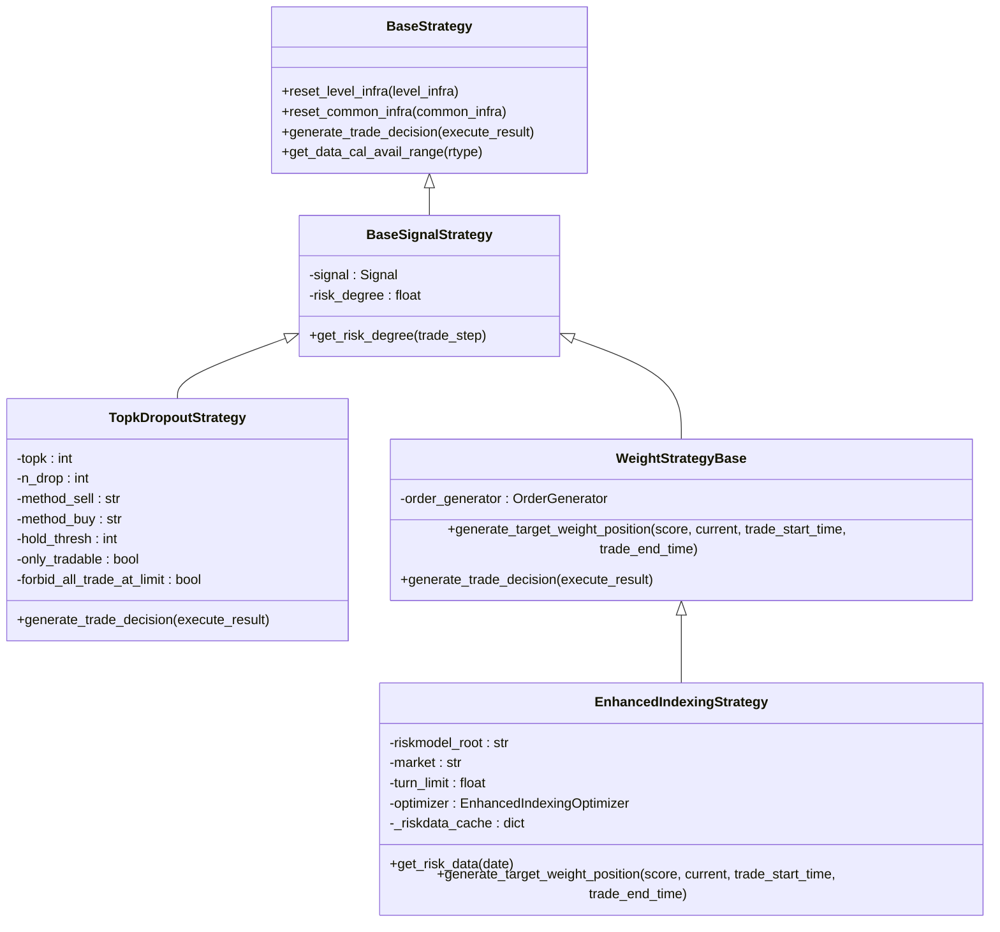
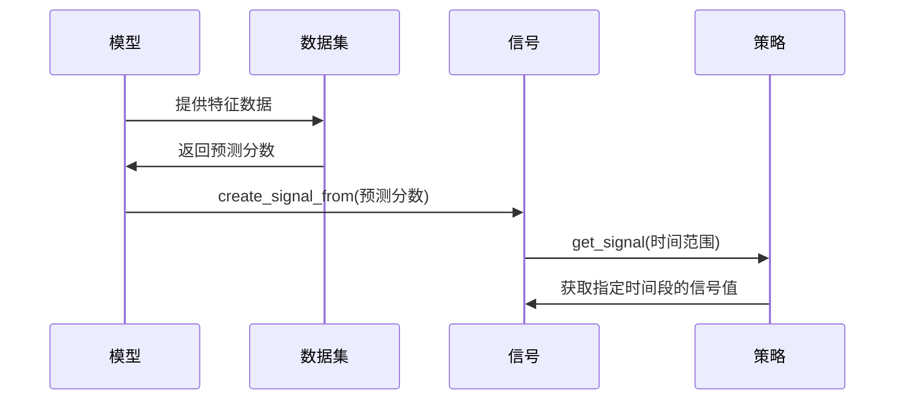
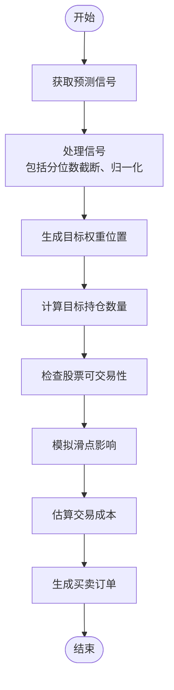
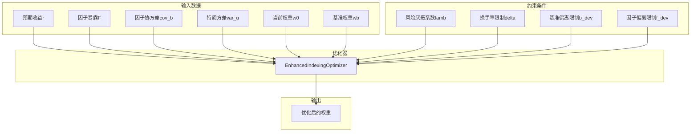
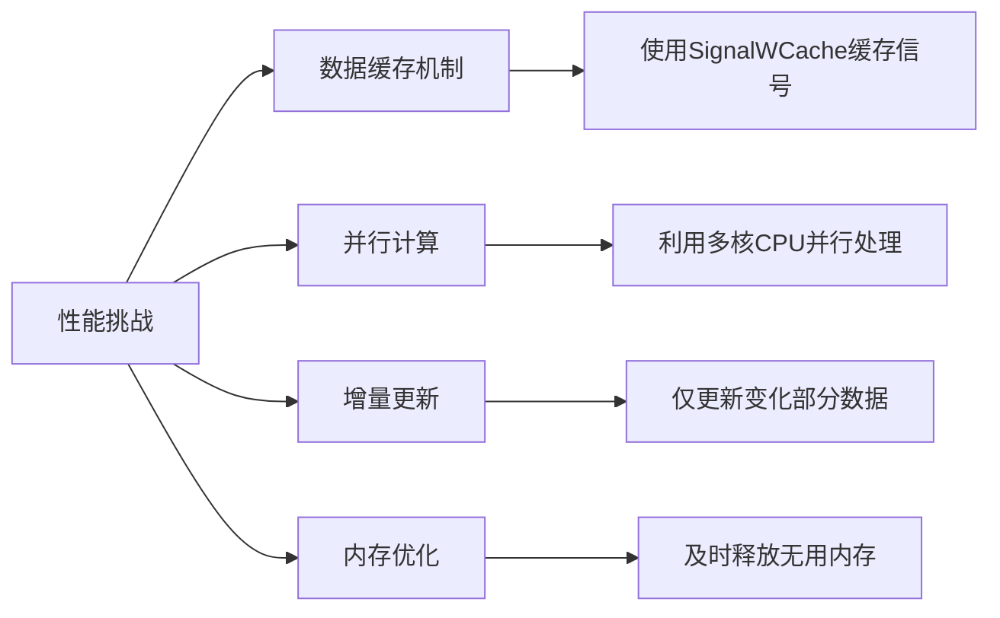

# 信号驱动策略

<cite>
**本文档引用的文件**
- [signal_strategy.py](file://qlib/contrib/strategy/signal_strategy.py)
- [order_generator.py](file://qlib/contrib/strategy/order_generator.py)
- [enhanced_indexing.py](file://qlib/contrib/strategy/optimizer/enhanced_indexing.py)
- [signal.py](file://qlib/backtest/signal.py)
- [decision.py](file://qlib/backtest/decision.py)
- [position.py](file://qlib/backtest/position.py)
- [exchange.py](file://qlib/backtest/exchange.py)
- [resam.py](file://qlib/utils/resam.py)
</cite>

## 目录
1. [引言](#引言)
2. [核心架构设计](#核心架构设计)
3. [信号生成与处理](#信号生成与处理)
4. [信号到订单的转换](#信号到订单的转换)
5. [多因子融合信号处理](#多因子融合信号处理)
6. [性能挑战与优化方案](#性能挑战与优化方案)
7. [信号稳定性检测与噪声过滤](#信号稳定性检测与噪声过滤)
8. [结论](#结论)

## 引言
信号驱动策略是一种基于模型预测得分生成可执行买卖信号的量化交易方法。该策略通过将机器学习模型的预测结果转化为具体的交易决策，实现自动化投资管理。在Qlib框架中，信号驱动策略的核心是将模型输出的预测分数经过一系列映射函数处理后，生成目标持仓权重，并最终转化为具体的买卖订单。本文档将深入探讨SignalStrategy如何将模型预测得分转化为可执行的买卖信号，分析信号映射函数的配置选项及其对交易行为的影响，以及信号到订单的完整转换过程。

## 核心架构设计

**图表来源**
- [signal_strategy.py](file://qlib/contrib/strategy/signal_strategy.py#L24-L71)
- [signal_strategy.py](file://qlib/contrib/strategy/signal_strategy.py#L74-L294)
- [signal_strategy.py](file://qlib/contrib/strategy/signal_strategy.py#L297-L371)
- [signal_strategy.py](file://qlib/contrib/strategy/signal_strategy.py#L374-L521)

**章节来源**
- [signal_strategy.py](file://qlib/contrib/strategy/signal_strategy.py#L24-L521)

## 信号生成与处理

信号驱动策略的首要任务是将模型预测得分转化为可用的交易信号。在Qlib框架中，这一过程通过`create_signal_from`函数实现，该函数能够从多种数据源创建统一的信号接口。信号可以来源于模型预测、预计算的数据序列或字典配置等多种形式。

**图表来源**
- [signal.py](file://qlib/backtest/signal.py#L87-L104)
- [signal.py](file://qlib/backtest/signal.py#L15-L32)
- [signal.py](file://qlib/backtest/signal.py#L35-L64)

**章节来源**
- [signal.py](file://qlib/backtest/signal.py#L15-L104)

信号映射函数在信号处理过程中起着关键作用，主要包括分位数截断和归一化处理等配置选项。这些处理方式直接影响交易行为：

1. **分位数截断**: 通过设定上下分位数阈值，去除极端异常值，提高信号的稳定性。
2. **归一化处理**: 将信号值标准化到特定范围（如[0,1]），便于不同模型间的信号融合和比较。
3. **缺失值处理**: 对于没有预测得分的股票，默认赋予最低分，确保组合的完整性。

这些配置选项通过影响信号分布特性，进而影响最终的投资组合构建。例如，严格的分位数截断会减少交易频率但可能错过某些机会，而宽松的处理则可能导致过度交易。

## 信号到订单的转换

信号到订单的转换过程是信号驱动策略的核心环节，涉及仓位计算、滑点模拟和交易成本估算等多个方面。该过程首先根据信号生成目标持仓权重，然后通过订单生成器将其转化为具体的买卖订单。

**图表来源**
- [exchange.py](file://qlib/backtest/exchange.py#L27-L641)
- [decision.py](file://qlib/backtest/decision.py#L36-L150)
- [position.py](file://qlib/backtest/position.py#L230-L499)

**章节来源**
- [exchange.py](file://qlib/backtest/exchange.py#L27-L641)
- [decision.py](file://qlib/backtest/decision.py#L36-L150)
- [position.py](file://qlib/backtest/position.py#L230-L499)

具体转换流程如下：
1. **仓位计算**: 根据风险度参数和当前现金量，确定可用于投资的资金比例。
2. **滑点模拟**: 考虑市场冲击成本，通过设置`impact_cost`参数来模拟实际交易中的价格偏差。
3. **交易成本估算**: 包括开仓成本(`open_cost`)和收盘成本(`close_cost`)，以及最小交易费用限制。
4. **交易单位调整**: 根据市场的交易单位要求（如A股的100股）对交易数量进行取整。

## 多因子融合信号处理

多因子融合信号处理是提升策略表现的重要手段。在EnhancedIndexingStrategy中，通过结合多个因子暴露、因子协方差和特异性风险等信息，实现更优的组合优化。

**图表来源**
- [enhanced_indexing.py](file://qlib/contrib/strategy/optimizer/enhanced_indexing.py#L15-L201)
- [signal_strategy.py](file://qlib/contrib/strategy/signal_strategy.py#L374-L521)

**章节来源**
- [enhanced_indexing.py](file://qlib/contrib/strategy/optimizer/enhanced_indexing.py#L15-L201)
- [signal_strategy.py](file://qlib/contrib/strategy/signal_strategy.py#L374-L521)

多因子融合的关键在于：
1. **风险模型集成**: 利用外部提供的风险模型数据，包括因子暴露、因子协方差矩阵和特质风险。
2. **约束条件设置**: 通过换手率限制、基准偏离限制等约束，控制组合的风险暴露。
3. **动态权重调整**: 根据市场状况动态调整各因子的权重分配，实现主动管理与被动跟踪的平衡。

## 性能挑战与优化方案

高频率信号更新带来的性能挑战主要体现在以下几个方面：

1. **数据处理延迟**: 高频信号需要快速处理大量市场数据，可能导致系统延迟。
2. **计算资源消耗**: 复杂的信号处理和组合优化算法消耗大量计算资源。
3. **内存占用**: 缓存大量历史数据和中间计算结果导致内存压力。

针对这些挑战，Qlib框架提供了以下优化方案：

**图表来源**
- [resam.py](file://qlib/utils/resam.py#L101-L205)
- [signal.py](file://qlib/backtest/signal.py#L35-L64)

**章节来源**
- [resam.py](file://qlib/utils/resam.py#L101-L205)
- [signal.py](file://qlib/backtest/signal.py#L35-L64)

具体优化措施包括：
1. **信号缓存**: 使用`SignalWCache`类缓存已计算的信号，避免重复计算。
2. **高效重采样**: 通过`resam_ts_data`函数实现高效的时序数据重采样。
3. **懒加载机制**: 延迟加载不必要的数据，减少初始加载时间。
4. **批量处理**: 将多个小任务合并为批量处理，提高处理效率。

## 信号稳定性检测与噪声过滤

信号稳定性检测与噪声过滤是确保策略稳健性的关键环节。最佳实践建议包括：

1. **移动平均平滑**: 对原始信号应用移动平均滤波，消除短期噪声。
2. **波动率调整**: 根据市场波动率动态调整信号强度，避免在高波动时期过度交易。
3. **相关性检验**: 检查新信号与现有信号的相关性，防止引入冗余信息。
4. **回测验证**: 在历史数据上充分测试信号的有效性和稳定性。

此外，还应建立完善的监控体系，实时跟踪信号的质量指标，如IC值、IR比率等，及时发现并处理异常情况。

## 结论
信号驱动策略通过系统化的架构设计，实现了从模型预测到实际交易的完整闭环。通过对信号映射函数的精细配置、多因子融合处理以及性能优化，能够有效提升策略的表现和稳定性。未来的发展方向包括更智能的噪声过滤算法、自适应的参数调整机制以及与其他AI技术的深度融合。