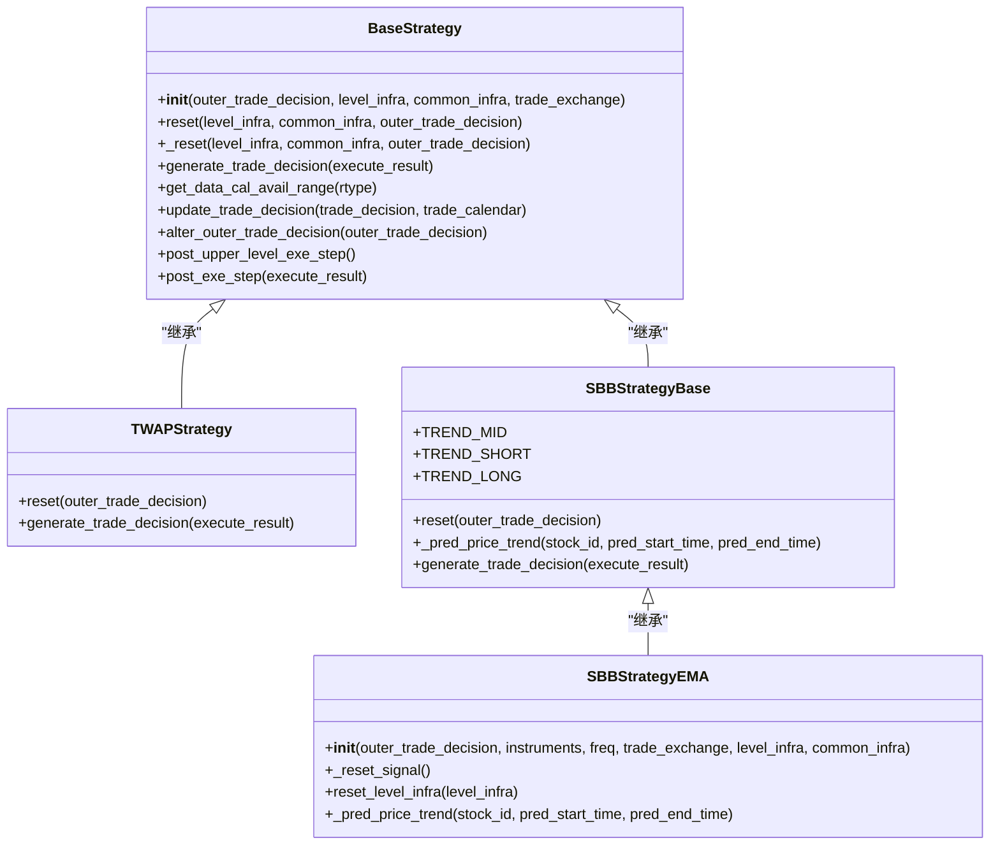
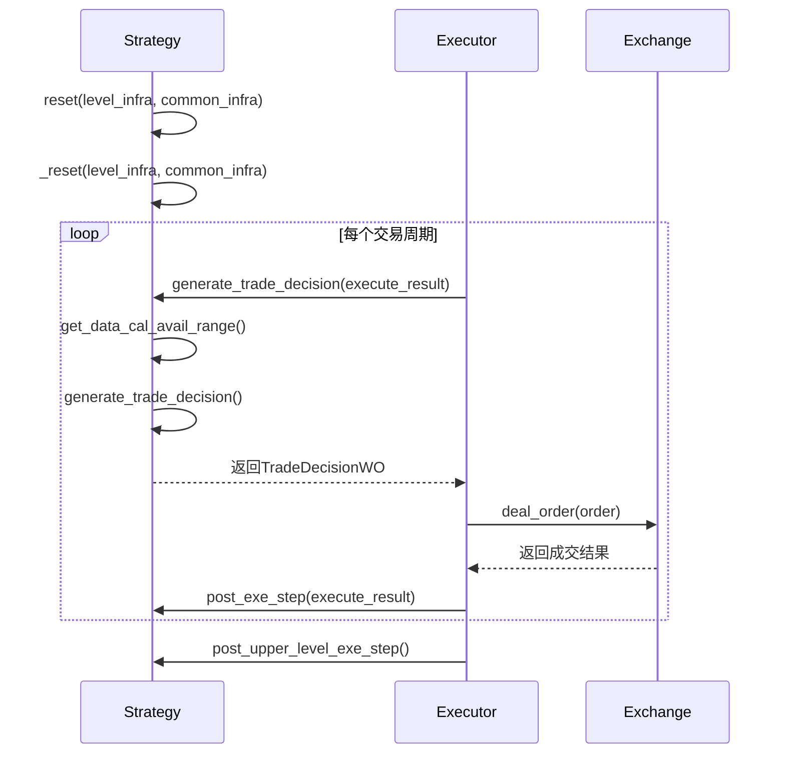
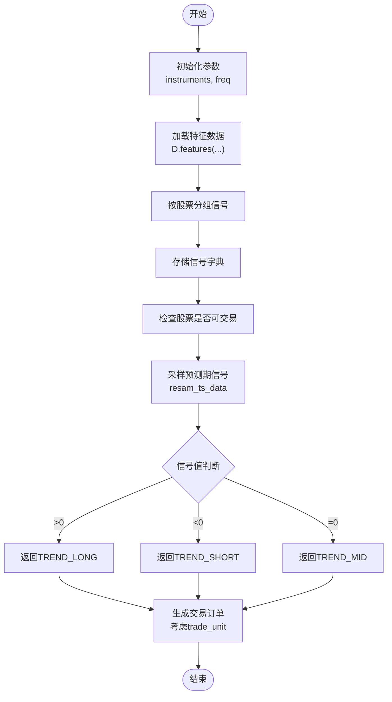

# 基础策略

<cite>
**本文档中引用的文件**  
- [base.py](file://qlib/strategy/base.py)
- [rule_strategy.py](file://qlib/contrib/strategy/rule_strategy.py)
- [backtest.py](file://qlib/backtest/backtest.py)
- [executor.py](file://qlib/backtest/executor.py)
- [decision.py](file://qlib/backtest/decision.py)
- [exchange.py](file://qlib/backtest/exchange.py)
</cite>

## 目录
1. [引言](#引言)
2. [Strategy基类设计原理](#strategy基类设计原理)
3. [关键方法调用流程](#关键方法调用流程)
4. [基于规则的策略实现](#基于规则的策略实现)
5. [策略与回测系统交互协议](#策略与回测系统交互协议)
6. [自定义策略开发示例](#自定义策略开发示例)
7. [常见错误与调试方法](#常见错误与调试方法)
8. [总结](#总结)

## 引言
Qlib框架中的策略模块为量化交易提供了灵活且可扩展的基础架构。`BaseStrategy`作为所有交易策略的公共接口，定义了策略执行的核心契约。该文档深入解析`BaseStrategy`的设计原理与实现机制，阐述其在回测系统中的核心作用，并通过具体实例展示如何基于时间规则或市场状态触发交易决策。

**Section sources**
- [base.py](file://qlib/strategy/base.py#L0-L297)

## Strategy基类设计原理
`BaseStrategy`是Qlib中所有交易策略的抽象基类，采用面向对象设计模式构建了一个统一的策略接口。该类通过依赖注入的方式获取回测所需的基础设施组件，包括交易日历、账户信息和交易所实例等。其核心设计理念是将策略逻辑与执行环境解耦，使得同一策略可以在不同频率和市场条件下复用。

该基类通过属性访问器（如`trade_calendar`、`trade_position`）提供对共享基础设施的便捷访问，同时支持在运行时动态重置这些组件。这种设计允许策略在嵌套执行场景下灵活切换上下文，例如在日频策略中嵌入分钟级拆单逻辑。



**Diagram sources**
- [base.py](file://qlib/strategy/base.py#L0-L297)
- [rule_strategy.py](file://qlib/contrib/strategy/rule_strategy.py#L21-L379)

**Section sources**
- [base.py](file://qlib/strategy/base.py#L0-L297)
- [rule_strategy.py](file://qlib/contrib/strategy/rule_strategy.py#L21-L379)

## 关键方法调用流程
`generate_trade_decision`是`BaseStrategy`中最核心的抽象方法，负责在每个交易周期生成具体的交易决策。该方法接收上一周期的执行结果作为输入参数，实现了基于反馈的闭环控制机制。当首次调用时，`execute_result`参数为`None`，表示没有历史执行信息。

策略的初始化过程通过`reset`方法完成，该方法会依次调用`_reset`来更新层级基础设施和通用基础设施。这种分层设计使得外部可以独立重置特定组件而不影响其他部分。`post_exe_step`和`post_upper_level_exe_step`钩子方法则提供了在执行前后插入自定义逻辑的能力，便于实现指标收集或状态更新等功能。



**Diagram sources**
- [base.py](file://qlib/strategy/base.py#L132-L145)
- [executor.py](file://qlib/backtest/executor.py#L512-L627)
- [backtest.py](file://qlib/backtest/backtest.py#L52-L109)

**Section sources**
- [base.py](file://qlib/strategy/base.py#L132-L145)
- [executor.py](file://qlib/backtest/executor.py#L512-L627)
- [backtest.py](file://qlib/backtest/backtest.py#L52-L109)

## 基于规则的策略实现
`rule_strategy.py`文件中实现了多种基于规则的交易策略，其中`SBBStrategyEMA`展示了如何利用技术指标进行交易决策。该策略通过计算10日与20日指数移动平均线的差值（EMA($close,10)-EMA($close,20)）来判断价格趋势：正值表示长期趋势，负值表示短期趋势，零值表示中间状态。

策略在初始化时加载指定股票池的历史数据，并在每次日历重置后重新计算信号。`_pred_price_trend`方法根据预测时间段内的信号值决定交易方向，而`generate_trade_decision`则结合当前市场可交易性检查和成交量单位约束生成最终订单。这种设计确保了策略既能响应市场信号变化，又能遵守实际交易限制。



**Diagram sources**
- [rule_strategy.py](file://qlib/contrib/strategy/rule_strategy.py#L296-L379)
- [exchange.py](file://qlib/backtest/exchange.py#L27-L957)

**Section sources**
- [rule_strategy.py](file://qlib/contrib/strategy/rule_strategy.py#L296-L379)
- [exchange.py](file://qlib/backtest/exchange.py#L27-L957)

## 策略与回测系统交互协议
策略与回测系统的交互遵循严格的协议规范。`backtest_loop`函数作为顶层协调者，驱动整个回测流程的执行。它通过`collect_data_loop`生成器逐周期推进交易，每个周期内依次调用策略的`generate_trade_decision`方法和执行器的`collect_data`方法。

交易指令以`Order`对象的形式传递，包含股票代码、数量、买卖方向和时间范围等必要信息。`TradeDecisionWO`类封装了订单列表及其关联策略，实现了`BaseTradeDecision`接口。执行器在处理订单时会调用交易所的`deal_order`方法完成实际成交计算，并将结果反馈给策略用于下一周期决策。

```mermaid
erDiagram
STRATEGY ||--o{ TRADE_DECISION : "生成"
TRADE_DECISION ||--o{ ORDER : "包含"
EXECUTOR }|--|| STRATEGY : "驱动"
EXECUTOR }|--|| EXCHANGE : "委托"
EXCHANGE }|--|| ACCOUNT : "更新"
class STRATEGY {
string name
method generate_trade_decision()
}
class TRADE_DECISION {
list[Order] order_list
Strategy strategy
}
class ORDER {
string stock_id
float amount
int direction
datetime start_time
datetime end_time
}
class EXECUTOR {
method execute()
method collect_data()
}
class EXCHANGE {
method deal_order()
method is_stock_tradable()
}
class ACCOUNT {
dict position
float cash
method update_order()
}
```

**Diagram sources**
- [backtest.py](file://qlib/backtest/backtest.py#L25-L49)
- [executor.py](file://qlib/backtest/executor.py#L309-L497)
- [decision.py](file://qlib/backtest/decision.py#L546-L577)

**Section sources**
- [backtest.py](file://qlib/backtest/backtest.py#L25-L49)
- [executor.py](file://qlib/backtest/executor.py#L309-L497)
- [decision.py](file://qlib/backtest/decision.py#L546-L577)

## 自定义策略开发示例
要