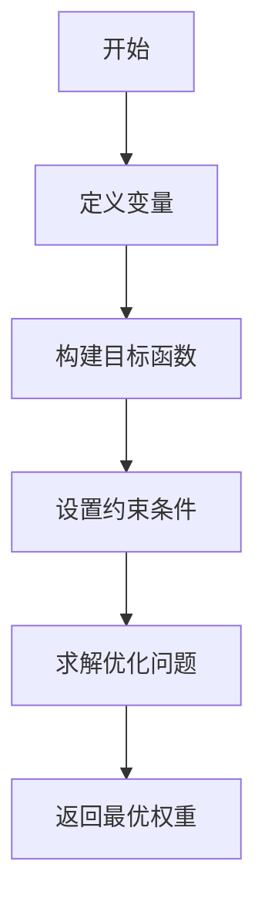
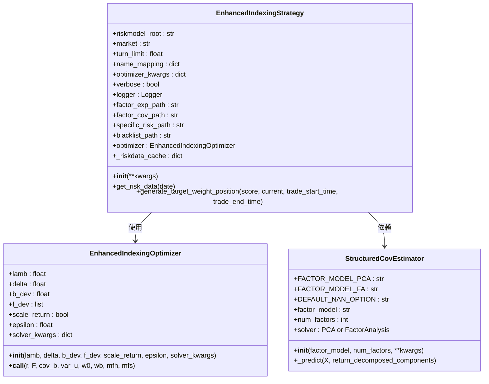
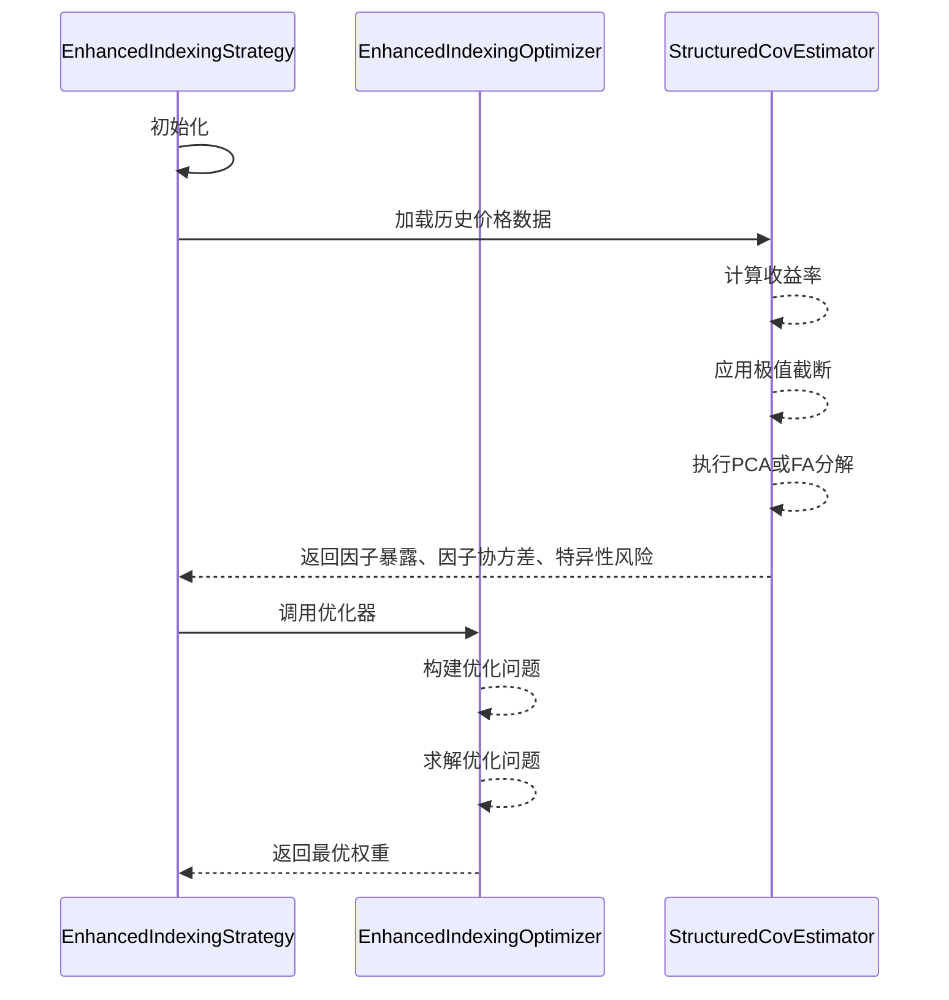

# 增强型指数跟踪策略

<cite>
**本文档中引用的文件**
- [enhanced_indexing.py](file://qlib/contrib/strategy/optimizer/enhanced_indexing.py)
- [config_enhanced_indexing.yaml](file://examples/portfolio/config_enhanced_indexing.yaml)
- [prepare_riskdata.py](file://examples/portfolio/prepare_riskdata.py)
- [signal_strategy.py](file://qlib/contrib/strategy/signal_strategy.py)
- [structured.py](file://qlib/model/riskmodel/structured.py)
</cite>

## 目录
1. [引言](#引言)
2. [核心数学模型](#核心数学模型)
3. [工程实现架构](#工程实现架构)
4. [优化器参数详解](#优化器参数详解)
5. [风险模型构建方法](#风险模型构建方法)
6. [完整配置示例](#完整配置示例)
7. [实盘稳定性保障](#实盘稳定性保障)
8. [参数敏感性分析](#参数敏感性分析)
9. [结论](#结论)

## 引言
增强型指数跟踪策略是一种结合被动管理和主动管理优势的投资方法，旨在超越基准指数（如沪深300）的收益表现，同时严格控制风险暴露（即跟踪误差）。该策略通过引入超额收益预测信号，在保持与基准指数相似的风险特征的同时，寻求获取超额回报。本策略的核心在于混合优化模型，它将跟踪误差项与Alpha收益项进行加权平衡，并通过行业暴露控制约束和动态调仓阈值机制来确保投资组合的稳定性和有效性。

## 核心数学模型
增强型指数跟踪策略的优化问题可以形式化为一个凸优化问题，其目标函数综合考虑了超额收益最大化和风险最小化两个方面。



**图源**
- [enhanced_indexing.py](file://qlib/contrib/strategy/optimizer/enhanced_indexing.py#L15-L201)

### 优化问题表述
设：
- \( w_0 \)：当前持仓权重
- \( w_b \)：基准权重
- \( r \)：预期收益向量
- \( F \)：因子暴露矩阵
- \( \Sigma_b \)：因子协方差矩阵
- \( \sigma_u^2 \)：残差方差向量（对角线）
- \( \lambda \)：风险厌恶参数
- \( \delta \)：总换手率限制
- \( b_{dev} \)：基准偏离限制
- \( f_{dev} \)：因子偏离限制

定义：
- \( d = w - w_b \)：相对于基准的权重偏离
- \( v = dF \)：因子暴露偏离

优化问题如下：
\[
\max_w  d^\top r - \lambda (v^\top \Sigma_b v + \sigma_u^2 \cdot d^2)
\]
\[
\text{s.t. } w \geq 0, \sum w_i = 1, \|w - w_0\|_1 \leq \delta, |d_i| \leq b_{dev}, |v_j| \leq f_{dev}
\]

**节源**
- [enhanced_indexing.py](file://qlib/contrib/strategy/optimizer/enhanced_indexing.py#L15-L201)

## 工程实现架构
增强型指数跟踪策略的工程实现基于Qlib框架，主要由以下几个组件构成：策略类、优化器类、风险模型和配置文件。



**图源**
- [signal_strategy.py](file://qlib/contrib/strategy/signal_strategy.py#L374-L521)
- [enhanced_indexing.py](file://qlib/contrib/strategy/optimizer/enhanced_indexing.py#L15-L201)
- [structured.py](file://qlib/model/riskmodel/structured.py#L10-L93)

### 主要组件说明
- **EnhancedIndexingStrategy**：策略主类，负责加载风险数据、处理交易信号并调用优化器生成目标仓位。
- **EnhancedIndexingOptimizer**：优化器类，实现了上述数学模型中的优化算法。
- **StructuredCovEstimator**：风险模型估计器，用于计算因子暴露、因子协方差和特异性风险。

**节源**
- [signal_strategy.py](file://qlib/contrib/strategy/signal_strategy.py#L374-L521)
- [enhanced_indexing.py](file://qlib/contrib/strategy/optimizer/enhanced_indexing.py#L15-L201)
- [structured.py](file://qlib/model/riskmodel/structured.py#L10-L93)

## 优化器参数详解
`EnhancedIndexingOptimizer` 类提供了多个可配置参数，以适应不同的投资需求和市场环境。

| 参数名 | 类型 | 默认值 | 描述 |
| --- | --- | --- | --- |
| lamb | float | 1 | 风险厌恶参数，越大表示越注重风险控制 |
| delta | float | 0.2 | 总换手率限制，控制交易成本 |
| b_dev | float | 0.01 | 基准偏离限制，控制与基准的偏离程度 |
| f_dev | list | None | 因子偏离限制，控制各因子的风险暴露 |
| scale_return | bool | True | 是否缩放收益以匹配估计的波动率 |
| epsilon | float | 5e-5 | 最小权重，低于此值的权重将被置零 |
| solver_kwargs | dict | {} | CVXPY 求解器的额外参数 |

**节源**
- [enhanced_indexing.py](file://qlib/contrib/strategy/optimizer/enhanced_indexing.py#L46-L85)

## 风险模型构建方法
风险模型是增强型指数跟踪策略的关键组成部分，它用于估计资产的协方差结构。Qlib 提供了 `StructuredCovEstimator` 类来构建统计风险模型。



**图源**
- [prepare_riskdata.py](file://examples/portfolio/prepare_riskdata.py#L10-L52)
- [structured.py](file://qlib/model/riskmodel/structured.py#L68-L93)

### 构建步骤
1. 收集指定时间段内的股票收盘价数据。
2. 计算每日收益率，并对极端值进行截断处理。
3. 使用主成分分析（PCA）或因子分析（FA）方法分解收益率矩阵。
4. 保存因子暴露、因子协方差和特异性风险到指定目录。

**节源**
- [prepare_riskdata.py](file://examples/portfolio/prepare_riskdata.py#L10-L52)
- [structured.py](file://qlib/model/riskmodel/structured.py#L68-L93)

## 完整配置示例
以下是一个完整的配置文件示例，展示了如何在 Qlib 中配置增强型指数跟踪策略。

```yaml
qlib_init:
    provider_uri: "~/.qlib/qlib_data/cn_data"
    region: cn
market: &market csi300
benchmark: &benchmark SH000300
data_handler_config: &data_handler_config
    start_time: 2008-01-01
    end_time: 2020-08-01
    fit_start_time: 2008-01-01
    fit_end_time: 2014-12-31
    instruments: *market
port_analysis_config: &port_analysis_config
    strategy:
        class: EnhancedIndexingStrategy
        module_path: qlib.contrib.strategy
        kwargs:
            model: <MODEL>
            dataset: <DATASET>
            riskmodel_root: ./riskdata
    backtest:
        start_time: 2017-01-01
        end_time: 2020-08-01
        account: 100000000
        benchmark: *benchmark
        exchange_kwargs:
            limit_threshold: 0.095
            deal_price: close
            open_cost: 0.0005
            close_cost: 0.0015
            min_cost: 5
task:
    model:
        class: LGBModel
        module_path: qlib.contrib.model.gbdt
        kwargs:
            loss: mse
            colsample_bytree: 0.8879
            learning_rate: 0.2
            subsample: 0.8789
            lambda_l1: 205.6999
            lambda_l2: 580.9768
            max_depth: 8
            num_leaves: 210
            num_threads: 20
    dataset:
        class: DatasetH
        module_path: qlib.data.dataset
        kwargs:
            handler:
                class: Alpha158
                module_path: qlib.contrib.data.handler
                kwargs: *data_handler_config
            segments:
                train: [2008-01-01, 2014-12-31]
                valid: [2015-01-01, 2016-12-31]
                test: [2017-01-01, 2020-08-01]
    record:
        - class: SignalRecord
          module_path: qlib.workflow.record_temp
          kwargs:
            model: <MODEL>
            dataset: <DATASET>
        - class: SigAnaRecord
          module_path: qlib.workflow.record_temp
          kwargs:
            ana_long_short: False
            ann_scaler: 252
        - class: PortAnaRecord
          module_path: qlib.workflow.record_temp
          kwargs:
            config: *port_analysis_config
```

**节源**
- [config_enhanced_indexing.yaml](file://examples/portfolio/config_enhanced_indexing.yaml#L1-L71)

## 实盘稳定性保障
为了确保增强型指数跟踪策略在实盘环境中的稳定性，采取了以下措施：

1. **多阶段优化尝试**：当包含所有约束的优化失败时，系统会尝试移除换手率约束再次求解，以提高优化成功率。
2. **热启动**：使用基准权重作为初始值，加快求解速度并提高收敛性。
3. **异常处理**：对优化失败的情况进行日志记录，并返回当前持仓权重作为默认值。
4. **数据缓存**：对风险数据进行缓存，避免重复加载，提高运行效率。
5. **强制持有/卖出**：根据流动性情况和黑名单信息，设置强制持有或卖出的股票。

**节源**
- [enhanced_indexing.py](file://qlib/contrib/strategy/optimizer/enhanced_indexing.py#L150-L190)
- [signal_strategy.py](file://qlib/contrib/strategy/signal_strategy.py#L461-L521)

## 参数敏感性分析
对关键参数进行敏感性分析有助于理解策略的行为和鲁棒性。

| 参数 | 敏感性分析方法 | 预期影响 |
| --- | --- | --- |
| lamb | 在 [0.1, 10] 范围内变化 | lamb 越大，组合风险越低，但可能牺牲部分收益 |
| delta | 在 [0.05, 0.5] 范围内变化 | delta 越小，换手率越低，交易成本越少，但可能错过机会 |
| b_dev | 在 [0.005, 0.05] 范围内变化 | b_dev 越小，组合越接近基准，跟踪误差越小 |
| f_dev | 对不同因子设置不同限制 | 控制特定因子的风险暴露，如行业、风格等 |

建议通过回测实验确定最优参数组合，并定期重新校准参数以适应市场变化。

**节源**
- [enhanced_indexing.py](file://qlib/contrib/strategy/optimizer/enhanced_indexing.py#L46-L85)

## 结论
增强型指数跟踪策略通过结合超额收益预测和风险控制，提供了一种有效的投资方法。其核心在于精心设计的混合优化模型，能够在追求超额收益的同时，有效管理风险。通过合理的参数配置和稳健的工程实现，该策略可以在实盘环境中表现出良好的稳定性和盈利能力。未来的工作可以探索更复杂的因子模型、动态参数调整机制以及与其他策略的集成。