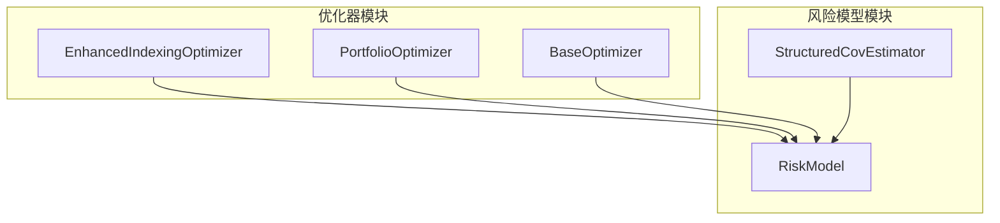
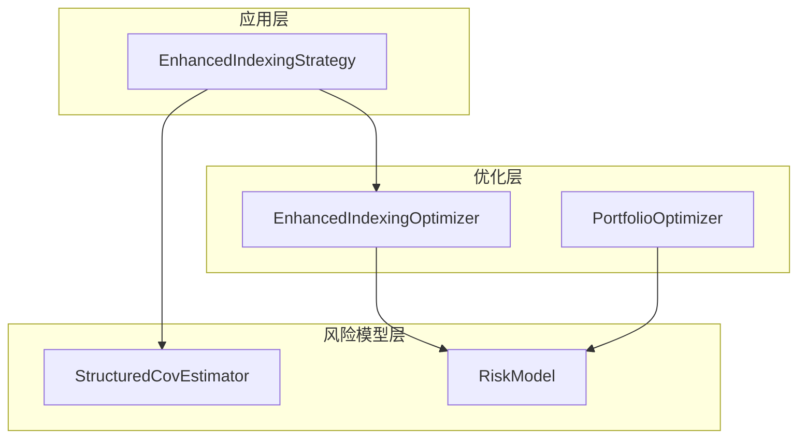
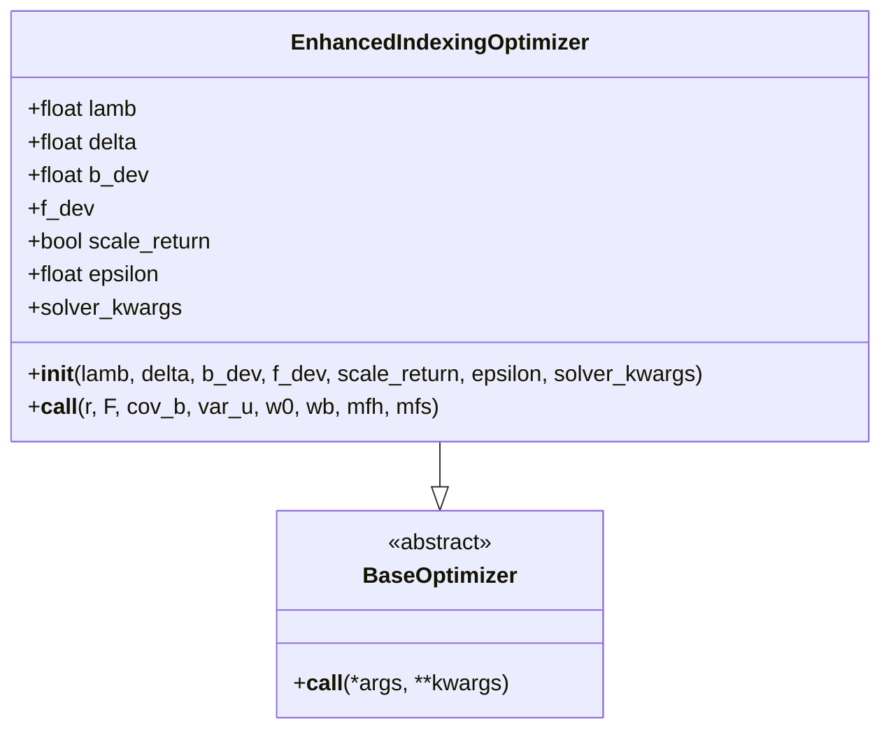
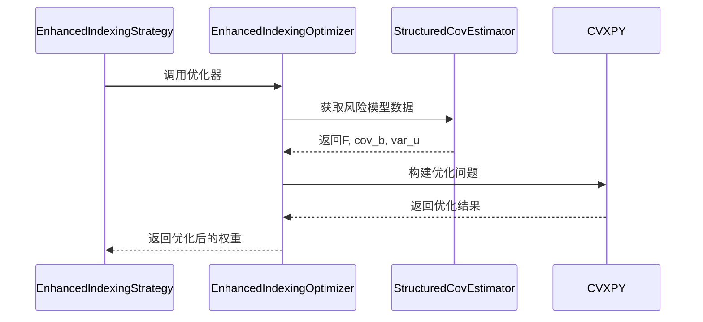
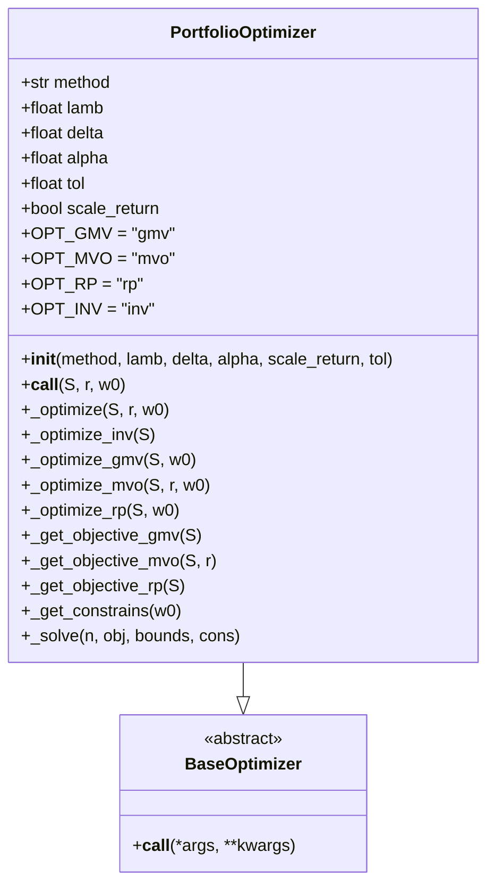
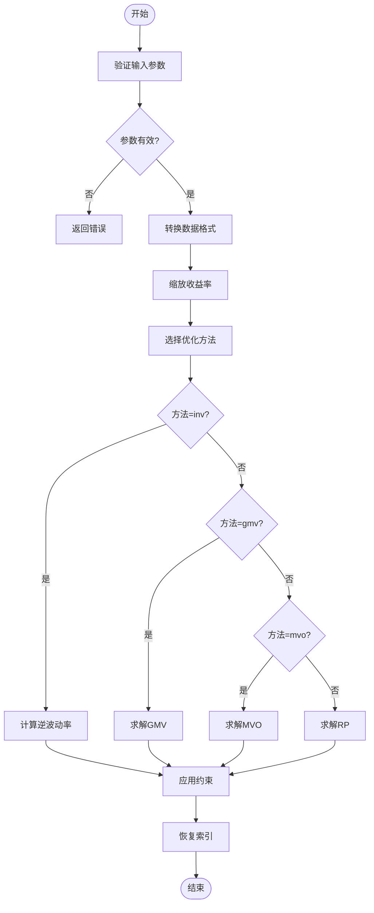
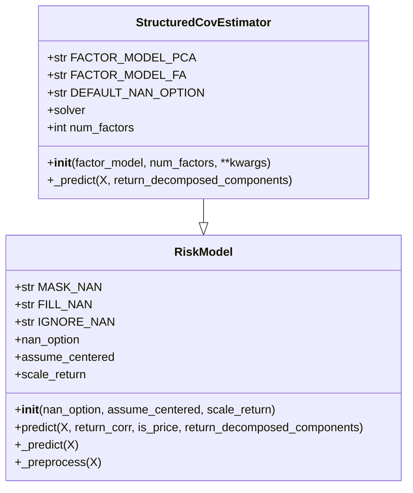
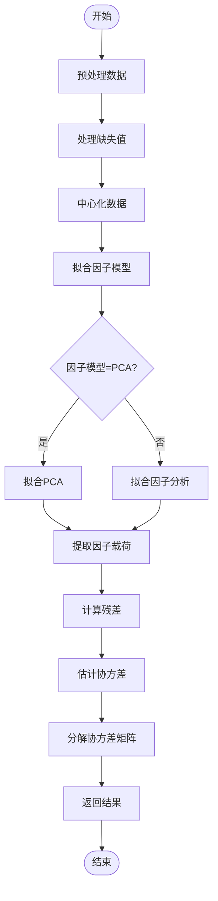

# 投资组合优化

<cite>
**本文档中引用的文件**
- [enhanced_indexing.py](file://qlib/contrib/strategy/optimizer/enhanced_indexing.py)
- [optimizer.py](file://qlib/contrib/strategy/optimizer/optimizer.py)
- [base.py](file://qlib/contrib/strategy/optimizer/base.py)
- [structured.py](file://qlib/model/riskmodel/structured.py)
- [base.py](file://qlib/model/riskmodel/base.py)
- [prepare_riskdata.py](file://examples/portfolio/prepare_riskdata.py)
- [config_enhanced_indexing.yaml](file://examples/portfolio/config_enhanced_indexing.yaml)
- [signal_strategy.py](file://qlib/contrib/strategy/signal_strategy.py)
</cite>

## 目录
1. [简介](#简介)
2. [项目结构](#项目结构)
3. [核心组件](#核心组件)
4. [架构概述](#架构概述)
5. [详细组件分析](#详细组件分析)
6. [依赖关系分析](#依赖关系分析)
7. [性能考量](#性能考量)
8. [故障排除指南](#故障排除指南)
9. [结论](#结论)

## 简介
本文档系统性地介绍了Qlib中的投资组合优化框架，重点剖析了增强型指数跟踪（Enhanced Indexing）策略的数学模型与工程实现。文档涵盖了目标函数构建、约束条件设置、求解器选择、优化任务调度机制、风险预算分配算法等内容，并通过实例演示如何配置优化参数并集成外部风险模型。

## 项目结构
Qlib的投资组合优化功能主要分布在`contrib/strategy/optimizer`和`model/riskmodel`两个模块中。优化器相关代码位于`contrib/strategy/optimizer`目录下，而风险模型实现则位于`model/riskmodel`目录中。

**图示来源**
- [enhanced_indexing.py](file://qlib/contrib/strategy/optimizer/enhanced_indexing.py)
- [optimizer.py](file://qlib/contrib/strategy/optimizer/optimizer.py)
- [structured.py](file://qlib/model/riskmodel/structured.py)

**章节来源**
- [enhanced_indexing.py](file://qlib/contrib/strategy/optimizer/enhanced_indexing.py)
- [optimizer.py](file://qlib/contrib/strategy/optimizer/optimizer.py)

## 核心组件
Qlib的投资组合优化框架由多个核心组件构成，包括增强型指数跟踪优化器、通用投资组合优化器、基础优化器抽象类以及结构化风险模型等。这些组件共同实现了复杂的投资组合优化功能。

**章节来源**
- [enhanced_indexing.py](file://qlib/contrib/strategy/optimizer/enhanced_indexing.py#L15-L201)
- [optimizer.py](file://qlib/contrib/strategy/optimizer/optimizer.py#L13-L264)
- [structured.py](file://qlib/model/riskmodel/structured.py#L10-L93)

## 架构概述
Qlib的投资组合优化架构采用分层设计，上层为具体的优化策略，中层为优化器实现，底层为风险模型支持。这种架构使得不同的优化策略可以共享相同的风险模型和优化基础设施。

**图示来源**
- [signal_strategy.py](file://qlib/contrib/strategy/signal_strategy.py#L358-L433)
- [enhanced_indexing.py](file://qlib/contrib/strategy/optimizer/enhanced_indexing.py)
- [structured.py](file://qlib/model/riskmodel/structured.py)

## 详细组件分析

### 增强型指数跟踪优化器分析
增强型指数跟踪优化器实现了在控制跟踪误差的同时追求超额收益的投资组合优化目标。该优化器通过多轮优化尝试确保求解的鲁棒性。

#### 对象导向组件：

**图示来源**
- [enhanced_indexing.py](file://qlib/contrib/strategy/optimizer/enhanced_indexing.py#L15-L201)
- [base.py](file://qlib/contrib/strategy/optimizer/base.py#L6-L11)

#### API服务组件：

**图示来源**
- [enhanced_indexing.py](file://qlib/contrib/strategy/optimizer/enhanced_indexing.py#L87-L201)
- [signal_strategy.py](file://qlib/contrib/strategy/signal_strategy.py#L392-L433)

**章节来源**
- [enhanced_indexing.py](file://qlib/contrib/strategy/optimizer/enhanced_indexing.py#L46-L201)

### 通用投资组合优化器分析
通用投资组合优化器支持多种经典的投资组合优化方法，包括全局最小方差、均值-方差优化、风险平价和逆波动率等。

#### 对象导向组件：

**图示来源**
- [optimizer.py](file://qlib/contrib/strategy/optimizer/optimizer.py#L13-L264)
- [base.py](file://qlib/contrib/strategy/optimizer/base.py#L6-L11)

#### 复杂逻辑组件：

**图示来源**
- [optimizer.py](file://qlib/contrib/strategy/optimizer/optimizer.py#L64-L111)
- [optimizer.py](file://qlib/contrib/strategy/optimizer/optimizer.py#L113-L136)

**章节来源**
- [optimizer.py](file://qlib/contrib/strategy/optimizer/optimizer.py#L31-L264)

### 结构化风险模型分析
结构化风险模型基于因子分解理论估计协方差矩阵，支持主成分分析(PCA)和因子分析(FA)两种潜在因子模型。

#### 对象导向组件：

**图示来源**
- [structured.py](file://qlib/model/riskmodel/structured.py#L10-L93)
- [base.py](file://qlib/model/riskmodel/base.py#L6-L147)

#### 复杂逻辑组件：

**图示来源**
- [structured.py](file://qlib/model/riskmodel/structured.py#L68-L93)
- [base.py](file://qlib/model/riskmodel/base.py#L120-L147)

**章节来源**
- [structured