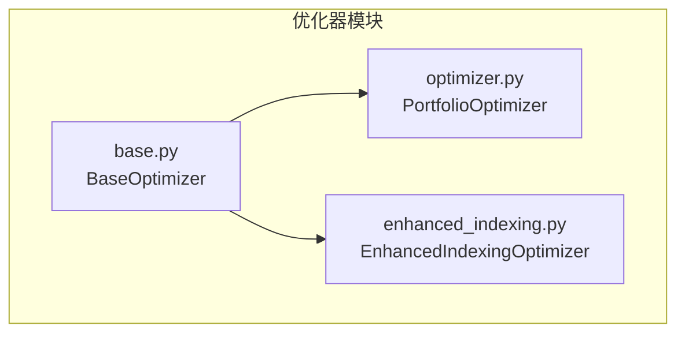
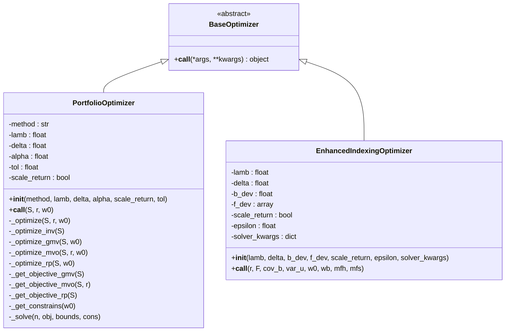
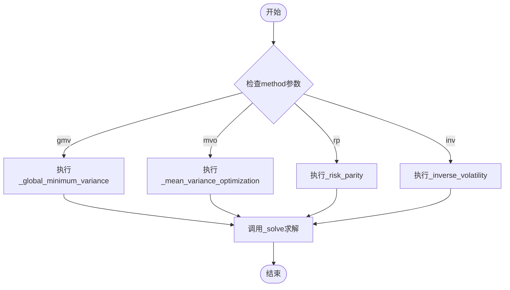
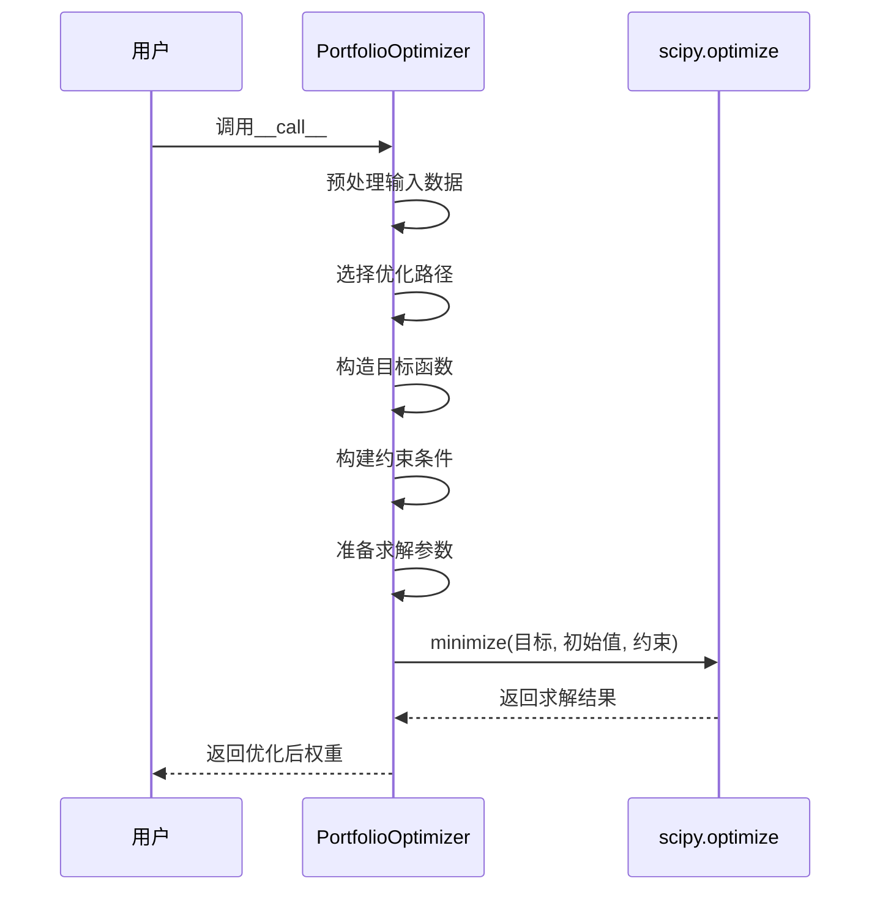
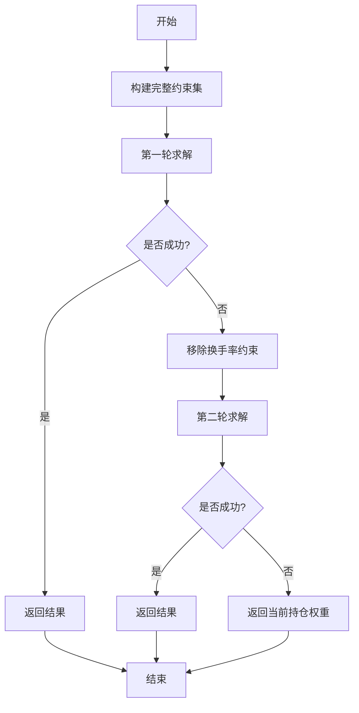
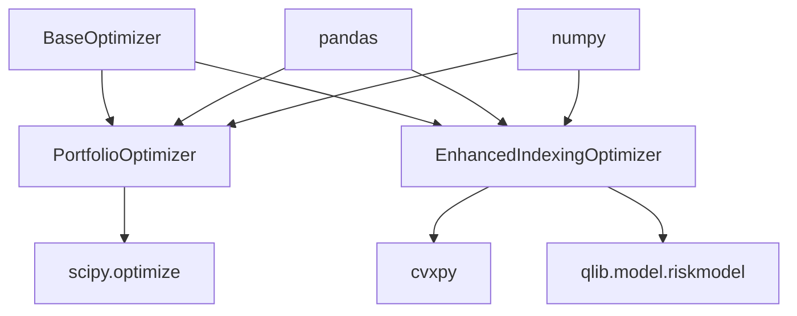

# 核心优化器架构

<cite>
**本文档中引用的文件**
- [base.py](file://qlib/contrib/strategy/optimizer/base.py)
- [optimizer.py](file://qlib/contrib/strategy/optimizer/optimizer.py)
- [enhanced_indexing.py](file://qlib/contrib/strategy/optimizer/enhanced_indexing.py)
</cite>

## 目录
1. [简介](#简介)
2. [项目结构](#项目结构)
3. [核心组件](#核心组件)
4. [架构概述](#架构概述)
5. [详细组件分析](#详细组件分析)
6. [依赖关系分析](#依赖关系分析)
7. [性能考量](#性能考量)
8. [故障排除指南](#故障排除指南)
9. [结论](#结论)

## 简介
Qlib投资组合优化引擎提供了一套灵活且可扩展的框架，用于实现复杂的资产配置策略。该系统通过`BaseOptimizer`抽象基类定义了统一的优化接口，并在此基础上实现了多种具体优化器，包括通用投资组合优化器和增强型指数跟踪优化器。这些优化器支持多阶段任务调度、风险预算分配与交易成本模型集成，能够有效处理大规模资产组合下的稀疏矩阵计算问题。

## 项目结构
Qlib的投资组合优化功能主要集中在`qlib/contrib/strategy/optimizer/`目录下，包含基础抽象类、通用优化器及特定场景优化器的实现。



**图表来源**
- [base.py](file://qlib/contrib/strategy/optimizer/base.py#L6-L11)
- [optimizer.py](file://qlib/contrib/strategy/optimizer/optimizer.py#L13-L264)
- [enhanced_indexing.py](file://qlib/contrib/strategy/optimizer/enhanced_indexing.py#L15-L201)

**章节来源**
- [base.py](file://qlib/contrib/strategy/optimizer/base.py#L6-L11)
- [optimizer.py](file://qlib/contrib/strategy/optimizer/optimizer.py#L13-L264)
- [enhanced_indexing.py](file://qlib/contrib/strategy/optimizer/enhanced_indexing.py#L15-L201)

## 核心组件
本系统的核心在于`BaseOptimizer`抽象基类的设计以及其两个主要实现：`PortfolioOptimizer`和`EnhancedIndexingOptimizer`。前者提供了多种经典投资组合优化算法（如全局最小方差、均值-方差优化等），后者则专注于增强型指数跟踪策略，能够在控制跟踪误差的同时最大化超额收益。

**章节来源**
- [base.py](file://qlib/contrib/strategy/optimizer/base.py#L6-L11)
- [optimizer.py](file://qlib/contrib/strategy/optimizer/optimizer.py#L13-L264)
- [enhanced_indexing.py](file://qlib/contrib/strategy/optimizer/enhanced_indexing.py#L15-L201)

## 架构概述
整个优化引擎采用基于继承的分层架构设计，确保了代码的可维护性和扩展性。



**图表来源**
- [base.py](file://qlib/contrib/strategy/optimizer/base.py#L6-L11)
- [optimizer.py](file://qlib/contrib/strategy/optimizer/optimizer.py#L13-L264)
- [enhanced_indexing.py](file://qlib/contrib/strategy/optimizer/enhanced_indexing.py#L15-L201)

## 详细组件分析

### 基础优化器分析
`BaseOptimizer`作为所有优化器的抽象基类，通过Python的abc模块定义了一个必须被子类实现的`__call__`方法，从而强制所有具体优化器遵循统一的调用接口规范。

```mermaid
classDiagram
class BaseOptimizer {
<<abstract>>
+__call__(*args, **kwargs) object
}
note right of BaseOptimizer
所有具体优化器必须实现此方法
以生成优化后的投资组合权重
end note
```

**图表来源**
- [base.py](file://qlib/contrib/strategy/optimizer/base.py#L6-L11)

**章节来源**
- [base.py](file://qlib/contrib/strategy/optimizer/base.py#L6-L11)

### 通用投资组合优化器分析
`PortfolioOptimizer`实现了四种主流的投资组合优化算法，每种算法对应不同的目标函数和约束条件。

#### 优化算法调度机制
该优化器通过`_optimize`方法根据配置的方法参数动态选择具体的优化路径。



**图表来源**
- [optimizer.py](file://qlib/contrib/strategy/optimizer/optimizer.py#L113-L136)

**章节来源**
- [optimizer.py](file://qlib/contrib/strategy/optimizer/optimizer.py#L113-L136)

#### 目标函数注册系统
每个优化算法都有独立的目标函数构造器，这些函数返回一个可调用对象供scipy.optimize.minimize使用。

```mermaid
classDiagram
class PortfolioOptimizer {
-_get_objective_gmv(S) : Callable
-_get_objective_mvo(S, r) : Callable
-_get_objective_rp(S) : Callable
}
note right of PortfolioOptimizer
返回lambda表达式或内嵌函数
作为scipy.optimize的objective参数
end note
```

**图表来源**
- [optimizer.py](file://qlib/contrib/strategy/optimizer/optimizer.py#L178-L202)

**章节来源**
- [optimizer.py](file://qlib/contrib/strategy/optimizer/optimizer.py#L178-L202)

#### 约束条件动态构建
约束条件通过`_get_constrains`方法动态生成，支持无卖空、全额投资和换手率限制。

```mermaid
flowchart TD
A[开始] --> B[设置边界约束<br/>0 ≤ w ≤ 1]
B --> C[添加全仓约束<br/>Σw = 1]
C --> D{是否有初始权重w0?}
D --> |是| E[添加换手率约束<br/>Σ|w-w0| ≤ δ]
D --> |否| F[跳过换手率约束]
E --> G[返回bounds和cons]
F --> G
G --> H[结束]
```

**图表来源**
- [optimizer.py](file://qlib/contrib/strategy/optimizer/optimizer.py#L219-L238)

**章节来源**
- [optimizer.py](file://qlib/contrib/strategy/optimizer/optimizer.py#L219-L238)

#### 求解器抽象层
通过`_solve`方法封装了scipy.optimize.minimize的调用细节，并支持L2正则化。



**图表来源**
- [optimizer.py](file://qlib/contrib/strategy/optimizer/optimizer.py#L240-L264)

**章节来源**
- [optimizer.py](file://qlib/contrib/strategy/optimizer/optimizer.py#L240-L264)

### 增强型指数跟踪优化器分析
`EnhancedIndexingOptimizer`专门用于增强型指数跟踪策略，利用CVXPY进行凸优化求解。

#### 风险预算分配与交易成本集成
该优化器将跟踪误差分解为因子风险和特异性风险两部分，并通过λ参数平衡收益与风险。

```mermaid
flowchart LR
A[预期收益r] --> B[目标函数]
C[因子暴露F] --> D[因子协方差cov_b]
D --> E[因子风险v@cov_b@v]
F[特质波动var_u] --> G[特质风险var_u@d^2]
E --> H[总风险]
G --> H
H --> I[目标: d@r - λ*总风险]
J[当前权重w0] --> K[换手成本约束]
L[基准权重wb] --> M[偏离度约束]
I --> N[CVXPY求解器]
K --> N
M --> N
N --> O[优化后权重]
```

**图表来源**
- [enhanced_indexing.py](file://qlib/contrib/strategy/optimizer/enhanced_indexing.py#L87-L201)

**章节来源**
- [enhanced_indexing.py](file://qlib/contrib/strategy/optimizer/enhanced_indexing.py#L87-L201)

#### 多阶段优化任务调度
采用双阶段容错机制：首先尝试在所有约束下求解；若失败，则移除换手率约束再次尝试。



**图表来源**
- [enhanced_indexing.py](file://qlib/contrib/strategy/optimizer/enhanced_indexing.py#L87-L201)

**章节来源**
- [enhanced_indexing.py](file://qlib/contrib/strategy/optimizer/enhanced_indexing.py#L87-L201)

## 依赖关系分析
整个优化器模块具有清晰的依赖层次结构，各组件之间的耦合度较低。



**图表来源**
- [base.py](file://qlib/contrib/strategy/optimizer/base.py#L6-L11)
- [optimizer.py](file://qlib/contrib/strategy/optimizer/optimizer.py#L13-L264)
- [enhanced_indexing.py](file://qlib/contrib/strategy/optimizer/enhanced_indexing.py#L15-L201)

**章节来源**
- [base.py](file://qlib/contrib/strategy/optimizer/base.py#L6-L11)
- [optimizer.py](file://qlib/contrib/strategy/optimizer/optimizer.py#L13-L264)
- [enhanced_indexing.py](file://qlib/contrib/strategy/optimizer/enhanced_indexing.py#L15-L201)

## 性能考量
对于大规模资产组合，系统通过以下方式提升性能：
- 使用稀疏矩阵表示法减少内存占用
- 提供warm start机制加速收敛
- 支持并行计算框架进行批量优化
- 对小权重进行阈值过滤以降低后续交易成本

## 故障排除指南
常见问题及解决方案：
- **优化失败**：检查协方差矩阵是否正定，尝试调整tolerance参数
- **权重不收敛**：验证输入数据完整性，确认无缺失值或异常值
- **运行缓慢**：考虑降维处理或启用稀疏矩阵模式
- **内存溢出**：对超大规模组合实施分块优化策略

**章节来源**
- [optimizer.py](file://qlib/contrib/strategy/optimizer/optimizer.py#L240-L264)
- [enhanced_indexing.py](file://qlib/contrib/strategy/optimizer/enhanced_indexing.py#L87-L201)

## 结论
Qlib的优化引擎通过精心设计的类继承体系和模块