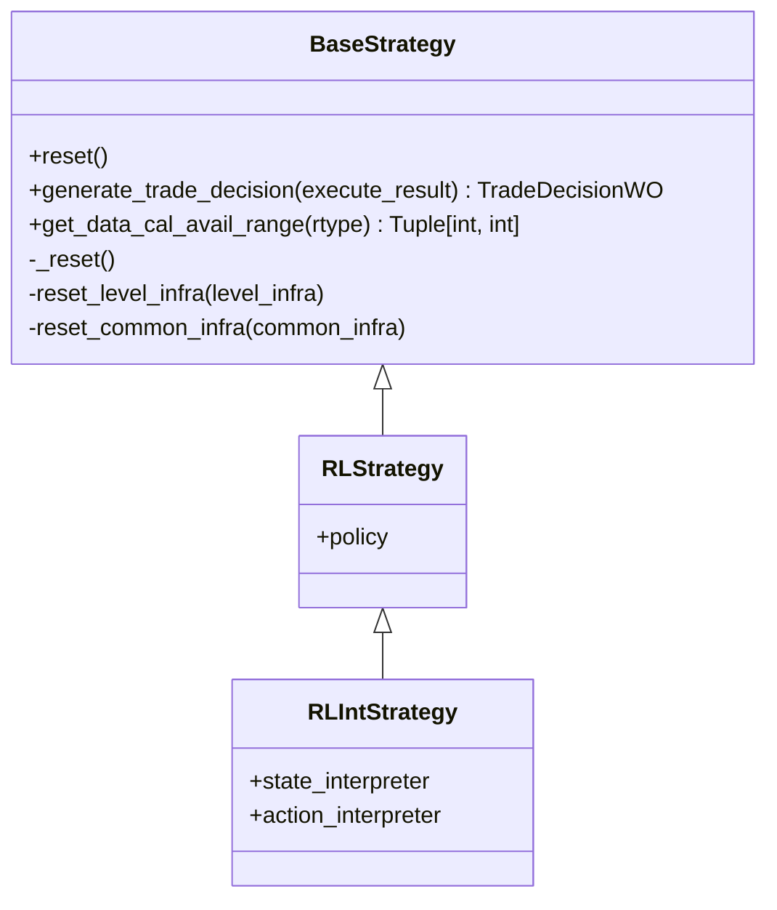
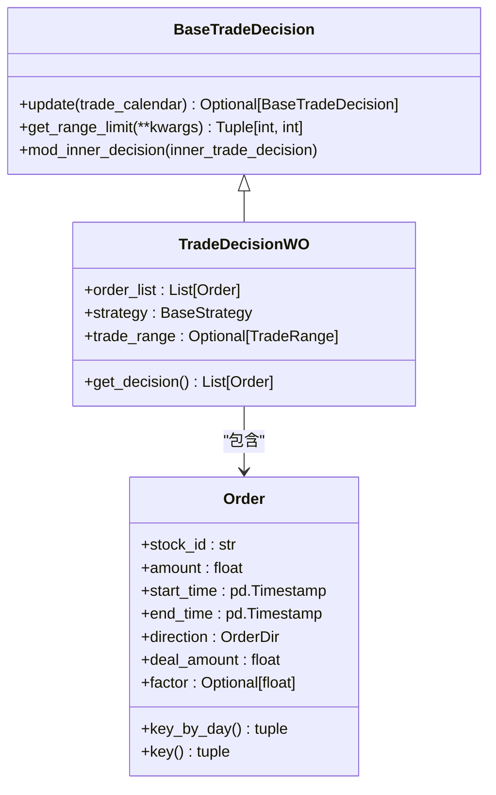
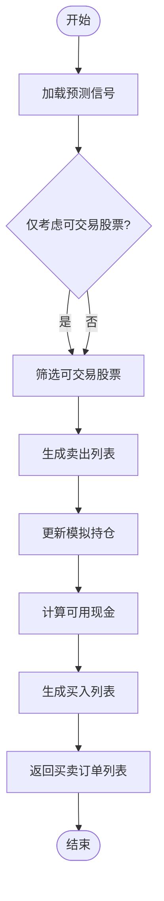
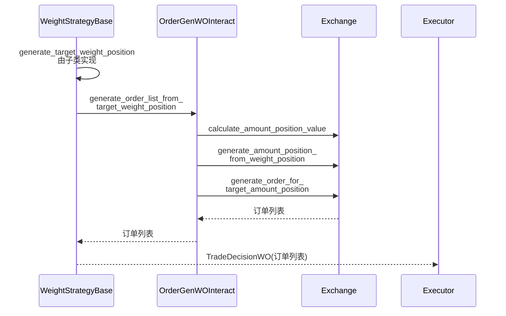

# 策略模块

<cite>
**本文档中引用的文件**  
- [base.py](file://qlib/strategy/base.py)
- [rule_strategy.py](file://qlib/contrib/strategy/rule_strategy.py)
- [signal_strategy.py](file://qlib/contrib/strategy/signal_strategy.py)
- [enhanced_indexing.py](file://qlib/contrib/strategy/optimizer/enhanced_indexing.py)
- [decision.py](file://qlib/backtest/decision.py)
- [order_generator.py](file://qlib/contrib/strategy/order_generator.py)
</cite>

## 目录
1. [引言](#引言)
2. [策略基类设计](#策略基类设计)
3. [决策系统交互机制](#决策系统交互机制)
4. [规则型策略实现](#规则型策略实现)
5. [信号驱动策略实现](#信号驱动策略实现)
6. [增强型指数跟踪优化器](#增强型指数跟踪优化器)
7. [订单生成与成本控制](#订单生成与成本控制)
8. [策略开发模板与调试建议](#策略开发模板与调试建议)

## 引言

Qlib框架提供了一套完整的交易策略与投资组合优化体系，旨在将模型预测结果转化为可执行的买卖决策。该体系通过分层架构实现了从信号生成到订单执行的全流程管理，支持多种策略类型，包括基于规则的执行策略、基于信号的选股策略以及基于优化的投资组合再平衡策略。本文档详细阐述了策略模块的核心设计原则和具体实现逻辑。

## 策略基类设计

策略模块采用面向对象的设计模式，以`BaseStrategy`作为所有策略的抽象基类。该基类定义了策略必须实现的核心接口，并提供了共享的基础设施访问方法。



**图源**
- [base.py](file://qlib/strategy/base.py#L0-L296)

**节源**
- [base.py](file://qlib/strategy/base.py#L0-L296)

`BaseStrategy`类的关键特性包括：
- **抽象方法**：`generate_trade_decision`是必须由子类实现的核心方法，负责在每个交易周期生成具体的交易决策。
- **基础设施注入**：通过`level_infra`和`common_infra`参数注入回测所需的共享资源，如交易日历、账户信息和交易所实例。
- **状态重置**：提供`reset`和`_reset`方法用于初始化或更新策略状态，支持在嵌套执行场景下的动态调整。
- **扩展接口**：为强化学习（RL）策略提供了专门的派生类`RLStrategy`和`RLIntStrategy`，支持通过解释器将环境状态映射到动作空间。

## 决策系统交互机制

策略与决策系统的交互主要通过`TradeDecisionWO`类来完成。该类封装了具体的交易指令列表，并与策略实例关联，构成了策略输出的标准格式。



**图源**
- [decision.py](file://qlib/backtest/decision.py#L0-L596)

**节源**
- [decision.py](file://qlib/backtest/decision.py#L0-L596)

交互流程如下：
1. **决策生成**：策略的`generate_trade_decision`方法返回一个`TradeDecisionWO`实例，其中包含了待执行的`Order`对象列表。
2. **指令执行**：执行器（Executor）接收`TradeDecisionWO`并调用其`get_decision`方法获取订单列表进行实际成交处理。
3. **状态反馈**：执行结果（成交数量、价格等）会填充回`Order`对象的`deal_amount`和`factor`字段，并作为`execute_result`参数传递给下一次`generate_trade_decision`调用，形成闭环反馈。
4. **范围限制**：`trade_range`属性可用于限制决策的有效时间范围，支持日内特定时段交易等高级功能。

## 规则型策略实现

规则型策略直接基于预设的逻辑规则生成交易指令，不依赖外部信号。`rule_strategy.py`文件中实现了多种此类策略。

### TWAP策略

时间加权平均价格（TWAP）策略将大额订单均匀分配到指定的交易时间段内执行，以降低市场冲击成本。

**节源**
- [rule_strategy.py](file://qlib/contrib/strategy/rule_strategy.py#L0-L672)

### SBB策略

选择更好时机（Select the Better Bar, SBB）策略通过分析相邻两个交易时段的价格趋势，在更优的时点执行买卖操作。例如，`SBBStrategyEMA`利用10日与20日指数移动平均线（EMA）的差值作为趋势判断信号。

**节源**
- [rule_strategy.py](file://qlib/contrib/strategy/rule_strategy.py#L0-L672)

### AC策略

Almgren-Chriss (AC) 策略是一种经典的最优执行算法，它在预期收益和交易风险之间进行权衡。该策略根据波动率信号动态调整每步的交易量，波动率高时减少交易量，反之则增加。

**节源**
- [rule_strategy.py](file://qlib/contrib/strategy/rule_strategy.py#L0-L672)

这些策略均继承自`BaseStrategy`，并通过覆盖`generate_trade_decision`方法来实现各自的交易逻辑。它们通常需要一个“外部交易决策”（`outer_trade_decision`）作为输入，即需要被拆分或优化的原始订单。

## 信号驱动策略实现

信号驱动策略以预测模型输出的信号为基础，通过一系列规则将其转化为具体的持仓调整方案。`signal_strategy.py`文件中的`TopkDropoutStrategy`和`WeightStrategyBase`是这类策略的典型代表。

### TopkDropout策略

该策略维护一个固定数量（topk）的股票组合。在每个调仓日，它根据最新的预测得分对持仓和候选池中的股票进行排序，并替换掉表现最差的n_drop只股票。



**图源**
- [signal_strategy.py](file://qlib/contrib/strategy/signal_strategy.py#L0-L522)

**节源**
- [signal_strategy.py](file://qlib/contrib/strategy/signal_strategy.py#L0-L522)

关键参数包括：
- `topk`: 组合目标持股数。
- `n_drop`: 每次调仓更换的股票数量。
- `hold_thresh`: 最小持有天数，防止频繁交易。
- `forbid_all_trade_at_limit`: 是否禁止涨跌停板交易。

### 权重策略基类

`WeightStrategyBase`为基于目标权重的投资组合再平衡策略提供了通用框架。其核心思想是先生成一个目标权重持仓（`target_weight_position`），然后通过`OrderGenerator`将其转换为具体的买卖订单。



**图源**
- [signal_strategy.py](file://qlib/contrib/strategy/signal_strategy.py#L0-L522)
- [order_generator.py](file://qlib/contrib/strategy/order_generator.py#L0-L218)

**节源**
- [signal_strategy.py](file://qlib/contrib/strategy/signal_strategy.py#L0-L522)
- [order_generator.py](file://qlib/contrib/strategy/order_generator.py#L0-L218)

## 增强型指数跟踪优化器

增强型指数跟踪策略旨在跑赢基准指数的同时，严格控制相对于基准的跟踪误差。`EnhancedIndexingStrategy`结合了主动管理和被动管理的优点。

### 风险模型数据准备

该策略依赖于外部的风险模型数据，通常包括：
- **因子暴露** (`factor_exp.pkl`)
- **因子协方差矩阵** (`factor_cov.pkl`)
- **特质风险** (`specific_risk.pkl`)
- **黑名单** (`blacklist.pkl`) （可选）

这些数据应按日期组织成目录结构，并通过`riskmodel_root`参数指定根路径。

**节源**
- [signal_strategy.py](file://qlib/contrib/strategy/signal_strategy.py#L0-L522)

### 优化问题建模

`EnhancedIndexingOptimizer`使用凸优化库CVXPY求解以下投资组合优化问题：

**最大化**: 超额收益 - 风险厌恶系数 × 跟踪误差
**约束条件**:
- 权重非负且总和为1
- 总换手率不超过上限
- 相对于基准的偏离度在允许范围内
- 因子暴露的偏离度在允许范围内
- 强制持有/强制卖出的股票

```python
maximize(d @ r - lamb * (v @ cov_b @ v + var_u @ d**2))
s.t. w >= 0, sum(w) == 1, sum(|w - w0|) <= delta
     d >= -b_dev, d <= b_dev, v >= -f_dev, v <= f_dev
```

**节源**
- [enhanced_indexing.py](file://qlib/contrib/strategy/optimizer/enhanced_indexing.py#L0-L202)

该优化器具备容错能力，当因约束过严导致求解失败时，会尝试放宽换手率约束或直接返回当前持仓。

## 订单生成与成本控制

订单生成过程是连接目标持仓与实际交易的关键环节，`order_generator.py`中的`OrderGenerator`及其子类负责此任务。

### 两种生成模式

1.  **无交互模式** (`OrderGenWOInteract`): 在生成订单时不查询当日实时价格，而是使用预测日的收盘价或当前持仓记录的价格进行估算。这适用于无法获取未来信息的严格回测场景。
2.  **有交互模式** (`OrderGenWInteract`): 在生成订单时与交易所实例交互，获取当前可交易状态和精确的成交价格，从而生成更准确的订单。

**节源**
- [order_generator.py](file://qlib/contrib/strategy/order_generator.py#L0-L218)

### 成本控制

策略通过以下方式控制交易成本：
- **交易单位取整**：所有交易量都需符合交易所规定的最小交易单位（如A股的100股）。
- **开平仓费用**：在计算可用资金时，会扣除预计的开仓成本。
- **风险预算分配**：通过`risk_degree`参数控制总投资仓位，保留一部分现金以应对市场波动。

## 策略开发模板与调试建议

### 开发模板

创建自定义策略的最佳实践是继承合适的基类：
- 对于简单的规则执行，继承`BaseStrategy`。
- 对于基于信号的选股，继承`TopkDropoutStrategy`或`WeightStrategyBase`。
- 对于复杂的优化策略，继承`WeightStrategyBase`并实现自己的`generate_target_weight_position`方法。

```python
from qlib.contrib.strategy.signal_strategy import WeightStrategyBase

class MyCustomStrategy(WeightStrategyBase):
    def __init__(self, my_param=1.0, **kwargs):
        super().__init__(**kwargs)
        self.my_param = my_param

    def generate_target_weight_position(self, score, current, trade_start_time, trade_end_time):
        # 实现你的权重生成逻辑
        target_weights = {}
        # ... 业务逻辑 ...
        return target_weights
```

### 调试建议

1.  **日志记录**：使用`get_module_logger`添加详细的日志信息，特别是在`generate_trade_decision`方法中。
2.  **单元测试**：为`generate_target_weight_position`等核心方法编写独立的单元测试，验证其在不同输入下的行为。
3.  **检查可交易性**：在生成订单前，务必使用`trade_exchange.is_stock_tradable()`检查股票是否处于可交易状态，避免无效订单。
4.  **处理边界情况**：确保策略能正确处理空信号、停牌股票、资金不足等异常情况。
5.  **性能监控**：利用`profit_attribution.py`等工具分析策略的收益归因，评估其Alpha来源和风险暴露。