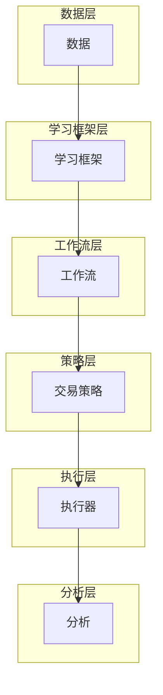

# 项目概述

<cite>
**本文档引用的文件**   
- [README.md](file://README.md)
- [framework-abstract.jpg](file://docs/_static/img/framework-abstract.jpg)
- [workflow_config_lightgbm_Alpha158.yaml](file://examples/benchmarks/LightGBM/workflow_config_lightgbm_Alpha158.yaml)
- [workflow.py](file://examples/nested_decision_execution/workflow.py)
</cite>

## 目录
1. [引言](#引言)
2. [核心目标与功能定位](#核心目标与功能定位)
3. [完整研究流程](#完整研究流程)
4. [系统架构抽象](#系统架构抽象)
5. [模块化设计与配置驱动](#模块化设计与配置驱动)
6. [多范式机器学习支持](#多范式机器学习支持)
7. [技术优势与性能对比](#技术优势与性能对比)
8. [关键技术栈集成](#关键技术栈集成)
9. [结论](#结论)

## 引言
Qlib 是一个开源的、以人工智能为导向的量化投资平台，旨在通过AI技术释放潜力、赋能研究并创造价值。该平台为从探索想法到实现生产应用的整个过程提供了强大的基础设施支持。

**Section sources**
- [README.md](file://README.md#L1-L100)

## 核心目标与功能定位
Qlib的核心目标是解决量化投资研究中的关键挑战，并提供一套完整的解决方案。它专注于三大主要领域：
1. **预测建模**：寻找有价值的信号和模式。
2. **适应市场动态**：应对金融市场的非平稳性。
3. **强化学习**：对连续决策进行建模。

作为一个AI导向的平台，Qlib覆盖了量化投资的全链条，包括数据处理、模型训练、回测以及投资组合优化等环节。

**Section sources**
- [README.md](file://README.md#L101-L150)

## 完整研究流程
Qlib 提供了一个端到端的研究工作流，涵盖了从数据处理到投资组合优化的每一个步骤：

### 数据处理
Qlib 支持多种频率的数据（如日频、分钟级），并且可以高效地加载和处理大规模金融数据集。用户可以通过简单的命令获取所需数据。

```bash
python -m qlib.cli.data qlib_data --target_dir ~/.qlib/qlib_data/cn_data --region cn
```

### 模型训练
平台支持监督学习、无监督学习及强化学习等多种机器学习范式。用户可以使用预定义的工作流或自定义代码来构建自己的研究流程。

### 回测
Qlib 内置了强大的回测引擎，能够模拟交易策略的表现，并生成详细的分析报告。

### 投资组合优化
基于模型预测结果，Qlib 可以执行复杂的投资组合优化任务，帮助投资者最大化收益同时控制风险。

**Section sources**
- [README.md](file://README.md#L151-L200)

## 系统架构抽象
Qlib 的高层框架设计为松耦合模块，每个组件都可以独立使用。其整体架构如下图所示：



**Diagram sources**
- [framework-abstract.jpg](file://docs/_static/img/framework-abstract.jpg)

**Section sources**
- [README.md](file://README.md#L143-L157)

## 模块化设计与配置驱动
Qlib 采用模块化设计，允许研究人员灵活地组合不同的组件。此外，平台还支持配置驱动的工作流机制，使得实验设置更加便捷。

例如，通过 YAML 配置文件即可定义整个研究流程：

```yaml
qlib_init:
  provider_uri: "~/.qlib/qlib_data/cn_data"
  region: cn
model:
  class: LGBModel
  module_path: qlib.contrib.model.gbdt
dataset:
  class: DatasetH
  module_path: qlib.data.dataset
  kwargs:
    handler:
      class: Alpha158
      module_path: qlib.contrib.data.handler
    segments:
      train: [2008-01-01, 2014-12-31]
      valid: [2015-01-01, 2016-12-31]
      test: [2017-01-01, 2020-08-01]
```

**Section sources**
- [workflow_config_lightgbm_Alpha158.yaml](file://examples/benchmarks/LightGBM/workflow_config_lightgbm_Alpha158.yaml)

## 多范式机器学习支持
Qlib 支持多种机器学习范式，包括但不限于：
- **监督学习**：用于挖掘市场中的非线性模式。
- **元学习**：用于指导基础模型的学习过程。
- **强化学习**：用于建模连续的投资决策。

这些能力使得 Qlib 成为了一个多功能的研究工具，适用于各种复杂的金融应用场景。

**Section sources**
- [README.md](file://README.md#L201-L250)

## 技术优势与性能对比
Qlib 在数据处理方面表现出色，相较于其他通用数据库解决方案，在相同任务下显著提升了性能。以下是不同存储方案的性能比较：

| 存储方案 | 单核总耗时(秒) | 多核总耗时(秒) |
| --- | --- | --- |
| HDF5 | 184.4±3.7 | - |
| MySQL | 365.3±7.5 | - |
| MongoDB | 253.6±6.7 | - |
| InfluxDB | 368.2±3.6 | - |
| Qlib (-E -D) | 147.0±8.8 | 8.8±0.6 |
| Qlib (+E -D) | 47.6±1.0 | **4.2±0.2** |
| Qlib (+E +D) | **7.4±0.3** | - |

*注释：`+(-)E` 表示启用(禁用)表达式缓存；`+(-)D` 表示启用(禁用)数据集缓存*

**Section sources**
- [README.md](file://README.md#L554-L571)

## 关键技术栈集成
Qlib 无缝集成了多个关键技术栈，增强了其功能性和灵活性：
- **PyTorch**：用于深度学习模型开发。
- **LightGBM/XGBoost/CatBoost**：支持高效的梯度提升树模型。
- **MLflow**：用于实验管理和跟踪。

这种广泛的集成确保了研究人员可以在熟悉的环境中快速上手并开展创新性工作。

**Section sources**
- [README.md](file://README.md#L251-L300)

## 结论
Qlib 作为一个先进的AI导向开源平台，在量化投资领域展现了巨大的潜力。它不仅提供了全面的功能覆盖，而且在性能和易用性方面也达到了行业领先水平。无论是初学者还是高级用户，都能从中受益匪浅。

**Section sources**
- [README.md](file://README.md#L301-L350)