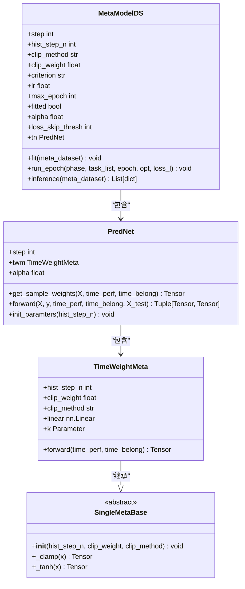
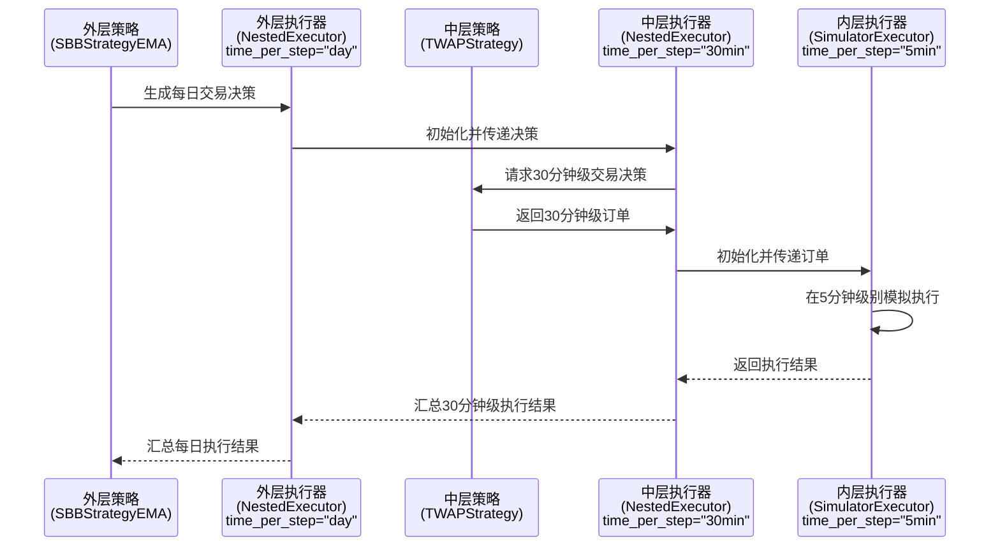

# 元学习

<cite>
**本文档中引用的文件**
- [dataset.py](file://qlib/contrib/meta/data_selection/dataset.py)
- [model.py](file://qlib/contrib/meta/data_selection/model.py)
- [net.py](file://qlib/contrib/meta/data_selection/net.py)
- [utils.py](file://qlib/contrib/meta/data_selection/utils.py)
- [workflow.py](file://examples/nested_decision_execution/workflow.py)
</cite>

## 目录
1. [引言](#引言)
2. [元学习任务构建与数据集筛选机制](#元学习任务构建与数据集筛选机制)
3. [模型选择与元控制器神经网络结构](#模型选择与元控制器神经网络结构)
4. [嵌套决策执行流程](#嵌套决策执行流程)
5. [特征工程与在线推理延迟控制](#特征工程与在线推理延迟控制)
6. [实验配置与性能评估](#实验配置与性能评估)
7. [应用场景：市场状态切换与模型漂移应对](#应用场景：市场状态切换与模型漂移应对)
8. [结论](#结论)

## 引言
Qlib中的元学习模块旨在通过高层策略动态优化底层预测模型的行为，实现对金融市场复杂性和时变性的自适应。该机制的核心思想是引入一个“元控制器”，它不直接进行资产定价，而是学习如何根据历史表现和当前市场环境，智能地选择或加权不同的数据集与预测模型。`meta/data_selection`子模块具体实现了这一理念，通过自动化数据选择（Data Selection）来提升主预测模型的鲁棒性。本文档将深入剖析其架构、关键组件及协同工作方式。

## 元学习任务构建与数据集筛选机制

`meta/data_selection`模块通过`MetaDatasetDS`类构建元学习任务。其核心在于利用代理模型（proxy models）的历史表现作为元特征（meta features）。在`dataset.py`中，`InternalData`类负责初始化这些代理模型。它首先基于用户提供的任务模板（`task_tpl`），使用`TrainerR`训练一系列在不同时间窗口上运行的模型，并收集它们的预测结果。随后，通过计算这些预测与真实标签之间的IC（信息系数）序列，构建出一个名为`data_ic_df`的相似性矩阵。这个矩阵的每一列代表一个特定时间段训练的代理模型，每一行代表一个测试日期，单元格值即为该模型在该日的表现IC。

当构建实际的元学习任务时，`MetaDatasetDS`会调用`_prepare_meta_ipt`方法。该方法从`data_ic_df`中提取与当前任务测试期结束时间之前的历史IC数据，并应用掩码操作以防止未来信息泄露（即屏蔽掉与训练数据重叠的时间段）。最终，这段经过处理的历史性能数据（`time_perf`）被作为元模型的主要输入特征，用于指导当前任务的数据选择策略。

**Section sources**
- [dataset.py](file://qlib/contrib/meta/data_selection/dataset.py#L1-L417)

## 模型选择与元控制器神经网络结构

元学习模型的实现位于`model.py`和`net.py`中。`MetaModelDS`是顶层的元模型类，它封装了训练和推理逻辑。其核心是一个名为`PredNet`的神经网络，定义于`net.py`中。

`PredNet`的结构设计精巧，包含两个主要部分：
1.  **时间权重模块 (TimeWeightMeta)**: 这是一个继承自`SingleMetaBase`的子网络，其作用是为历史数据片段分配权重。它接收`time_perf`（历史IC序列）作为输入，通过一个线性层（`nn.Linear`）和一个可学习的缩放参数`k`，生成一组权重。这些权重反映了不同历史时期数据对于当前预测的相关性。
2.  **预测器**: `PredNet`的`forward`方法利用`TimeWeightMeta`生成的权重，对主预测模型的训练数据（`X`, `y`）进行加权。然后，它采用一个闭式解（closed-form solution），通过加权最小二乘法计算出模型参数`theta`，并用此参数对测试数据`X_test`进行预测。

这种设计使得元控制器能够学习到一种“注意力”机制，自动放大那些在过去表现出色且与当前市场状态相似的历史数据的影响，从而间接实现了对底层模型训练数据的动态筛选和加权。

**Diagram sources**
- [model.py](file://qlib/contrib/meta/data_selection/model.py#L26-L197)
- [net.py](file://qlib/contrib/meta/data_selection/net.py#L1-L75)

**Section sources**
- [model.py](file://qlib/contrib/meta/data_selection/model.py#L26-L197)
- [net.py](file://qlib/contrib/meta/data_selection/net.py#L1-L75)

## 嵌套决策执行流程

元学习的决策需要在交易执行层面得到体现。`nested_decision_execution/workflow.py`提供了一个强大的框架，展示了多层智能体如何协同工作。其核心是`NestedExecutor`（嵌套执行器）。

如示例代码所示，`port_analysis_config`中定义了一个三层嵌套的执行器：
-   最外层 (`time_per_step="day"`) 负责每日的宏观决策，例如使用`SBBStrategyEMA`策略决定整体的买卖方向。
-   中间层 (`time_per_step="30min"`) 接收外层的决策指令，并将其分解为更细粒度的操作。它内部也包含一个`NestedExecutor`。
-   最内层 (`time_per_step="5min"`) 是最精细的执行单元，通常结合`TWAPStrategy`（时间加权平均价格策略）来平滑地执行来自中间层的大额订单，以减少市场冲击成本。

这种架构完美契合了元学习的理念：上层的元策略（可以是基于`MetaModelDS`的输出）动态调整底层预测模型的训练周期和切换逻辑，而`NestedExecutor`则确保这些高层决策能够被精确、高效地转化为具体的交易行为，在多个时间尺度上协同优化。

**Diagram sources**
- [workflow.py](file://examples/nested_decision_execution/workflow.py#L1-L395)

**Section sources**
- [workflow.py](file://examples/nested_decision_execution/workflow.py#L1-L395)

## 特征工程与在线推理延迟控制

元学习任务的输入特征工程原则主要体现在`MetaTaskDS._get_processed_meta_info`方法中。原始的IC序列会被减去其行均值以进行中心化，然后根据`fill_method`参数处理缺失值。默认的`max`填充法会用每行的最大值填充NaN，这假设了最新的数据具有与历史上最佳表现时期相似的特性，从而强化了近期数据的重要性。

在在线推理时，延迟控制至关重要。`MetaModelDS.inference`方法的设计保证了高效性。它只在测试阶段运行，接收一个准备好的`MetaDatasetDS`实例，遍历其中的每个测试任务，调用`_prepare_task`方法。该方法利用已训练好的`PredNet`快速生成时间权重，并创建一个新的、带有`TimeReweighter`的任务配置。整个过程避免了复杂的重新训练，确保了低延迟的实时决策能力。

**Section sources**
- [dataset.py](file://qlib/contrib/meta/data_selection/dataset.py#L1-L417)
- [model.py](file://qlib/contrib/meta/data_selection/model.py#L26-L197)

## 实验配置与性能评估

配置一个元学习实验涉及多个关键参数。在`MetaDatasetDS`的构造函数中，`step`定义了滚动窗口的步长，`hist_step_n`决定了用于决策的历史步骤数量，`trunc_days`用于防止未来信息泄露。`exp_name`指定了存储代理模型性能的实验名称。

反馈信号的设计直接由代理模型的预测目标决定，通常是资产收益率。性能评估指标则主要依赖于IC（信息系数），这是`ICLoss`类