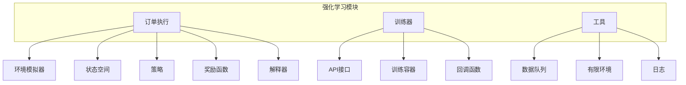
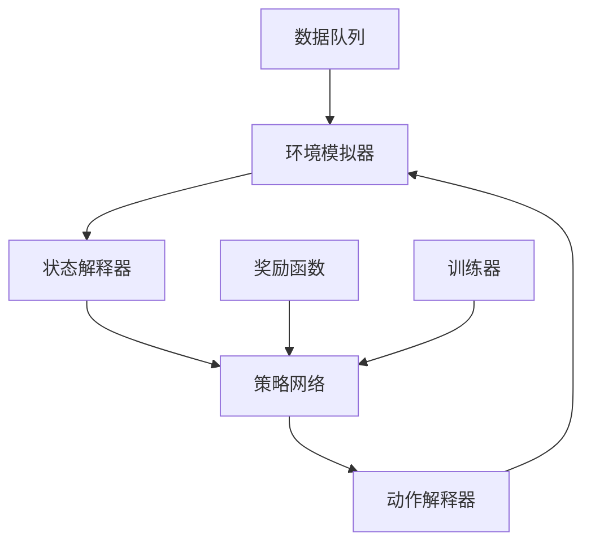
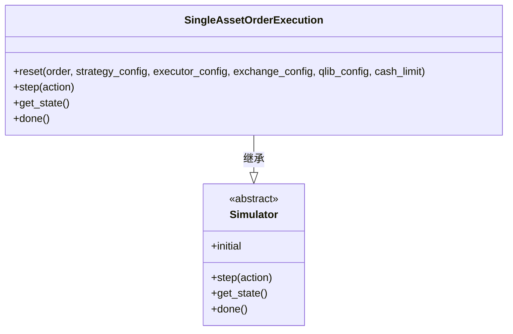
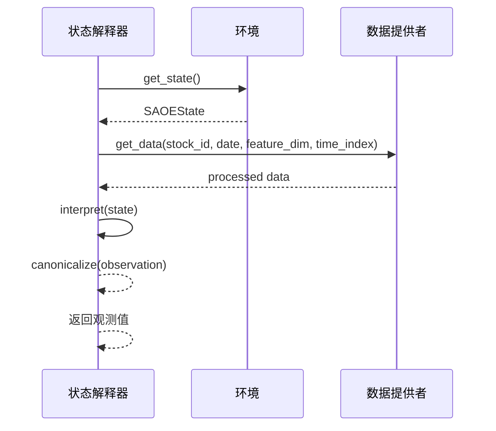
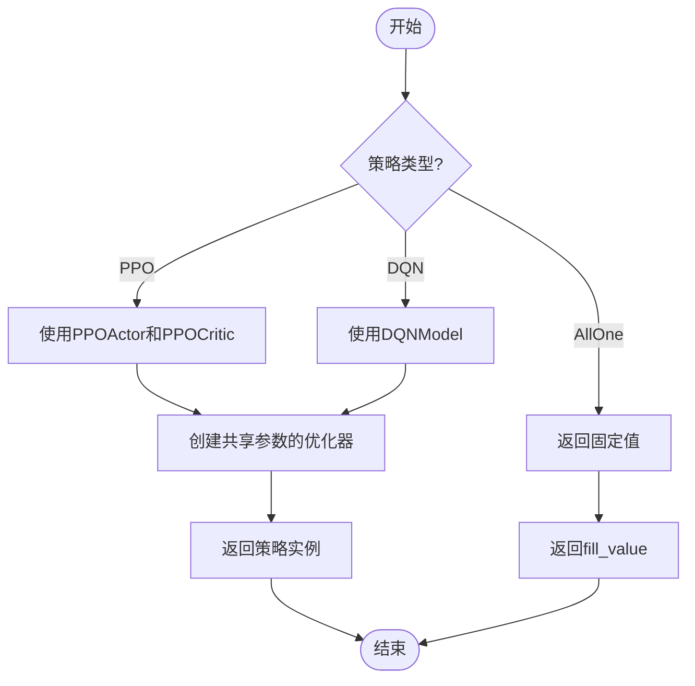
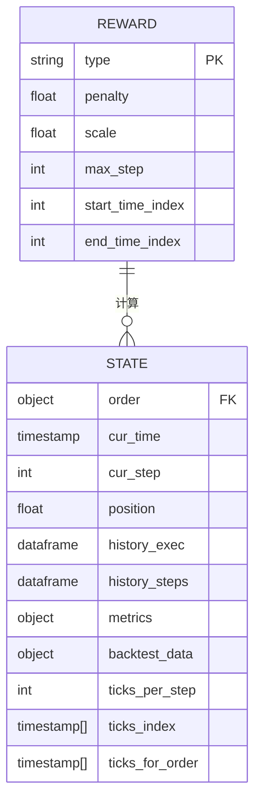
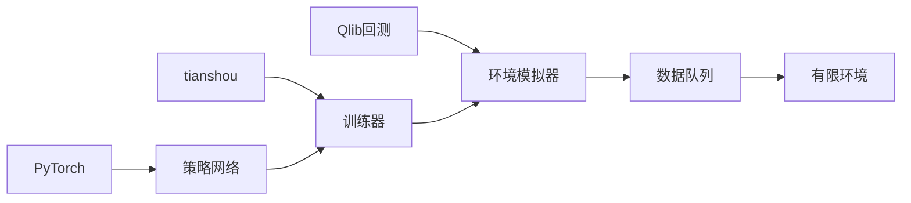

# 强化学习

<cite>
**本文档中引用的文件**
- [simulator_qlib.py](file://qlib/rl/order_execution/simulator_qlib.py)
- [state.py](file://qlib/rl/order_execution/state.py)
- [policy.py](file://qlib/rl/order_execution/policy.py)
- [reward.py](file://qlib/rl/order_execution/reward.py)
- [trainer.py](file://qlib/rl/trainer/trainer.py)
- [api.py](file://qlib/rl/trainer/api.py)
- [interpreter.py](file://qlib/rl/order_execution/interpreter.py)
- [data_queue.py](file://qlib/rl/utils/data_queue.py)
- [finite_env.py](file://qlib/rl/utils/finite_env.py)
- [train_ppo.yml](file://examples/rl_order_execution/exp_configs/train_ppo.yml)
- [backtest_opds.yml](file://examples/rl_order_execution/exp_configs/backtest_opds.yml)
</cite>

## 目录
1. [简介](#简介)
2. [项目结构](#项目结构)
3. [核心组件](#核心组件)
4. [架构概述](#架构概述)
5. [详细组件分析](#详细组件分析)
6. [依赖关系分析](#依赖关系分析)
7. [性能考量](#性能考量)
8. [故障排除指南](#故障排除指南)
9. [结论](#结论)

## 简介
本文档全面介绍Qlib中的强化学习框架设计与应用实践。重点解析rl模块中的环境抽象（simulator）、状态空间（state）、动作策略（policy）和奖励函数（reward）的设计模式。以rl_order_execution为例，说明订单执行场景中OPDS和PPO算法的训练配置、回测设置及策略部署流程。

## 项目结构
Qlib项目的强化学习模块主要位于`qlib/rl`目录下，包含多个子模块如order_execution、trainer、utils等。这些模块共同构成了一个完整的强化学习框架，支持从环境构建到策略定义再到在线交互的完整开发流程。

**图示来源**
- [simulator_qlib.py](file://qlib/rl/order_execution/simulator_qlib.py)
- [trainer.py](file://qlib/rl/trainer/trainer.py)
- [data_queue.py](file://qlib/rl/utils/data_queue.py)

**本节来源**
- [project_structure](file://project_structure#L1-L200)

## 核心组件
Qlib的强化学习框架由多个核心组件构成，包括环境模拟器、状态解释器、动作解释器、奖励函数和训练器。这些组件通过清晰的接口进行交互，实现了灵活且可扩展的强化学习系统。

**本节来源**
- [simulator_qlib.py](file://qlib/rl/order_execution/simulator_qlib.py#L1-L142)
- [interpreter.py](file://qlib/rl/order_execution/interpreter.py#L1-L258)
- [policy.py](file://qlib/rl/order_execution/policy.py#L1-L238)

## 架构概述
Qlib的强化学习架构采用分层设计，底层是基于Qlib回测系统的环境模拟器，中间层是状态和动作的解释器，顶层是策略网络和训练器。这种设计使得算法可以专注于决策逻辑，而无需关心底层的数据处理和执行细节。

**图示来源**
- [simulator_qlib.py](file://qlib/rl/order_execution/simulator_qlib.py#L1-L142)
- [interpreter.py](file://qlib/rl/order_execution/interpreter.py#L1-L258)
- [trainer.py](file://qlib/rl/trainer/trainer.py#L1-L356)

## 详细组件分析

### 环境模拟器分析
环境模拟器是强化学习系统的核心，负责模拟交易环境并提供状态信息。在Qlib中，SingleAssetOrderExecution类实现了单资产订单执行的模拟功能。

#### 类图

**图示来源**
- [simulator_qlib.py](file://qlib/rl/order_execution/simulator_qlib.py#L1-L142)

### 状态空间分析
状态空间定义了智能体观察环境的方式。Qlib提供了多种状态解释器，如FullHistoryStateInterpreter和CurrentStepStateInterpreter，以适应不同的策略需求。

#### 序列图

**图示来源**
- [state.py](file://qlib/rl/order_execution/state.py#L1-L102)
- [interpreter.py](file://qlib/rl/order_execution/interpreter.py#L1-L258)

### 动作策略分析
动作策略决定了智能体的行为方式。Qlib支持多种策略，包括PPO、DQN和非学习型策略如AllOne。这些策略通过统一的接口与环境交互。

#### 流程图

**图示来源**
- [policy.py](file://qlib/rl/order_execution/policy.py#L1-L238)

### 奖励函数分析
奖励函数指导策略的学习方向。Qlib提供了PAPenaltyReward和PPOReward两种奖励机制，分别用于鼓励价格优势和惩罚集中交易。

#### 数据模型图

**图示来源**
- [reward.py](file://qlib/rl/order_execution/reward.py#L1-L100)

## 依赖关系分析
Qlib的强化学习框架依赖于多个外部库和内部模块。主要依赖包括PyTorch用于神经网络计算，tianshou用于强化学习算法实现，以及Qlib自身的回测系统。

**图示来源**
- [trainer.py](file://qlib/rl/trainer/trainer.py#L1-L356)
- [finite_env.py](file://qlib/rl/utils/finite_env.py#L1-L370)

**本节来源**
- [requirements.txt](file://examples/benchmarks/ADARNN/requirements.txt#L1-L10)
- [go.mod](file://go.mod#L1-L20)

## 性能考量
Qlib的强化学习框架在设计时充分考虑了性能因素。通过多进程并行、数据预加载和内存优化等技术，确保了大规模训练的效率。

- 使用DataQueue实现数据的异步加载
- 支持多GPU训练和断点续训
- 采用向量化环境提高采样效率
- 提供详细的日志记录和监控功能

## 故障排除指南
当遇到问题时，可以参考以下常见问题的解决方案：

**本节来源**
- [tests/rl/test_trainer.py](file://tests/rl/test_trainer.py#L1-L50)
- [tests/rl/test_finite_env.py](file://tests/rl/test_finite_env.py#L1-L40)

## 结论
Qlib的强化学习框架提供了一套完整的解决方案，涵盖了从环境构建到策略部署的各个环节。其模块化的设计使得用户可以轻松地定制和扩展功能，适用于各种金融交易场景。