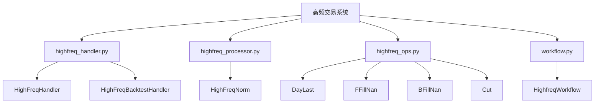
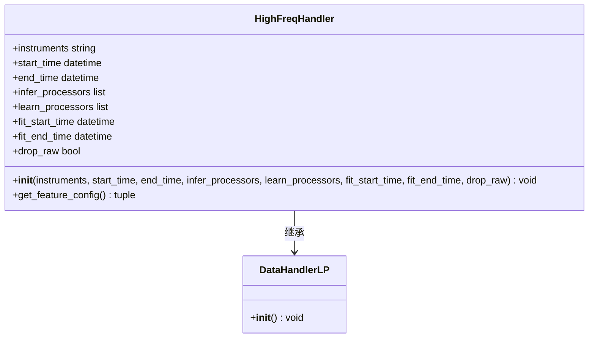
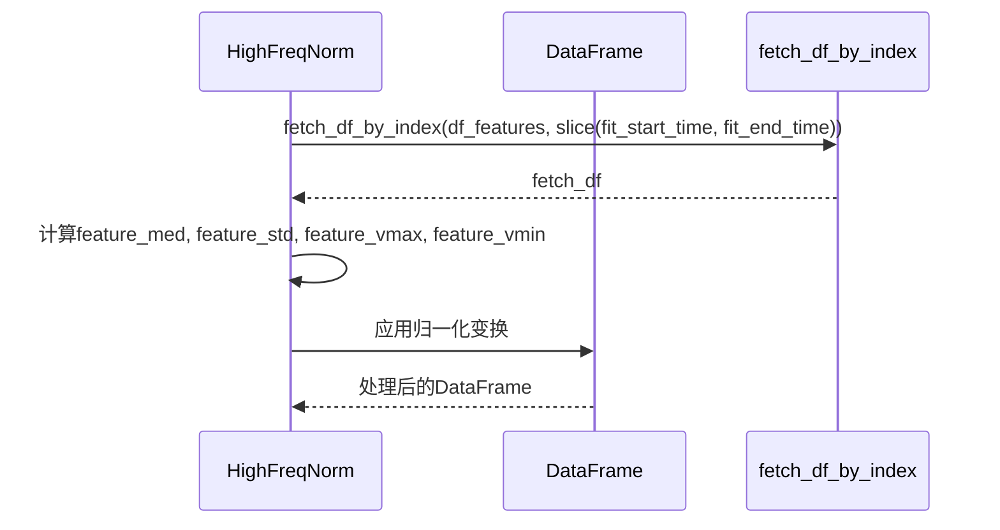
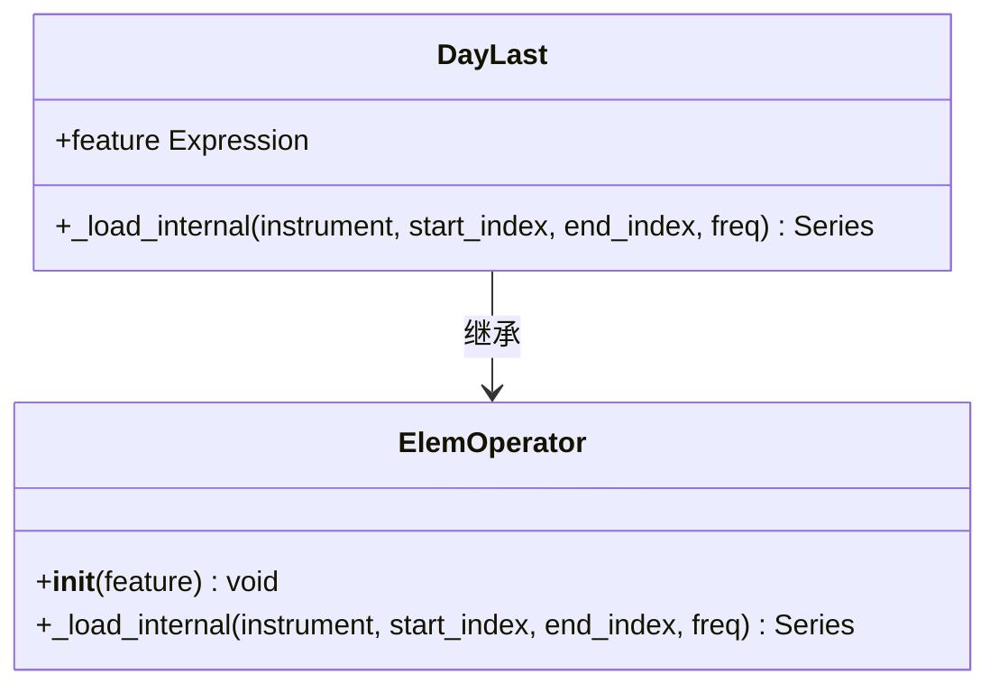
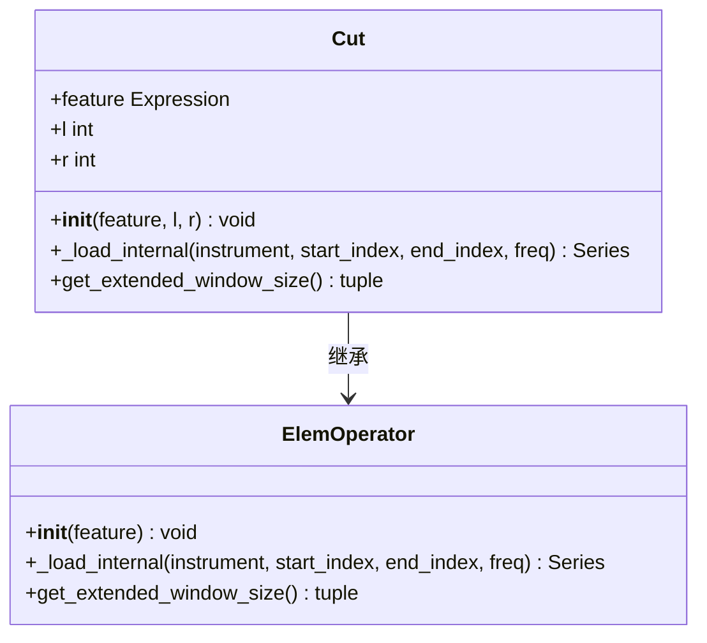
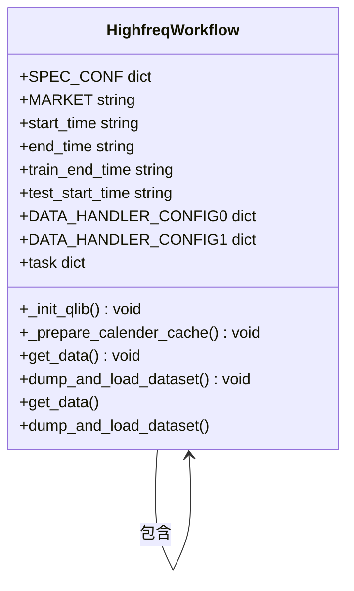
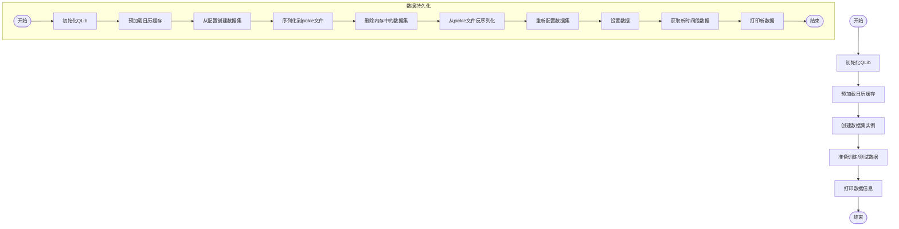

# 高频交易

<cite>
**本文档引用的文件**
- [highfreq_handler.py](file://examples/highfreq/highfreq_handler.py)
- [highfreq_processor.py](file://examples/highfreq/highfreq_processor.py)
- [highfreq_ops.py](file://examples/highfreq/highfreq_ops.py)
- [workflow.py](file://examples/highfreq/workflow.py)
- [executor.py](file://qlib/backtest/executor.py)
</cite>

## 目录
1. [项目结构](#项目结构)
2. [核心组件](#核心组件)
3. [数据处理机制](#数据处理机制)
4. [专用操作符优化](#专用操作符优化)
5. [工作流配置与执行](#工作流配置与执行)
6. [性能优化策略](#性能优化策略)
7. [高频特征处理器自定义](#高频特征处理器自定义)
8. [订单撮合机制](#订单撮合机制)
9. [常见问题解决方案](#常见问题解决方案)

## 项目结构

Qlib的高频交易系统主要位于`examples/highfreq`目录下，包含四个核心模块：数据处理器、特征处理器、专用操作符和工作流示例。该系统专门针对毫秒级行情数据处理进行了优化。



**图表来源**
- [highfreq_handler.py](file://examples/highfreq/highfreq_handler.py)
- [highfreq_processor.py](file://examples/highfreq/highfreq_processor.py)
- [highfreq_ops.py](file://examples/highfreq/highfreq_ops.py)
- [workflow.py](file://examples/highfreq/workflow.py)

**章节来源**
- [highfreq_handler.py](file://examples/highfreq/highfreq_handler.py)
- [highfreq_processor.py](file://examples/highfreq/highfreq_processor.py)
- [highfreq_ops.py](file://examples/highfreq/highfreq_ops.py)
- [workflow.py](file://examples/highfreq/workflow.py)

## 核心组件

高频交易系统由多个协同工作的核心组件构成，包括数据处理器、特征处理器、专用操作符和工作流管理器。这些组件共同实现了对逐笔数据的高效处理和分析。

**章节来源**
- [highfreq_handler.py](file://examples/highfreq/highfreq_handler.py#L4-L100)
- [highfreq_processor.py](file://examples/highfreq/highfreq_processor.py#L7-L75)
- [highfreq_ops.py](file://examples/highfreq/highfreq_ops.py#L10-L166)

## 数据处理机制

### HighFreqHandler实现

`HighFreqHandler`类继承自`DataHandlerLP`，负责毫秒级行情数据的加载和预处理。它通过`get_feature_config`方法定义了特征提取的配置，包括价格和成交量的标准化处理。



**图表来源**
- [highfreq_handler.py](file://examples/highfreq/highfreq_handler.py#L4-L100)

**章节来源**
- [highfreq_handler.py](file://examples/highfreq/highfreq_handler.py#L4-L100)

### HighFreqProcessor实现

`HighFreqNorm`处理器负责对高频特征进行归一化处理。它在`fit`阶段计算训练集的统计特征，在`__call__`阶段应用这些统计量对数据进行标准化。



**图表来源**
- [highfreq_processor.py](file://examples/highfreq/highfreq_processor.py#L7-L75)

**章节来源**
- [highfreq_processor.py](file://examples/highfreq/highfreq_processor.py#L7-L75)

## 专用操作符优化

### DayLast操作符

`DayLast`操作符用于获取每个交易日内最后一个值，这对于计算日终指标至关重要。它通过分组操作实现高效的日终值提取。



**图表来源**
- [highfreq_ops.py](file://examples/highfreq/highfreq_ops.py#L10-L27)

### Cut操作符

`Cut`操作符用于删除序列的前l个和后r个元素，支持窗口截断功能。它还实现了`get_extended_window_size`方法来管理时间窗口的扩展。



**图表来源**
- [highfreq_ops.py](file://examples/highfreq/highfreq_ops.py#L130-L166)

**章节来源**
- [highfreq_ops.py](file://examples/highfreq/highfreq_ops.py#L10-L27)
- [highfreq_ops.py](file://examples/highfreq/highfreq_ops.py#L130-L166)

## 工作流配置与执行

### HighfreqWorkflow实现

`HighfreqWorkflow`类提供了高频交易系统的完整工作流示例，包括QLib初始化、日历缓存预加载、数据获取和数据集持久化等功能。



**图表来源**
- [workflow.py](file://examples/highfreq/workflow.py#L19-L170)

### 工作流执行流程



**图表来源**
- [workflow.py](file://examples/highfreq/workflow.py#L19-L170)

**章节来源**
- [workflow.py](file://examples/highfreq/workflow.py#L19-L170)

## 性能优化策略

### 内存复用技术

系统通过以下方式优化内存使用：
1. 使用`copy-on-write`特性避免子进程重复计算日历
2. 预加载日历缓存以减少重复计算
3. 数据集序列化和反序列化实现状态持久化

### 高频数据加载优化


**章节来源**
- [highfreq_ops.py](file://examples/highfreq/highfreq_ops.py)
- [workflow.py](file://examples/highfreq/workflow.py#L70-L85)

## 高频特征处理器自定义

要自定义高频特征处理器，需要继承`Processor`基类并实现`fit`和`__call__`方法：

```python
class CustomHighFreqProcessor(Processor):
    def __init__(self, fit_start_time, fit_end_time):
        self.fit_start_time = fit_start_time
        self.fit_end_time = fit_end_time
        # 初始化参数
    
    def fit(self, df_features):
        # 在此方法中计算训练集统计量
        pass
    
    def __call__(self, df_features):
        # 在此方法中应用预处理逻辑
        return processed_df
```

**章节来源**
- [highfreq_processor.py](file://examples/highfreq/highfreq_processor.py#L7-L75)

## 订单撮合机制

### SimulatorExecutor实现

`SimulatorExecutor`是高频模式下的核心订单撮合引擎，负责模拟真实市场的交易执行过程。

```mermaid
classDiagram
    class SimulatorExecutor {
        +time_per_step str
        +trade_type str
        +__init__(time_per_step, start_time, end_time, indicator_config, generate_portfolio_metrics, verbose, track_data, common_infra, trade_type) void
        +_get_order_iterator(trade_decision) List[Order]
        +_collect_data(trade_decision, level) Tuple