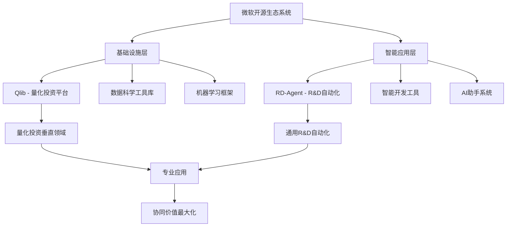
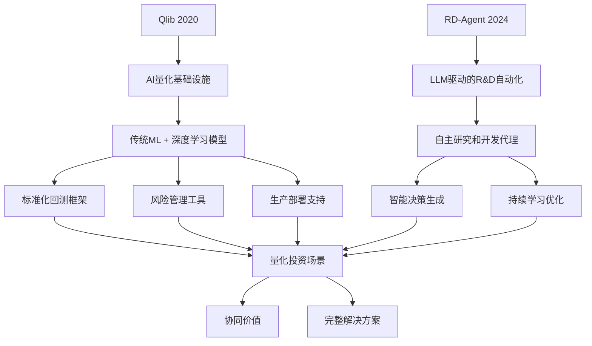
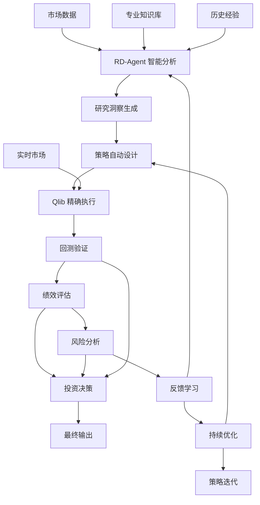
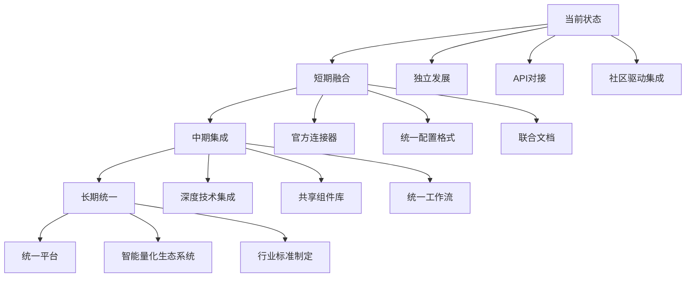
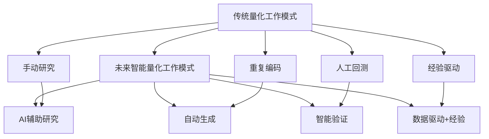

# Qlib 与 RD-Agent 关系分析报告

> 微软开源量化投资生态系统的深度解析

---

## 1. 项目基本信息

### Qlib (已了解)
- **GitHub**: microsoft/qlib (34.1k stars, 5.3k forks)
- **发布时间**: 2020年8月
- **定位**: AI-oriented Quant Investment Platform
- **目标**: 使用 AI 技术赋能量化投资研究
- **核心价值**: 提供完整、专业的量化投资技术基础设施

### RD-Agent (新收集)
- **GitHub**: microsoft/RD-Agent (9.6k stars, 1k forks)
- **发布时间**: 2024年4月
- **定位**: LLM-Agent Framework Towards Autonomous Data Science
- **目标**: 通过大语言模型自动化研究和开发流程
- **核心价值**: 提供智能化、自动化的研究开发框架

### 微软开源生态系统


---

## 2. 技术架构关系

### RD-Agent 的核心架构

根据学术论文信息，RD-Agent 采用双组件架构：

**R 组件 (Research Agent)**
- 负责提出新想法、假设和理论
- 进行文献分析和知识整合
- 生成研究计划和实验设计

**D 组件 (Development Agent)**
- 负责实现和验证这些想法
- 执行代码生成和模型训练
- 进行结果分析和优化建议

### 与 Qlib 的技术连接

**技术演进关系**


### 技术互补性

**1. 基础设施 vs 智能化**
- **Qlib**: 提供了量化投资的技术基础设施
- **RD-Agent**: 在基础设施上增加智能化决策层

**2. 工具化 vs 自动化**
- **Qlib**: 提供专业的工具和框架
- **RD-Agent**: 提供自动化的研究流程

**3. 精确控制 vs 智能推理**
- **Qlib**: 强调精确的控制和可预测的结果
- **RD-Agent**: 强调智能的推理和创新的解决方案

---

## 3. 功能定位对比

### 核心功能对比

| 维度 | Qlib | RD-Agent |
|------|------|----------|
| **核心定位** | 量化投资平台 | R&D自动化框架 |
| **技术基础** | 传统ML + 深度学习 | 大语言模型 + 智能代理 |
| **主要功能** | 模型训练、回测、部署 | 自动研究、智能开发、持续优化 |
| **用户群体** | 量化研究员、数据科学家 | 研究人员、开发者、AI工程师 |
| **应用范围** | 量化投资 | 通用R&D场景（包括量化） |
| **交互方式** | 编程接口 | 自然语言 + 编程接口 |
| **学习模式** | 监督学习、强化学习 | 无监督学习、元学习、在线学习 |
| **部署复杂度** | 中等 | 较高 |
| **可解释性** | 高 | 中等 |

### 应用场景详细分析

#### Qlib 的核心应用场景

**1. 策略开发**
```python
# Qlib 典型工作流
from qlib import init
from qlib.data import D
from qlib.model.gbdt import LGBModel
from qlib.backtest.executor import SimulatorExecutor

# 初始化环境
init(provider_uri='data', redis_host='localhost')

# 数据准备
instruments = D.instruments(market='csi300')
fields = ['$close', '$volume', '$vwap', 'RSI($close)', 'MACD($close)']
df = D.features(instruments, fields, start_time='2020-01-01', end_time='2023-12-31')

# 模型训练
model = LGBModel(loss='mse', learning_rate=0.1)
model.fit(df)

# 回测验证
executor = SimulatorExecutor()
backtest_result = executor.run(model, df)
```

**2. 风险管理**
- 风险建模：市场风险、信用风险、流动性风险
- 组合优化：均值-方差优化、风险平价、最大分散化
- 绩效分析：夏普比率、最大回撤、信息比率

**3. 生产部署**
- 实时预测：高频信号生成、实时风险监控
- 交易执行：智能订单路由、滑点优化
- 监控告警：模型衰退检测、异常交易识别

#### RD-Agent 的核心应用场景

**1. 自动研究**
```python
# RD-Agent 典型工作流（伪代码）
from rd_agent import ResearchAgent, DevelopmentAgent

# 初始化智能代理
research_agent = ResearchAgent(llm_model='gpt-4')
development_agent = DevelopmentAgent(llm_model='gpt-4')

# 自动研究流程
market_insights = research_agent.analyze_market_data(market_data)
research_questions = research_agent.generate_questions(market_insights)
hypotheses = research_agent.form_hypotheses(research_questions)

# 自动开发流程
for hypothesis in hypotheses:
    code = development_agent.generate_code(hypothesis)
    experiment_result = development_agent.run_experiment(code)
    analysis = research_agent.analyze_results(experiment_result)

    if analysis.is_promising():
        refined_code = development_agent.refine_code(code, analysis)
        final_result = development_agent.validate(refined_code)
```

**2. 智能开发**
- 代码生成：自动生成模型代码、数据处理流程
- 模型优化：超参数调优、架构搜索、特征工程
- 实验设计：自动设计实验方案、评估指标选择

**3. 持续进化**
- 学习反馈：从结果中学习改进建议
- 策略迭代：基于市场变化自动调整策略
- 知识积累：构建领域知识库、经验传承

### 在量化领域的协同应用

**协同工作流示例**
```python
class QuantRDAgentPipeline:
    """Qlib 与 RD-Agent 协同工作流"""
    def __init__(self):
        self.rd_agent = RDAgent()  # 研究决策代理
        self.qlib_platform = Qlib()   # 量化执行平台

    def automated_quant_research(self, market_data, research_goal):
        # RD-Agent 负责研究和决策
        research_insights = self.rd_agent.analyze_market(market_data)
        strategy_proposals = self.rd_agent.generate_strategies(
            insights=research_insights,
            goal=research_goal
        )

        # Qlib 负责执行和验证
        results = []
        for strategy in strategy_proposals:
            try:
                # 使用 Qlib 进行精确回测
                backtest_result = self.qlib_platform.run_backtest(
                    strategy, market_data
                )

                # 风险分析
                risk_analysis = self.qlib_platform.analyze_risk(backtest_result)

                results.append({
                    'strategy': strategy,
                    'backtest': backtest_result,
                    'risk': risk_analysis
                })
            except Exception as e:
                self.rd_agent.log_error(e, strategy)

        # 反馈循环
        self.rd_agent.learn_from_results(results)
        return results

    def continuous_optimization(self, strategy, live_data):
        """持续优化策略"""
        # 实时监控策略表现
        performance = self.qlib_platform.monitor_strategy(strategy, live_data)

        # RD-Agent 分析并建议优化
        optimization_suggestions = self.rd_agent.suggest_optimizations(
            strategy, performance, live_data
        )

        # 应用优化建议
        for suggestion in optimization_suggestions:
            if self.rd_agent.confidence(suggestion) > threshold:
                optimized_strategy = self.qlib_platform.apply_optimization(
                    strategy, suggestion
                )
                yield optimized_strategy
```

---

## 4. 协同关系和互补价值

### 技术层面互补

**1. 智能化程度互补**
- **Qlib**: 提供了完整的量化技术基础设施，但需要人工指导
- **RD-Agent**: 提供智能化决策支持，可以减少人工干预

**2. 应用范围互补**
- **Qlib**: 深度聚焦量化投资垂直领域，专业性极强
- **RD-Agent**: 提供通用R&D自动化能力，可应用于多个领域

**3. 交互方式互补**
- **Qlib**: 专业编程接口，精确控制，适合专业用户
- **RD-Agent**: 自然语言交互，降低使用门槛，适合更广泛用户

### 业务价值协同

**完整业务流程**


**1. 降低门槛**
- RD-Agent 的自然语言交互使非编程专家也能使用量化投资技术
- Qlib 提供的专业执行保证结果的可靠性
- 组合使用可以让更多用户受益于量化投资技术

**2. 提升效率**
- RD-Agent 自动化研究流程，减少人工重复工作
- Qlib 优化的执行引擎保证计算效率
- 智能化 + 高效执行 = 大幅提升生产力

**3. 增强智能**
- RD-Agent 的学习能力持续改进研究质量
- Qlib 的丰富模型库提供多样化解决方案
- 两者结合可以实现1+1>2的效果

**4. 风险控制**
- Qlib 提供专业的风险管理工具
- RD-Agent 可以实时监控并预警风险
- 多层次的风险控制机制

### 经济价值分析

**1. 研发成本降低**
```python
# 成本效益分析示例
class CostBenefitAnalysis:
    def __init__(self):
        self.traditional_costs = {
            'researcher_salary': 150000,  # 研究员年薪
            'time_to_strategy': 90,        # 策略开发时间（天）
            'iteration_cycles': 5,         # 迭代次数
            'infrastructure_cost': 50000   # 基础设施成本
        }

        self.rd_qlib_costs = {
            'researcher_salary': 150000,
            'time_to_strategy': 30,        # 降低到30天
            'iteration_cycles': 2,         # 减少到2次
            'infrastructure_cost': 70000,  # 略高的基础设施成本
            'ai_tooling_cost': 30000      # AI工具成本
        }

    def calculate_savings(self):
        traditional_total = sum(self.traditional_costs.values())
        rd_qlib_total = sum(self.rd_qlib_costs.values())

        savings = traditional_total - rd_qlib_total
        savings_percentage = savings / traditional_total * 100

        return {
            'traditional_cost': traditional_total,
            'rd_qlib_cost': rd_qlib_total,
            'savings': savings,
            'savings_percentage': savings_percentage
        }
```

**2. 创新加速**
- 快速假设验证和迭代
- 自动化的文献调研和知识整合
- 智能化的特征工程和模型选择

**3. 质量提升**
- 减少人工错误和偏见
- 更全面的风险分析
- 更持续的策略监控和优化

---

## 5. 实际应用案例

### 案例1: 智能因子挖掘

**传统方式**
```python
# 传统因子挖掘方式
def traditional_factor_mining():
    # 1. 手动研究学术文献
    papers = manual_literature_search("quantitative factors")

    # 2. 手动实现因子
    factors = []
    for paper in papers:
        factor = manual_factor_implementation(paper.method)
        factors.append(factor)

    # 3. 手动回测验证
    valid_factors = []
    for factor in factors:
        backtest_result = qlib_backtest(factor)
        if backtest_result.sharpe_ratio > threshold:
            valid_factors.append(factor)

    return valid_factors
```

**RD-Agent + Qlib 方式**
```python
# 智能化因子挖掘方式
def intelligent_factor_mining():
    # 1. RD-Agent 自动研究
    research_agent = ResearchAgent()
    factor_ideas = research_agent.discover_factors_from_literature()

    # 2. RD-Agent 自动生成因子代码
    development_agent = DevelopmentAgent()
    candidate_factors = []
    for idea in factor_ideas:
        factor_code = development_agent.generate_factor_code(idea)
        candidate_factors.append(factor_code)

    # 3. Qlib 高效回测
    valid_factors = []
    for factor in candidate_factors:
        try:
            # 使用 Qlib 的优化回测引擎
            backtest_result = qlib_fast_backtest(factor)
            risk_metrics = qlib_risk_analysis(backtest_result)

            # 综合评估
            if is_valid_factor(backtest_result, risk_metrics):
                valid_factors.append(factor)
        except Exception as e:
            development_agent.learn_from_error(e, factor)

    # 4. 反馈学习
    research_agent.learn_from_results(valid_factors)
    return valid_factors
```

### 案例2: 自适应策略优化

**市场环境变化响应**
```python
class AdaptiveStrategyOptimizer:
    def __init__(self):
        self.rd_agent = RD-Agent()
        self.qlib = Qlib()
        self.market_state_detector = MarketStateDetector()

    def adaptive_optimization(self, current_strategy, market_data):
        # 1. 检测市场状态变化
        market_state = self.market_state_detector.detect(market_data)

        if market_state.has_changed:
            # 2. RD-Agent 分析变化影响
            impact_analysis = self.rd_agent.analyze_market_impact(
                current_strategy, market_state
            )

            if impact_analysis.requires_optimization:
                # 3. 生成优化建议
                optimizations = self.rd_agent.generate_optimizations(
                    current_strategy, impact_analysis
                )

                # 4. 使用 Qlib 验证优化方案
                best_optimization = None
                best_score = -float('inf')

                for optimization in optimizations:
                    # 快速验证
                    test_result = self.qlib.quick_validation(
                        current_strategy, optimization
                    )

                    if test_result.score > best_score:
                        best_score = test_result.score
                        best_optimization = optimization

                # 5. 应用最佳优化
                if best_optimization:
                    optimized_strategy = self.qlib.apply_optimization(
                        current_strategy, best_optimization
                    )

                    # 6. 部署前最终验证
                    final_validation = self.qlib.comprehensive_backtest(
                        optimized_strategy, market_data
                    )

                    if final_validation.is_acceptable:
                        return optimized_strategy

        return current_strategy
```

### 案例3: 风险智能管理

**多层次风险监控系统**
```python
class IntelligentRiskManager:
    def __init__(self):
        self.rd_agent = RD-Agent()
        self.qlib_risk = QlibRiskModule()
        self.market_monitor = MarketMonitor()

    def comprehensive_risk_management(self, portfolio, market_data):
        # 1. 实时基础风险监控 (Qlib)
        basic_risks = self.qlib_risk.calculate_basic_risks(portfolio)

        # 2. 市场异常检测
        market_anomalies = self.market_monitor.detect_anomalies(market_data)

        # 3. RD-Agent 智能风险分析
        risk_insights = self.rd_agent.analyze_portfolio_risks(
            portfolio, market_data, basic_risks, market_anomalies
        )

        # 4. 预测性风险评估
        predictive_risks = self.rd_agent.predict_future_risks(
            portfolio, risk_insights, market_anomalies
        )

        # 5. 生成风险应对策略
        risk_responses = self.rd_agent.generate_risk_responses(
            basic_risks, predictive_risks, portfolio
        )

        # 6. 验证风险应对效果
        validated_responses = []
        for response in risk_responses:
            test_result = self.qlib_risk.simulate_risk_response(
                portfolio, response, market_data
            )

            if test_result.effectiveness > threshold:
                validated_responses.append(response)

        return {
            'current_risks': basic_risks,
            'predictive_risks': predictive_risks,
            'risk_insights': risk_insights,
            'recommended_actions': validated_responses
        }
```

---

## 6. 未来发展方向

### 技术融合趋势

**1. 深度集成**


**具体融合计划**
- **API标准化**: 统一的调用接口和数据格式
- **配置一体化**: 支持从一个配置文件生成完整的实验方案
- **工作流集成**: 从研究到部署的无缝衔接
- **知识共享**: 模型、策略、经验的自动共享机制

**2. 生态协同**
- **共享模型库**: 构建统一的量化模型和策略库
- **数据标准**: 制定行业数据标准和接口规范
- **社区建设**: 建立统一的开发者社区和知识分享平台
- **工具链完善**: 提供从数据到决策的完整工具链

**3. 智能演进**
- **认知智能**: 从数据处理提升到认知理解
- **自适应学习**: 根据环境变化自动调整策略
- **协作智能**: 多代理协作完成复杂任务
- **创造性能力**: 生成创新的交易策略和风险管理方法

### 应用场景扩展

**1. 智能量投平台**
```python
class IntelligentQuantPlatform:
    """智能量化投资平台愿景"""
    def __init__(self):
        self.natural_language_interface = NaturalLanguageInterface()
        self.research_engine = RD-Agent()
        self.execution_engine = Qlib()
        self.knowledge_graph = QuantKnowledgeGraph()

    def natural_language_quant_research(self, user_query):
        # 自然语言理解
        parsed_query = self.natural_language_interface.parse(user_query)

        # 智能研究
        research_plan = self.research_engine.create_research_plan(parsed_query)

        # 自动执行
        results = []
        for step in research_plan:
            if step.type == 'analysis':
                result = self.research_engine.analyze(step.data)
            elif step.type == 'backtest':
                result = self.execution_engine.run_backtest(step.strategy)
            elif step.type == 'optimization':
                result = self.research_engine.optimize(step.model)

            results.append(result)

        # 知识图谱更新
        self.knowledge_graph.update_with_results(results)

        # 生成报告
        return self.generate_comprehensive_report(results)
```

**2. 教育和培训**
- **智能学习助手**: 个性化的量化投资学习路径
- **实践环境**: 安全的实盘模拟和学习环境
- **知识评估**: 智能化的技能评估和提升建议

**3. 研究协作**
- **分布式研究**: 多团队协作的研究平台
- **知识共享**: 研究成果的自动整理和分享
- **智能项目管理**: 自动化的研究项目管理和进度跟踪

### 技术挑战和解决方案

**1. 技术挑战**
- **集成复杂性**: 两个复杂系统的深度集成
- **性能优化**: 智能化和执行效率的平衡
- **可靠性保证**: 智能化决策的可靠性和可解释性
- **安全性**: 智能系统的安全性和隐私保护

**2. 解决方案**
```python
class RobustIntegrationFramework:
    """健壮的集成框架"""
    def __init__(self):
        self.error_handler = ErrorHandler()
        self.performance_monitor = PerformanceMonitor()
        self.explainer = Explainer()
        self.security_manager = SecurityManager()

    def safe_integrated_execution(self, task):
        try:
            # 预执行检查
            safety_check = self.security_manager.validate_task(task)
            if not safety_check.is_safe:
                raise SafetyException(safety_check.reasons)

            # 执行监控
            with self.performance_monitor.monitor():
                result = self.execute_integrated_task(task)

            # 可解释性保证
            explanation = self.explainer.explain(result, task)

            return {
                'result': result,
                'explanation': explanation,
                'performance_metrics': self.performance_monitor.get_metrics()
            }

        except Exception as e:
            error_analysis = self.error_handler.analyze_error(e, task)
            fallback_strategy = self.error_handler.suggest_fallback(error_analysis)

            return {
                'error': str(e),
                'analysis': error_analysis,
                'fallback': fallback_strategy
            }
```

---

## 7. 行业影响和发展前景

### 对量化投资行业的影响

**1. 降低行业门槛**
- **技术民主化**: 让更多机构和个人能够参与量化投资
- **成本降低**: 大幅降低量化投资的研发和运营成本
- **效率提升**: 显著提高策略开发和迭代的效率

**2. 改变工作模式**


**3. 创新加速**
- **策略创新**: AI可以发现人类难以发现的策略模式
- **风险管理**: 更全面和实时的风险识别和应对
- **产品创新**: 催生新的量化投资产品和服务

### 市场前景预测

**1. 短期影响 (1-2年)**
- 技术集成和标准化
- 早期应用者的竞争优势
- 行业标准和规范的建立

**2. 中期影响 (2-5年)**
- 智能量投平台的普及
- 传统量化机构的转型
- 新的商业模式和服务

**3. 长期影响 (5+年)**
- 量化投资生态的重构
- AI原生量化策略的兴起
- 行业整体智能化水平提升

### 投资建议

**对于不同类型的机构**

**1. 大型量化机构**
- 逐步引入智能化工具，保持竞争优势
- 投资基础设施升级和人才培养
- 探索AI与人类专家的最佳协作模式

**2. 中小型量化机构**
- 利用开源工具快速提升技术能力
- 专注于细分领域的专业化发展
- 考虑与技术服务商合作降低成本

**3. 新进入者**
- 利用智能化工具降低进入门槛
- 专注于创新策略和数据优势
- 重视合规和风险管理建设

---

## 8. 实施建议和最佳实践

### 技术实施路线图

**阶段一: 基础集成 (0-6个月)**
```python
# 阶段一实施计划
class PhaseOneImplementation:
    """基础集成阶段"""
    def __init__(self):
        self.implementation_steps = [
            '环境搭建和依赖管理',
            '基础API对接',
            '数据格式标准化',
            '简单工作流验证',
            '性能基准测试'
        ]

    def execute(self):
        results = {}
        for step in self.implementation_steps:
            try:
                result = self.execute_step(step)
                results[step] = 'success'
            except Exception as e:
                results[step] = f'failed: {e}'
                break  # 失败时停止，确保基础稳定

        return results
```

**阶段二: 深度集成 (6-12个月)**
- 统一工作流引擎
- 智能化决策集成
- 性能优化和稳定性提升

**阶段三: 全面应用 (12+个月)**
- 生产环境部署
- 持续优化和改进
- 新功能开发和扩展

### 最佳实践建议

**1. 团队建设**
```python
class TeamBuildingGuide:
    """团队建设指导"""
    def recommend_team_structure(self, organization_size):
        if organization_size == 'large':
            return {
                'AI研究团队': ['ML研究员', 'LLM专家', '数据科学家'],
                '量化团队': ['量化研究员', '策略师', '风控专家'],
                '技术团队': ['软件工程师', 'DevOps工程师', '系统架构师'],
                '产品团队': ['产品经理', '业务分析师', '合规专家']
            }
        elif organization_size == 'medium':
            return {
                '核心团队': ['量化研究员', 'ML工程师', '软件工程师'],
                '支持角色': ['风控专家', '产品经理']
            }
        else:  # small
            return {
                '多面手': ['具备多技能的量化工程师'],
                '外部支持': ['技术顾问', '云服务提供商']
            }
```

**2. 风险管理**
- **技术风险**: 建立完善的测试和验证机制
- **模型风险**: 实施多重验证和回测机制
- **操作风险**: 建立标准化的操作流程和监控
- **合规风险**: 确保符合监管要求和行业标准

**3. 数据管理**
- **数据质量**: 建立完善的数据清洗和验证流程
- **数据安全**: 实施严格的数据访问和加密措施
- **数据治理**: 建立清晰的数据所有权和使用规范

**4. 监控和运维**
```python
class MonitoringSystem:
    """智能监控系统"""
    def __init__(self):
        self.performance_monitor = PerformanceMonitor()
        self.error_detector = ErrorDetector()
        self.alert_system = AlertSystem()
        self.auto_recovery = AutoRecovery()

    def monitor_integrated_system(self):
        while True:
            # 性能监控
            performance_metrics = self.performance_monitor.collect()

            # 异常检测
            anomalies = self.error_detector.detect_anomalies(performance_metrics)

            # 告警处理
            if anomalies:
                alert_info = self.alert_system.generate_alert(anomalies)

                # 自动恢复
                if self.auto_recovery.can_handle(anomalies):
                    recovery_result = self.auto_recovery.execute_recovery(anomalies)
                    if recovery_result.success:
                        continue
                    else:
                        self.alert_system.escalate_to_human(alert_info)
                else:
                    self.alert_system.notify_team(alert_info)

            time.sleep(monitoring_interval)
```

---

## 9. 结论与展望

### 关键洞察总结

**1. 技术互补性强**
- Qlib 提供了量化投资的技术基础设施，专业性强、可靠性高
- RD-Agent 提供了智能化的决策支持，创新性强、自动化程度高
- 两者结合可以形成完整的量化投资解决方案，实现1+1>2的效果

**2. 市场定位差异化**
- Qlib 深度聚焦量化投资垂直领域，积累了丰富的领域知识
- RD-Agent 提供通用的R&D自动化能力，具有更广泛的应用前景
- 在量化领域形成有力互补，既保证专业性又提升智能化

**3. 发展潜力巨大**
- 代表了从工具化到智能化的演进方向，符合行业发展趋势
- 有望改变量化投资的工作模式，显著提升行业效率
- 为行业发展提供了新的可能性，推动行业整体进步

### 战略建议

**对于微软**
- **深度整合**: 将两个项目进行深度集成，形成统一的智能量化平台
- **生态建设**: 围绕集成平台建设完整的生态系统
- **标准制定**: 推动行业标准和规范的建立，巩固领导地位

**对于量化机构**
- **积极拥抱**: 主动学习和应用新技术，保持竞争优势
- **循序渐进**: 从简单应用开始，逐步深化集成程度
- **人才培养**: 投资团队培训，提升整体技术水平

**对于开发者社区**
- **贡献代码**: 积极参与开源项目，推动技术发展
- **分享经验**: 建立知识共享机制，促进最佳实践传播
- **创新应用**: 探索新的应用场景和商业模式

### 未来展望

**技术发展趋势**
- **更深度的AI集成**: 从辅助决策到自主决策的演进
- **更广泛的应用场景**: 从量化投资到更多领域的扩展
- **更完善的生态系统**: 从工具到平台的转变

**行业发展前景**
- **智能化普及**: 量化投资智能化的全面普及
- **竞争格局变化**: 新兴技术驱动的竞争格局重塑
- **服务模式创新**: 基于新技术的新型服务模式

**社会价值创造**
- **金融服务普惠**: 让更多投资者受益于先进技术
- **风险管理提升**: 提升金融系统的风险管理能力
- **创新驱动发展**: 推动金融科技的创新和发展

### 最终评价

Qlib 和 RD-Agent 的结合代表了微软在 AI 驱动金融科技领域的重要布局。这两个项目不仅仅是技术工具的简单组合，而是代表了完整的智能化量化投资解决方案的雏形。

**核心价值**:
1. **技术领导力**: 巩固了微软在AI金融科技领域的领导地位
2. **生态影响力**: 构建了开源的量化投资生态系统
3. **创新推动力**: 推动了整个行业向智能化方向转型

随着技术的不断发展和应用的深入，Qlib 和 RD-Agent 的协同效应将会越来越明显，有望成为智能量化投资领域的事实标准，为整个行业的发展做出重要贡献。

---

*本报告基于公开信息和技术分析，为读者提供全面的 Qlib 与 RD-Agent 关系分析。具体实施时请结合实际情况进行详细评估和规划。*