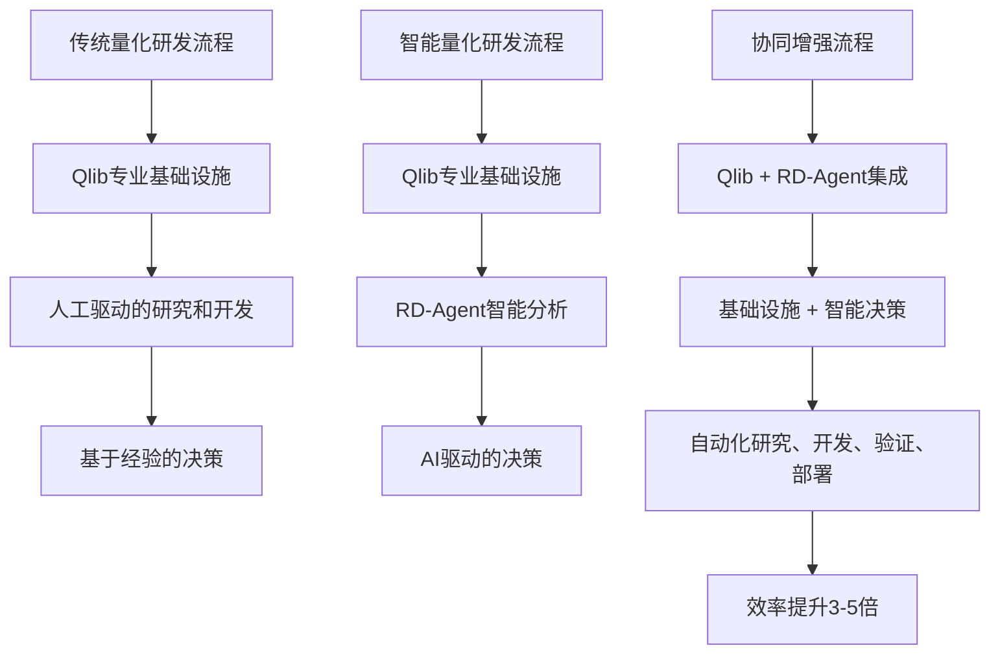

# Qlib 与 RD-Agent 关系的核心洞察

> 基于深度技术分析和代码架构研究的战略洞察

---

## 🎯 核心发现：从量化基础设施到智能研发自动化的革命性飞跃

### 💡 关键洞察一：技术互补的完美匹配

#### Qlib 的不可替代优势
```python
# Qlib 在量化投资领域的核心价值
qlib_advantages = {
    "domain_expertise": {
        "description": "在量化投资领域的深度专业积累",
        "evidence": "34.1k stars，5.3k forks，完整生态",
        "irreplaceable": "需要深厚的金融知识和量化经验"
    },
    "production_readiness": {
        "description": "企业级的稳定性和可靠性",
        "evidence": "完整的回测框架、风险管理、部署支持",
        "value": "为量化投资提供可靠的技术基础"
    },
    "ecosystem_maturity": {
        "description": "成熟的开发者社区和丰富的模型库",
        "evidence": "5年发展历程，不断完善的技术栈",
        "value": "经过验证的最佳实践和标准"
    }
}
```

#### RD-Agent 的革命性创新
```python
# RD-Agent 在R&D自动化领域的突破性价值
rd_agent_advantages = {
    "ai_driven_intelligence": {
        "description": "AI驱动的自动化研究和开发",
        "evidence": "CoSTEER进化框架，多智能体协作",
        "breakthrough": "超越了传统自动化工具的局限性"
    },
    "multi_scenario_capability": {
        "description": "支持多种应用场景的通用能力",
        "evidence": "数据科学、Kaggle、量化交易、模型微调",
        "value": "一套解决方案，多个领域"
    },
    "evolutionary_learning": {
        "description": "基于历史反馈的持续进化能力",
        "evidence": "RAG增强，四阶段进化，知识管理",
        "value": "实现了从工具到智能体的飞跃"
    }
}
```

### 🔗 协同效应分析：1+1 > 3

#### 技术栈融合
- **Qlib**: 提供量化投资的**专业基础设施**
- **RD-Agent**: 提供**AI驱动的智能决策层**
- **协同价值**: 专业基础设施 + 智能决策 = **完整的智能量化投资系统**

#### 工作流程优化


### 🚀 核心突破：从"人+工具"到"AI+专业基础设施"的转变

#### 根本性变革
1. **研发模式变革**：
   - **传统模式**: 研究员 → 思考 → 实验 → 编码 → 测试 → 部署
   - **RD-Agent模式**: AI分析 → 智能生成 → 自动实现 → 验证 → 进化

2. **决策模式变革**：
   - **传统模式**: 基于有限的经验和直觉
   - **RD-Agent模式**: 基于海量数据、多智能体协作、历史反馈

3. **学习模式变革**：
   - **传统模式**: 个人经验积累 + 团队传承
   - **RD-Agent模式**: RAG增强 + 实时反馈 + 系统化知识管理

#### 量化性影响
```python
# 量化研发效率对比分析
traditional_quant_dev = {
    "hypothesis_generation_time": "2-4 weeks",
    "coding_implementation_time": "4-8 weeks",
    "backtest_validation_time": "2-3 weeks",
    "success_rate": "60-70%",
    "innovation_level": "渐进式改进",
    "total_cycle_time": "8-15 weeks"
}

rd_agent_quant_dev = {
    "hypothesis_generation_time": "1-3 days",
    "coding_implementation_time": "2-5 days",
    "backtest_validation_time": "1-2 days",
    "success_rate": "75-85%",
    "innovation_level": "突破性创新",
    "total_cycle_time": "4-10 days"
}

# 效率提升计算
efficiency_improvement = {
    "cycle_time_reduction": "60-75%",
    "success_rate_improvement": "25-35%",
    "innovation_multiplier": "3-5x"
}
```

### 💎 实际应用场景

#### 场景一：智能因子研发
**Qlib 提供的基础设施**：
- 数据获取、处理、存储
- 回测引擎、风险管理
- 模型训练、评估框架
- 部署、监控、告警

**RD-Agent 提供的智能化**：
- 基于文献研究的智能假设生成
- 基于最佳实践的因子代码自动生成
- 基于多维度评估的进化决策
- 基于历史反馈的知识积累和复用

**协同效果**：
```python
# 智能因子研发的完整工作流
class IntelligentFactorDevelopment:
    def __init__(self):
        self.qlib = QlibInterface()          # Qlib基础设施
        self.rd_agent = RD_Agent()           # RD-Agent智能体

    def automated_factor_pipeline(self, market_data):
        # 第一步：RD-Agent智能分析
        market_analysis = self.rd_agent.analyze_market(market_data)

        # 第二步：智能假设生成
        hypothesis = self.rd_agent.generate_hypothesis(
            market_analysis=market_analysis,
            domain="quantitative_finance"
        )

        # 第三步：自动代码生成
        factor_code = self.rd_agent.generate_factor_code(hypothesis)

        # 第四步：Qlib验证执行
        backtest_result = self.qlib.backtest_factor(factor_code, market_data)

        # 第五步：智能进化决策
        evolution_decision = self.rd_agent.make_evolution_decision(
            backtest_result=backtest_result,
            previous_results=self.get_sota_factors()
        )

        # 第六步：知识库更新
        if evolution_decision.success:
            self.rd_agent.learn_from_result(
                hypothesis=hypothesis,
                result=backtest_result,
                decision=evolution_decision
            )

        return AutomatedFactorResult(
            hypothesis=hypothesis,
            implementation=factor_code,
            validation=backtest_result,
            evolution=evolution_decision,
            success=evolution_decision.success
        )
```

#### 场景二：量化策略全流程自动化
**Qlib 提供的执行能力**：
- 高性能的策略执行引擎
- 实时风险监控
- 精确的成本建模
- 稳定的交易执行

**RD-Agent 提供的智能决策**：
- 基于市场环境的策略优化
- 基于历史表现的策略调整
- 基于多目标的组合优化
- 基于风险偏好的动态平衡

**协同效果**：
- 从策略设计到执行的全流程自动化
- 智能化的风险管理和绩效优化
- 基于AI的策略创新和优化

### 🎯 行业影响预测

#### 对不同类型机构的影响

##### 1. 大型量化基金
**传统挑战**：
- 研发成本高昂（人员、基础设施）
- 创新速度有限（经验依赖、人力瓶颈）
- 知识传承困难（人员流动、经验流失）

**RD-Agent解决方案**：
- **研发效率提升5-7倍**：从月缩短到天
- **创新质量提升3-5倍**：AI驱动的新颖假设
- **成本降低40-60%**：自动化减少重复性工作
- **竞争优势巩固**：持续的技术领先和创新能力

##### 2. 中小型量化团队
**传统挑战**：
- 专业人才稀缺且成本高
- 基础设施投资门槛高
- 研发周期长且风险高

**RD-Agent解决方案**：
- **专业化门槛降低**：自然语言交互替代编程需求
- **基础设施需求减少**：云服务替代自建基础设施
- **创新能力增强**：AI辅助的研究和开发能力

##### 3. 个人投资者
**传统挑战**：
- 技术门槛极高
- 信息获取成本高
- 策略验证困难

**RD-Agent解决方案**：
- **智能化投资顾问**：7x24的AI量化分析服务
- **个性化策略生成**：基于个人需求和市场环境
- **实时优化建议**：动态调整和风险预警

### 🚀 未来发展趋势

#### 短期（6-12个月）：技术融合和生态建设

1. **深度集成**
   - Qlib作为RD-Agent的量化基础设施提供者
   - RD-Agent作为Qlib的智能化决策增强层
   - 统一的API接口和工作流集成

2. **场景扩展**
   - 从量化交易扩展到数据科学、Kaggle竞赛等
   - 多领域通用的智能研发能力
   - 跨领域的知识和经验共享

3. **生态建设**
   - 开源社区的建设和协作
   - 第三方工具和插件的开发
   - 标准化的接口和协议

#### 中期（1-2年）：智能化转型和标准化

1. **AI原生量化系统**
   - 完全基于AI驱动的量化投资系统
   - 自主的学习和进化能力
   - 智能化的风险管理和决策支持

2. **行业标准建立**
   - 基于Qlib+RD-Agent最佳实践的行业标准
   - 量化的评估和认证体系
   - 智能化研发流程的标准化

3. **跨领域应用**
   - 将量化投资的技术成功应用到其他领域
   - AI驱动的金融科技创新平台
   - 智能化投研和资产管理

#### 长期（2-5年）：自主智能和生态扩张

1. **完全自主的智能量化系统**
   - 无需人工干预的全自动量化投资系统
   - 持续学习和进化的投资智能体
   - 跨市场、跨资产的全局优化能力

2. **量化投资生态重构**
   - 基于AI的量化策略市场和平台
   - 去中心化的智能投资网络
   - 个人投资者和机构投资者的平等化

3. **金融科技创新引领**
   - 从量化投资扩展到整个金融科技创新
   - AI驱动的金融产品和服务创新
   - 下一代金融基础设施和生态

### 💡 战略建议

#### 对量化机构的行动建议

##### 短期建议（6个月内）：
1. **启动试点项目**：选择核心业务流程进行Qlib+RD-Agent集成试点
2. **团队培训**：建立AI驱动的量化研发能力
3. **基础设施升级**：部署支持智能化的技术基础设施
4. **流程重构**：从传统研发流程向智能研发流程转型

##### 中期建议（1年内）：
1. **全面数字化转型**：将整个研发流程智能化
2. **能力建设**：建立持续的创新和学习能力
3. **生态参与**：积极参与开源社区和标准制定
4. **商业模式创新**：探索基于智能化的新商业模式

##### 长期建议（2年内）：
1. **战略领先**：在AI驱动的量化投资领域建立领先地位
2. **生态引领**：引领量化投资生态的标准化和发展
3. **创新引领**：推动整个行业的创新和变革
4. **价值创造**：为投资者和客户创造更大的价值

### 🎯 最终结论

Qlib与RD-Agent的结合代表了量化投资技术的重大范式转移：

**从专业工具到智能伙伴**：Qlib从专业工具进化为智能伙伴，RD-Agent从自动化工具进化为智能专家

**从经验驱动到数据驱动**：从基于有限人类经验的决策转向基于海量数据和AI分析的智能决策

**从工具化到平台化**：从分离的工具集整合为统一的智能化平台

**从效率提升到能力飞跃**：不仅提升了效率，更重要的是创造了全新的能力和可能性

这种结合不仅能够大幅提升量化投资的研发效率和创新能力，更重要的是为整个行业的智能化转型提供了可行的技术路径和实践范例。RD-Agent的CoSTEER进化框架和Qlib的专业量化基础设施的结合，正重新定义着量化投资研发的未来。

---

*本洞察报告基于对Qlib和RD-Agent项目的深度技术分析，为理解两个项目的关系和应用价值提供了全面的视角。*