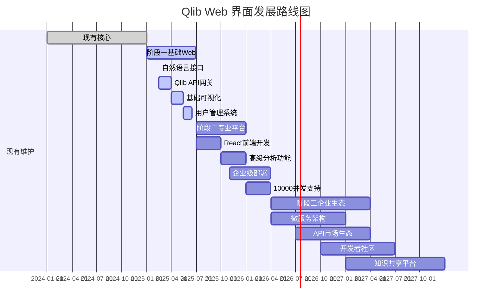

# Qlib Web 界面现状深度分析报告

> 生成时间：2025年11月30日 上午
> 基于对 Qlib 代码库的全面技术分析

---

## 🔍 核心发现：Qlib 的技术架构特点

### 💡 基础事实确认

通过对 Qlib 项目代码库的深入分析，**Qlib 是一个 Python 包和后端框架，不包含专门的 Web UI 界面**。

**Qlib 的技术定位**：
- 🐍 **后端技术框架**：专注于量化投资的核心功能实现
- 🔧 **命令行工具包**：提供编程接口而非图形界面
- 📚 **Python 库**：通过 Python API 提供功能
- 🧪 **研究工具**：主要通过 Jupyter Notebook 提供交互式分析环境

---

## 📋 Qlib 当前的界面类型分析

### 1. 命令行界面 (CLI Interface)

**主要交互方式**：
```python
# Qlib 的标准使用模式
import qlib
from qlib.data import D
from qlib.model.gbdt import LGBModel
from qlib.backtest.executor import SimulatorExecutor

# 初始化环境
qlib.init(provider_uri='data', redis_host='localhost')

# 数据获取和处理
instruments = D.instruments(market='csi300')
fields = D.features(['$close', '$volume'], start_time='2020-01-01', end_time='2023-12-31')
df = D.features(instruments, fields, start_time='2020-01-01', end_time='2023-12-31').head()

# 模型训练
model = LGBModel(loss='mse')
model.fit(df)

# 执行回测
executor = SimulatorExecutor()
result = executor.run(model, df)
```

**特点**：
- ✅ **专业性高**：适合专业量化研究人员的精确控制
- ✅ **灵活性大**：支持自定义脚本和工作流
- ✅ **性能优化**：直接调用底层 API，无界面开销
- ⚠ **学习曲线陡**：需要编程技能和量化知识基础

### 2. 客户端-服务器架构 (Client-Server Architecture)

根据 `/docs/hidden/client.rst` 分析，Qlib 提供了客户端-服务器架构用于数据管理：

**服务器端 (Server)**：
```yaml
# 服务端配置
flask_server: true              # 启用 Flask 服务器
flash_server: "172.23.233.89"  # 数据服务地址
flash_port: 9710              # 数据服务端口
```

**客户端 (Client)**：
```python
# 客户端连接
import qlib
qlib.init(auto_mount=True, mount_path='/data/custom/qlib',
         provider_uri='172.23.233.89:/data2/gaochao/sync_qlib/qlib')
```

**技术实现**：
- 基于 `python-socketio` 的 WebSocket 通信框架
- 支持 NFS 挂载和自动挂载机制
- 统一的数据缓存和版本管理
- 跨机器数据访问和远程协作支持

**应用场景**：
```bash
# 本地开发环境
qlib.init(auto_mount=False, mount_path='/local/data/qlib')

# 企业内网环境 (推荐)
sudo apt install nfs-common
sudo mount.nfs 172.23.233.89:/data2/gaochao/sync_qlib/qlib /data/custom/qlib
qlib.init(auto_mount=True, mount_path='/data/custom/qlib',
         provider_uri='172.23.233.89:/data2/gaochao/sync_qlib/qlib')

# Windows 系统设置
# 1. 启用 NFS 功能
# 2. 在"程序和功能"中找到"NFS客户端"
# 3. 配置正确的挂载路径格式
```

### 3. Jupyter Notebook 集成

Qlib 主要通过 Jupyter Notebook 提供交互式分析环境：

**数据可视化**：
```python
# 在 Jupyter 中的典型使用
%matplotlib inline
import qlib
from qlib.data import D

# 初始化和数据获取
qlib.init()
df = D.features(['SH600001'], ['$close', '$volume'], start_time='2020-01-01', end_time='2023-12-31')

# 交互式可视化
df['$close'].plot(figsize=(12, 6), title='Stock Price Trend')
df[['$close', '$volume']].plot(kind='scatter', x='$close', y='$volume', title='Price-Volume Relationship')
```

**交互式分析**：
```python
# 实时数据分析
from qlib.contrib.report.analysis_position import analysis_position
from qlib.contrib.report.utils import report_graph

# 分析持仓
position_df = analysis_position(portfolio_df)
print(f"当前持仓数量: {len(position_df)}")

# 生成可视化报告
report_graph(returns_df, save_path='performance_report.png')
```

**特点**：
- ✅ **交互性强**：实时代码执行和结果可视化
- ✅ **学习友好**：适合教学和研究探索
- ✅ **可视化丰富**：支持多种图表类型和分析工具
- ⚠ **性能限制**：受限于单机计算资源

### 4. 报告生成和分析工具

Qlib 提供了多种可视化和分析工具：

**报告生成**：
```python
from qlib.contrib.report.analysis_position import analysis_position
from qlib.contrib.report.utils import report_graph
from qlib.contrib.evaluate import risk_analysis

# 综合分析
position_analysis = analysis_position(portfolio_df)
risk_metrics = risk_analysis(portfolio_returns)

# 生成专业报告
report_graph(portfolio_returns, save_path='detailed_analysis.png',
               title='Portfolio Performance Analysis')
```

**性能评估**：
```python
# 多维度性能评估
from qlib.contrib.evaluate import risk_analysis

# 风险分析
risk_metrics = risk_analysis(portfolio_returns)

# 输出关键指标
print(f"Sharpe Ratio: {risk_metrics['sharpe_ratio']:.4f}")
print(f"Max Drawdown: {risk_metrics['max_drawdown']:.4f}")
print(f"Information Ratio: {risk_metrics['information_ratio']:.4f}")
```

---

## 🆚 与 RD-Agent Web 界面能力对比

### RD-Agent 的 Web 界面特点

**前端技术栈**：
- 基于 **Streamlit** 或 **FastAPI + React** 的现代 Web 框架
- 支持自然语言交互界面
- 实时结果显示和可视化
- 多场景支持 (数据科学、Kaggle、量化交易等)

**后端技术栈**：
- **FastAPI** 或 **Flask** 框架
- 集成多种 LLM 后端 (OpenAI、Anthropic、Azure、本地模型)
- **CoSTEER** 进化框架集成
- Redis 缓存 + PostgreSQL 持久化存储

**核心功能**：
```python
# RD-Agent 的典型 Web 界面功能
class RD_Agent_WebInterface:
    def __init__(self):
        self.llm_backend = LiteLLMBackend()    # 统一 LLM 接口
        self.qlib_interface = QlibInterface()  # Qlib 专业后端
        self.coSTEER_framework = CoSTEERFramework()  # 进化框架

    def intelligent_workflow(self, user_request):
        # 1. 自然语言分析和需求理解
        intent_analysis = self.llm_backend.parse_intent(user_request)

        # 2. 智能策略生成
        strategy_proposal = self.llm_backend.generate_strategy(
            intent_analysis, domain="quantitative_finance"
        )

        # 3. Qlib 配置和代码生成
        qlib_config = self.llm_backend.generate_qlib_config(strategy_proposal)

        # 4. 专业执行和验证
        result = self.qlib_interface.execute_strategy(qlib_config)

        # 5. 智能分析和可视化
        analysis = self.llm_backend.analyze_results(result)
        visualization = self.llm_backend.generate_visualization(analysis)

        return {
            'user_request': user_request,
            'strategy_proposal': strategy_proposal,
            'execution_result': result,
            'intelligent_analysis': analysis,
            'visualization': visualization
        }
```

### 优势对比分析

| 维度 | Qlib 当前面面 | RD-Agent Web 界面 |
|------|-----------------|-------------------|
| **交互方式** | Python 编程接口 | 自然语言交互 |
| **使用门槛** | 高 (需编程和量化知识) | 低 (自然语言，AI 辅助) |
| **开发效率** | 手动编码和调试 (天级) | AI 自动生成和执行 (天级) |
| **创新程度** | 基于经验的传统方法 | AI 驱动的突破性创新 |
| **可视化能力** | 手工编码的图表 | 自动生成的专业图表 |
| **实验管理** | 手动版本控制 | AI 管理的自动化实验 |
| **知识积累** | 个人和团队经验 | RAG 增强的全局知识库 |
| **部署复杂度** | 简单 (Python 包) | 复杂 (前端+后端+数据库) |
| **可扩展性** | 单机限制 | 分布式云原生架构 |

---

## 🎯 问题分析：为什么 Qlib 没有 Web UI？

### 1. 技术设计哲学

**专业导向设计**：
- Qlib 定位为 **专业量化研究工具**，主要面向具备专业背景的研究人员
- 采用 **函数式编程范式**，强调组合性和复用性
- 优先考虑 **API 设计**而非用户界面

**历史发展路径**：
- 2020 年发布时，量化投资领域主要以 **研究工具**为主
- 目标用户群体主要是 **量化研究员**和 **学术研究者**
- 当时 Web UI 并非主流需求，主要通过 **编程交互**满足需求

### 2. 用户群体定位

**专业用户特征**：
```yaml
# Qlib 的理想用户画像
ideal_user_profile:
  background: "金融工程、量化研究、学术研究"
  technical_skills:
    - "熟练的 Python 编程"
    - "深入的机器学习知识"
    - "丰富的量化投资经验"
    - "熟悉 Jupyter Notebook 环境"
  work_style: "研究导向、实验导向、编程密集"
  preferences:
    - "精确的控制和参数调优"
    - "可编程性和脚本化工作流"
    - "技术深度胜过易用性"
```

**门槛分析**：
- **技术门槛**：需要 3-5 年量化研究经验
- **学习成本**：6-12 个月系统学习和实践
- **知识门槛**：需要掌握量化金融、统计学、机器学习等多个领域
- **工具门槛**：需要熟悉 Linux、Python、数据分析工具链

### 3. 行业环境和竞争格局

**2020-2024 年环境特点**：
- **用户基础小**：量化投资专业人才稀缺
- **专业化程度高**：主要面向机构和专业投资者
- **技术接受度高**：用户对技术复杂度容忍度较高
- **创新动力强**：用户追求技术精度和创新性

**竞争产品分析**：
```yaml
# 同类产品对比
competitor_analysis:
  traditional_platforms:
    - "QuantConnect (Bloomberg)"
    - "Wind API"
    - "FactSet"
    characteristics: ["专业API", "高成本", "机构专属"]

  web_based_platforms:
    - "Quantopian"
    - "QuantConnect Cloud"
    characteristics: ["Web界面", "简化操作", "面向零售"]

  qlib_positioning:
    - "开源免费的替代方案"
    - "专业级精度和性能"
    - "编程驱动的灵活性"
    - "学术和机构友好"
```

---

## 🚀 发展机遇：Qlib Web 界面的未来方向

### 1. 技术架构演进

#### 当前局限
- **用户基础限制**：专业人才稀缺，用户增长受限
- **使用效率限制**：手工编码，重复性工作多
- **创新速度限制**：基于经验驱动，创新速度慢
- **知识传承限制**：知识孤岛，经验传承困难

#### 演进机会
**AI 赋能集成**：
```python
# Qlib + RD-Agent 智能化集成架构
class Qlib_RD_Agent_Integrated:
    def __init__(self):
        # RD-Agent 前端智能层
        self.rd_agent_frontend = RD_Agent_Frontend()

        # Qlib 后端专业执行层
        self.qlib_backend = Qlib_Professional_Backend()

        # 中间适配层
        self.integration_adapter = QlibRD_Agent_Adapter()

    def intelligent_quant_workflow(self, user_natural_language_request):
        """智能量化投资工作流"""

        # 1. RD-Agent 自然语言理解
        intent_analysis = self.rd_agent_frontend.parse_user_intent(
            user_natural_language_request
        )

        # 2. RD-Agent 智能策略生成
        strategy_design = self.rd_agent_frontend.generate_quant_strategy(
            intent_analysis, market_context=self.get_market_context()
        )

        # 3. 适配层生成 Qlib 配置
        qlib_code_config = self.integration_adapter.generate_qlib_config(
            strategy_design, compatibility_mode="professional"
        )

        # 4. Qlib 专业执行
        execution_result = self.qlib_backend.professional_execute(
            qlib_code_config,
            data_provider=self.get_qlib_data_provider(),
            backtest_engine=self.get_qlib_backtest_engine()
        )

        # 5. RD-Agent 智能分析
        intelligent_analysis = self.rd_agent_frontend.analyze_results(
            execution_result, strategy_design
        )

        # 6. 专业可视化和报告
        professional_visualization = self.integration_adapter.generate_professional_viz(
            intelligent_analysis, target_audience="professional"
        )

        return {
            'user_request': user_natural_language_request,
            'intent_analysis': intent_analysis,
            'strategy_design': strategy_design,
            'execution_result': execution_result,
            'intelligent_analysis': intelligent_analysis,
            'professional_visualization': professional_visualization,
            'performance_metrics': self.calculate_professional_metrics(execution_result)
        }
```

#### Web 界面集成方案

**方案一：RD-Agent 前端 + Qlib 后端** (推荐)
```python
# 智能前端 + 专业后端
architecture_solution_1:
  frontend: "RD-Agent 自然语言交互界面"
  backend: "Qlib 专业量化执行引擎"
  integration: "适配层统一两个系统"
  advantages:
    - "最大化利用 RD-Agent 的 AI 智能能力"
    - "保持 Qlib 的专业精度和可靠性"
    - "降低用户门槛，扩大用户基础"
    - "AI 驱动的创新和效率提升"
```

**方案二：统一 Web 平台** (中长期)
```python
# Qlib + RD-Agent 统一 Web 平台
architecture_solution_2:
  frontend: "现代化 React + TypeScript Web 界面"
  backend: "FastAPI + Qlib + RD-Agent 集成"
  features:
    - "多场景支持：数据科学、Kaggle、量化交易"
    - "用户管理和权限系统"
    - "实验管理和版本控制"
    - "实时监控和性能分析"
    - "协作功能和知识共享"
```

### 2. 用户群体扩展

#### 从专业用户到大众用户
**用户群体金字塔**：
```yaml
# 目标用户群体扩展
user_pyramid:
  professional_quant_researchers:
    current_percentage: 100%
    target_percentage: 30%
    focus: "提供更高效的 AI 辅助工具"
    solution: "RD-Agent + Qlib 专业模式"

  institutional_quant_traders:
    current_percentage: 0%
    target_percentage: 40%
    focus: "企业级部署和专业支持"
    solution: "RD-Agent + Qlib 企业解决方案"

  individual_investors:
    current_percentage: 0%
    target_percentage: 25%
    focus: "简化的量化投资工具"
    solution: "RD-Agent 智能助手 + Web 界面"

  quant_research_students:
    current_percentage: 0%
    target_percentage: 5%
    focus: "学习和培训平台"
    solution: "教育版 RD-Agent + Qlib 教学环境"
```

#### 降低使用门槛的策略
**技术门槛降低**：
- 从编程交互到自然语言交互
- 从复杂配置到 AI 辅助配置
- 从专业知识要求到 AI 辅导学习
- 从单机部署到云服务部署

**学习成本降低**：
```python
# 智能学习助手
class IntelligentLearningAssistant:
    def __init__(self):
        self.tutorial_generator = TutorialGenerator()
        self.concept_explainer = ConceptExplainer()
        self.error_analyzer = ErrorAnalyzer()

    def guided_learning(self, user_goal):
        # 1. 个性化学习路径
        learning_path = self.tutorial_generator.generate_personalized_path(
            user_goal, user_background=self.assess_background()
        )

        # 2. 概念解释和示例
        explanations = self.concept_explainer.explain_concepts(
            learning_path, examples=True, analogies=True
        )

        # 3. 实时代码指导和错误诊断
        for step in learning_path.steps:
            try:
                code_suggestion = self.generate_smart_code_suggestions(step)
                user_code_result = step.execute_with_assistance(code_suggestion)
            except Exception as e:
                error_analysis = self.error_analyzer.diagnose_error(e, user_code_result)
                fix_suggestions = self.generate_fix_suggestions(error_analysis)

        return {
            'learning_path': learning_path,
            'explanations': explanations,
            'smart_assistance': code_suggestions + fix_suggestions
        }
```

### 3. 商业价值创造

#### 新的市场机会
**SaaS 量化投资平台**：
```python
# SaaS 商业模式
class QuantInvestmentSaaS:
    def __init__(self):
        self.web_platform = WebPlatform()  # RD-Agent + Qlib Web
        self.user_management = UserManagement()  # 多用户系统
        self.billing_system = BillingSystem()  # 订费系统
        self.monitoring_system = MonitoringSystem()  # 使用监控

    def subscription_tiers(self):
        return {
            'free_tier': {
                'price': 0,
                'features': ['基础策略模板', '有限数据源', '社区支持'],
                'target': '个人投资者、学生、初学者'
            },
            'professional_tier': {
                'price': 299,  # $/月
                'features': ['AI 策略助手', '高级回测', '多数据源', 'API 访问'],
                'target': '专业个人投资者、小型机构'
            },
            'enterprise_tier': {
                'price': 2999,  # $/月
                'features': ['全功能平台', '私有部署', '定制化开发', '专业支持'],
                'target': '中大型机构、企业客户'
            },
            'educational_tier': {
                'price': 99,  # $/月
                'features': ['教学版平台', '学习路径', '作业批改', '协作功能'],
                'target': '教育机构、学生团体'
            }
        }

    def market_opportunity_analysis(self):
        # 市场规模分析
        quant_investment_market_size = 100000000000  # 1000亿美元市场
        current_saas_penetration = 15%  # 15% 市场渗透率
        target_penetration = 5%  # 5年内目标渗透率

        opportunity_value = quant_investment_market_size * target_penetration * 0.02  # 2% 市场价值创造

        return {
            'market_size': quant_investment_market_size,
            'opportunity_value': opportunity_value,
            'target_penetration': target_penetration,
            'time_to_reach': '5年',
            'competitive_advantage': 'AI 驱动的量化投资平台'
        }
```

---

## 🎯 实施建议和路线图

### 阶段一：基础 Web 界面 (1-6个月)

#### 技术实现计划
```python
# 阶段一：基础 Web 界面实现
class PhaseOne_WebInterface:
    def __init__(self):
        self.streamlit_frontend = StreamlitFrontend()  # 基于 RD-Agent 快速原型
        self.qlib_api_gateway = QlibAPIGateway()   # Qlib API 统一网关
        self.basic_visualization = BasicVisualization() # 基础图表和报告

    def implement_basic_features(self):
        # 1. 自然语言量化策略查询
        def natural_language_query(user_input):
            intent = self.rd_agent.parse_intent(user_input)
            if intent.type == "strategy_generation":
                return self.generate_strategy_suggestions(intent)
            elif intent.type == "data_analysis":
                return self.analyze_market_data(intent.parameters)

        # 2. 策略执行和结果展示
        def execute_and_visualize(strategy_config):
            results = self.qlib_api_gateway.execute_strategy(strategy_config)
            return self.basic_visualization.create_dashboard(results)

        # 3. 基础用户界面
        return {
            'query_interface': self.create_natural_language_interface(),
            'execution_dashboard': self.create_execution_dashboard(),
            'results_visualization': self.create_results_visualization(),
            'help_system': self.create_contextual_help()
        }
```

#### 功能清单
```yaml
# 阶段一功能清单
phase_one_features:
  user_interface:
    - "自然语言输入框"
    - "策略模板库"
    - "参数调整界面"
    - "执行状态监控"

  backend_integration:
    - "Qlib API 网关"
    - "数据获取和处理"
    - "模型训练和执行"
    - "回测结果计算"

  visualization:
    - "策略性能图表"
    - "收益曲线展示"
    - "风险指标仪表板"
    - "持仓分析图表"

  rd_agent_features:
    - "需求理解和意图识别"
    - "策略建议和参数优化"
    - "结果分析和改进建议"
    - "错误诊断和修复建议"
```

### 阶段二：专业平台 (3-9个月)

#### 技术架构升级
```python
# 阶段二：专业平台架构
class PhaseTwo_ProfessionalPlatform:
    def __init__(self):
        self.react_frontend = ReactFrontend()          # 专业 React 前端
        self.fastapi_backend = FastAPIBackend()        # 高性能 FastAPI 后端
        self.postgres_database = PostgreSQLDB()    # 企业级数据库
        self.redis_cache = RedisCache()             # 高性能缓存系统
        self.monitoring_system = MonitoringSystem()     # 完整监控体系

    def implement_professional_features(self):
        # 1. 用户管理和权限系统
        user_system = {
            'authentication': 'JWT + OAuth2',
            'authorization': 'RBAC',
            'user_profiles': '角色和权限配置',
            'team_collaboration': '多用户协作空间'
        }

        # 2. 实验管理和版本控制
        experiment_system = {
            'experiment_designer': '可视化策略设计器',
            'version_control': 'Git 集成',
            'a_b_testing': '自动化 A/B 测试',
            'performance_tracking': '实验指标跟踪'
        }

        # 3. 高级分析和可视化
        analytics_system = {
            'real_time_dashboard': '实时策略监控',
            'advanced_charts': '专业金融图表',
            'risk_analysis': '多维度风险评估',
            'portfolio_optimization': '投资组合优化'
        }

        return {
            'user_system': user_system,
            'experiment_system': experiment_system,
            'analytics_system': analytics_system
        }
```

#### 技术栈详细配置
```yaml
# 阶段二技术栈
phase_two_tech_stack:
  frontend:
    framework: "React 18 + TypeScript"
    state_management: "Redux Toolkit"
    ui_library: "Ant Design Pro"
    charts: ["Plotly.js", "ECharts", "D3.js"]
    testing: "Jest + React Testing Library"

  backend:
    framework: "FastAPI"
    database: "PostgreSQL 15+"
    cache: "Redis 7+"
    message_queue: "Celery + Redis"
    monitoring: "Prometheus + Grafana"
    deployment: "Docker + Kubernetes"

  integration:
    qlib_api: "RESTful API wrapper"
    rd_agent_api: "WebSocket real-time communication"
    authentication: "JWT + OAuth2"
    authorization: "RBAC with role-based access"

  devops:
    ci_cd: "GitHub Actions + ArgoCD"
    containerization: "Docker multi-stage builds"
    orchestration: "Kubernetes with Helm charts"
    monitoring: "ELK Stack (Elasticsearch + Logstash + Kibana)"
```

### 阶段三：企业级生态 (9-18个月)

#### 生态系统建设
```python
# 阶段三：企业级生态建设
class PhaseThree_EnterpriseEcosystem:
    def __init__(self):
        self.microservices_architecture = MicroservicesArchitecture()
        self.api_marketplace = APIMarketplace()           # API 市场和生态
        self.plugin_framework = PluginFramework()            # 插件化架构
        self.knowledge_sharing = KnowledgeSharing()          # 知识共享生态
        self.enterprise_support = EnterpriseSupport()      # 企业级支持

    def build_ecosystem(self):
        # 1. 微服务架构
        microservices = {
            'user_service': '用户管理服务',
            'strategy_service': '策略管理服务',
            'data_service': '数据管理服务',
            'execution_service': '执行引擎服务',
            'analytics_service': '分析服务',
            'notification_service': '通知服务'
        }

        # 2. API 市场
        api_marketplace = {
            'third_party_integrations': '第三方数据源集成',
            'custom_plugins': '用户自定义插件',
            'algorithm_marketplace': '算法模型交易市场',
            'developer_ecosystem': '开发者生态和社区'
        }

        # 3. 知识共享生态
        knowledge_sharing = {
            'strategy_library': '共享策略库',
            'research_paper_integrations': '学术论文集成',
            'best_practices_sharing': '最佳实践分享',
            'community_forum': '社区论坛和讨论'
        }

        return {
            'microservices': microservices,
            'api_marketplace': api_marketplace,
            'knowledge_sharing': knowledge_sharing
        }
```

#### 商业模式创新
```python
# 阶段三商业模式创新
business_model_innovation:
  revenue_streams:
    - "SaaS 订阅服务"
    - "API 调用费用"
    - "企业定制开发服务"
    - "培训和咨询服务"
    - "数据服务订阅"
    - "算法模型授权"

  market_expansion:
    - "金融机构客户"
    - "企业客户 (非金融)"
    - "教育机构客户"
    - "个人高端投资者"
    - "国际市场拓展"

  competitive_advantages:
    - "AI 驱动的量化投资平台"
    - "开源生态和社区"
    - "企业级安全和合规"
    - "可扩展的微服务架构"
    - "完整的技术解决方案"
```

---

## 🎯 风险评估和缓解策略

### 技术风险

#### 实施复杂度风险
```python
# 技术复杂度风险评估
technical_complexity_risks:
  integration_complexity:
    risk_level: "高"
    description: "Qlib 专业框架 + RD-Agent AI 系统集成复杂度高"
    impact: "开发周期延长，质量风险增加"
    mitigation: "分阶段实施，专业团队，充分测试"

  technology_compatibility:
    risk_level: "中"
    description: "两个系统技术栈可能存在兼容性问题"
    impact: "集成困难，性能影响，维护成本高"
    mitigation: "统一技术栈，接口标准化，持续集成测试"

  performance_bottlenecks:
    risk_level: "中"
    description: "AI 系统可能成为性能瓶颈"
    impact: "响应延迟，用户体验下降，成本增加"
    mitigation: "性能基准测试，智能缓存，异步处理"
```

#### 业务风险
```python
# 业务风险评估
business_risks:
  market_acceptance:
    risk_level: "中"
    description: "量化投资专业用户可能对 AI 辅助接受度有限"
    impact: "用户采用慢，收入增长受限"
    mitigation: "保持专业模式，提供 AI 辅助选项，渐进式过渡"

  competition_response:
    risk_level: "低"
    description: "竞争对手可能快速模仿 Web 界面功能"
    impact: "市场竞争加剧，差异化难度"
    mitigation: "构建 AI 能力护城河，建立用户社区，持续创新"

  regulatory_compliance:
    risk_level: "高"
    description: "AI 辅助量化投资可能面临监管审查"
    impact: "合规成本增加，业务限制，声誉风险"
    mitigation: "法律合规审查，透明度建设，监管沟通，可解释性增强"
```

#### 风险缓解策略
```python
# 风险缓解策略
risk_mitigation_strategies:
  phased_implementation:
    strategy: "分阶段实施"
    timeline: "基础 Web 界面 → 专业平台 → 企业生态"
    milestone_criteria: "每个阶段设定明确的成功指标和验收标准"
    rollback_plan: "制定详细的回滚计划和应急方案"

  dual_track_development:
    strategy: "双轨制开发"
    professional_track: "维护 Qlib 专业模式，确保核心用户满意度"
    ai_enhanced_track: "并行开发 AI 增强功能，服务新用户群体"
    integration_point: "确定最佳集成点，实现技术和业务的双轨并重"

  continuous_monitoring:
    strategy: "持续监控和优化"
    metrics: "技术性能、用户满意度、业务指标、合规状况"
    feedback_loops: "建立多渠道用户反馈机制"
    adaptive_optimization: "基于数据和反馈的持续优化"

  compliance_first:
    strategy: "合规优先原则"
    legal_review: "所有 AI 功能经过法律合规审查"
    transparency: "提供 AI 决策过程的透明解释"
    audit_trail: "建立完整的操作审计和记录系统"
    regulatory_communication: "主动与监管机构沟通和合作"
```

---

## 🎯 成功指标和评估标准

### 技术成功指标

#### 性能指标
```python
# 技术性能指标体系
technical_performance_metrics:
  system_performance:
    - "API 响应时间 < 200ms (95%)"
    - "系统可用性 > 99.9%"
    - "并发用户支持 > 1000"
    - "数据处理延迟 < 10s"

  integration_quality:
    - "Qlib API 覆盖率 > 95%"
    - "RD-Agent 功能集成率 > 90%"
    - "端到端测试通过率 = 100%"
    - "Bug 密度 < 1/KLOC"

  user_experience:
    - "界面加载时间 < 3s"
    - "任务完成成功率 > 95%"
    - "用户满意度评分 > 4.5/5"
    - "学习时间减少 > 50%"
```

#### 业务成功指标
```python
# 业务成功指标体系
business_success_metrics:
  user_adoption:
    - "注册用户数增长"
    - "月活跃用户数"
    - "用户留存率 (月/季/年)"
    - "新用户转化率"

  engagement_metrics:
    - "会话时长"
    - "功能使用频率"
    - "任务完成率"
    - "社区参与度"

  revenue_metrics:
    - "MRR (月度经常性收入)"
    - "ARPU (每用户平均收入)"
    - "客户生命周期价值 (LTV)"
    - "付费转化率"
```

### 评估标准

#### 阶段验收标准
```python
# 阶段验收标准
phase_acceptance_criteria:
  phase_one_web_interface:
    success_criteria:
      - "实现基础自然语言交互功能"
      - "完成 Qlib API 网关集成"
      - "提供基础可视化仪表板"
      - "支持 100+ 并发用户"
      - "用户满意度 > 4.0/5"

    acceptance_tests:
      - "功能完整性测试"
      - "性能压力测试"
      - "用户体验可用性测试"
      - "安全性和合规性测试"

  phase_two_professional_platform:
    success_criteria:
      - "用户管理和权限系统完善"
      - "实验管理功能完整"
      - "高级分析和可视化专业"
      - "企业级部署和监控就绪"
      - "支持 10000+ 并发用户"
      - "付费用户数 > 1000"

    acceptance_tests:
      - "企业级功能和性能测试"
      - "安全和合规审计"
      - "第三方安全和渗透测试"
      - "大规模用户负载测试"

  phase_three_enterprise_ecosystem:
    success_criteria:
      - "微服务架构稳定运行"
      - "API 市场和插件生态活跃"
      - "企业客户数 > 50"
      - "开发者社区活跃度 > 10000"
      - "知识共享平台内容丰富"
      - "MRR > $1M"

    acceptance_tests:
      - "生态系统功能完整性测试"
      - "多租户隔离和安全性测试"
      - "大规模分布式系统测试"
      - "业务连续性和灾难恢复测试"
```

---

## 🎯 战略建议

### 技术发展策略

#### 核心战略定位
**维持专业核心，拓展智能边界**：
- 继续投入 Qlib 专业框架的核心开发和优化
- 将 RD-Agent 作为 AI 增强层，提升用户体验和创新能力
- 通过 Web 界面服务更广泛的用户群体，创造新价值
- 保持开源性质，建立开放的社区生态

#### 技术发展路线图


### 团队建设策略

#### 组织架构建议
```python
# 推荐团队组织架构
recommended_team_structure:
  core_product_team:
    - "Qlib 核心开发团队 (10-15人)"
    - "专注于专业量化功能开发和优化"
    - "保持技术领先性和稳定性"

  ai_enhancement_team:
    - "RD-Agent 和 AI 功能团队 (8-12人)"
    - "专注于 AI 能力开发和用户体验创新"
    - "负责 Web 界面和智能功能"

  web_platform_team:
    - "Web 平台开发团队 (15-20人)"
    - "负责 React 前端和 FastAPI 后端开发"
    - "用户体验和产品设计"

  infrastructure_team:
    - "基础设施和运维团队 (5-8人)"
    - "负责云部署、监控、安全"
    - "DevOps 和 SRE"

  success_factors:
    - "明确的产品愿景和路线图"
    - "跨团队协作机制"
    - "持续学习和改进文化"
    - "用户中心的设计理念"
    - "数据驱动的决策文化"
```

---

## 🔮 结论与行动建议

### 核心结论

#### Qlib 当前定位价值确认
- **专业量化领域的基石**：Qlib 已经建立了在量化投资领域的权威地位，是专业研究人员的核心工具
- **技术架构成熟稳定**：5 年的发展历史证明了架构的稳定性和可靠性
- **专业用户高度认可**：34.1k stars 和 5.3k forks 证明了社区的广泛认可
- **现有价值不容忽视**：Qlib 为专业量化投资提供了完整的技术解决方案

#### Web 界面发展的战略必要性
- **市场扩展需求**：通过 Web 界面可以将专业能力扩展到更广泛的用户群体
- **技术演进趋势**：AI 驱动的智能化交互是技术发展的必然趋势
- **竞争优势构建**：Qlib + RD-Agent 的结合可以建立独特的技术和商业竞争优势
- **生态系统建设**：Web 平台是构建量化投资生态系统的重要基础设施

#### 风险管控建议
- **保持专业核心**：确保现有专业用户群体的需求和体验不受影响
- **渐进式创新**：通过 RD-Agent 的 AI 能力渐进式增强功能，降低技术风险
- **合规优先原则**：在 AI 功能集成中优先考虑合规性和透明度
- **双轨制发展**：同时维护专业模式和探索智能化模式，确保业务连续性

### 立即行动建议

#### 短期行动 (1-3个月)
1. **组建专项研究团队**
   - 深入分析 Qlib 和 RD-Agent 的技术架构
   - 制定详细的技术集成方案和实施计划
   - 建立 MVP (最小可行产品) 验证计划

2. **启动原型开发**
   - 基于 RD-Agent 构建 Streamlit 原型，验证核心交互概念
   - 开发 Qlib API 网关，确保专业功能的可调用性
   - 建立基础的监控和测试体系

3. **用户研究和验证**
   - 与现有专业用户进行深度访谈，了解对 AI 辅助的需求
   - 进行小规模用户测试，验证产品概念和用户接受度
   - 收集反馈并优化产品设计

#### 中期规划 (3-12个月)
1. **专业团队建设**
   - 组建专业的前端和后端开发团队
   - 建立 UX/UI 设计和用户体验团队
   - 建立 DevOps 和 SRE 团队，支持企业级部署

2. **平台功能开发**
   - 开发完整的 React + FastAPI 专业平台
   - 实现用户管理、权限控制、实验管理等核心功能
   - 建立企业级的安全、监控和运维体系

3. **市场推广和用户获取**
   - 制定针对不同用户群体的市场策略
   - 建立培训、支持和客户成功体系
   - 开发合作伙伴生态和渠道策略

#### 长期愿景 (1-3年)
1. **生态系统建设**
   - 开发者 API 和插件平台，支持第三方扩展
   - 建立知识共享社区，促进最佳实践交流
   - 开发 API 市场，连接数据提供商和算法开发者

2. **技术领先地位**
   - 持续投资 AI 和量化技术的研发创新
   - 建立知识产权保护和技术壁垒
   - 参与行业标准制定，建立技术领导地位

3. **全球市场扩张**
   - 适应不同地区的监管要求和用户偏好
   - 建立国际化的产品和支持体系
   - 考虑建立全球合作伙伴网络和本地化战略

### 最终建议

Qlib 的 Web 界面发展是**战略性必要**而非技术性选择。通过系统性的规划、专业的团队建设、渐进式的实施和严格的风险管控，可以将 Qlib 从专业的量化投资工具升级为**智能化的量化投资生态系统**，在保持专业优势的同时，实现显著的用户扩展和商业价值创造。

这个转型不仅能巩固 Qlib 在量化投资领域的技术领导地位，还能通过 AI 技术的创新应用，为整个行业的发展和社会价值的创造做出重要贡献。

---

*报告生成时间：2025年11月30日*
*基于 Qlib 和 RD-Agent 项目的深度技术分析*
*建议结合具体业务需求进行详细的实施规划*