[根目录](../../CLAUDE.md) > **docs**

# 文档系统 (docs)

> Qlib 的完整文档体系，包含用户指南、API 文档、教程和最佳实践。

## 模块职责

docs 模块提供：
- 完整的用户指南和教程
- 详细的 API 参考文档
- 组件使用说明和示例
- 开发者贡献指南

## 文档架构

```mermaid
graph TD
    A["docs 文档系统"] --> B["入门指南"];
    A --> C["主要组件"];
    A --> D["高级功能"];
    A --> E["开发者指南"];
    A --> F["参考资料"];
    A --> G["FAQ 和更新日志"];

    B --> B1["introduction/ - 框架介绍"];
    B --> B2["start/ - 快速开始"];
    B --> B3["installation/ - 安装指南"];

    C --> C1["component/data.rst - 数据框架"];
    C --> C2["component/model.rst - 模型训练"];
    C --> C3["component/strategy.rst - 投资组合管理"];
    C --> C4["component/highfreq.rst - 高频交易"];
    C --> C5["component/meta.rst - 元控制器"];
    C --> C6["component/recorder.rst - 实验管理"];
    C --> C7["component/report.rst - 结果分析"];
    C --> C8["component/online.rst - 在线服务"];
    C --> C9["component/rl/ - 强化学习"];

    D --> D1["advanced/alpha.rst - 公式化阿尔法"];
    D --> D2["advanced/server.rst - 在线离线模式"];
    D --> D3["advanced/serial.rst - 序列化"];
    D --> D4["advanced/task_management.rst - 任务管理"];
    D --> D5["advanced/PIT.rst - 点对点数据库"];

    E --> E1["developer/code_standard_and_dev_guide.rst - 代码标准"];
    E --> E2["developer/how_to_build_image.rst - 镜像构建"];

    F --> F1["reference/api.rst - API 参考"];
    F --> F2["FAQ/FAQ.rst - 常见问题"];
    F --> F3["changelog/changelog.rst - 更新日志"];

    G --> G1["_static/ - 静态资源"];
    G --> G2["_build/ - 构建输出"];

    click B1 "./introduction/" "查看框架介绍"
    click C1 "./component/data.rst" "查看数据框架文档"
    click F1 "./reference/api.rst" "查看 API 参考"
```



## 入门指南

### 框架介绍 (introduction/)
- **平台概述**：Qlib 的设计理念和架构特点
- **框架图解**：详细的模块架构图和说明
- **适用场景**：量化研究、策略开发、风险管理

### 快速开始 (start/)
- **安装指南**：详细的安装步骤和环境配置
- **初始化配置**：数据源配置和基础设置
- **数据获取**：数据下载和准备工作
- **模型集成**：自定义模型的集成方法

### 安装说明
```bash
# 通过 pip 安装
pip install pyqlib

# 通过源码安装
git clone https://github.com/microsoft/qlib.git
cd qlib
python setup.py install
```

## 主要组件文档

### 数据框架 (component/data.rst)
- **统一接口**：D 对象的使用方法
- **数据提供者**：本地和客户端数据源
- **缓存系统**：多级缓存优化
- **操作符系统**：特征工程和数据变换

### 模型训练 (component/model.rst)
- **模型接口**：统一的模型抽象
- **训练框架**：模型训练和评估流程
- **超参数调优**：参数优化方法
- **模型保存**：模型序列化和加载

### 投资组合管理 (component/strategy.rst)
- **策略框架**：策略基类和实现
- **回测引擎**：完整的回测系统
- **风险管理**：风险控制和优化
- **业绩评估**：详细的业绩分析

### 高频交易 (component/highfreq.rst)
- **高频数据**：分钟级、秒级数据处理
- **嵌套执行**：多层级决策执行
- **性能优化**：高性能计算技术
- **实时处理**：实时数据处理能力

### 在线服务 (component/online.rst)
- **在线预测**：实时模型服务
- **模型管理**：模型版本和更新
- **服务监控**：性能监控和报警
- **部署运维**：生产环境部署

## 高级功能

### 公式化阿尔法 (advanced/alpha.rst)
- **阿尔法因子**：量化因子构建方法
- **因子计算**：技术指标和基本面因子
- **因子评估**：因子有效性和稳定性
- **因子组合**：多因子模型构建

### 点对点数据库 (advanced/PIT.rst)
- **PIT 数据**：点对点时序数据
- **数据结构**：高效的数据组织方式
- **查询优化**：快速数据检索
- **应用场景**：历史数据回溯和分析

### 在线离线模式 (advanced/server.rst)
- **服务模式**：在线服务和离线处理
- **数据同步**：数据一致性保证
- **性能对比**：不同模式的性能特点
- **使用建议**：场景选择和配置

## 开发者指南

### 代码标准 (developer/code_standard_and_dev_guide.rst)
- **编码规范**：Python 代码风格要求
- **贡献流程**：代码提交和审核流程
- **测试要求**：单元测试和集成测试
- **文档要求**：代码文档和注释规范

### 镜像构建 (developer/how_to_build_image.rst)
- **Docker 镜像**：容器化部署方案
- **构建步骤**：镜像构建详细流程
- **环境配置**：运行环境设置
- **部署方案**：生产环境部署建议

## API 参考

### 完整 API 文档 (reference/api.rst)
- **核心接口**：主要类和方法的详细说明
- **参数说明**：完整的参数列表和说明
- **返回值**：详细的返回值说明
- **使用示例**：丰富的代码示例

### 常见问题 (FAQ/FAQ.rst)
- **安装问题**：常见安装问题解决
- **使用问题**：功能使用疑问解答
- **性能问题**：性能优化建议
- **错误处理**：常见错误和解决方法

## 构建和部署

### 文档构建
```bash
# 构建 HTML 文档
cd docs
make html

# 构建 PDF 文档
make latexpdf
```

### 静态资源
- **图片资源**：框架图、流程图、结果图
- **样式文件**：CSS 样式和主题
- **脚本文件**：JavaScript 交互功能

## 学习路径

### 初学者路径
1. 阅读框架介绍了解整体架构
2. 按照快速开始进行环境搭建
3. 学习数据框架和基础模型使用
4. 完成简单的策略回测

### 进阶用户路径
1. 深入学习各组件的详细功能
2. 掌握高级功能和配置选项
3. 学习自定义扩展开发
4. 优化性能和生产部署

### 研究者路径
1. 研究最新的算法实现
2. 开发新的模型和策略
3. 贡献代码和文档
4. 参与社区讨论和交流

## 文档特色

### 图文并茂
- **架构图**：清晰的系统架构图
- **流程图**：详细的处理流程
- **结果图**：丰富的分析结果展示

### 示例丰富
- **代码示例**：完整的代码演示
- **配置示例**：详细的配置文件
- **使用案例**：实际应用场景

### 持续更新
- **版本同步**：与代码版本同步更新
- **社区贡献**：接受社区贡献和改进
- **用户反馈**：根据用户反馈持续优化

## 常见问题 (FAQ)

### Q1: 如何找到特定功能的文档？
使用文档目录或搜索功能，各个组件都有详细的独立文档。

### Q2: 文档与代码不一致怎么办？
提交 Issue 或 PR，帮助维护者更新文档。

### Q3: 如何贡献文档？
参考开发者指南中的贡献流程，提交文档改进建议。

## 相关文件清单

### 主要文档文件
- `index.rst` - 文档首页
- `introduction/introduction.rst` - 框架介绍
- `start/installation.rst` - 安装指南
- `component/` - 组件文档目录
- `advanced/` - 高级功能目录
- `reference/api.rst` - API 参考

### 资源文件
- `_static/` - 静态资源目录
- `_build/` - 构建输出目录
- `_static/img/` - 图片资源
- `_templates/` - 模板文件

## 变更记录 (Changelog)

### 2025-11-17 12:41:10
- ✨ 创建文档系统完整分析
- 📊 完成文档架构结构梳理
- 🔗 建立文档学习路径导航
- 📝 补充文档使用指南和贡献流程