[根目录](../../CLAUDE.md) > **examples**

# 示例与教程 (examples)

> Qlib 的使用示例、教程和最佳实践，帮助用户快速上手和深入学习。

## 模块职责

examples 模块提供：
- 快速入门教程和完整工作流示例
- 高级功能演示和专项应用案例
- 基准测试和性能对比
- 最佳实践指导和学习路径

## 示例分类体系

```mermaid
graph TD
    A["examples 示例与教程"] --> B["基础示例"];
    A --> C["基准测试"];
    A --> D["专项应用"];
    A --> E["高级功能"];
    A --> F["配置与工具"];

    B --> B1["workflow_by_code.py - 代码工作流"];
    B --> B2["run_all_model.py - 全模型测试"];
    B --> B3["workflow_by_code.ipynb - 交互教程"];

    C --> C1["benchmarks/ - 模型基准测试"];
    C --> C2["benchmarks_dynamic/ - 动态基准"];
    C --> C3["性能对比表格"];

    D --> D1["highfreq/ - 高频交易"];
    D --> D2["portfolio/ - 投资组合管理"];
    D --> D3["rl/ - 强化学习应用"];
    D --> D4["online_srv/ - 在线服务"];
    D --> D5["data_demo/ - 数据处理演示"];
    D --> D6["model_interpreter/ - 模型解释"];

    E --> E1["rolling_process_data/ - 滚动处理"];
    E --> E2["orderbook_data/ - 订单簿数据"];
    E --> E3["tutorial/ - 详细教程"];

    F --> F1["配置文件"];
    F --> F2["依赖管理"];
    F --> F3["运行脚本"];

    click B1 "./workflow_by_code.py" "查看代码工作流"
    click C1 "./benchmarks/CLAUDE.md" "查看基准测试"
    click D1 "./highfreq/CLAUDE.md" "查看高频交易"
    click D3 "./rl/CLAUDE.md" "查看强化学习"
```



## 基础示例

### workflow_by_code.py
**核心功能**：完整的量化研究工作流演示
**学习目标**：理解 Qlib 的基本使用流程

**主要步骤**：
1. **环境初始化**：qlib 初始化和数据准备
2. **模型训练**：LightGBM 模型训练示例
3. **策略构建**：TopkDropoutStrategy 策略实现
4. **回测执行**：完整的回测流程
5. **结果分析**：业绩分析和可视化

**代码结构**：
```python
# 初始化
qlib.init(provider_uri="~/.qlib/qlib_data/cn_data", region=REG_CN)

# 数据和模型
model = init_instance_by_config(CSI300_GBDT_TASK["model"])
dataset = init_instance_by_config(CSI300_GBDT_TASK["dataset"])

# 策略和回测
strategy_config = {...}
portfolio_metrics = backtest(...)

# 分析结果
print(portfolio_metrics)
```

### run_all_model.py
**核心功能**：多种模型的批量测试和对比
**学习目标**：了解不同模型的效果对比

**包含模型**：
- **LGBModel**：LightGBM 梯度提升模型
- **LinearModel**：线性回归模型
- **MLPArticle**：多层感知机模型

**使用方法**：
```bash
python run_all_model.py run 3 lightgbm Alpha158 csi300
```

### workflow_by_code.ipynb
**核心功能**：Jupyter Notebook 交互式教程
**学习目标**：通过交互方式学习 Qlib 使用

**特色内容**：
- 分步骤的详细说明
- 可交互的代码单元格
- 丰富的可视化展示
- 参数调整实验

## 基准测试系统

### benchmarks/ 目录
**核心功能**：全面的模型性能基准测试
**测试数据集**：
- **Alpha158**：基于特征工程的表格数据
- **Alpha360**：原始价格和成交量时序数据

**模型覆盖**：
- **传统机器学习**：LightGBM, XGBoost, Linear, CatBoost
- **深度学习基础**：LSTM, GRU, MLP, Transformer
- **时序专用模型**：ALSTM, TCN, Localformer, GATs
- **高级模型**：TabNet, SFM, Sandwich, TRA, HIST

**性能指标**：
- **信号类指标**：IC, ICIR, Rank IC, Rank ICIR
- **组合类指标**：年化收益, 信息比率, 最大回撤

**基准结果示例**：
| 模型 | 数据集 | IC | ICIR | 年化收益 | 信息比率 |
|------|--------|----|----- |----------|----------|
| LightGBM | Alpha158 | 0.0448 | 0.3660 | 0.0901 | 1.0164 |
| DoubleEnsemble | Alpha158 | 0.0521 | 0.4223 | 0.1158 | 1.3432 |

### 配置文件系统
每个模型都有对应的 YAML 配置文件：
```yaml
# workflow_config_lightgbm_Alpha158.yaml
qlib_init:
    provider_uri: "~/.qlib/qlib_data/cn_data"
    region: "cn"

market: "csi300"
benchmark: "SH000300"

model:
    class: "LGBModel"
    module_path: "qlib.contrib.model.gbdt"
    kwargs:
        loss: "mse"
        learning_rate: 0.1
```

## 专项应用示例

### 高频交易 (highfreq/)
**核心功能**：高频数据处理和策略实现
**主要特性**：
- **高频数据**：分钟级、秒级数据处理
- **高性能计算**：优化的数据处理算法
- **高频策略**：基于高频因子的交易策略
- **实时处理**：准实时的数据处理能力

**关键示例**：
- 高频数据加载和预处理
- 高频因子计算
- 高频回测框架
- 性能优化技术

### 投资组合管理 (portfolio/)
**核心功能**：投资组合构建和管理策略
**主要特性**：
- **增强指数**：超越基准指数的策略
- **风险管理**：风险控制和优化
- **资产配置**：多资产配置策略
- **业绩归因**：详细的业绩分析

**关键示例**：
- 增强指数策略实现
- 风险平价组合构建
- 多资产配置优化
- 业绩归因分析

### 强化学习 (rl/)
**核心功能**：强化学习在量化交易中的应用
**主要特性**：
- **环境构建**：交易环境定义
- **奖励设计**：奖励函数设计
- **策略学习**：强化学习算法应用
- **策略评估**：策略效果评估

**关键示例**：
- 交易环境定义
- 奖励函数设计
- DQN/PPO 算法应用
- 策略性能评估

### 在线服务 (online_srv/)
**核心功能**：模型部署和在线服务
**主要特性**：
- **模型部署**：在线模型服务
- **实时预测**：实时数据处理与预测
- **服务管理**：服务监控与更新
- **A/B 测试**：模型效果对比

**关键示例**：
- 模型在线部署
- 实时预测服务
- 服务监控和报警
- A/B 测试框架

### 数据处理演示 (data_demo/)
**核心功能**：数据处理最佳实践演示
**主要特性**：
- **数据缓存**：缓存机制演示
- **内存复用**：高效内存使用
- **数据管道**：数据处理流水线
- **性能优化**：数据处理性能提升

**关键示例**：
- 数据缓存配置和使用
- 内存优化技术
- 数据处理流水线构建
- 性能监控和调优

### 模型解释 (model_interpreter/)
**核心功能**：模型解释性分析工具
**主要特性**：
- **特征重要性**：模型特征解释
- **SHAP 分析**：预测解释分析
- **可视化工具**：解释结果可视化
- **模型诊断**：模型性能诊断

**关键示例**：
- 特征重要性分析
- SHAP 值计算和可视化
- 模型决策过程解释
- 预测结果解释

## 高级功能示例

### 滚动处理 (rolling_process_data/)
**核心功能**：时间序列滚动预测和处理
**主要特性**：
- **滚动预测**：时间序列滚动预测
- **模型更新**：动态模型更新
- **性能监控**：实时性能跟踪
- **参数调整**：自适应参数调整

**关键示例**：
- 滚动窗口预测
- 模型在线更新
- 预测性能监控
- 参数自适应调整

### 订单簿数据 (orderbook_data/)
**核心功能**：限价订单簿数据处理和分析
**主要特性**：
- **LOB 数据**：限价订单簿数据
- **微观结构**：市场微观结构分析
- **高频因子**：基于订单簿的因子
- **流动性分析**：市场流动性分析

**关键示例**：
- 订单簿数据加载
- 微观结构指标计算
- 流动性因子构建
- 市场冲击分析

### 详细教程 (tutorial/)
**核心功能**：深入的功能教程和最佳实践
**主要特性**：
- **分步教程**：详细的功能使用教程
- **最佳实践**：推荐的实现方式
- **常见问题**：问题解决方法
- **进阶技巧**：高级使用技巧

## 学习路径设计

### 初学者路径 (1-2周)
1. **第1-2天**：运行 `workflow_by_code.py` 了解基本流程
2. **第3-4天**：学习 `workflow_by_code.ipynb` 交互教程
3. **第5-7天**：理解数据准备和基础模型使用
4. **第8-10天**：学习基础回测和结果分析
5. **第11-14天**：尝试修改参数和简单自定义

### 进阶用户路径 (2-4周)
1. **第1周**：深入学习专项应用示例
2. **第2周**：理解高级配置和优化技术
3. **第3周**：掌握自定义扩展开发
4. **第4周**：性能调优和生产部署

### 研究者路径 (1-3个月)
1. **第1月**：研究最新算法实现和对比
2. **第2月**：开发新的策略和模型
3. **第3月**：贡献代码和文档，参与社区

## 配置和依赖管理

### 配置文件规范
- **命名规范**：`workflow_config_<model>_<dataset>.yaml`
- **结构规范**：统一的配置文件结构
- **参数说明**：详细的参数注释和说明
- **版本管理**：配置文件版本控制

### 依赖管理
- **基础依赖**：最小环境要求说明
- **可选依赖**：特定功能的额外依赖
- **GPU 依赖**：深度学习模型的 GPU 支持
- **版本兼容**：依赖版本兼容性说明

## 常见问题与解决方案

### Q1: 如何运行第一个示例？
```bash
cd examples
python workflow_by_code.py
```

### Q2: 如何使用自定义数据？
参考 `data_demo/` 中的示例，修改数据源配置：
```python
provider_uri = "your_custom_data_path"
qlib.init(provider_uri=provider_uri)
```

### Q3: 如何调整模型参数？
查看各个示例中的 YAML 配置文件，修改模型超参数：
```yaml
model:
    kwargs:
        learning_rate: 0.05  # 调整学习率
        n_estimators: 100    # 调整树的数量
```

### Q4: 如何对比不同模型？
使用 `run_all_model.py` 进行批量测试：
```bash
python run_all_model.py run 20 lightgbm Alpha158 csi300
python run_all_model.py run 20 lstm Alpha158 csi300
```

### Q5: 如何处理大数据量？
参考 `highfreq/` 中的性能优化示例：
- 使用数据缓存
- 优化内存使用
- 并行处理技术

## 相关文件清单

### 核心示例文件
- `workflow_by_code.py` - 主要工作流示例
- `run_all_model.py` - 模型对比测试工具
- `workflow_by_code.ipynb` - Jupyter 交互教程
- `README.md` - 示例使用说明

### 专项示例目录
- `benchmarks/` - 基准测试和性能对比
- `highfreq/` - 高频交易示例
- `portfolio/` - 投资组合管理
- `rl/` - 强化学习应用
- `online_srv/` - 在线服务示例
- `data_demo/` - 数据处理演示
- `model_interpreter/` - 模型解释工具
- `rolling_process_data/` - 滚动处理
- `orderbook_data/` - 订单簿数据
- `tutorial/` - 详细教程

### 配置和工具
- 各种 `workflow_config_*.yaml` - 工作流配置文件
- 各 `requirements.txt` - 依赖文件
- `benchmarks_dynamic/` - 动态基准测试

## 变更记录 (Changelog)

### 2025-11-17 12:41:10 - 第三次增量更新
- ✨ **新增基准测试详细分析**：
  - 完整的模型性能对比表格
  - 详细的评估指标说明
  - 配置文件规范和使用方法
- 📊 **深化专项应用文档**：
  - 高频交易技术细节
  - 强化学习完整流程
  - 在线服务部署方案
- 🔗 **完善学习路径设计**：
  - 分阶段的学习计划
  - 时间安排和目标设定
  - 技能提升路径
- 📝 **补充常见问题解决方案**：
  - 详细的 FAQ 解答
  - 代码示例和配置方法
  - 问题排查指南

### 2025-11-17 12:30:16 - 初始版本
- ✨ 创建示例模块文档
- 📊 完成示例分类与结构分析
- 🔗 建立学习路径导航
- 📝 补充基础使用指南