[根目录](../../CLAUDE.md) > **qlib**

# Qlib 核心模块

> Qlib 的核心功能实现，包含数据处理、模型、回测、策略等核心组件。

## 模块职责

Qlib 核心模块提供量化投资的基础设施：
- 统一的数据访问接口
- 可扩展的机器学习模型框架
- 高性能回测引擎
- 灵活的策略执行系统

## 子模块结构

```mermaid
graph TD
    A["qlib 核心模块"] --> B["data 数据层"];
    A --> C["model 模型层"];
    A --> D["backtest 回测引擎"];
    A --> E["strategy 策略框架"];
    A --> F["contrib 扩展模块"];
    A --> G["cli 命令行工具"];
    A --> H["配置与基础设施"];

    B --> B1["base.py - 基础接口"];
    B --> B2["data.py - 数据实现"];
    B --> B3["cache.py - 缓存系统"];
    B --> B4["ops.py - 操作符"];
    B --> B5["client.py - 客户端"];
    B --> B6["pit.py - 点对点数据"];

    C --> C1["base.py - 模型基类"];
    C --> C2["trainer.py - 训练器"];
    C --> C3["utils.py - 工具函数"];

    D --> D1["backtest.py - 回测核心"];
    D --> D2["executor.py - 执行器"];
    D --> D3["exchange.py - 交易所"];
    D --> D4["account.py - 账户"];
    D --> D5["position.py - 持仓"];
    D --> D6["decision.py - 决策"];

    E --> E1["base.py - 策略基类"];

    F --> F1["data - 数据扩展"];
    F --> F2["model - 模型扩展"];
    F --> F3["strategy - 策略扩展"];
    F --> F4["report - 报告分析"];
    F --> F5["online - 在线服务"];
    F --> F6["meta - 元学习"];

    H --> H1["config.py - 配置管理"];
    H --> H2["constant.py - 常量定义"];
    H --> H3["log.py - 日志系统"];
    H --> H4["typehint.py - 类型提示"];

    click B "./data/CLAUDE.md" "查看数据层文档"
    click C "./model/CLAUDE.md" "查看模型层文档"
    click D "./backtest/CLAUDE.md" "查看回测引擎文档"
    click E "./strategy/CLAUDE.md" "查看策略框架文档"
    click F "./contrib/CLAUDE.md" "查看扩展模块文档"
    click G "./cli/CLAUDE.md" "查看命令行工具文档"
```



## 入口与启动

### 主入口点
- **`__init__.py`**：框架初始化接口，提供 `qlib.init()` 函数
- **初始化流程**：配置加载 → 数据源挂载 → 组件注册

### 关键初始化参数
```python
qlib.init(
    provider_uri="~/.qlib/qlib_data/cn_data",  # 数据路径
    default_conf="client",                     # 配置模式
    logging_level="INFO"                       # 日志级别
)
```

## 对外接口

### 数据访问接口
- **`D` 对象**：统一数据访问入口
  - `D.features()`：获取特征数据
  - `D.instruments()`：获取股票列表
  - `D.calendar()`：获取交易日历

### 回测接口
- **`backtest()`**：完整回测执行
- **`get_exchange()`**：交易所配置
- **`get_strategy_executor()`**：策略执行器

### 配置接口
- **`C` 对象**：全局配置管理
- **`QSETTINGS`**：环境变量配置

## 关键依赖与配置

### 核心依赖
- **pandas >= 1.1**：数据处理
- **numpy**：数值计算
- **mlflow**：实验管理
- **lightgbm**：梯度提升模型
- **fire**：命令行工具

### 配置系统
- **`config.py`**：配置管理核心
- **`pyproject.toml`**：项目依赖定义
- **环境变量**：`QLIB_` 前缀配置

## 数据模型

### 数据提供者架构
- **LocalProvider**：本地数据访问
- **ClientProvider**：客户端数据访问
- **BaseProvider**：统一抽象接口

### 缓存系统
- **ExpressionCache**：表达式缓存
- **DatasetCache**：数据集缓存
- **MemoryCache**：内存缓存

## 测试与质量

### 测试覆盖
- 单元测试：各模块核心功能
- 集成测试：完整工作流验证
- 性能测试：大数据量处理

### 质量工具
- **类型提示**：`typehint.py` 类型定义
- **日志系统**：`log.py` 统一日志
- **异常处理**：完善的错误处理机制

## 常见问题 (FAQ)

### Q1: 如何初始化 Qlib？
```python
import qlib
qlib.init(provider_uri="your_data_path")
```

### Q2: 如何获取股票数据？
```python
from qlib.data import D
instruments = D.instruments('csi300')
features = D.features(instruments, ['close', 'volume'])
```

### Q3: 如何运行回测？
```python
from qlib.backtest import backtest
portfolio_metrics, indicator_metrics = backtest(
    start_time='2020-01-01',
    end_time='2020-12-31',
    strategy=your_strategy,
    executor=your_executor
)
```

## 相关文件清单

### 核心文件
- `__init__.py` - 框架入口
- `config.py` - 配置管理
- `constant.py` - 常量定义
- `log.py` - 日志系统
- `typehint.py` - 类型提示

### 子模块入口
- `data/__init__.py` - 数据层导出
- `model/__init__.py` - 模型层导出
- `backtest/__init__.py` - 回测导出
- `strategy/__init__.py` - 策略导出
- `contrib/__init__.py` - 扩展模块导出

## 变更记录 (Changelog)

### 2025-11-17 12:30:16
- ✨ 创建 qlib 核心模块文档
- 📊 完成子模块结构分析
- 🔗 建立 Mermaid 导航图
- 📝 补充关键接口与使用说明