[根目录](../../../CLAUDE.md) > [qlib](../../CLAUDE.md) > **backtest**

# 回测引擎 (backtest)

> Qlib 的高性能回测引擎，提供完整的交易模拟、策略执行和性能评估功能。

## 模块职责

回测引擎是 Qlib 的核心组件，负责：
- 模拟真实交易环境和执行流程
- 支持多时间尺度、多策略嵌套回测
- 提供详细的交易成本和滑点建模
- 生成全面的业绩分析和风险评估报告

## 架构设计

```mermaid
graph TD
    A["回测引擎"] --> B["backtest.py - 回测核心"];
    A --> C["executor.py - 执行器"];
    A --> D["exchange.py - 交易所模拟"];
    A --> E["account.py - 账户管理"];
    A --> F["position.py - 持仓管理"];
    A --> G["decision.py - 交易决策"];
    A --> H["report.py - 报告生成"];
    A --> I["utils.py - 工具函数"];

    B --> B1["backtest_loop() - 主循环"];
    B --> B2["collect_data_loop() - 数据收集"];
    B --> B3["get_exchange() - 交易所初始化"];
    B --> B4["backtest() - 对外接口"];

    C --> C1["BaseExecutor - 执行器基类"];
    C --> C2["Executor - 通用执行器"];
    C --> C3["NestedExecutor - 嵌套执行器"];
    C --> C4["level_infra - 层级基础设施"];

    D --> D1["Exchange - 交易所核心"];
    D --> D2["deal_order() - 订单处理"];
    D --> D3["get_quote() - 行情获取"];
    D --> D4["check_limit() - 涨跌停检查"];

    E --> E1["Account - 账户管理"];
    E --> E2["cash - 现金管理"];
    E --> E3["positions - 持仓管理"];
    E --> E4["portfolio_value - 组合价值"];

    F --> F1["BasePosition - 持仓基类"];
    F --> F2["Position - 标准持仓"];
    F --> F3["update_stock() - 持仓更新"];
    F --> F4["calculate_stock_value() - 价值计算"];

    click B "./backtest.py" "查看回测核心实现"
    click C "./executor.py" "查看执行器实现"
    click D "./exchange.py" "查看交易所实现"
    click E "./account.py" "查看账户管理实现"
```



## 入口与启动

### 主要入口函数
```python
from qlib.backtest import backtest

# 完整回测执行
portfolio_metrics, indicator_metrics = backtest(
    start_time='2020-01-01',
    end_time='2020-12-31',
    strategy=your_strategy_config,
    executor=your_executor_config,
    account=1e9,  # 初始资金
    benchmark='SH000300'
)
```

### 初始化流程
1. **配置验证**：检查时间范围、策略配置等参数
2. **组件创建**：初始化 Exchange、Account、Strategy、Executor
3. **基础设施**：创建 CommonInfrastructure 共享基础设施
4. **回测执行**：运行 backtest_loop 主循环

## 对外接口

### 核心接口
- **`backtest()`**：主要回测接口，返回组合和指标分析
- **`collect_data()`**：数据收集模式，用于强化学习训练
- **`get_exchange()`**：创建和配置交易所对象
- **`get_strategy_executor()`**：创建策略-执行器对

### 配置接口
```python
# 交易所配置
exchange_config = {
    "freq": "day",           # 交易频率
    "open_cost": 0.0015,     # 开仓成本
    "close_cost": 0.0025,    # 平仓成本
    "min_cost": 5.0,         # 最小手续费
    "deal_price": "$close",  # 成交价格
    "limit_threshold": 0.1   # 涨跌停限制
}

# 执行器配置
executor_config = {
    "time_per_step": "day",
    "generate_portfolio_metrics": True,
    "verbose": True
}
```

## 关键组件详解

### 1. Exchange (交易所模拟)
- **功能**：模拟真实交易所的交易执行
- **特性**：
  - 支持多种成交价格类型（close、open、vwap 等）
  - 内置涨跌停检查机制
  - 灵活的交易成本配置
  - 高频数据支持

### 2. Executor (执行器)
- **BaseExecutor**：执行器基类，定义通用接口
- **层级执行**：支持多时间尺度嵌套执行
- **决策处理**：将策略决策转换为具体交易指令
- **状态管理**：维护执行过程中的状态信息

### 3. Account (账户管理)
- **资金管理**：现金、持仓、总价值跟踪
- **收益计算**：实时收益率和风险评估
- **基准比较**：与基准指数的业绩对比
- **报告生成**：详细的交易和业绩报告

### 4. Position (持仓管理)
- **持仓跟踪**：实时维护股票持仓数量和成本
- **价值计算**：按市值计算持仓价值
- **收益归因**：详细的收益来源分析
- **风险指标**：持仓集中度、行业分布等

## 回测流程

### 标准回测循环
```python
def backtest_loop(start_time, end_time, strategy, executor):
    for current_time in trade_calendar:
        # 1. 策略生成交易决策
        decisions = strategy.generate_decisions(current_time)

        # 2. 执行器处理决策
        trades = executor.execute(decisions, current_time)

        # 3. 交易所处理交易
        filled_orders = exchange.deal_orders(trades)

        # 4. 更新账户和持仓
        account.update(filled_orders)
        positions.update(filled_orders)

        # 5. 记录性能指标
        record_metrics(current_time)
```

### 嵌套执行支持
- **多时间尺度**：支持日内策略和日间策略组合
- **层级决策**：上层策略分配资金，下层策略具体交易
- **独立执行**：不同层级的执行器独立运行

## 数据模型

### 交易决策 (BaseTradeDecision)
- **订单类型**：买、卖、撤单等
- **执行策略**：市价单、限价单等
- **时间约束**：立即执行、定时执行等

### 市场数据 (BaseQuote)
- **行情数据**：价格、成交量、买卖盘等
- **高性能存储**：针对回测优化的数据结构
- **实时更新**：支持动态数据更新

### 指标计算
- **组合指标**：总收益、夏普比率、最大回撤等
- **交易指标**：换手率、交易成本、成交率等
- **风险指标**：波动率、VaR、跟踪误差等

## 测试与质量

### 单元测试覆盖
- `test_file_strategy.py`：文件策略测试
- `test_high_freq_trading.py`：高频交易测试
- 各组件独立功能测试

### 集成测试
- 完整工作流回测验证
- 多策略组合测试
- 极端市场情况处理

### 性能优化
- **向量化计算**：批量数据处理
- **内存优化**：高效的数据结构
- **并行化**：多进程回测支持

## 常见问题 (FAQ)

### Q1: 如何设置交易成本？
```python
from qlib.backtest import get_exchange

exchange = get_exchange(
    open_cost=0.0015,  # 开仓成本 0.15%
    close_cost=0.0025, # 平仓成本 0.25%
    min_cost=5.0       # 最小手续费 5 元
)
```

### Q2: 如何进行高频回测？
```python
# 设置分钟级频率
executor_config = {
    "time_per_step": "1min",
    "generate_portfolio_metrics": True
}
```

### Q3: 如何自定义执行逻辑？
```python
from qlib.backtest.executor import BaseExecutor

class CustomExecutor(BaseExecutor):
    def execute(self, decisions, trade_info):
        # 自定义执行逻辑
        pass
```

## 性能特点

### 高性能特性
- **C++ 扩展**：核心计算使用 C++ 优化
- **向量化操作**：批量数据处理减少循环
- **内存映射**：大文件高效读取
- **并行计算**：多进程支持

### 可扩展性
- **插件架构**：支持自定义组件
- **配置驱动**：灵活的参数配置
- **API 接口**：标准化的扩展接口

## 相关文件清单

### 核心模块
- `backtest.py` - 回测主逻辑和对外接口
- `executor.py` - 交易执行器实现
- `exchange.py` - 交易所模拟实现
- `account.py` - 账户管理实现
- `position.py` - 持仓管理实现
- `decision.py` - 交易决策相关类

### 支持模块
- `report.py` - 报告生成和分析
- `utils.py` - 工具函数和基础设施
- `high_performance_ds.py` - 高性能数据结构
- `profit_attribution.py` - 收益归因分析
- `signal.py` - 信号处理相关

## 变更记录 (Changelog)

### 2025-11-17 12:35:11
- ✨ 创建回测引擎详细文档
- 📊 完成架构组件分析
- 🔗 建立模块交互关系图
- 📝 补充关键接口和使用示例
- 🔧 添加性能优化说明