[根目录](../../../CLAUDE.md) > [qlib](../../CLAUDE.md) > **contrib**

# 扩展模块 (contrib)

> Qlib 的扩展功能集合，包含丰富的模型、策略、数据处理和工具组件。

## 模块职责

contrib 模块是 Qlib 的扩展生态，提供：
- 丰富的机器学习模型实现
- 多种交易策略模板
- 高级数据处理组件
- 在线服务和报告分析工具

## 模块结构

```mermaid
graph TD
    A["contrib 扩展模块"] --> B["data 数据扩展"];
    A --> C["model 模型扩展"];
    A --> D["strategy 策略扩展"];
    A --> E["report 报告分析"];
    A --> F["online 在线服务"];
    A --> G["meta 元学习"];
    A --> H["ops 操作符扩展"];
    A --> I["tuner 参数调优"];
    A --> J["workflow 工作流"];
    A --> K["eva 评估模块"];
    A --> L["rolling 滚动处理"];

    B --> B1["data.py - 数据加载器"];
    B --> B2["handler.py - 数据处理器"];
    B --> B3["processor.py - 数据预处理"];
    B --> B4["highfreq_handler.py - 高频数据处理"];
    B --> B5["dataset.py - 数据集工具"];

    C --> C1["gbdt.py - 梯度提升模型"];
    C --> C2["pytorch_*.py - PyTorch 模型系列"];
    C --> C3["linear.py - 线性模型"];
    C --> C4["catboost_model.py - CatBoost 模型"];
    C --> C5["xgboost.py - XGBoost 模型"];

    D --> D1["signal_strategy.py - 信号策略"];
    D --> D2["rule_strategy.py - 规则策略"];
    D --> D3["cost_control.py - 成本控制"];

    E --> E1["analysis_position/ - 持仓分析"];
    E --> E2["analysis_model/ - 模型分析"];
    E --> E3["data/ - 报告数据"];
    E --> E4["graph.py - 图表生成"];

    F --> F1["manager.py - 在线管理器"];
    F --> F2["online_model.py - 在线模型"];
    F --> F3["operator.py - 在线操作符"];

    click B "./data/CLAUDE.md" "查看数据扩展文档"
    click C "./model/CLAUDE.md" "查看模型扩展文档"
    click D "./strategy/CLAUDE.md" "查看策略扩展文档"
    click E "./report/CLAUDE.md" "查看报告分析文档"
    click F "./online/CLAUDE.md" "查看在线服务文档"
```



## 数据扩展模块

### 数据处理组件
- **高级处理器**：支持高频数据处理、缺失值填充
- **数据集工具**：数据集构建、分割、增强
- **特征工程**：技术指标计算、特征选择

### 特色功能
- **高频数据处理**：分钟级、秒级数据处理
- **多源数据融合**：基本面、技术面、另类数据
- **实时数据支持**：在线数据更新

## 模型扩展模块

### 传统机器学习模型
- **LGBModel**：LightGBM 梯度提升
- **XGBModel**：XGBoost 实现
- **LinearModel**：线性回归模型
- **CatBoostModel**：CatBoost 模型

### 深度学习模型系列
- **LSTM 系列**：ALSTM, LSTM, LSTM_TS
- **GRU 系列**：GRU, GRU_TS
- **Transformer 系列**：Transformer, LocalFormer
- **其他模型**：TCN, GATs, TabNet, Sandwich

### 模型特点
- **统一接口**：所有模型继承统一基类
- **灵活配置**：支持超参数调优
- **性能优化**：GPU 加速支持

## 策略扩展模块

### 信号策略
- **TopkDropoutStrategy**：Top-K 选择策略
- **EnhancedIndexingStrategy**：增强指数策略
- **WeightStrategyBase**：权重策略基类

### 规则策略
- **TWAPStrategy**：时间加权平均价格
- **SBBStrategy**：基于信号平衡的策略
- **成本控制策略**：交易成本优化

## 报告分析模块

### 持仓分析
- **收益分析**：累积收益、风险指标
- **持仓分析**：持仓结构、换手率
- **风险分析**：VaR、最大回撤

### 模型分析
- **性能评估**：预测准确率、IC 分析
- **特征重要性**：模型解释性分析
- **可视化报告**：图表生成

## 在线服务模块

### 在线模型管理
- **模型更新**：实时模型版本管理
- **预测服务**：在线预测接口
- **A/B 测试**：模型效果对比

### 运维工具
- **监控报警**：模型性能监控
- **自动调优**：参数自动优化
- **故障恢复**：服务容错机制

## 测试与质量

### 模型验证
- **交叉验证**：K-fold 交叉验证
- **时间序列验证**：前向滚动验证
- **样本外测试**：避免过拟合验证

### 策略回测
- **历史回测**：多历史时间段验证
- **市场适应性**：不同市场环境测试
- **鲁棒性测试**：极端情况处理

## 常见问题 (FAQ)

### Q1: 如何使用自定义模型？
```python
from qlib.contrib.model import LGBModel

model = LGBModel(loss='mse', learning_rate=0.1)
model.fit(dataset)
predictions = model.predict(dataset)
```

### Q2: 如何构建交易策略？
```python
from qlib.contrib.strategy import TopkDropoutStrategy

strategy = TopkDropoutStrategy(
    topk=50,
    n_drop=5,
    method='score'
)
```

### Q3: 如何生成分析报告？
```python
from qlib.contrib.report.analysis_position import report_graph

report_graph(
    portfolio_dict,
    indicator_dict,
    show_notebook=True
)
```

## 相关文件清单

### 核心模块
- `data/` - 数据处理扩展
- `model/` - 模型实现扩展
- `strategy/` - 策略实现扩展
- `report/` - 报告分析工具
- `online/` - 在线服务组件

### 工具模块
- `ops/` - 操作符扩展
- `tuner/` - 参数调优工具
- `workflow/` - 工作流模板
- `eva/` - 评估模块
- `rolling/` - 滚动处理工具

## 变更记录 (Changelog)

### 2025-11-17 12:30:16
- ✨ 创建扩展模块文档
- 📊 完成子模块结构分析
- 🔗 建立扩展生态架构图
- 📝 补充关键使用示例