[根目录](../../../CLAUDE.md) > [qlib](../../CLAUDE.md) > [contrib](../CLAUDE.md) > **model**

# 模型扩展模块 (model)

> Qlib 的丰富机器学习模型库，提供从传统机器学习到深度学习的完整模型生态。

## 模块职责

模型扩展模块为量化投资提供：
- 丰富的预置模型实现，开箱即用
- 统一的模型接口，便于切换和对比
- 高性能的模型训练和推理
- 灵活的超参数配置和调优支持

## 模型架构

```mermaid
graph TD
    A["模型扩展模块"] --> B["传统机器学习模型"];
    A --> C["深度学习模型"];
    A --> D["模型工具"];
    A --> E["高级模型"];

    B --> B1["gbdt.py - LightGBM/XGBoost"];
    B --> B2["linear.py - 线性模型"];
    B --> B3["catboost_model.py - CatBoost"];
    B --> B4["double_ensemble.py - 双重集成"];

    C --> C1["pytorch_nn.py - 深度神经网络"];
    C --> C2["pytorch_lstm*.py - LSTM 系列"];
    C --> C3["pytorch_gru*.py - GRU 系列"];
    C --> C4["pytorch_transformer*.py - Transformer 系列"];
    C --> C5["pytorch_gats*.py - 图注意力网络"];
    C --> C6["pytorch_tcn*.py - 时间卷积网络"];

    D --> D1["pytorch_utils.py - PyTorch 工具"];
    D --> D2["模型训练器"];
    D --> D3["特征选择器"];
    D --> D4["性能评估器"];

    E --> E1["pytorch_tabnet.py - TabNet"];
    E --> E2["pytorch_sandwich.py - Sandwich 模型"];
    E --> E3["pytorch_sfm.py - SFM 模型"];
    E --> E4["pytorch_tra.py - TRA 模型"];
    E --> E5["pytorch_localformer*.py - LocalFormer"];

    click B1 "./gbdt.py" "查看 GBDT 模型实现"
    click C1 "./pytorch_nn.py" "查看 DNN 模型实现"
    click D1 "./pytorch_utils.py" "查看 PyTorch 工具"
    click E1 "./pytorch_tabnet.py" "查看 TabNet 模型"
```



## 传统机器学习模型

### 1. LightGBM 模型 (LGBModel)
- **特点**：高性能梯度提升框架
- **优势**：训练速度快、内存占用少、支持GPU
- **适用场景**：表格数据、特征工程完善的数据集

```python
from qlib.contrib.model.gbdt import LGBModel

model = LGBModel(
    loss="mse",                    # 损失函数
    early_stopping_rounds=50,      # 早停轮数
    num_boost_round=1000,          # 最大迭代次数
    learning_rate=0.1,             # 学习率
    num_leaves=31,                 # 叶子节点数
    feature_fraction=0.9           # 特征采样比例
)
```

### 2. XGBoost 模型 (XGBModel)
- **特点**：极端梯度提升
- **优势**：正则化支持、处理缺失值、并行化
- **适用场景**：特征维度高、需要正则化的场景

### 3. 线性模型 (LinearModel)
- **特点**：经典统计学习模型
- **优势**：可解释性强、计算简单、不易过拟合
- **适用场景**：线性关系明显、特征重要性分析

### 4. CatBoost 模型 (CatBoostModel)
- **特点**：类别特征梯度提升
- **优势**：自动处理类别特征、减少过拟合
- **适用场景**：包含大量类别特征的数据

## 深度学习模型系列

### 1. 深度神经网络 (DNNModelPytorch)
```python
from qlib.contrib.model.pytorch_nn import DNNModelPytorch

model = DNNModelPytorch(
    input_dim=100,                 # 输入维度
    output_dim=1,                  # 输出维度
    layers=(256, 128, 64),         # 隐藏层结构
    lr=0.001,                      # 学习率
    dropout=0.2,                   # Dropout 比例
    batch_size=2000,               # 批大小
    early_stopping_rounds=50       # 早停轮数
)
```

### 2. LSTM 系列
- **ALSTM**：注意力增强 LSTM
- **LSTM**：标准长短期记忆网络
- **LSTM_TS**：时间序列专用 LSTM
- **特点**：适合序列建模、长期依赖学习

### 3. GRU 系列
- **GRU**：门控循环单元
- **GRU_TS**：时间序列专用 GRU
- **特点**：计算效率高于 LSTM、适合长序列

### 4. Transformer 系列
- **Transformer**：标准 Transformer
- **LocalFormer**：局部注意力 Transformer
- **特点**：并行计算、注意力机制、全局依赖

### 5. 时序专用模型
- **TCN**：时间卷积网络
- **TCN_TS**：时间序列专用 TCN
- **特点**：因果卷积、长期记忆、并行训练

### 6. 图神经网络
- **GATs**：图注意力网络
- **GATs_TS**：时间序列图网络
- **特点**：关系建模、注意力机制、股票关联性

## 高级模型

### 1. TabNet 模型
- **特点**：可解释的表格深度学习模型
- **优势**：特征选择、可解释性、高性能
- **适用场景**：表格数据、需要特征重要性的场景

### 2. Sandwich 模型
- **特点**：三明治架构模型
- **优势**：结合不同类型网络的优势
- **适用场景**：复杂模式识别

### 3. SFM 模型 (Selective Feature Mixing)
- **特点**：选择性特征混合
- **优势**：自适应特征选择、噪声鲁棒
- **适用场景**：高维数据、特征选择

## 使用接口

### 统一的模型接口
所有模型都继承自 `Model` 或 `ModelFT` 基类，提供统一接口：

```python
# 数据准备
from qlib.data.dataset import DatasetH
from qlib.data.dataset.handler import DataHandlerLP

dataset = DatasetH(handler=DataHandlerLP(...))

# 模型训练
model = YourModel(**params)
model.fit(dataset)

# 模型预测
predictions = model.predict(dataset)

# 模型评估
score = model.score(dataset)
```

### 训练配置
```python
# 通用训练参数
training_params = {
    "loss": "mse",                   # 损失函数
    "early_stopping_rounds": 50,    # 早停
    "eval_metric": ["l2", "rmse"],  # 评估指标
    "verbose_eval": 10,             # 训练输出频率
    "save_freq": 5                  # 模型保存频率
}
```

## 模型特点对比

| 模型类型 | 训练速度 | 预测速度 | 内存占用 | 可解释性 | 推荐场景 |
|---------|---------|---------|---------|---------|---------|
| LightGBM | ⭐⭐⭐⭐⭐ | ⭐⭐⭐⭐⭐ | ⭐⭐⭐⭐ | ⭐⭐⭐ | 表格数据、快速迭代 |
| XGBoost | ⭐⭐⭐⭐ | ⭐⭐⭐⭐⭐ | ⭐⭐⭐ | ⭐⭐⭐ | 高维特征、正则化 |
| DNN | ⭐⭐⭐ | ⭐⭐⭐⭐⭐ | ⭐⭐ | ⭐⭐ | 复杂非线性关系 |
| LSTM | ⭐⭐ | ⭐⭐⭐ | ⭐⭐ | ⭐ | 时序建模、长期依赖 |
| Transformer | ⭐⭐ | ⭐⭐⭐⭐ | ⭐ | ⭐ | 并行计算、注意力 |
| TabNet | ⭐⭐⭐ | ⭐⭐⭐⭐ | ⭐⭐⭐ | ⭐⭐⭐⭐⭐ | 可解释性要求高 |

## 高级功能

### 1. 特征重要性分析
```python
# LightGBM 特征重要性
importance = model.feature_importance_
feature_names = model.feature_name_

# 可视化特征重要性
import matplotlib.pyplot as plt
plt.barh(feature_names, importance)
```

### 2. 模型解释
```python
# SHAP 值分析 (LightGBM)
import shap
explainer = shap.TreeExplainer(model.model)
shap_values = explainer.shap_values(X_test)

# 特征贡献分析
shap.summary_plot(shap_values, X_test)
```

### 3. 超参数优化
```python
from qlib.contrib.tuner import ParamTuner

tuner = ParamTuner(
    model_class=LGBModel,
    param_space={
        "learning_rate": [0.01, 0.05, 0.1],
        "num_leaves": [31, 63, 127],
        "feature_fraction": [0.8, 0.9, 1.0]
    }
)

best_params = tuner.tune(dataset)
```

## 性能优化

### GPU 加速
```python
# PyTorch 模型 GPU 支持
import torch
device = torch.device("cuda" if torch.cuda.is_available() else "cpu")

model = DNNModelPytorch(..., device=device)
```

### 批量推理
```python
# 大数据量批量预测
def batch_predict(model, dataset, batch_size=10000):
    predictions = []
    for i in range(0, len(dataset), batch_size):
        batch = dataset[i:i+batch_size]
        pred = model.predict(batch)
        predictions.append(pred)
    return np.concatenate(predictions)
```

### 模型压缩
```python
# 模型量化 (PyTorch)
model_int8 = torch.quantization.quantize_dynamic(
    model, {torch.nn.Linear}, dtype=torch.qint8
)
```

## 测试与验证

### 交叉验证
```python
from sklearn.model_selection import TimeSeriesSplit

tscv = TimeSeriesSplit(n_splits=5)
scores = []

for train_idx, val_idx in tscv.split(X):
    X_train, X_val = X[train_idx], X[val_idx]
    y_train, y_val = y[train_idx], y[val_idx]

    model.fit(X_train, y_train)
    score = model.score(X_val, y_val)
    scores.append(score)
```

### 时间序列验证
```python
# 滚动窗口验证
def rolling_validation(model, data, window_size=252):
    predictions = []
    for i in range(window_size, len(data)):
        train_data = data[i-window_size:i]
        test_data = data[i:i+1]

        model.fit(train_data)
        pred = model.predict(test_data)
        predictions.append(pred)
    return predictions
```

## 常见问题 (FAQ)

### Q1: 如何选择合适的模型？
- **数据量小** (< 10K)：选择 LightGBM 或线性模型
- **序列数据**：选择 LSTM、GRU 或 TCN
- **需要解释性**：选择 LightGBM 或 TabNet
- **复杂关系**：选择 DNN 或 Transformer

### Q2: 如何处理缺失值？
```python
# LightGBM 自动处理缺失值
model = LGBModel(missing_value=np.nan)

# 其他模型需要预处理
from sklearn.impute import SimpleImputer
imputer = SimpleImputer(strategy='median')
X_imputed = imputer.fit_transform(X)
```

### Q3: 如何防止过拟合？
```python
# 早停机制
model = LGBModel(early_stopping_rounds=50)

# 正则化
model = DNNModelPytorch(dropout=0.3, weight_decay=1e-4)

# 交叉验证
from sklearn.model_selection import cross_val_score
scores = cross_val_score(model, X, y, cv=5)
```

## 相关文件清单

### 传统机器学习
- `gbdt.py` - LightGBM 模型实现
- `xgboost.py` - XGBoost 模型实现
- `linear.py` - 线性模型实现
- `catboost_model.py` - CatBoost 模型实现
- `double_ensemble.py` - 双重集成模型

### 深度学习核心
- `pytorch_nn.py` - 深度神经网络基础
- `pytorch_utils.py` - PyTorch 工具函数
- `pytorch_add.py` - 自动差分模型

### 时序模型
- `pytorch_lstm.py` - LSTM 实现
- `pytorch_alstm.py` - 注意力 LSTM
- `pytorch_gru.py` - GRU 实现
- `pytorch_tcn.py` - 时间卷积网络

### 高级模型
- `pytorch_transformer.py` - Transformer
- `pytorch_gats.py` - 图注意力网络
- `pytorch_tabnet.py` - TabNet 实现
- `pytorch_localformer.py` - LocalFormer

## 变更记录 (Changelog)

### 2025-11-17 12:35:11
- ✨ 创建模型扩展模块详细文档
- 📊 完成模型分类和架构分析
- 🔗 建立模型关系和使用指南
- 📝 补充性能对比和选择建议
- 🔧 添加超参数优化指南