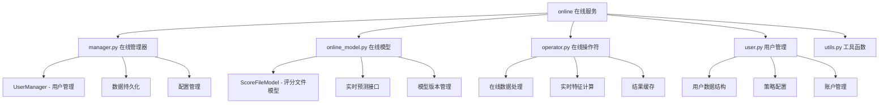
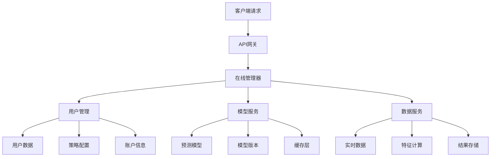

[根目录](../../../CLAUDE.md) > [qlib](../../CLAUDE.md) > [contrib](../CLAUDE.md) > **online**

# 在线服务模块

> Qlib 的在线服务和实时预测系统，支持生产环境下的模型部署和实时推理。

## 模块职责

在线服务模块专注于量化策略的在线化部署：
- 实时模型推理和预测服务
- 在线用户和策略管理
- 实时数据处理和更新
- 生产环境监控和维护

## 模块结构



## 核心功能组件

### 在线管理器 (manager.py)

#### UserManager 类
负责管理在线系统的所有用户和相关数据：

```python
class UserManager:
    def __init__(self, user_data_path, save_report=True):
        """
        在线系统用户管理器

        参数:
            user_data_path: 用户数据存储路径
            save_report: 是否保存交易报告
        """
```

#### 核心功能
- **用户数据管理**：统一管理所有用户的数据和配置
- **策略状态跟踪**：记录用户策略的运行状态
- **数据持久化**：自动保存用户数据和交易结果
- **用户生命周期**：支持用户的添加、删除、更新操作

#### 主要方法
```python
# 加载所有用户
def load_users(self):
    """加载所有用户数据到管理器"""

# 加载单个用户
def load_user(self, user_id):
    """加载指定用户的完整数据"""

# 添加新用户
def add_user(self, user_id, config_file, add_date):
    """添加新用户到系统"""

# 保存用户数据
def save_user_data(self, user_id):
    """保存指定用户的数据"""

# 删除用户
def remove_user(self, user_id):
    """从系统中删除用户"""
```

#### 数据存储结构
```
user_data_path/
├── users.csv                 # 用户索引文件
├── user_001/                 # 用户数据目录
│   ├── account/              # 账户数据
│   ├── strategy_user_001.pickle  # 策略配置
│   └── model_user_001.pickle     # 模型文件
├── user_002/
│   └── ...
```

### 在线模型 (online_model.py)

#### ScoreFileModel 类
基于评分文件的简单在线预测模型：

```python
class ScoreFileModel(Model):
    """
    评分文件模型，从预计算的评分文件中加载预测结果
    """

    def __init__(self, score_path):
        """
        初始化模型

        参数:
            score_path: 评分文件路径
        """
        pred_test = pd.read_csv(score_path, index_col=[0, 1], parse_dates=True)
        self.pred = pred_test
```

#### 核心特性
- **文件驱动**：直接从预计算文件加载预测结果
- **高效查询**：基于索引的快速数据检索
- **日期定位**：支持按日期快速定位预测数据
- **轻量级设计**：适合简单预测场景

#### 主要接口
```python
def get_data_with_date(self, date, **kwargs):
    """
    获取指定日期的预测评分

    参数:
        date: 查询日期

    返回:
        pd.Series: 股票评分序列
    """

def predict(self, x_test, **kwargs):
    """预测接口（占位实现）"""

def score(self, x_test, **kwargs):
    """评分接口（占位实现）"""

def fit(self, x_train, y_train, x_valid, y_valid, w_train=None, w_valid=None, **kwargs):
    """训练接口（占位实现）"""
```

### 用户管理 (user.py)

#### User 类
表示在线系统中的单个用户：

```python
class User:
    """
    用户类，包含账户、策略、模型等完整信息
    """

    def __init__(self, account, strategy, model):
        """
        初始化用户

        参数:
            account: 交易账户
            strategy: 交易策略
            model: 预测模型
        """
```

#### 用户数据组成
- **账户信息**：资金、持仓、交易记录
- **策略配置**：策略参数、交易规则
- **模型实例**：预测模型和评分数据
- **历史记录**：交易历史和绩效数据

### 工具函数 (utils.py)

#### 数据序列化
```python
def load_instance(file_path):
    """加载序列化的实例"""

def save_instance(instance, file_path):
    """保存实例到文件"""
```

#### 配置管理
- **YAML配置**：支持YAML格式的配置文件
- **动态加载**：运行时动态加载策略和模型
- **参数验证**：配置参数的有效性检查

## 在线服务架构

### 系统架构图


### 数据流处理
1. **请求接收**：API网关接收用户请求
2. **用户验证**：验证用户身份和权限
3. **数据准备**：加载用户配置和模型
4. **预测执行**：执行实时预测和决策
5. **结果返回**：返回预测结果和建议
6. **数据持久化**：保存交易结果和状态

## 部署配置

### 环境要求
- **Python >= 3.8**：基础运行环境
- **pandas, numpy**：数据处理依赖
- **redis**：缓存和会话管理（可选）
- **fastapi/flask**：Web服务框架

### 配置示例
```yaml
# config.yaml
server:
  host: "0.0.0.0"
  port: 8000
  workers: 4

database:
  type: "redis"
  host: "localhost"
  port: 6379
  db: 0

storage:
  user_data_path: "./user_data"
  model_cache_path: "./model_cache"
  backup_path: "./backup"

logging:
  level: "INFO"
  file: "./logs/online_service.log"
```

### Docker 部署
```dockerfile
FROM python:3.9-slim

WORKDIR /app
COPY requirements.txt .
RUN pip install -r requirements.txt

COPY . .
EXPOSE 8000

CMD ["python", "main.py"]
```

## 使用示例

### 基础用户管理
```python
from qlib.contrib.online.manager import UserManager

# 初始化用户管理器
manager = UserManager(user_data_path="./user_data")

# 加载所有用户
manager.load_users()

# 添加新用户
manager.add_user(
    user_id="user_001",
    config_file="config.yaml",
    add_date="2025-01-01"
)

# 获取用户实例
user = manager.load_user("user_001")
```

### 在线预测服务
```python
from qlib.contrib.online.online_model import ScoreFileModel

# 初始化在线模型
model = ScoreFileModel(score_path="predictions.csv")

# 获取今日预测
today = pd.Timestamp("2025-01-01")
predictions = model.get_data_with_date(today)

# 返回Top-K推荐
top_stocks = predictions.nlargest(50)
```

### 用户策略配置
```yaml
# user_config.yaml
user_id: "user_001"
init_cash: 1000000

model:
  class: "ScoreFileModel"
  module_path: "qlib.contrib.online.online_model"
  kwargs:
    score_path: "./models/user_001_predictions.csv"

strategy:
  class: "TopkDropoutStrategy"
  module_path: "qlib.contrib.strategy.signal_strategy"
  kwargs:
    topk: 50
    n_drop: 5
```

## 性能优化

### 缓存策略
- **预测结果缓存**：缓存常用预测结果
- **模型缓存**：缓存加载的模型实例
- **用户数据缓存**：缓存频繁访问的用户数据

### 并发处理
- **异步IO**：使用异步处理提升并发能力
- **连接池**：数据库连接池管理
- **负载均衡**：多实例负载分布

### 资源管理
- **内存优化**：及时释放不需要的对象
- **磁盘管理**：定期清理过期数据
- **CPU优化**：向量化计算和并行处理

## 监控和维护

### 性能监控
```python
# 性能指标收集
metrics = {
    "request_count": 0,
    "response_time": [],
    "error_rate": 0.0,
    "memory_usage": 0,
    "cpu_usage": 0
}
```

### 健康检查
- **服务状态**：定期检查服务可用性
- **数据完整性**：验证用户数据完整性
- **模型准确性**：监控模型预测性能

### 日志管理
```python
import logging

# 配置日志
logging.basicConfig(
    level=logging.INFO,
    format='%(asctime)s - %(name)s - %(levelname)s - %(message)s',
    handlers=[
        logging.FileHandler('online_service.log'),
        logging.StreamHandler()
    ]
)
```

## 安全考虑

### 数据安全
- **访问控制**：基于角色的访问控制
- **数据加密**：敏感数据加密存储
- **备份策略**：定期数据备份和恢复

### 网络安全
- **HTTPS**：启用SSL/TLS加密
- **API认证**：JWT令牌认证
- **速率限制**：防止API滥用

## 扩展开发

### 自定义模型接口
```python
from qlib.contrib.model.base import Model

class CustomOnlineModel(Model):
    """自定义在线预测模型"""

    def predict(self, x_test, **kwargs):
        # 实现自定义预测逻辑
        return predictions

    def get_data_with_date(self, date, **kwargs):
        # 实现按日期查询逻辑
        return result
```

### 新增功能模块
```python
# 扩展管理器功能
class EnhancedUserManager(UserManager):
    """增强版用户管理器"""

    def batch_add_users(self, user_configs):
        """批量添加用户"""
        pass

    def export_user_data(self, user_id, format="csv"):
        """导出用户数据"""
        pass
```

## 常见问题 (FAQ)

### Q1: 如何处理模型更新？
支持热更新模型版本，无需重启服务。

### Q2: 如何处理用户数据备份？
系统支持自动备份和手动备份两种方式。

### Q3: 如何处理高并发访问？
使用缓存和连接池优化，支持水平扩展。

## 相关文件清单

### 核心文件
- `manager.py` - 在线管理器
- `online_model.py` - 在线预测模型
- `user.py` - 用户管理
- `operator.py` - 在线操作符
- `utils.py` - 工具函数

### 配置文件
- `config.yaml` - 系统配置
- `docker-compose.yml` - 容器编排
- `requirements.txt` - 依赖管理

## 变更记录 (Changelog)

### 2025-11-17 12:53:01 - 第四次增量更新
- ✨ **新增在线服务模块详细文档**：
  - 完整的在线服务架构说明
  - 用户管理和模型部署详解
  - 实时预测和数据处理指南
- 📊 **深度分析核心组件**：
  - UserManager 用户管理系统
  - ScoreFileModel 在线预测模型
  - 数据持久化和配置管理
- 🔗 **完善部署运维指南**：
  - Docker 容器化部署
  - 性能优化和监控维护
  - 安全考虑和扩展开发