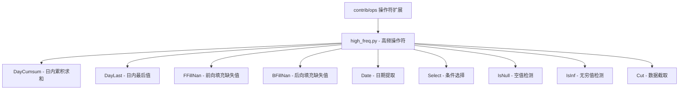

[根目录](../../../CLAUDE.md) > [qlib](../../CLAUDE.md) > [contrib](../CLAUDE.md) > **ops**

# 操作符扩展模块 (contrib/ops)

> Qlib 的高级操作符扩展，提供高频数据处理、时间序列分析和专业金融计算功能。

## 模块职责

contrib/ops 模块提供专业金融计算操作符：
- 高频数据处理操作符
- 时间序列分析工具
- 日内交易分析功能
- 专业金融指标计算

## 模块结构



## 核心操作符详解

### 1. DayCumsum - 日内累积求和
**功能**：在指定时间段内进行累积求和计算

**使用场景**：
- 日内成交量累积分析
- 日内收益累积计算
- 特定时间段指标聚合

**参数说明**：
```python
DayCumsum(
    feature,              # 待计算的特征
    start="9:30",         # 开始时间
    end="14:59",          # 结束时间
    data_granularity=1    # 数据粒度（分钟）
)
```

**使用示例**：
```python
from qlib.contrib.ops.high_freq import DayCumsum
from qlib.data.ops import Ref

# 计算上午交易时间的累积成交量
morning_volume_cumsum = DayCumsum(
    feature=Ref($volume, 0),  # 当日成交量
    start="9:30",             # 开盘时间
    end="11:30"               # 上午收盘
)

# 计算全天累积成交量
full_day_cumsum = DayCumsum(
    feature=Ref($volume, 0),
    start="9:30",
    end="14:59"
)
```

**工作原理**：
1. **时间窗口定义**：根据 start 和 end 参数定义交易时间段
2. **日内分组**：按交易日对数据进行分组
3. **累积计算**：在指定时间段内进行累积求和
4. **时段外归零**：非交易时间段的数据设为 0

### 2. DayLast - 日内最后值
**功能**：获取每个交易日的最后一个有效值

**使用场景**：
- 日内收盘价提取
- 日终指标获取
- 日内状态快照

**使用示例**：
```python
from qlib.contrib.ops.high_freq import DayLast

# 获取日内最后成交价
day_last_price = DayLast(Ref($close, 0))

# 获取日内最后成交量
day_last_volume = DayLast(Ref($volume, 0))

# 组合使用：计算日内价格变化
price_change = Ref($close, 0) / DayLast(Ref($close, 1)) - 1
```

### 3. FFillNan - 前向填充缺失值
**功能**：使用前一个有效值填充缺失值

**使用场景**：
- 高频数据缺失处理
- 技术指标计算中的数据补全
- 时间序列数据清洗

**使用示例**：
```python
from qlib.contrib.ops.high_freq import FFillNan

# 前向填充价格数据
filled_price = FFillNan(Ref($close, 0))

# 组合使用：先填充再计算移动平均
ma_5 = FFillNan(Ref($close, 0)).rolling(5).mean()
```

### 4. BFillNan - 后向填充缺失值
**功能**：使用后一个有效值填充缺失值

**使用场景**：
- 未来数据回填（注意避免未来函数）
- 数据完整性补全
- 特定场景下的缺失处理

**使用示例**：
```python
from qlib.contrib.ops.high_freq import BFillNan

# 后向填充数据
backfilled_data = BFillNan(Ref($volume, 0))
```

### 5. Date - 日期提取
**功能**：从时间序列索引中提取日期信息

**使用场景**：
- 日期特征工程
- 跨期数据对齐
- 时间相关分析

**使用示例**：
```python
from qlib.contrib.ops.high_freq import Date

# 提取日期信息
date_series = Date(Ref($close, 0))

# 用于条件过滤
is_trading_day = Date(Ref($close, 0)) == "2023-01-03"
```

### 6. Select - 条件选择
**功能**：根据条件选择相应的值

**使用场景**：
- 条件特征提取
- 多状态数据处理
- 动态指标计算

**使用示例**：
```python
from qlib.contrib.ops.high_freq import Select

# 选择上涨时的成交量
up_volume = Select(
    feature_left=Ref($close, 0) > Ref($close, 1),  # 上涨条件
    feature_right=Ref($volume, 0)                  # 成交量
)

# 选择下跌时的价格
down_price = Select(
    feature_left=Ref($close, 0) < Ref($close, 1),  # 下跌条件
    feature_right=Ref($close, 0)                   # 价格
)
```

### 7. IsNull - 空值检测
**功能**：检测数据中的空值

**使用场景**：
- 数据质量检查
- 缺失值标记
- 数据清洗预处理

**使用示例**：
```python
from qlib.contrib.ops.high_freq import IsNull

# 检测价格数据中的空值
null_price_flags = IsNull(Ref($close, 0))

# 统计空值比例
null_ratio = IsNull(Ref($close, 0)).rolling(20).mean()
```

### 8. IsInf - 无穷值检测
**功能**：检测数据中的无穷值

**使用场景**：
- 异常值检测
- 计算结果验证
- 数据质量控制

**使用示例**：
```python
from qlib.contrib.ops.high_freq import IsInf

# 检测无穷值
inf_flags = IsInf(Ref($close, 0) / Ref($close, 1) - 1)
```

### 9. Cut - 数据截取
**功能**：截取数据的指定部分

**使用场景**：
- 数据窗口处理
- 序列切片操作
- 特定时段数据提取

**使用示例**：
```python
from qlib.contrib.ops.high_freq import Cut

# 截取前10个数据点（去掉前10个）
cut_data = Cut(
    feature=Ref($close, 0),
    left=10,           # 去掉前10个数据点
    right=None         # 保留后面所有数据
)

# 截取后5个数据点（去掉后5个）
cut_data_end = Cut(
    feature=Ref($close, 0),
    left=None,
    right=-5           # 去掉后5个数据点
)
```

## 日历和时间工具

### 高频日历管理
**功能**：提供高频交易的高效日历管理

**核心函数**：
```python
from qlib.contrib.ops.high_freq import get_calendar_day, get_calendar_minute

# 获取日历日期（缓存优化）
calendar_days = get_calendar_day(freq="1min", future=False)

# 获取日历分钟信息
calendar_minutes = get_calendar_minute(freq="day", future=False)
```

**特性**：
- **缓存优化**：使用内存缓存提升性能
- **灵活频率**：支持多种时间频率
- **未来支持**：可选择包含未来交易日

## 高频数据处理最佳实践

### 1. 数据预处理流程
```python
# 标准高频数据预处理流程
from qlib.contrib.ops.high_freq import FFillNan, IsNull, IsInf

# 原始数据
raw_data = Ref($close, 0)

# 缺失值处理
cleaned_data = FFillNan(raw_data)

# 异常值检测
null_flags = IsNull(cleaned_data)
inf_flags = IsInf(cleaned_data)

# 数据质量验证
quality_score = 1 - (null_flags | inf_flags).rolling(20).mean()
```

### 2. 日内分析指标构建
```python
# 构建日内交易指标
from qlib.contrib.ops.high_freq import DayCumsum, DayLast

# 日内累积成交量
intraday_volume = DayCumsum(
    feature=Ref($volume, 0),
    start="9:30",
    end="15:00"
)

# 日内价格变化范围
intraday_range = DayLast(Ref($high, 0)) - DayLast(Ref($low, 0))

# 日内波动率
intraday_volatility = (Ref($close, 0) / DayLast(Ref($close, 1)) - 1).abs()
```

### 3. 多时段分析
```python
# 分时段分析
from qlib.contrib.ops.high_freq import DayCumsum, Select

# 上午交易量
morning_volume = DayCumsum(
    feature=Ref($volume, 0),
    start="9:30",
    end="11:30"
)

# 下午交易量
afternoon_volume = DayCumsum(
    feature=Ref($volume, 0),
    start="13:00",
    end="15:00"
)

# 上午下午成交量比
volume_ratio = morning_volume / afternoon_volume
```

## 性能优化建议

### 1. 缓存策略
- **日历缓存**：高频使用日历数据，利用内置缓存
- **计算缓存**：重复计算结果进行缓存
- **内存管理**：合理控制缓存大小

### 2. 计算优化
- **向量化操作**：尽量使用向量化计算
- **批量处理**：批量处理多只股票数据
- **时间窗口优化**：合理设置时间窗口

### 3. 数据访问优化
- **索引优化**：利用时间索引加速访问
- **预加载策略**：预加载常用数据
- **并行计算**：多进程并行处理

## 实际应用案例

### 案例1：高频成交量分析
```python
# 分析日内成交量分布
from qlib.contrib.ops.high_freq import DayCumsum, DayLast

# 各时段累积成交量
morning_cumsum = DayCumsum(Ref($volume, 0), "9:30", "11:30")
afternoon_cumsum = DayCumsum(Ref($volume, 0), "13:00", "15:00")
full_day_cumsum = DayCumsum(Ref($volume, 0), "9:30", "15:00")

# 时段占比分析
morning_ratio = morning_cumsum / full_day_cumsum
afternoon_ratio = afternoon_cumsum / full_day_cumsum
```

### 案例2：价格异常检测
```python
# 检测价格异常
from qlib.contrib.ops.high_freq import IsNull, IsInf, Select

# 价格变化率
price_change = Ref($close, 0) / Ref($close, 1) - 1

# 异常检测
is_null = IsNull(price_change)
is_inf = IsInf(price_change)
is_extreme = (price_change.abs() > 0.095)  # 涨跌停检测

# 正常价格变化
normal_change = Select(
    feature_left=~(is_null | is_inf | is_extreme),
    feature_right=price_change
)
```

### 案例3：日内趋势分析
```python
# 日内价格趋势分析
from qlib.contrib.ops.high_freq import DayCumsum, DayLast

# 价格累积变化
price_cumsum = DayCumsum(
    feature=Ref($close, 0) - Ref($close, 1),
    start="9:30",
    end="15:00"
)

# 日内强度指标
intraday_strength = price_cumsum / DayLast(Ref($volume, 0))

# 趋势方向
trend_direction = (DayLast(Ref($close, 0)) > DayLast(Ref($open, 0))).astype(int)
```

## 常见问题 (FAQ)

### Q1: 如何处理非交易时间的数据？
```python
# 使用 DayCumsum 自动处理非交易时间
# 非交易时间的数据会被设为 0
trading_only_data = DayCumsum(
    feature=Ref($volume, 0),
    start="9:30",    # 交易开始
    end="14:59"      # 交易结束
)
```

### Q2: 如何避免未来函数？
```python
# 使用 Ref 确保数据可用性
# 正确：使用历史数据
historical_data = DayLast(Ref($close, 1))  # 昨日收盘价

# 错误：使用未来数据（会产生未来函数）
# future_data = DayLast(Ref($close, -1))  # 明日收盘价
```

### Q3: 如何处理不同频率的数据？
```python
# 统一频率处理
from qlib.contrib.ops.high_freq import FFillNan, DayLast

# 高频数据转低频
daily_close = DayLast(FFillNan(Ref($close, 0)))

# 保持数据一致性
consistent_data = FFillNan(Ref($close, 0)).resample("1D").last()
```

## 相关文件清单

### 核心模块
- `high_freq.py` - 高频数据处理操作符
- `__init__.py` - 模块入口和导出

## 变更记录 (Changelog)

### 2025-11-17 14:10:03 - 第五次增量更新创建
- ✨ **创建操作符扩展模块文档**：
  - 完成高频操作符详细说明
  - 建立操作符使用最佳实践
  - 构建实际应用案例库
- 📊 **补充技术细节**：
  - 操作符工作原理详解
  - 性能优化建议
  - 常见问题解决方案
- 🔗 **建立实用代码示例**：
  - 完整的使用场景演示
  - 最佳实践代码模板
  - 实际应用案例分析