[根目录](../../../CLAUDE.md) > [qlib](../../CLAUDE.md) > [contrib](../CLAUDE.md) > **report**

# 报告分析模块

> Qlib 的报告分析和可视化工具集，提供丰富的回测结果分析和图表生成功能。

## 模块职责

报告分析模块专注于量化投资结果的深度分析和可视化：
- 回测业绩分析和风险评估
- 持仓结构和交易行为分析
- 模型性能评估和归因分析
- 交互式图表和报告生成

## 模块结构

```mermaid
graph TD
    A["report 报告分析"] --> B["analysis_position/ 持仓分析"];
    A --> C["analysis_model/ 模型分析"];
    A --> D["data/ 报告数据"];
    A --> E["graph.py 图表生成"];
    A --> F["utils.py 工具函数"];

    B --> B1["report.py - 综合报告生成"];
    B --> B2["risk_analysis.py - 风险分析"];
    B --> B3["cumulative_return.py - 累积收益分析"];
    B --> B4["parse_position.py - 持仓解析"];
    B --> B5["rank_label.py - 标签排名分析"];
    B --> B6["score_ic.py - IC分析"];

    C --> C1["analysis_model_performance.py - 模型性能分析"];

    D --> D1["base.py - 基础数据结构"];
    D --> D2["ana.py - 分析数据"];

    E --> E1["BaseGraph - 图表基类"];
    E --> E2["ScatterGraph - 散点图"];
    E --> E3["BarGraph - 柱状图"];
    E --> E4["HeatmapGraph - 热力图"];
    E --> E5["HistogramGraph - 直方图"];
    E --> E6["SubplotsGraph - 子图组合"];

    click B1 "#report_py" "查看综合报告生成"
    click B2 "#risk_analysis_py" "查看风险分析"
    click E "#graph_py" "查看图表生成"
```



## 核心功能组件

### 综合报告生成 (report.py)

#### 主要功能
- **完整回测报告**：生成包含7个子图的综合分析报告
- **关键指标展示**：累积收益、最大回撤、换手率、超额收益等
- **可视化增强**：标记最大回撤区间，支持多种图表类型

#### 核心函数
```python
def report_graph(report_df: pd.DataFrame, show_notebook: bool = True):
    """
    生成回测分析图表

    参数:
        report_df: DataFrame, 必须包含 return, turnover, cost, bench 列
        show_notebook: bool, 是否在notebook中显示

    返回:
        plotly.graph_objs.Figure 列表
    """
```

#### 图表组件
1. **收益对比图**：策略收益 vs 基准收益
2. **回撤分析图**：最大回撤区间标记
3. **成本影响图**：交易成本对收益的影响
4. **超额收益图**：相对基准的超额表现
5. **换手率分析**：交易活跃度指标

### 风险分析 (risk_analysis.py)

#### 风险指标计算
- **基础风险指标**：收益率、波动率、最大回撤
- **风险调整收益**：夏普比率、信息比率
- **月度风险分析**：按月分解的风险指标

#### 核心分析功能
```python
def risk_analysis_graph(
    analysis_df: pd.DataFrame = None,
    report_normal_df: pd.DataFrame = None,
    show_notebook: bool = True
):
    """
    生成风险分析图表和月度分析

    分析指标包括:
    - annualized_return: 年化收益率
    - max_drawdown: 最大回撤
    - information_ratio: 信息比率
    - std: 收益率标准差
    """
```

#### 月度分析特点
- **时间序列分解**：按月展示关键指标变化
- **趋势识别**：识别策略表现的月度模式
- **异常检测**：标记异常表现的月份

### 图表生成系统 (graph.py)

#### 图表类型支持
- **ScatterGraph**：散点图，支持线性和标记模式
- **BarGraph**：柱状图，支持分组和堆叠
- **HeatmapGraph**：热力图，支持矩阵数据可视化
- **HistogramGraph**：直方图，支持分布分析
- **SubplotsGraph**：子图组合，支持复杂布局

#### 通用特性
- **交互式图表**：基于 Plotly 的动态可视化
- **响应式设计**：适配不同屏幕尺寸
- **导出功能**：支持多种格式导出
- **自定义样式**：灵活的颜色和布局配置

#### 高级功能示例
```python
# 创建子图组合
figure = SubplotsGraph(
    df=data,
    layout=layout_config,
    sub_graph_data=graph_config,
    subplots_kwargs={
        "rows": 3,
        "cols": 2,
        "shared_xaxes": True,
        "vertical_spacing": 0.05
    }
).figure
```

### IC分析 (score_ic.py)

#### 信息系数分析
- **IC值计算**：预测值与真实值的相关系数
- **IC_IR分析**：信息比率评估
- **IC分布**：IC值的统计分布特征

### 模型性能分析 (analysis_model_performance.py)

#### 模型评估维度
- **预测准确性**：MAE, RMSE, R²等指标
- **排序能力**：IC, Rank IC等排序指标
- **稳定性分析**：时间序列上的表现稳定性

## 使用示例

### 基础报告生成
```python
from qlib.contrib.report.analysis_position import report_graph

# 生成基础回测报告
report_graph(
    report_df=portfolio_metrics,
    show_notebook=True
)
```

### 风险分析报告
```python
from qlib.contrib.report.analysis_position import risk_analysis_graph
from qlib.contrib.evaluate import risk_analysis

# 计算风险指标
analysis_df = risk_analysis(portfolio_metrics['return'] - portfolio_metrics['bench'])

# 生成风险分析图表
risk_analysis_graph(
    analysis_df=analysis_df,
    report_normal_df=portfolio_metrics
)
```

### 自定义图表生成
```python
from qlib.contrib.report.graph import ScatterGraph, SubplotsGraph

# 创建散点图
scatter_fig = ScatterGraph(
    df=data,
    layout={"title": "收益分布"},
    graph_kwargs={"mode": "markers"}
).figure

# 创建组合图
subplots_fig = SubplotsGraph(
    df=multi_data,
    subplots_kwargs={"rows": 2, "cols": 2}
).figure
```

## 数据格式要求

### 报告数据格式
```python
# portfolio_metrics DataFrame 格式要求
# index: datetime (交易日)
# columns: ['return', 'bench', 'cost', 'turnover']
                    return      bench       cost        turnover
date
2017-01-04         0.003421    0.011693    0.000864    0.576325
2017-01-05         0.000508    0.000721    0.000447    0.227882
```

### 风险分析数据格式
```python
# analysis_df MultiIndex 格式
# index: 分析指标名称
# columns: 风险指标值
                                    risk
excess_return_without_cost mean               0.000692
                             std                0.005374
                             annualized_return  0.174495
                             information_ratio  2.045576
                             max_drawdown      -0.079103
```

## 可视化配置

### 布局参数
```python
layout_config = {
    "title": "策略回测报告",
    "height": 800,
    "width": 1200,
    "showlegend": True,
    "template": "plotly_white"
}
```

### 样式定制
```python
# 颜色方案
color_scheme = {
    "strategy": "#1f77b4",
    "benchmark": "#ff7f0e",
    "cost": "#d62728",
    "excess": "#2ca02c"
}

# 线条样式
line_style = {
    "width": 2,
    "dash": "solid"
}
```

## 性能优化

### 大数据量处理
- **分页显示**：支持大数据集的分页展示
- **数据聚合**：自动聚合高频数据
- **缓存机制**：图表结果缓存提升响应速度

### 内存优化
- **惰性加载**：按需加载图表组件
- **数据压缩**：优化数据存储格式
- **垃圾回收**：及时释放不需要的对象

## 扩展开发

### 自定义图表类型
```python
from qlib.contrib.report.graph import BaseGraph

class CustomGraph(BaseGraph):
    _name = "custom"

    def _get_data(self):
        # 实现自定义数据处理逻辑
        pass
```

### 添加新的分析指标
```python
def custom_analysis_metric(df: pd.DataFrame):
    """
    自定义分析指标

    参数:
        df: 输入数据

    返回:
        计算结果
    """
    # 实现分析逻辑
    return result
```

## 常见问题 (FAQ)

### Q1: 如何自定义报告样式？
可以通过 layout 参数自定义图表样式，包括颜色、字体、布局等。

### Q2: 支持哪些导出格式？
支持 HTML、PNG、PDF、SVG 等多种格式导出。

### Q3: 如何处理大数据量？
系统自动支持数据聚合和分页，也可以手动采样减少数据量。

## 相关文件清单

### 核心文件
- `analysis_position/report.py` - 综合报告生成
- `analysis_position/risk_analysis.py` - 风险分析
- `graph.py` - 图表生成系统
- `utils.py` - 工具函数

### 分析模块
- `analysis_model/` - 模型分析工具
- `analysis_position/` - 持仓分析工具
- `data/` - 数据处理工具

## 变更记录 (Changelog)

### 2025-11-17 12:53:01 - 第四次增量更新
- ✨ **新增报告分析模块详细文档**：
  - 完整的报告生成功能说明
  - 风险分析和可视化工具详解
  - 图表生成系统和扩展指南
- 📊 **深度分析核心组件**：
  - 7个子图的综合报告体系
  - 月度风险分析和趋势识别
  - 交互式图表和自定义样式
- 🔗 **完善使用示例和最佳实践**：
  - 标准数据格式规范
  - 性能优化和大数据处理
  - 扩展开发和自定义指南