[根目录](../../../CLAUDE.md) > [qlib](../../CLAUDE.md) > [contrib](../CLAUDE.md) > **strategy**

# 策略扩展模块 (strategy)

> Qlib 的丰富交易策略库，提供从基础信号策略到复杂规则策略的完整策略生态。

## 模块职责

策略扩展模块提供：
- 多种预置策略实现，开箱即用
- 灵活的策略框架，支持自定义扩展
- 完整的订单生成和执行逻辑
- 成本控制和风险管理功能

## 策略架构

```mermaid
graph TD
    A["策略扩展模块"] --> B["signal_strategy.py - 信号策略"];
    A --> C["rule_strategy.py - 规则策略"];
    A --> D["order_generator.py - 订单生成"];
    A --> E["cost_control.py - 成本控制"];
    A --> F["__init__.py - 模块导出"];

    B --> B1["BaseSignalStrategy - 信号策略基类"];
    B --> B2["TopkDropoutStrategy - TopK 策略"];
    B --> B3["EnhancedIndexingStrategy - 增强指数策略"];
    B --> B4["WeightStrategyBase - 权重策略基类"];

    C --> C1["RuleBasedStrategy - 规则策略基类"];
    C --> C2["TWAPStrategy - 时间加权策略"];
    C --> C3["SBBStrategy - 信号平衡策略"];

    D --> D1["OrderGenerator - 订单生成器"];
    D --> D2["OrderGenWOInteract - 无交互订单生成"];
    D --> D3["订单优化逻辑"];
    D --> D4["执行计划生成"];

    E --> E1["成本控制模块"];
    E --> E2["交易成本优化"];
    E --> E3["滑点控制"];

    click B "./signal_strategy.py" "查看信号策略实现"
    click C "./rule_strategy.py" "查看规则策略实现"
    click D "./order_generator.py" "查看订单生成器"
    click E "./cost_control.py" "查看成本控制"
```



## 信号策略 (Signal Strategy)

### 1. BaseSignalStrategy
信号策略的基类，提供信号到交易决策的转换框架：

```python
from qlib.contrib.strategy.signal_strategy import BaseSignalStrategy

class CustomSignalStrategy(BaseSignalStrategy):
    def __init__(self, signal, risk_degree=0.95, **kwargs):
        super().__init__(
            signal=signal,           # 信号源
            risk_degree=risk_degree,  # 风险暴露程度
            **kwargs
        )

    def generate_target_weight_position(self, score_series, current_position, trade_exchange):
        # 自定义权重分配逻辑
        pass
```

### 2. TopkDropoutStrategy
Top-K 选择策略，选择排名最高的 K 只股票：

```python
from qlib.contrib.strategy import TopkDropoutStrategy

strategy = TopkDropoutStrategy(
    signal=(model, dataset),       # 模型信号
    topk=50,                       # 选择前 50 只股票
    n_drop=5,                      # 每次调仓时随机丢弃 5 只
    method='score',                # 选择方法: score/amount
    risk_degree=0.95               # 风险暴露程度
)
```

### 3. EnhancedIndexingStrategy
增强指数策略，在基准指数基础上进行增强：

```python
from qlib.contrib.strategy import EnhancedIndexingStrategy

strategy = EnhancedIndexingStrategy(
    signal=(model, dataset),
    risk_degree=0.95,
    optimize_type='risk_parity',   # 优化类型
    turnover_limit=0.3             # 换手率限制
)
```

## 规则策略 (Rule Strategy)

### 1. RuleBasedStrategy
基于规则的策略基类，支持自定义交易规则：

```python
from qlib.contrib.strategy.rule_strategy import RuleBasedStrategy

class CustomRuleStrategy(RuleBasedStrategy):
    def __init__(self, rules, **kwargs):
        super().__init__(**kwargs)
        self.rules = rules

    def generate_order_list(self, score_series, current_position, trade_exchange):
        # 基于规则生成订单
        orders = []
        for rule in self.rules:
            order = rule.apply(score_series, current_position)
            if order:
                orders.append(order)
        return orders
```

### 2. TWAPStrategy
时间加权平均价格策略，大单拆分执行：

```python
from qlib.contrib.strategy import TWAPStrategy

strategy = TWAPStrategy(
    volume_ratio=0.1,              # 每次交易量比例
    trade_time_range=['09:30', '14:30']  # 交易时间窗口
)
```

## 订单生成 (Order Generation)

### 1. OrderGenerator
订单生成器，将目标持仓转换为具体交易指令：

```python
from qlib.contrib.strategy.order_generator import OrderGenerator

order_gen = OrderGenerator(
    trade_exchange=exchange,
    deal_order_threshold=0.5,      # 订单处理阈值
    pad_factor=0.1                 # 订单填充因子
)

# 生成订单列表
orders = order_gen.generate_orders(
    target_weight_position,
    current_position
)
```

### 2. 订单优化
- **交易成本最小化**：优化订单执行顺序
- **冲击成本控制**：控制大单对市场的影响
- **时间分布优化**：优化订单执行时间

## 成本控制 (Cost Control)

### 交易成本建模
```python
from qlib.contrib.strategy.cost_control import CostController

cost_controller = CostController(
    fixed_cost=5.0,                # 固定成本
    variable_cost_rate=0.0003,     # 变动成本率
    slippage_rate=0.001,           # 滑点率
    threshold=1000                 # 成本阈值
)
```

### 成本优化策略
- **订单拆分**：大单拆分为小单执行
- **时机选择**：选择市场流动性好的时机
- **价格优化**：限价单优化执行价格

## 使用示例

### 1. 基础信号策略
```python
from qlib.contrib.strategy import TopkDropoutStrategy
from qlib.contrib.model import LGBModel
from qlib.data.dataset import DatasetH

# 创建模型和数据集
model = LGBModel(loss='mse')
dataset = DatasetH(handler=handler)

# 创建策略
strategy = TopkDropoutStrategy(
    signal=(model, dataset),
    topk=30,
    n_drop=3,
    risk_degree=0.9
)

# 回测
from qlib.backtest import backtest
portfolio_metrics, indicator_metrics = backtest(
    start_time='2020-01-01',
    end_time='2020-12-31',
    strategy=strategy,
    executor=executor_config
)
```

### 2. 自定义策略
```python
from qlib.contrib.strategy.signal_strategy import BaseSignalStrategy

class MomentumStrategy(BaseSignalStrategy):
    def generate_target_weight_position(self, score_series, current_position, trade_exchange):
        # 动量策略逻辑
        returns = score_series.pct_change(20)  # 20日收益率
        top_stocks = returns.nlargest(self.topk)

        # 等权重分配
        weights = pd.Series(1.0/self.topk, index=top_stocks.index)
        return weights * self.risk_degree

strategy = MomentumStrategy(
    signal=price_data,
    topk=20,
    risk_degree=0.95
)
```

### 3. 组合策略
```python
class CombinedStrategy(BaseStrategy):
    def __init__(self, strategies, weights, **kwargs):
        super().__init__(**kwargs)
        self.strategies = strategies
        self.weights = weights

    def generate_order_list(self, score_series, current_position, trade_exchange):
        all_orders = []
        for strategy, weight in zip(self.strategies, self.weights):
            orders = strategy.generate_order_list(
                score_series, current_position, trade_exchange
            )
            # 按权重调整订单
            for order in orders:
                order.amount *= weight
            all_orders.extend(orders)
        return all_orders
```

## 策略性能评估

### 关键指标
```python
# 分析策略表现
from qlib.contrib.report.analysis_position import report_graph

report_graph(
    portfolio_metrics,
    indicator_metrics,
    show_notebook=True
)

# 获取详细指标
analysis = {
    "annual_return": annual_return,
    "sharpe_ratio": sharpe_ratio,
    "max_drawdown": max_drawdown,
    "turnover": turnover,
    "win_rate": win_rate
}
```

### 策略对比
```python
def compare_strategies(strategies, test_data):
    results = {}
    for name, strategy in strategies.items():
        metrics = backtest_with_strategy(strategy, test_data)
        results[name] = metrics

    # 对比分析
    comparison = pd.DataFrame(results).T
    return comparison
```

## 高级功能

### 1. 风险管理
```python
class RiskManagedStrategy(BaseSignalStrategy):
    def __init__(self, max_position_size=0.1, **kwargs):
        super().__init__(**kwargs)
        self.max_position_size = max_position_size

    def generate_target_weight_position(self, score_series, current_position, trade_exchange):
        weights = super().generate_target_weight_position(
            score_series, current_position, trade_exchange
        )

        # 限制单只股票最大权重
        weights = weights.clip(upper=self.max_position_size)

        # 重新归一化
        weights = weights / weights.sum() * self.risk_degree
        return weights
```

### 2. 自适应调仓
```python
class AdaptiveStrategy(BaseSignalStrategy):
    def should_rebalance(self, current_time, current_position):
        # 基于市场状况决定是否调仓
        market_volatility = self.get_market_volatility()

        if market_volatility > self.volatility_threshold:
            return True  # 高波动时调仓
        else:
            return False
```

### 3. 多信号融合
```python
class MultiSignalStrategy(BaseSignalStrategy):
    def __init__(self, signals, signal_weights, **kwargs):
        super().__init__(**kwargs)
        self.signals = signals
        self.signal_weights = signal_weights

    def generate_target_weight_position(self, score_series, current_position, trade_exchange):
        combined_score = 0
        for signal, weight in zip(self.signals, self.signal_weights):
            combined_score += signal * weight

        return self.generate_weights_from_score(combined_score)
```

## 最佳实践

### 1. 策略设计原则
- **简单有效**：避免过度复杂的逻辑
- **风险可控**：内置风险管理机制
- **可解释性**：策略逻辑清晰可理解
- **鲁棒性**：在不同市场环境下表现稳定

### 2. 性能优化
```python
# 向量化操作
def calculate_weights_vectorized(scores):
    ranks = scores.rank(ascending=False)
    selected = ranks <= self.topk
    weights = pd.Series(0.0, index=scores.index)
    weights[selected] = 1.0 / self.topk
    return weights * self.risk_degree

# 缓存计算结果
@lru_cache(maxsize=1000)
def cached_calculation(params):
    # 耗时计算
    return result
```

### 3. 测试验证
```python
# 参数敏感性分析
def sensitivity_analysis(strategy, param_ranges):
    results = {}
    for param, values in param_ranges.items():
        param_results = []
        for value in values:
            setattr(strategy, param, value)
            metrics = backtest_strategy(strategy)
            param_results.append(metrics)
        results[param] = param_results
    return results
```

## 常见问题 (FAQ)

### Q1: 如何选择合适的策略？
- **新手**：从 TopkDropoutStrategy 开始
- **稳健需求**：选择 EnhancedIndexingStrategy
- **特殊需求**：继承 BaseSignalStrategy 自定义

### Q2: 如何控制交易成本？
```python
# 增加最小交易金额
strategy = TopkDropoutStrategy(
    signal=(model, dataset),
    min_trade_amount=10000,  # 最小交易金额
    threshold=0.02           # 交易阈值
)
```

### Q3: 如何处理停牌股票？
```python
def filter_suspended_stocks(weights, trade_exchange):
    tradable = trade_exchange.get_tradable_stocks()
    return weights[weights.index.isin(tradable)]
```

## 相关文件清单

### 核心策略
- `signal_strategy.py` - 信号策略实现
- `rule_strategy.py` - 规则策略实现
- `__init__.py` - 模块导出和便捷接口

### 支持模块
- `order_generator.py` - 订单生成逻辑
- `cost_control.py` - 成本控制模块
- `optimizer.py` - 优化算法

### 策略类型
- **信号策略**：基于模型预测的策略
- **规则策略**：基于业务规则的策略
- **混合策略**：结合多种策略逻辑

## 变更记录 (Changelog)

### 2025-11-17 12:35:11
- ✨ 创建策略扩展模块详细文档
- 📊 完成策略分类和架构分析
- 🔗 建立策略使用指南和最佳实践
- 📝 补充性能评估和风险管理
- 🔧 添加自定义策略开发指南

<claude-mem-context>
# Recent Activity

<!-- This section is auto-generated by claude-mem. Edit content outside the tags. -->

*No recent activity*
</claude-mem-context>