[根目录](../../../CLAUDE.md) > [qlib](../../CLAUDE.md) > **data**

# 数据层模块

> Qlib 的数据访问与处理核心，提供统一的数据接口和高效的缓存机制。

## 模块职责

数据层是 Qlib 的基础组件，负责：
- 统一的数据访问接口
- 多种数据源支持（本地/客户端）
- 高效的数据缓存机制
- 灵活的数据操作符

## 模块结构

```mermaid
graph TD
    A["data 数据层"] --> B["核心组件"];
    A --> C["缓存系统"];
    A --> D["操作符"];

    B --> B1["base.py - 基础抽象类"];
    B --> B2["data.py - 数据提供者实现"];
    B --> B3["client.py - 客户端访问"];
    B --> B4["pit.py - 点对点数据"];
    B --> B5["filter.py - 数据过滤"];
    B --> B6["inst_processor.py - 实例处理器"];

    C --> C1["cache.py - 缓存抽象"];
    C --> C2["ExpressionCache - 表达式缓存"];
    C --> C3["DatasetCache - 数据集缓存"];
    C --> C4["DiskCache - 磁盘缓存"];
    C --> C5["MemoryCache - 内存缓存"];

    D --> D1["ops.py - 数据操作符"];
    D --> D2["ElementOps - 元素操作"];
    D --> D3["SeriesOps - 序列操作"];
    D --> D4["ExpressionOps - 表达式操作"];

    click B1 "./base.py" "查看基础抽象类"
    click B2 "./data.py" "查看数据提供者实现"
    click C1 "./cache.py" "查看缓存抽象"
    click D1 "./ops.py" "查看数据操作符"
```



## 入口与启动

### 主要接口
- **`D` 对象**：全局数据访问实例
- **数据类型**：
  - `CalendarProvider`：交易日历
  - `InstrumentProvider`：股票列表
  - `FeatureProvider`：特征数据
  - `ExpressionProvider`：表达式数据
  - `DatasetProvider`：数据集提供

### 初始化流程
```python
from qlib.data import D

# 获取股票列表
instruments = D.instruments('csi300')

# 获取特征数据
features = D.features(instruments, ['close', 'volume'], start_time, end_time)

# 获取交易日历
calendar = D.calendar(start_time, end_time)
```

## 对外接口

### 核心数据接口
```python
# 获取股票列表
D.instruments(market='csi300')  # 支持多个市场

# 获取特征数据
D.features(instruments, fields, freq='day')

# 获取交易日历
D.calendar(freq='day')

# 表达式计算
D.expression(instruments, expression, start_time, end_time)
```

### 数据提供者类型
- **LocalProvider**：本地文件数据
- **ClientProvider**：远程客户端数据
- **HybridProvider**：混合数据源

## 关键依赖与配置

### 数据源配置
- **`provider_uri`**：数据存储路径
- **`freq`**：数据频率（day, 1min, 5min等）
- **`region`**：市场区域（CN, US等）

### 缓存配置
- **内存缓存**：快速访问热点数据
- **磁盘缓存**：持久化缓存
- **表达式缓存**：计算结果缓存

## 数据模型

### 数据格式
- **DataFrame**：标准 Pandas 数据格式
- **MultiIndex**：时间和股票的多级索引
- **Panel**：三维数据结构（已弃用）

### 数据字段
- **基础字段**：open, high, low, close, volume
- **技术指标**：MA, RSI, MACD等
- **基本面数据**：财务指标、行业分类
- **自定义字段**：通过操作符计算

## 测试与质量

### 数据质量检查
- **完整性检查**：缺失值检测
- **一致性检查**：数据范围验证
- **时效性检查**：数据更新验证

### 性能优化
- **向量化操作**：批量数据处理
- **缓存机制**：减少重复计算
- **并行处理**：多进程数据加载

## 常见问题 (FAQ)

### Q1: 如何配置数据源？
```python
qlib.init(
    provider_uri="~/.qlib/qlib_data/cn_data",
    default_conf="client"
)
```

### Q2: 如何获取特定时间范围的数据？
```python
from qlib.data import D

features = D.features(
    instruments=['000001.SZ', '000002.SZ'],
    fields=['close', 'volume'],
    start_time='2020-01-01',
    end_time='2020-12-31'
)
```

### Q3: 如何使用自定义表达式？
```python
# 计算收益率
returns = D.expression(
    instruments=instruments,
    expression='Ref(close, -1) / close - 1',
    start_time=start_time,
    end_time=end_time
)
```

## 相关文件清单

### 核心文件
- `__init__.py` - 模块导出接口
- `base.py` - 基础抽象类定义
- `data.py` - 数据提供者具体实现
- `cache.py` - 缓存系统实现
- `ops.py` - 数据操作符定义
- `client.py` - 客户端数据访问
- `pit.py` - 点对点数据处理

### 配置文件
- `filter.py` - 数据过滤器
- `inst_processor.py` - 实例处理器

## 变更记录 (Changelog)

### 2025-11-17 12:30:16
- ✨ 创建数据层模块文档
- 📊 完成数据接口分析
- 🔗 建立数据流架构图
- 📝 补充数据使用示例

<claude-mem-context>
# Recent Activity

<!-- This section is auto-generated by claude-mem. Edit content outside the tags. -->

*No recent activity*
</claude-mem-context>