[根目录](../../CLAUDE.md) > [qlib](./CLAUDE.md) > **utils**

# 通用工具库

> Qlib 的核心工具库，提供数据处理、时间序列、配置管理等通用功能。

## 模块职责

utils 模块为整个 Qlib 框架提供基础工具支持：
- 数据处理和转换工具
- 时间序列分析和计算
- 配置管理和参数解析
- 文件操作和序列化工具
- 并行计算和性能优化

## 模块结构

```mermaid
graph TD
    A["utils 通用工具库"] --> B["data.py 数据工具"];
    A --> C["time.py 时间工具"];
    A --> D["file.py 文件工具"];
    A --> E["serial.py 序列化工具"];
    A --> F["mod.py 模块工具"];
    A --> G["paral.py 并行工具"];
    A --> H["resam.py 重采样工具"];
    A --> I["objm.py 对象管理"];
    A --> J["index_data.py 索引数据"];
    A --> K["exceptions.py 异常处理"];

    B --> B1["robust_zscore - 鲁棒标准化"];
    B --> B2["zscore - 标准化"];
    B --> B3["update_config - 配置更新"];
    B --> B4["guess_horizon - 预测周期推断"];

    C --> C1["Freq - 频率类"];
    C --> C2["get_min_cal - 分钟日历"];
    C --> C3["time functions - 时间函数"];

    D --> D1["get_or_create_path - 路径管理"];
    D --> D2["save_multiple_parts_file - 多文件保存"];
    D --> D3["unpack_archive_with_buffer - 缓冲解压"];

    F --> F1["init_instance_by_config - 配置初始化"];
    F --> F2["get_module_by_module_path - 模块路径解析"];
    F --> F3["get_callable_kwargs - 可调用参数"];

    click B "#data_py" "查看数据工具"
    click C "#time_py" "查看时间工具"
    click F "#mod_py" "查看模块工具"
```



## 核心功能组件

### 数据处理工具 (data.py)

#### 鲁棒标准化
```python
def robust_zscore(x: pd.Series, zscore=False):
    """
    鲁棒Z-Score标准化

    使用鲁棒统计量进行Z-Score标准化：
        mean(x) = median(x)
        std(x) = MAD(x) * 1.4826

    参数:
        x: 输入序列
        zscore: 是否进行标准z-score标准化

    返回:
        标准化后的序列
    """
```

#### 配置更新
```python
def update_config(base_config: dict, ext_config: Union[dict, List[dict]]):
    """
    递归更新配置字典

    支持嵌套字典的深度合并，并支持删除标记。

    参数:
        base_config: 基础配置
        ext_config: 扩展配置

    返回:
        更新后的配置字典
    """
```

#### 周期推断
```python
def guess_horizon(label: List):
    """
    通过解析标签推断预测周期

    参数:
        label: 标签列表

    返回:
        推断的预测周期
    """
```

### 时间序列工具 (time.py)

#### Freq 类 - 频率统一管理
```python
class Freq:
    """频率统一处理类"""

    NORM_FREQ_MONTH = "month"
    NORM_FREQ_WEEK = "week"
    NORM_FREQ_DAY = "day"
    NORM_FREQ_MINUTE = "min"

    def __init__(self, freq: Union[str, "Freq"]):
        """初始化频率对象"""

    @staticmethod
    def parse(freq: str) -> Tuple[int, str]:
        """
        解析频率字符串为统一格式

        支持格式：'day', '2week', '10min', '1month' 等
        """
```

#### 交易日历管理
```python
@functools.lru_cache(maxsize=240)
def get_min_cal(shift: int = 0, region: str = REG_CN) -> List[time]:
    """
    获取分钟级交易日历

    参数:
        shift: 时间偏移
        region: 市场区域

    返回:
        交易时间列表
    """
```

#### 时间对齐
```python
def cal_sam_minute(x: pd.Timestamp, sam_minutes: int, region: str = REG_CN) -> pd.Timestamp:
    """
    将分钟级数据对齐到下采样日历

    例如：将10:38对齐到5分钟级的10:35，10分钟级的10:30

    参数:
        x: 输入时间戳
        sam_minutes: 对齐分钟数
        region: 市场区域

    返回:
        对齐后的时间戳
    """
```

### 模块管理工具 (mod.py)

#### 配置初始化
```python
def init_instance_by_config(config: dict, **kwargs):
    """
    根据配置初始化实例

    支持类路径字符串和配置字典两种方式。

    参数:
        config: 配置字典
        **kwargs: 额外参数

    返回:
        初始化的实例
    """
```

#### 模块路径解析
```python
def get_module_by_module_path(module_path: str):
    """
    根据模块路径获取模块对象

    参数:
        module_path: 模块路径字符串

    返回:
        模块对象
    """
```

#### 可调用参数提取
```python
def get_callable_kwargs(func: Callable, exclude: List[str] = None):
    """
    获取可调用对象的参数信息

    参数:
        func: 可调用对象
        exclude: 排除的参数列表

    返回:
        参数信息字典
    """
```

### 文件操作工具 (file.py)

#### 路径管理
```python
def get_or_create_path(path: Union[str, Path]):
    """
    获取或创建路径

    参数:
        path: 路径字符串或Path对象

    返回:
        Path对象
    """
```

#### 多文件保存
```python
def save_multiple_parts_file(file_path: Path, parts: List[bytes]):
    """
    保存多部分文件

    参数:
        file_path: 文件路径
        parts: 文件部分列表
    """
```

#### 缓冲解压
```python
def unpack_archive_with_buffer(archive_path: Path, extract_path: Path):
    """
    使用缓冲区解压归档文件

    参数:
        archive_path: 归档文件路径
        extract_path: 解压路径
    """
```

### 序列化工具 (serial.py)

#### 对象序列化
- **Pickle序列化**：支持Python对象的序列化和反序列化
- **JSON序列化**：支持基础数据类型的JSON转换
- **自定义序列化**：支持自定义序列化逻辑

### 并行计算工具 (paral.py)

#### 并行处理
- **多进程处理**：支持CPU密集型任务的并行化
- **线程池**：支持I/O密集型任务的并发处理
- **任务队列**：支持异步任务队列管理

### 重采样工具 (resam.py)

#### 频率转换
- **上采样**：低频数据转换为高频数据
- **下采样**：高频数据转换为低频数据
- **插值方法**：支持多种插值算法

## 核心算法实现

### 鲁棒Z-Score算法
```python
def robust_zscore(x: pd.Series, zscore=False):
    # 使用中位数替代均值
    x = x - x.median()

    # 使用MAD计算标准差
    mad = x.abs().median()
    x = np.clip(x / mad / 1.4826, -3, 3)

    # 可选的标准z-score标准化
    if zscore:
        x -= x.mean()
        x /= x.std()

    return x
```

### 频率解析算法
```python
@staticmethod
def parse(freq: str) -> Tuple[int, str]:
    freq = freq.lower()
    match_obj = re.match("^([0-9]*)(month|mon|week|w|day|d|minute|min)$", freq)

    if match_obj is None:
        raise ValueError("频率格式不支持")

    _count = int(match_obj.group(1)) if match_obj.group(1) else 1
    _freq = match_obj.group(2)

    # 统一频率格式映射
    _freq_format_dict = {
        "month": Freq.NORM_FREQ_MONTH,
        "mon": Freq.NORM_FREQ_MONTH,
        "week": Freq.NORM_FREQ_WEEK,
        "w": Freq.NORM_FREQ_WEEK,
        "day": Freq.NORM_FREQ_DAY,
        "d": Freq.NORM_FREQ_DAY,
        "minute": Freq.NORM_FREQ_MINUTE,
        "min": Freq.NORM_FREQ_MINUTE,
    }

    return _count, _freq_format_dict[_freq]
```

### 递归配置合并
```python
def update_config(base_config: dict, ext_config: Union[dict, List[dict]]):
    base_config = deepcopy(base_config)

    for ec in ext_config if isinstance(ext_config, (list, tuple)) else [ext_config]:
        for key in ec:
            if key not in base_config:
                # 添加新键（非删除标记）
                if ec[key] != S_DROP:
                    base_config[key] = ec[key]
            else:
                if isinstance(base_config[key], dict) and isinstance(ec[key], dict):
                    # 递归合并字典
                    base_config[key] = update_config(base_config[key], ec[key])
                elif ec[key] == S_DROP:
                    # 删除标记
                    del base_config[key]
                else:
                    # 替换值
                    base_config[key] = ec[key]

    return base_config
```

## 使用示例

### 数据标准化
```python
from qlib.utils.data import robust_zscore, zscore

# 鲁棒标准化
robust_normalized = robust_zscore(price_series)

# 标准z-score标准化
standard_normalized = zscore(price_series)

# 鲁棒标准化后进一步标准化
robust_standard = robust_zscore(price_series, zscore=True)
```

### 频率处理
```python
from qlib.utils.time import Freq, get_min_cal

# 创建频率对象
freq = Freq("5min")  # 5分钟
daily_freq = Freq("day")  # 日频

# 频率解析
count, base = Freq.parse("2week")  # 返回 (2, "week")

# 获取分钟日历
min_calendar = get_min_cal(region="cn")

# 频率比较
if freq == daily_freq:
    print("相同频率")
```

### 配置管理
```python
from qlib.utils import update_config, init_instance_by_config

# 更新配置
base_config = {"model": {"type": "lgb", "params": {"learning_rate": 0.1}}}
ext_config = {"model": {"params": {"n_estimators": 100}}}

new_config = update_config(base_config, ext_config)

# 初始化实例
model = init_instance_by_config({
    "class": "LGBModel",
    "module_path": "qlib.contrib.model.gbdt",
    "kwargs": new_config["model"]
})
```

### 模块动态加载
```python
from qlib.utils.mod import get_module_by_module_path, get_callable_kwargs

# 动态加载模块
module = get_module_by_module_path("qlib.contrib.model.gbdt")
model_class = getattr(module, "LGBModel")

# 获取函数参数
kwargs_info = get_callable_kwargs(model_class.__init__)
```

## 性能优化

### 缓存机制
```python
@functools.lru_cache(maxsize=240)
def get_min_cal(shift: int = 0, region: str = REG_CN):
    """使用LRU缓存优化重复计算"""
```

### 向量化计算
```python
def zscore(x: Union[pd.Series, pd.DataFrame]):
    """向量化标准化计算"""
    return (x - x.mean()).div(x.std())
```

### 内存优化
```python
def deepcopy_basic_type(obj: object) -> object:
    """轻量级深拷贝，避免复杂对象的内存开销"""
```

## 异常处理

### 自定义异常
```python
# 在 exceptions.py 中定义
class QlibError(Exception):
    """Qlib基础异常类"""
    pass

class DataError(QlibError):
    """数据相关异常"""
    pass

class ConfigError(QlibError):
    """配置相关异常"""
    pass
```

### 错误恢复
```python
def safe_init_instance(config: dict, default_class: type = None):
    """安全初始化，支持错误恢复"""
    try:
        return init_instance_by_config(config)
    except Exception as e:
        if default_class:
            return default_class()
        raise e
```

## 扩展开发

### 添加新的数据工具
```python
def custom_data_processor(data: pd.DataFrame, **kwargs):
    """
    自定义数据处理器

    参数:
        data: 输入数据
        **kwargs: 额外参数

    返回:
        处理后的数据
    """
    # 实现处理逻辑
    return processed_data
```

### 扩展频率支持
```python
class CustomFreq(Freq):
    """自定义频率类"""

    @staticmethod
    def parse_custom(freq: str):
        """解析自定义频率格式"""
        # 实现解析逻辑
        pass
```

### 添加新的序列化格式
```python
def custom_serialize(obj: object, format: str):
    """自定义序列化"""
    # 实现序列化逻辑
    pass

def custom_deserialize(data: bytes, format: str):
    """自定义反序列化"""
    # 实现反序列化逻辑
    pass
```

## 最佳实践

### 配置管理
1. **分层配置**：使用基础配置+环境配置的模式
2. **配置验证**：在使用前验证配置的完整性
3. **配置缓存**：缓存解析后的配置对象

### 数据处理
1. **内存效率**：使用向量化操作替代循环
2. **异常处理**：处理缺失值和异常数据
3. **类型安全**：保持数据类型的一致性

### 时间处理
1. **时区处理**：统一使用UTC时间
2. **交易日历**：使用缓存的交易日历
3. **频率对齐**：确保时间序列的频率一致

## 常见问题 (FAQ)

### Q1: 如何处理不同市场的交易时间？
使用 region 参数指定市场，支持 CN（中国）、US（美国）、TW（台湾）等市场。

### Q2: 如何自定义配置合并规则？
继承 update_config 函数，实现自定义的合并逻辑。

### Q3: 如何优化大数据量的处理？
使用向量化操作、分块处理、并行计算等技术。

## 相关文件清单

### 核心工具
- `__init__.py` - 工具库导出
- `data.py` - 数据处理工具
- `time.py` - 时间序列工具
- `file.py` - 文件操作工具

### 高级功能
- `mod.py` - 模块管理工具
- `serial.py` - 序列化工具
- `paral.py` - 并行计算工具
- `resam.py` - 重采样工具

### 支持模块
- `exceptions.py` - 异常处理
- `index_data.py` - 索引数据工具
- `objm.py` - 对象管理

## 变更记录 (Changelog)

### 2025-11-17 12:53:01 - 第四次增量更新
- ✨ **新增通用工具库详细文档**：
  - 完整的数据处理和转换工具
  - 时间序列分析和计算工具详解
  - 配置管理和模块加载指南
- 📊 **深度分析核心算法**：
  - 鲁棒标准化和配置更新算法
  - 频率处理和时间对齐机制
  - 模块动态加载和实例化
- 🔗 **完善性能优化指南**：
  - 缓存机制和向量化计算
  - 内存优化和并行处理
  - 扩展开发和最佳实践

<claude-mem-context>
# Recent Activity

<!-- This section is auto-generated by claude-mem. Edit content outside the tags. -->

*No recent activity*
</claude-mem-context>