[根目录](../../CLAUDE.md) > **scripts**

# 工具脚本 (scripts)

> Qlib 的工具脚本集合，提供数据获取、处理、检查和管理等功能。

## 模块职责

scripts 模块提供：
- 数据下载和管理工具
- 数据健康检查和验证
- 数据收集器和转换器
- 系统信息和配置工具

## 脚本分类

```mermaid
graph TD
    A["scripts 工具脚本"] --> B["数据获取工具"];
    A --> C["数据检查工具"];
    A --> D["数据收集器"];
    A --> E["数据处理工具"];
    A --> F["信息收集工具"];

    B --> B1["get_data.py - 主要数据获取工具"];
    B --> B2["dump_bin.py - 数据二进制化"];
    B --> B3["dump_pit.py - PIT 数据导出"];

    C --> C1["check_data_health.py - 数据健康检查"];
    C --> C2["check_dump_bin.py - 二进制数据检查"];

    D --> D1["data_collector/ - 数据收集器框架"];
    D --> D2["yahoo/ - Yahoo Finance 数据"];
    D --> D3["fund/ - 基金数据"];
    D --> D4["cn_index/ - 中国指数数据"];
    D --> D5["us_index/ - 美国指数数据"];
    D --> D6["crypto/ - 加密货币数据"];
    D --> D7["contrib/ - 贡献的数据收集器"];

    E --> E1["数据转换"];
    E --> E2["格式化处理"];
    E --> E3["清洗和验证"];

    F --> F1["collect_info.py - 系统信息收集"];

    click B1 "./get_data.py" "查看数据获取工具"
    click C1 "./check_data_health.py" "查看数据健康检查"
    click D1 "./data_collector/" "查看数据收集器框架"
```



## 数据获取工具

### get_data.py
**核心功能**：Qlib 数据获取的主要入口工具
**支持数据源**：
- **中国 A 股数据**：日线和分钟线数据
- **美国股市数据**：美股日线数据
- **简化数据集**：包含基本数据的精简版本

**使用方法**：
```bash
# 下载中国A股日线数据
python get_data.py qlib_data --target_dir ~/.qlib/qlib_data/cn_data --region cn

# 下载中国A股分钟线数据（可选）
python get_data.py qlib_data --target_dir ~/.qlib/qlib_data/cn_data_1min --region cn --interval 1min

# 下载美国股市数据
python get_data.py qlib_data --target_dir ~/.qlib/qlib_data/us_data --region us

# 下载简化数据集
python get_data.py qlib_data --name qlib_data_simple --target_dir ~/.qlib/qlib_data/cn_data --region cn

# 查看帮助信息
python get_data.py qlib_data --help
```

**数据集成到 Qlib**：
```python
# 中国数据
import qlib
from qlib.constant import REG_CN
provider_uri = "~/.qlib/qlib_data/cn_data"
qlib.init(provider_uri=provider_uri, region=REG_CN)

# 美国数据
from qlib.config import REG_US
provider_uri = "~/.qlib/qlib_data/us_data"
qlib.init(provider_uri=provider_uri, region=REG_US)
```

### dump_bin.py
**核心功能**：将原始数据转换为 Qlib 二进制格式
**主要用途**：
- 数据格式转换和优化
- 提高数据访问性能
- 支持大规模数据处理

### dump_pit.py
**核心功能**：Point-in-Time 数据导出工具
**主要用途**：
- PIT 数据格式转换
- 历史数据快照导出
- 时序数据处理

## 数据检查工具

### check_data_health.py
**核心功能**：数据健康状态检查和验证
**检查内容**：
- **数据完整性**：检查数据是否缺失
- **数据一致性**：验证数据格式和范围
- **数据质量**：评估数据质量和异常值
- **性能指标**：数据访问性能测试

**使用场景**：
- 数据下载后的验证
- 定期数据质量检查
- 问题诊断和排查

### check_dump_bin.py
**核心功能**：二进制数据文件检查
**检查内容**：
- 二进制文件完整性
- 数据格式正确性
- 索引和元数据验证

## 数据收集器框架

### data_collector/ 目录结构
**框架设计**：模块化的数据收集器系统
**核心组件**：
- **base.py**：基础收集器类
- **utils.py**：工具函数和辅助方法

### 基础架构

#### BaseCollector
**功能**：数据收集器的基础抽象类
**核心方法**：
- `download()`：数据下载
- `normalize()`：数据标准化
- `save()`：数据保存

#### BaseNormalize
**功能**：数据标准化处理基类
**处理内容**：
- 数据格式统一
- 字段映射和转换
- 数据清洗和验证

#### BaseRun
**功能**：运行管理和控制
**管理功能**：
- 任务调度
- 错误处理
- 进度跟踪

### 具体数据收集器

#### Yahoo Finance 数据收集器 (yahoo/)
**数据源**：Yahoo Finance API
**覆盖范围**：
- **美国股票**：美股历史数据
- **中国股票**：A股历史数据
- **国际市场**：全球主要市场数据

**数据特性**：
- **基础数据**：价格、成交量、调整因子
- **时间范围**：长期历史数据支持
- **更新频率**：每日更新

**使用方法**：
```python
from data_collector.yahoo.collector import YahooCollector

collector = YahooCollector()
collector.download(symbols=["AAPL", "MSFT"], start_date="2020-01-01")
collector.normalize()
collector.save(output_dir="path/to/save")
```

#### 基金数据收集器 (fund/)
**数据源**：东方财富网 (fund.eastmoney.com)
**数据类型**：
- **公募基金**：开放式基金数据
- **净值数据**：基金净值历史
- **基础信息**：基金基本信息

#### 中国指数数据收集器 (cn_index/)
**数据源**：中证指数有限公司 (www.csindex.com.cn)
**覆盖指数**：
- **CSI300**：沪深300指数
- **CSI100**：沪深100指数
- **其他指数**：中证系列指数

#### 美国指数数据收集器 (us_index/)
**数据源**：Wikipedia 金融数据
**覆盖指数**：
- **S&P 500**：标准普尔500指数
- **NASDAQ 100**：纳斯达克100指数
- **DJIA**：道琼斯工业指数
- **S&P 400**：标准普尔400指数

#### 加密货币数据收集器 (crypto/)
**数据特性**：
- **数字资产**：主流加密货币数据
- **24/7 市场**：全天候交易数据
- **高波动性**：价格波动较大

#### 贡献收集器 (contrib/)
**包含内容**：
- **高频数据填充**：1分钟数据填充工具
- **交易日历收集**：期货交易日历
- **自定义收集器**：社区贡献的数据源

### 自定义数据收集器开发

#### 开发步骤
1. **创建收集器目录**
2. **实现收集器类**
```python
from data_collector.base import BaseCollector, BaseNormalize, BaseRun

class CustomCollector(BaseCollector):
    def download(self):
        # 实现数据下载逻辑
        pass

class CustomNormalize(BaseNormalize):
    def normalize(self):
        # 实现数据标准化逻辑
        pass

class Run(BaseRun):
    def main(self):
        # 实现主要运行逻辑
        pass
```
3. **添加配置文件**
   - `README.md`：使用说明
   - `requirements.txt`：依赖文件
4. **测试和验证**

#### 数据格式规范
**基础数据结构**：
```
Features (价格/成交量数据):
- close/open/low/high/volume/change/factor

Calendar (交易日历):
- day.txt (日线)
- 1min.txt (分钟线)

Instruments (股票列表):
- <market>.txt:
    - all.txt (必需)
    - csi300.txt/csi500.txt/sp500.txt
```

**数据要求**：
- **Features**：数值型数据
- **调整因子**：未调整数据 factor=1
- **时间格式**：标准时间格式

## 信息收集工具

### collect_info.py
**核心功能**：系统环境和配置信息收集
**收集内容**：
- **系统信息**：操作系统、Python版本
- **依赖信息**：安装的包版本
- **配置信息**：Qlib 配置状态
- **性能信息**：系统性能指标

**使用场景**：
- 问题诊断和调试
- 环境配置验证
- 性能优化分析

## 使用指南和最佳实践

### 数据获取最佳实践

#### 1. 选择合适的数据源
```bash
# 中国A股研究 - 使用 cn_data
python get_data.py qlib_data --target_dir ~/.qlib/qlib_data/cn_data --region cn

# 美股研究 - 使用 us_data
python get_data.py qlib_data --target_dir ~/.qlib/qlib_data/us_data --region us

# 快速测试 - 使用简化数据
python get_data.py qlib_data --name qlib_data_simple --target_dir ~/.qlib/qlib_data/cn_data --region cn
```

#### 2. 数据验证和健康检查
```bash
# 下载完成后检查数据健康状态
python check_data_health.py --data_dir ~/.qlib/qlib_data/cn_data

# 检查二进制数据完整性
python check_dump_bin.py --bin_dir ~/.qlib/qlib_data/cn_data
```

#### 3. 自定义数据收集
```python
# 使用数据收集器框架
from scripts.data_collector.base import BaseCollector

class MyDataCollector(BaseCollector):
    def download(self):
        # 实现自定义数据下载
        pass

    def normalize(self):
        # 实现数据标准化
        pass
```

### 性能优化建议

#### 1. 数据存储优化
- 使用二进制格式提高访问速度
- 合理设置缓存大小
- 定期清理过期数据

#### 2. 网络优化
- 使用代理和镜像源
- 批量下载减少请求次数
- 错误重试和断点续传

#### 3. 并行处理
- 多进程数据收集
- 异步数据下载
- 分布式数据处理

### 常见问题与解决方案

#### Q1: 数据下载失败怎么办？
1. 检查网络连接和防火墙设置
2. 使用代理或更换数据源
3. 检查磁盘空间和权限
4. 查看详细错误日志

#### Q2: 数据格式不正确？
1. 使用数据健康检查工具
2. 检查数据源格式变化
3. 重新运行数据标准化
4. 验证数据完整性

#### Q3: 如何添加新的数据源？
1. 继承 BaseCollector 基类
2. 实现必要的方法
3. 添加配置和文档
4. 测试和验证

#### Q4: 大数据量处理性能问题？
1. 使用二进制数据格式
2. 启用数据缓存
3. 分批处理数据
4. 优化数据访问模式

## 相关文件清单

### 核心工具脚本
- `get_data.py` - 主要数据获取工具
- `dump_bin.py` - 数据二进制化工具
- `dump_pit.py` - PIT 数据导出工具
- `check_data_health.py` - 数据健康检查
- `check_dump_bin.py` - 二进制数据检查
- `collect_info.py` - 系统信息收集

### 数据收集器框架
- `data_collector/` - 数据收集器主目录
- `data_collector/base.py` - 基础类定义
- `data_collector/utils.py` - 工具函数
- `data_collector/index.py` - 入口脚本

### 具体数据收集器
- `data_collector/yahoo/` - Yahoo Finance 数据
- `data_collector/fund/` - 基金数据
- `data_collector/cn_index/` - 中国指数数据
- `data_collector/us_index/` - 美国指数数据
- `data_collector/crypto/` - 加密货币数据
- `data_collector/contrib/` - 贡献的数据收集器

## 变更记录 (Changelog)

### 2025-11-17 12:41:10
- ✨ 创建工具脚本完整文档
- 📊 完成数据收集器框架分析
- 🔗 建立自定义数据收集器开发指南
- 📝 补充使用最佳实践和问题解决方案
- 🛠️ 新增性能优化建议