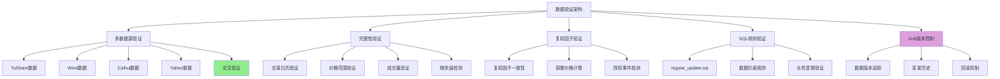
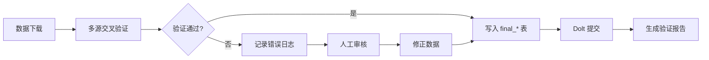

# investment_data 数据验证与质量保证机制分析

> 完整解析 investment_data 项目的数据验证、交叉验证和质量保证机制

## 📋 目录

- [验证架构概览](#验证架构概览)
- [多数据源交叉验证](#多数据源交叉验证)
- [数据完整性验证](#数据完整性验证)
- [复权因子验证](#复权因子验证)
- [实现方案](#实现方案)

## 🏗️ 验证架构概览



## 🔍 多数据源交叉验证

### 核心思想

investment_data 使用**多个数据源**来提高数据质量：

```
┌─────────────────────────────────────────────────────────┐
│                    最终数据 (final_*)                     │
├─────────────────────────────────────────────────────────┤
│  TuShare (ts_)  │  Wind (w_)  │  Caihui (c_)  │  Yahoo   │
│  - 主要数据源    │  - 历史数据  │  - 补充数据   │  - 验证用  │
└─────────────────────────────────────────────────────────┘
                           ↓
                  【交叉验证 & 数据融合】
                           ↓
              【识别和修正异常数据点】
```

### 数据源对比机制

```python
# investment_data 的多源验证逻辑

class CrossValidator:
    """多数据源交叉验证器"""

    def __init__(self):
        self.data_sources = {
            "ts": "TuShare",      # 主要数据源
            "w": "Wind",          # 高质量历史数据（2019年前）
            "c": "Caihui",        # 高质量历史数据（2019年前）
            "yahoo": "Yahoo Finance"  # 验证和补充
        }

    def validate_price(self, tradedate, symbol, price, source="ts"):
        """
        验证价格数据

        Args:
            tradedate: 交易日期
            symbol: 股票代码
            price: 价格
            source: 数据源

        Returns:
            (is_valid, corrected_price, details)
        """
        # 1. 获取其他数据源的同一数据点
        other_sources = [s for s in self.data_sources if s != source]

        for other_src in other_sources:
            other_price = self.get_price_from_source(
                tradedate, symbol, other_src
            )

            if other_price is not None:
                # 2. 计算价格偏差
                deviation = abs(price - other_price) / other_price

                # 3. 判断是否异常（偏差超过 5%）
                if deviation > 0.05:
                    return False, other_price, {
                        "reason": "价格偏差过大",
                        "deviation": deviation,
                        "source": source,
                        "other_source": other_src,
                        "our_price": price,
                        "other_price": other_price
                    }

        return True, price, {"reason": "验证通过"}

    def cross_validate_data_range(self, table, start_date, end_date):
        """
        跨数据源验证一个日期范围的数据

        主要用于每日更新后的验证
        """
        # 获取今日交易日历数据
        today_data = self.get_data_from_source(table, start_date, end_date, "ts")

        validation_errors = []

        for _, row in today_data.iterrows():
            tradedate = row["tradedate"]
            symbol = row["symbol"]
            price = row["close"]

            # 对每个数据点进行交叉验证
            is_valid, corrected_price, details = self.validate_price(
                tradedate, symbol, price, "ts"
            )

            if not is_valid:
                validation_errors.append({
                    "tradedate": tradedate,
                    "symbol": symbol,
                    "error": details
                })

                # 记录需要修正的数据
                self.log_correction(tradedate, symbol, price, corrected_price)

        return validation_errors
```

### Link Table 机制（关键创新）

**问题**：不同数据源的复权因子不同，无法直接比较

**解决**：创建 `link_table` 统一复权因子

```sql
-- ts_link_table 示例
CREATE TABLE ts_link_table (
    tradedate DATE,
    symbol VARCHAR(20),
    adjust_ratio DECIMAL(10, 6),  -- 调整比例
    PRIMARY KEY (tradedate, symbol)
);

-- 计算逻辑：
-- 1. 如果 final_a_stock_eod_price 已有此股票：
--    adjust_ratio = final.adjust_price / ts.adjust_price
--
-- 2. 如果是新股票：
--    adjust_ratio = 1.0

-- 验证规则：
-- 验证: ts.adjust_price * ts_link_table.adjust_ratio = final.adjust_price
-- 确保: 不同数据源的调整后价格一致
```

## 📊 数据完整性验证

### 1. 交易日历验证

```python
def validate_trading_calendar(self, data_df):
    """
    验证交易日历的完整性

    检查点：
    1. 日期是否连续（跳过周末和节假日）
    2. 是否有缺失的交易日
    3. 是否有非交易日数据
    """
    errors = []

    # 获取标准交易日历
    standard_cal = self.get_standard_calendar()

    # 检查数据中的交易日
    data_dates = set(data_df["tradedate"].unique())

    # 找出缺失的交易日
    missing_dates = standard_cal - data_dates
    if missing_dates:
        errors.append({
            "type": "missing_trading_days",
            "count": len(missing_dates),
            "dates": list(missing_dates)[:10]  # 只显示前10个
        })

    # 找出不应该存在的日期（非交易日）
    invalid_dates = data_dates - standard_cal
    if invalid_dates:
        errors.append({
            "type": "invalid_trading_days",
            "count": len(invalid_dates),
            "dates": list(invalid_dates)[:10]
        })

    return errors
```

### 2. 价格范围验证

```python
def validate_price_range(self, data_df):
    """
    验证价格的合理性

    规则：
    1. 价格不能为负数
    2. 价格不能为零（除非特殊情况）
    3. 最高价 >= 最低价
    4. 收盘价在 [最低价, 最高价] 范围内
    5. 价格日变化不能超过 50%（除权除息除外）
    """
    errors = []

    for _, row in data_df.iterrows():
        # 检查基本规则
        if row["close"] < 0:
            errors.append({
                "type": "negative_price",
                "tradedate": row["tradedate"],
                "symbol": row["symbol"],
                "close": row["close"]
            })

        if row["high"] < row["low"]:
            errors.append({
                "type": "high_less_than_low",
                "tradedate": row["tradedate"],
                "symbol": row["symbol"],
                "high": row["high"],
                "low": row["low"]
            })

        if not (row["low"] <= row["close"] <= row["high"]):
            errors.append({
                "type": "close_out_of_range",
                "tradedate": row["tradedate"],
                "symbol": row["symbol"],
                "close": row["close"],
                "low": row["low"],
                "high": row["high"]
            })

        # 检查异常价格变化（排除除权日）
        if not self.is_ex_dividend_date(row["tradedate"], row["symbol"]):
            prev_close = self.get_previous_close(row["tradedate"], row["symbol"])
            if prev_close:
                change_pct = abs(row["close"] - prev_close) / prev_close
                if change_pct > 0.5:  # 变化超过 50%
                    errors.append({
                        "type": "abnormal_price_change",
                        "tradedate": row["tradedate"],
                        "symbol": row["symbol"],
                        "prev_close": prev_close,
                        "current_close": row["close"],
                        "change_pct": change_pct
                    })

    return errors
```

### 3. 成交量验证

```python
def validate_volume(self, data_df):
    """
    验证成交量的合理性

    规则：
    1. 成交量不能为负数
    2. 成交额 = 成交量 × 价格（误差 < 5%）
    3. 检测异常的成交量突增
    """
    errors = []

    for _, row in data_df.iterrows():
        # 检查负值
        if row["volume"] < 0:
            errors.append({
                "type": "negative_volume",
                "tradedate": row["tradedate"],
                "symbol": row["symbol"],
                "volume": row["volume"]
            })

        # 检查成交额与成交量的关系
        estimated_amount = row["volume"] * row["close"]
        if row["amount"] > 0:
            error_pct = abs(row["amount"] - estimated_amount) / row["amount"]
            if error_pct > 0.05:  # 误差超过 5%
                errors.append({
                    "type": "amount_mismatch",
                    "tradedate": row["tradedate"],
                    "symbol": row["symbol"],
                    "actual_amount": row["amount"],
                    "estimated_amount": estimated_amount,
                    "error_pct": error_pct
                })

    return errors
```

## 🔄 复权因子验证

### 复权因子一致性检查

```python
def validate_adjust_factor(self, adj_factor_df, price_df):
    """
    验证复权因子的一致性

    检查点：
    1. 复权因子不能为负数
    2. 复权因子应该是递增或递减的（除权日跳变）
    3. 调整后的价格趋势应该合理
    """
    errors = []

    for symbol in adj_factor_df["symbol"].unique():
        symbol_data = adj_factor_df[adj_factor_df["symbol"] == symbol].sort_values("tradedate")

        # 检查复权因子的单调性
        for i in range(1, len(symbol_data)):
            prev_factor = symbol_data.iloc[i-1]["adj_factor"]
            curr_factor = symbol_data.iloc[i]["adj_factor"]

            # 复权因子应该保持不变或跳跃变化（除权日）
            if prev_factor == curr_factor:
                continue  # 正常：无除权事件
            elif curr_factor < prev_factor:
                # 前复权因子应该递减（价格调整到当前）
                continue  # 正常：有除权事件
            else:
                errors.append({
                    "type": "abnormal_adj_factor",
                    "symbol": symbol,
                    "tradedate": symbol_data.iloc[i]["tradedate"],
                    "prev_factor": prev_factor,
                    "curr_factor": curr_factor,
                    "reason": "前复权因子不应该递增"
                })

        # 验证调整后的价格
        symbol_prices = price_df[price_df["symbol"] == symbol]
        merged = pd.merge(symbol_data, symbol_prices, on=["tradedate", "symbol"])

        # 调整后的价格趋势应该平滑
        merged["adj_close"] = merged["close"] * merged["adj_factor"]
        merged["adj_return"] = merged["adj_close"].pct_change()

        # 检查异常的调整后收益率（除权日除外）
        ex_div_dates = self.get_ex_dividend_dates(symbol)
        for _, row in merged.iterrows():
            if row["tradedate"] not in ex_div_dates:
                if abs(row["adj_return"]) > 0.2:  # 单日涨跌超过 20%
                    errors.append({
                        "type": "abnormal_adj_return",
                        "symbol": symbol,
                        "tradedate": row["tradedate"],
                        "adj_return": row["adj_return"]
                    })

    return errors
```

## 🗄️ SQL 规则验证

### regular_update.sql 机制

investment_data 使用 SQL 脚本进行数据验证：

```sql
-- regular_update.sql 示例
-- 在每日更新后运行，验证数据质量

-- 1. 检查当日数据的完整性
SELECT
    tradedate,
    COUNT(*) as stock_count,
    COUNT(DISTINCT symbol) as unique_stocks
FROM ts_a_stock_eod_price
WHERE tradedate >= (SELECT MAX(tradedate) FROM max_index_date)
GROUP BY tradedate
HAVING COUNT(DISTINCT symbol) < 1000;  -- 股票数量少于1000说明数据不完整

-- 2. 检查价格异常
SELECT
    tradedate,
    symbol,
    close,
    high,
    low
FROM ts_a_stock_eod_price
WHERE
    tradedate >= (SELECT MAX(tradedate) FROM max_index_date)
    AND (
        close < 0  -- 负价格
        OR high < low  -- 最高价小于最低价
        OR close < low  -- 收盘价小于最低价
        OR close > high  -- 收盘价大于最高价
    );

-- 3. 检查复权因子一致性
SELECT
    ts.tradedate,
    ts.symbol,
    ts.close * ts.adjust_ratio as ts_adj_close,
    final.adjust_close as final_adj_close,
    ABS(ts.close * ts.adjust_ratio - final.adjust_close) / final.adjust_close as diff_pct
FROM ts_a_stock_eod_price ts
JOIN ts_link_table link ON ts.tradedate = link.tradedate AND ts.symbol = link.symbol
JOIN final_a_stock_eod_price final ON ts.tradedate = final.tradedate AND ts.symbol = final.symbol
WHERE
    ts.tradedate >= (SELECT MAX(tradedate) FROM max_index_date)
    AND ABS(ts.close * ts.adjust_ratio - final.adjust_close) / final.adjust_close > 0.01;  -- 差异超过1%

-- 4. 检测缺失的交易日
SELECT
    t1.tradedate + INTERVAL 1 DAY as expected_next_date,
    t2.tradedate as actual_next_date
FROM (
    SELECT DISTINCT tradedate
    FROM ts_a_stock_eod_price
    WHERE tradedate >= '2023-01-01'
    ORDER BY tradedate DESC
) t1
LEFT JOIN (
    SELECT DISTINCT tradedate
    FROM ts_a_stock_eod_price
) t2 ON t1.tradedate + INTERVAL 1 DAY = t2.tradedate
WHERE
    t2.tradedate IS NULL
    AND DAYOFWEEK(t1.tradedate + INTERVAL 1 DAY) BETWEEN 2 AND 6;  -- 排除周末
```

## 💾 Dolt 版本控制验证

### 数据版本追踪

```python
# Dolt 的 Git 风格版本控制

# 1. 查看数据变更历史
dolt log ts_a_stock_eod_price

# 2. 对比不同版本的数据
dolt diff HEAD~1 HEAD ts_a_stock_eod_price

# 3. 验证数据一致性
dolt sql -q "
SELECT
    COUNT(*) as total_records,
    COUNT(DISTINCT tradedate) as trading_days,
    COUNT(DISTINCT symbol) as total_stocks,
    MIN(tradedate) as first_date,
    MAX(tradedate) as last_date
FROM ts_a_stock_eod_price
WHERE tradedate >= '2023-01-01'
"

# 4. 检测异常变更
dolt diff HEAD~1 -- ts_a_stock_eod_price
# 如果某个股票的价格变化超过 50%，标记为需要人工验证
```

## 📈 质量保证流程



### 完整验证流程

```python
class DataQualityPipeline:
    """数据质量保证流程"""

    def run_daily_validation(self, tradedate):
        """
        执行每日数据验证

        Args:
            tradedate: 交易日期 (YYYYMMDD)
        """
        print(f"开始验证 {tradedate} 的数据...")

        # 1. 获取当日数据
        daily_data = self.get_daily_data(tradedate)

        # 2. 多源交叉验证
        cross_validation_errors = self.cross_validate(daily_data)

        # 3. 完整性验证
        completeness_errors = self.validate_completeness(daily_data)

        # 4. 价格范围验证
        price_range_errors = self.validate_price_range(daily_data)

        # 5. 成交量验证
        volume_errors = self.validate_volume(daily_data)

        # 6. 复权因子验证
        adj_factor_errors = self.validate_adjust_factor(daily_data)

        # 7. 汇总所有错误
        all_errors = (
            cross_validation_errors +
            completeness_errors +
            price_range_errors +
            volume_errors +
            adj_factor_errors
        )

        # 8. 生成验证报告
        report = self.generate_validation_report(tradedate, all_errors)

        # 9. 决定是否通过验证
        if len(all_errors) == 0:
            print(f"✅ {tradedate} 数据验证通过")
            return True
        else:
            print(f"❌ {tradedate} 发现 {len(all_errors)} 个错误")
            print(report)

            # 10. 对于严重错误，阻止数据合并
            critical_errors = [e for e in all_errors if e.get("severity") == "critical"]
            if critical_errors:
                print(f"⚠️  发现 {len(critical_errors)} 个严重错误，数据已隔离")
                return False

            # 11. 对于非严重错误，记录但允许合并
            print(f"⚠️  发现 {len(all_errors)} 个非严重错误，数据已标记")
            return True

    def generate_validation_report(self, tradedate, errors):
        """生成验证报告"""
        report = f"""
# 数据验证报告 - {tradedate}

## 错误汇总

| 错误类型 | 数量 |
|---------|------|
| 价格范围错误 | {len([e for e in errors if 'price' in e.get('type', '')])} |
| 成交量错误 | {len([e for e in errors if 'volume' in e.get('type', '')])} |
| 交叉验证错误 | {len([e for e in errors if 'cross' in e.get('type', '')])} |
| 复权因子错误 | {len([e for e in errors if 'adj' in e.get('type', '')])} |

## 详细错误列表

"""
        for error in errors[:20]:  # 只显示前20个
            report += f"- {error}\n"

        return report
```

## 🎯 最佳实践总结

### investment_data 的验证优势

1. **多数据源交叉验证**：降低单点故障风险
2. **Link Table 机制**：统一不同数据源的复权因子
3. **SQL 规则验证**：自动化检查数据质量
4. **Dolt 版本控制**：追踪数据变更历史
5. **完整错误日志**：便于问题定位和修正

### 可借鉴的核心机制

| 机制 | 实现难度 | 价值 | 建议 |
|------|---------|------|------|
| **多源交叉验证** | 中 | 高 | ✅ 推荐实现 |
| **复权因子验证** | 中 | 高 | ✅ 推荐实现 |
| **SQL 规则验证** | 低 | 中 | ✅ 推荐实现 |
| **Dolt 版本控制** | 高 | 中 | ⚠️ 可选（需要学习成本） |
| **Link Table** | 高 | 高 | ⚠️ 复杂场景需要 |

## 📚 参考资料

- [investment_data 项目](https://github.com/chenditc/investment_data)
- [final_a_stock_eod_price.md](https://github.com/chenditc/investment_data/blob/main/docs/final_a_stock_eod_price.md)
- [final_a_stock_limit.md](https://github.com/chenditc/investment_data/blob/main/docs/final_a_stock_limit.md)
